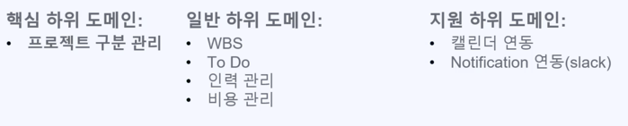

# DDD 란?
도메인 주도 설계(Domain Driver Design) 이며 
도메인 설계나 개발 작업의 중심에 도메인 모델을 두고 반복적으로 변경 및 진화시텨서 프로그램 구현하는 개발 방법론이다 

### 비즈니스 도메인이란?
- 기업의 주요 활동 영역을 알아야한다.
- 즉, 회사가 고객에게 제공하는 서비스을 파악해야 한다.
- ex) 스타벅스 => 커피 판매 (<- 비즈니스 도메인)

기업은 여러개의 도메인을 운영할 수 있다. 
- 아마존 : 소매와 클라우드 모두 제공
- 우버 : 차량공유 회사 + 음식 배달 및 자전거 공유 서비스도 제공한다.

이렇게 한 회사가 여러개의 비즈니스 도메인을 가지게 되면 나눠서 운영할 수 있다  

#### 하위 도메인 이란?
- 비즈니스 도메인의 목표 달성을 위해서 여러가지 하위 도메인을 운영해야 한다.
- 비즈니스 활동의 세분화된 영역
- 하위 도메인은 고객에게 제공하는 서비스 단위로 비즈니스 도메인을 만든다.
- 각각의 하위 도메인은 회사의 비즈니스 도메인에서 목표를 달성하기 위해 서로 상호작용 한다.
> 스타벅스
> >비즈니스 도메인 : 커피 판매
> >> 하위 도메인 : 부동산 구매/임대, 직원 고요으 재정 관리 etc

예를 들어 프로젝트 관리 어플리케이션이 있다 
위 어플리케이션에 하위 도메인을 분류를 해보겠다.

하위 도메인을 이렇게 분류 할 수 있다.

왜 DDD 아키텍쳐를 사용해야 할까?  
1) 소프트웨어 개발 시 발생할 수 있는 복잡도 줄임
2) 유지보수에 용이성
3) 모듈화/캡슐화 기반 유연성 향상

단점  
1) 도메인 전문가 참여 필수 요구
2) 기존 도메인의 관행 개선 어려움
3) 기술적으로 복잡한 프로젝트에 부적합 하다.

즉 DDD 는 핵심 서비스를 기반으로 나눠진다. 

