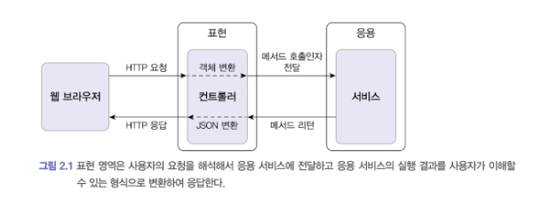
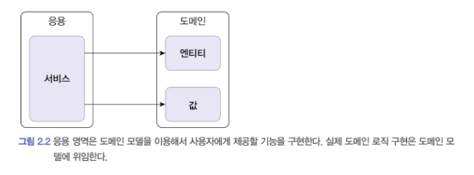
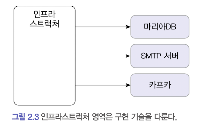
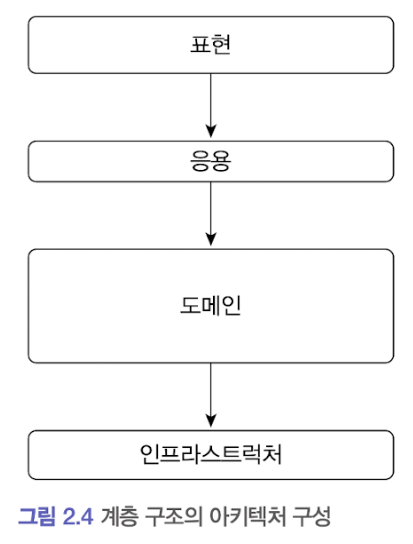
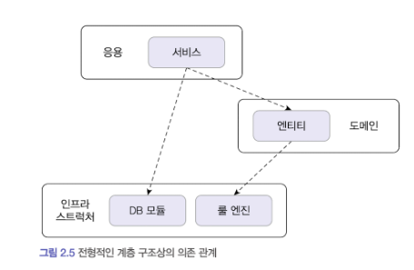
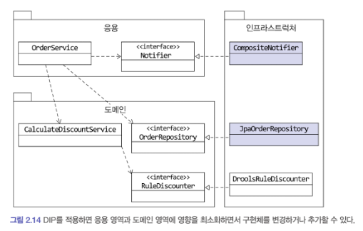

# 도메인 주도 개발 시작하기 - DDD 핵심 개념 정리부터 구현까지

## 도메인 모델 시작하기
도메인은 여러 하위 도메인으로 구성이된다 <br>
소프트웨어가 도메인은 모든 기능을 제공하지는 않는다. 어떠한 도메인은 외부 업체를 이용해서 진행한 후 가져다가 붙이기만 하는경우도 많다<br>
ex) 결제 - PG사, 카드,VAN 사, 물류 - 외부 물류 업체 <br>

#### 도메인 전문가와 개발자 간 지식 공유
요구사항을 제대로 이해하지 않으면 쓸모없거나 유용함이 떨어지는 시스템을 만들기 때문이다 (요구사항은 첫 단추와 같다) <br>
도메인 전문가 = PM ? 개발자도 도메인 지식을 갖춰야 한다 <br>
'Garbage in Garbage out' -> 잘못된 값이 들어가면 잘못된 값이 나온다 <br>

#### 도메인 모델
도메인 모델을 정의할 때는 클래스 다이어그램을 사용해서 UML 을 그리면 보기가 편하다 <br>
그리고 도메인 모델을 모델링 할 때 상태 다이어그램을 이용하면 편하다 <br>
도메인 모델 표현할 때 클래스 다이어그램이나 상태 다이어그램과 같은 UML 표기법만 사용해야 하는 것은 아니다 <br>
관게가 중요한 도메인이라면 그래프를 이용해서 도메인을 모델링할 수 있다 <br>
예를 들어 객체 기반 모델을 기반으로 도메인을 표현했다면 객체 지향 언어를 이용해 개념 모델을 가깝게 구현할 수 있다<br>

#### 도메인 모델 패턴
일반적이 어플리케이션 아키텍쳐는 [ 표현 - 응용 - 도메인 - 인프라 - DB] 로 구성이 된다. <br>
DDD 에서의 도메인 모델은 아키텍쳐 상의 도메인 계층을 객체 지향 기법으로 구현하는 패턴을 말합니다 <br>
도메인 계층은 도메인의 핵심 규칙을 구현한다. <br>
개념 모델과 구현 모델 <br>
개념 모델은 순수하게 문제를 분석한 결과물이다 <br>
프로젝트를 진행하면서 개념 모델을 구현 모델로 점진적으로 발전시켜 나가야 한다

#### 도메인 모델 추출
문서화를 하든 주된 이유는 지식을 공유하기 위함이다. 실제 구현은 코드에 있으므로 코드를 보면 다 알 수 있지만 <br>
코드는 상세한 모든 내용을 다루고 있기 때문에 코드를 이용해서 전체 소프트웨어를 분석하려면 많은시간이 필요하다 <br>
코드를 보면서 도메인을 깊게 이해하게 되므로 코드 자체도 문서화의 대상이 된다 <br>

#### Entity & Value
도출한 모델은 크게 Entity, Value 로 구분할 수 있다. <br>
Entity, Value 를 제대로 구분해야 도메인을 올바르게 설계하고 구현할 수 있기 때문에 <br>
이 둘의 차이를 명확하게 이해하는 것은 도메인을 구현하는 데 있어 중요하다 <br>

#### Entity
엔티티의 가장 큰 특징은 식별자를 가진다는 것이다 <br>
식별자는 엔티티 객체마다 고유해서 각 엔티티는 서로 다른 식별자를 갖는다 <br>
엔티티의 식별자를 생성하는 시점의 도메인의 특징과 사용하는 기술에 따라 달라진다 <br>
1) 특정 규칙에 따라 생성
2) UUID 나 Nano ID 와 같은 고유 식별자 생성기 사용
3) 값을 직접 입력
4) 일련번호 사용(시퀀스나 DB의 자동 증가 컬럼 사용)

```java
import java.util.UUID;

UUID uuid = UUID.randomUUID();
String strUuid = uuid.toString();
```

#### Value
정보를 가진 클래스에는 데이터를 갖고 있다 <br>
Value 타입은 개념적으로 완전한 하나를 표현할 때 사용한다 <br>
예를 들어 받는 사람을 위한 Value 타입인 Receiver 를 작성할 수 있다. <br>
```java
public class Receiver {
	private Stirng name;
	private String phoneNumber;
	
	public Receiver(String name, String phoneNumber) {
		this.name = name;
		this.phoneNumber = phoneNumber;
    }
	
	public String getName() {
		return this.name;
    }
	
	public String getPhoneNumber() {
		return this.phoneNumber;
    }
	
}
```

**도메인 모델에 set 메소드 넣지 않기** <br>
getter,setter 를 습관적으로 만드는 이유는 프로그래밍 예제 코드 때문일 확률이 높다 <br>
특히 set 메소드는 도메인의 핵심 개념이나 의도를 코드에서 사라지게 한다 <br>
set 에 의미는 그냥 단순하게 설정을 한다는 뜻으로 사용이 된다 <br>

도메인 객체가 불완전한 상태로 사용되는 것을 막으려면 생성 시점에 필요한 것을 전달해주어야 한다. 즉 생성자를 통해 필요한 데이터를 모두 받아야한다 <br>

**DTO 의 getter/setter** <br>
DTO 는 Data Transfer Object 의 약자로 프레젠테이션 계층과 도메인 계층이 데이터를 주고 받을 때 사용하는 일종의 구조체이다 <br>
요즘 개발 프레임워크나 개발 도구는 set 메소드가 아닌 private 필드에 직접 값을 할당할 수 있는 기능을 제공하고 있어 <br>
set 메소드가 없어도 프레임워크를 이용해서 데이터를 전달 받을 수 있다 <br>
프레임워크가 필드에 직접 값을 할당하는 기능을 제공하고 있다면 set 메소드를 만드는 대신 해당 기능을 최대한 활용하자 <br>
이렇게 하면 DTO 도 불변 객체가 되어 불변의 장점 DTO 까지 확장할 수 있다

#### 도메인 용어와 유비쿼터스 언어
코드를 작성할 때 도메인에서 사용하는 용어는 매우 중요하다 <br>
도메인에서 사용하는 용어를 코드에 반영하지 않으면 그 코드는 개발자에게 코드의 의미를 해석해야 하는 부담을 준다 <br>
**도메인 용어에 알맞은 단어를 찾는 시간을 아까워하지 말자**

## 2장 아키텍쳐 개요
표현,응용,도메인 인프라스트럭쳐는 아키텍쳐를 설계할 때 출현하는 전형적인 4가지 영역이다 <br>
네 영역중 표현 영역은 사용자의 요청을 받아 응용 영역에 전달하고 응용 영역의 처리 결과를 다시 사용자에게 보여주는 역할을 한다  Ex) 스프링 MVC <br>
 <br>
표현 영역은 사용자의 요청을 해석해서 응용 서비스에 전달하고 응용 서비스의 실행 결과를 사용자가 이해할 수 있는 형식으로 변환하여 응답한다 <br>
응용 영역은 기는을 구현하기 위해 도메인 영역의 도메인 모델을 사용한다 <br>
응용 서비스는 로직을 직접 수행하기 보다는 도메인 모델에 로직 수행을 위임한다 <br>
 <br>
도메인 영역은 도메인 모델을 구현한다. 도메인 모델은 도메인의 핵심 로직을 구현한다 <br>
인프라 영역은 구현 기술에 대한 것을 다룬다 ex) rdbms 연동, 메세징 큐 사용, redis, mongoDB 연동 등 <br>
- 인프라 영역은 논리적인 개념을 표현하기보다는 실제 구현을 다룬다.
 <br>
도메인,응용,표현 영역은 구현 기술을 사용한 코드를 직접 만들지 않는다 <br>

#### 계층 구조 아키텍쳐
 <br>
계층 구조는 그 특성상 상위 계층에서 하위 계층으로의 의존만 존재하고 하위 계층은 상위 계층에 의존하지 않는다 <br>
 <br>
응용,도메인 영역은 DB나 외부시스템 연동을 위해 인프라 영역 기능을 사용해야 한다 <br>
하지만 표현,응용,도메인 계층이 구현 기술을 다루는 인프라 계층에 종속된다 <br>
인프라 영역에 의존하게 되면 '테스트 어려움', '기능 확장의 어려움' 이라는 두가지 문제가 발생한다 <br>

#### DIP 의존 역전 원칙
인프라 영역에 의존하지 않기 위해서 DIP 객체지향 설계원칙을 잘 활용해야 한다. <br>
DIP 는 저수준 모듈이 고수준 모듈에 의존하도록 바꾼다 <br>
고수준 모듈을 구현하려면 저수준 모듈을 사용해야 하는데, 반대로 저수준 모듈이 고수준 모듈에 의존하도록 하려면 어떻게 해야할까? 비밀은 추상화한 인터페이스에 있다.
```java
public interface RuleDiscounter {
	Money applyRules(Customer customer, List<OrderLine> orderLines);
}
```

의존이란: 다른 객체를 포함 또는 사용하고 있는 것을 의미한다. 
```java
class A {
	private B b;
}
class B {
	
}
```

**모듈의 수준** <br>
고수준 모듈이란 실제로 사용하는 것과 근접해있는 것이다. 모듈의 본질적인 기능과 책임이 어떤 것인지 나타내는 것이다. <br>
저수준 모듈이란 모듈 내부를 구성하는 각각의 동작들을 의미한다. 고수준 모듈에서 기능을 수행하기 위해 도와주는 역할을 한다.<br>

고수준 모듈은 더 이상 저수준 모듈에 의존하지 않고 구현을 추상화한 인터페이스에 의존한다 <br>
실제 사용할 저수준 구현 객체는 다음 코드처럼 의존 주입을 이용해서 전달받을 수 있다 <br>
```java
// 사용할 저수준 객체 생성
RuleDiscounter ruleDiscounter = new DroolsRuleDiscounter();

// 생성자 방식으로 주입
CalculateDiscountService discountService = new CalculateDiscountService(ruleDiscounter);
```

구현 기술을 변경하더라도 CalculateDiscountService(고수준 모듈) 를 수정할 필요 없이 저수준 모듈을 변경하면 된다. <br>
스프링과 같은 의존 주입을 지원하는 프레임워크를 사용하면 설정 코드를 수정해서 쉽게 구현체를 변경할 수 있다 <br>

#### DIP 주의사항
인프라 영역은 구현 기술을 다루는 저수준 모듈이고, 응용 영역과 도메인 영역은 고수준 모듈이다 <br>
인프라 계층이 가장 하단에 위치하는 계층형 구조와 달리 아키텍쳐에 DIP 를 적용하면, 인프라 영역이 응용 영역과 도메인 영역에 의존하는 구조가 된다.<br>
인프라에 위차한 클래스가 도메인이나 응용 영역에 정의한 인터페이스를 상속받아 구현하는 구조가 되므로 도메인과 응용 영역에 대한 영향을 주지않거나 최소화하면서 구현 기술을 변경하는 것이 가능하다 <br>
 <br>
jpa를 사용한다면 jpaRepository 구현 클래스를 인프라 영역에 추가해서 사용하면 된다 <br>
항상 DIP 를 항상 적용할 필요는 없다.

### 도메인 영역의 주요 구성요소
도메인 영역은 도메인의 핵심 모델을 구현한다, 도메인 영역의 모델은 도메인의 주요 개념을 표현하며 핵심 로직을 구현한다 <br>
1장에서 살펴본 Entity & Value 는  도메인 영역의 주요 구성요소이다. <br>
- Entity: 고유 식별자를 갖는 객체라 자신의 라이플 사이클을 갖는다.
- Value: 고유의 식별자를 갖지 않는 객체로 주로 개념적으로 하나인 값을 표현할 때 사용된다.
- Aggregate: 연관된 엔티티와 밸류 객체를 개념적으로 하나로 묶은 것이다.
- Repository: 도메인 모델의 영속성을 처리한다.
- Domain Service: 특정 엔티티에 속하지 않는 도메인 로직을 제공한다.

#### Entity & Value
도메인 모델의 Entity 와 DB 모델의 Entity 를 같은 것이라고 착각하면 안된다 <br>
이 두 모델의 가장 큰 차이점은 도메인 모델의 엔티티는 데이터와 함께 도메인 기능을 함께 제공한다는 점이다 <br>
ex) 주문을 표현하는 엔티티는 주문과 관련된 데이터 뿐만 아니라 배송지 주소 변경을 위한 기능을 함께 제공한다 <br>
```java
public class Order {
	// 주문 도메인 모델의 데이터
    private OrderNo number;
	private Orderer orderer;
	private ShippingInfo shippingInfo;
	
	// 도메인 모델 엔티티는 도메인 기능도 함께 제공
    public void changeShippingInfo(ShippingInfo newShippingInfo) {
		// 로직
    }
}
```

도메인 모델의 엔티티는 단순히 데이터를 담고 있는 데이터 구조라기보다는 데이터와 함께 기능을 제공하는 객체이다 <br>
도메인 관점에서 기능을 구현하고 기능 구현을 캡슐화해서 데이터가 임의로 변경되는 것을 막는다 <br>
또 다른 차이점은 도메인 모델의 엔티티는 두 개 이상의 데이터가 개념적으로 하나인 경우 밸류 타입을 이용해서 표현할 수 있다는 것이다 <br>
```java
public class Orderer {
	private String name;
	private String email;
}
```

RDBMS 와 같은 관계형 데이터베이스는 밸류 타입을 제대로 표현하기 어렵다<br>
Value 는 Immutable 으로 구현할 것을 권장하며, 이는 엔티티의 Value 타입 데이터를 변경할 때는 객체 자체를 완전히 교체한다는 것을 의미한다 <br>

#### 애그리거트 Aggregate
도메인이 커질수록 개발할 도메인 모델도 커지면서 많은 엔티티와 밸류가 출현한다 <br>
Entity 와 Value 개수가 많아질수록 모델은 점점 복잡해진다 <br>
도메인 모델에서 전체적인 구조를 이해하는데 도움이 되는 것이 바로 애그리거트 이다 <br>
애그리거트의 대표적인 예가 주문이다 -> 관련 객체를 하나로 묶은 군집 <br>
ex) 주문 - 배송지정보, 주문자, 주문목록, 총 결제 금액 등 하위 모델로 구성 <br>
에그리거트를 구현할 때는 고려할 것이 많다. 애그리거트를 어떻게 구성했느냐에 따라 구현이 복잡해지기도 하고, 트랜잭션 범위가 달라지기도 한다 <br>

#### 레포지토리
도메인 객체를 지속적으로 사용하려면 물리적인 저장소에 도메인 객체를 보관해야 한다.<br>
엔티티나 밸류가 요구사항에서 도출되는 도메인이라면, 레포지토리는 구현을 위한 도메인 모델이다<br>
레포지토리는 애그리거트 단위로 도메인 객체를 저장하고 조회하는 기능을 정의한다 <br>
```java
public interface OrderRepository {
	Order findByNumber(OrderNumber orderNumber);
	void save(Order order);
	void delete(Order order);
}
```

도메인 모델 관점에서 OrderRepository 는 도메인 객체를 영속화 하는데 필요한 기능을 추상화 한것으로 고수준 모듈에 속한다 <br>
OrderRepository 를 구현한 클래스는 저수준 모듈로 인프라 영역에 속한다 <br>
레포지토리 인터페이스는 도메인 모델 영역에 속하며, 실제 구현 클래스는 인프라 영역에 속한다 <br>


