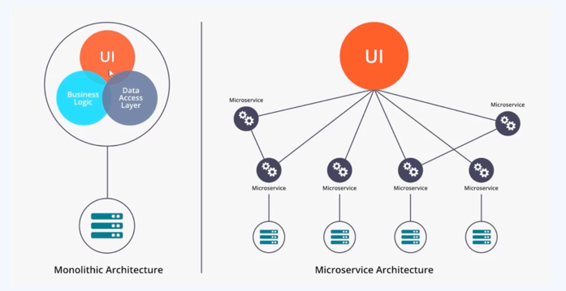
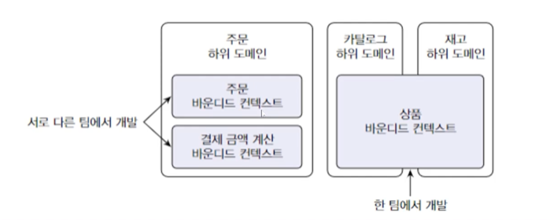

# MSA ?
Microsoft Architecture 다 
애플리케이션을 독립된 소프트웨어 컴포넌트, 즉 서비스로 분할하는 것이다.

사진에서 보다 싶이 모놀리식 아키텍쳐와 MSA 는 비교가 많이 된다. 
고객의 니즈에 맞춰 빠르게 유지보수가 가능한 아키텍쳐 이다 

각 하위 도메인은 바운디크 컨텍스트로 구분하여 개발되고  
아래 구조가 일반적으로 MSA 구조가 될 수 있다  

### MSA 장점 
- 배포 : 잦은 배포에 적합한 서비스, 서비스별 개별 배포가 가능, 특정 서비스의 요구사항 만을 반영하여 배포
- 확장 : 특정 서비스에 대한 확장성(Scale out) 이 유리, 클라우드 기반 서비스 사용에 적합
- 장애처리 : 일부 장애가 전체 서비스로 확장될 가능성이 적고, 부분적으로 발생하는 장애에 대한 격리가 수월
- 유연성 : 새로운 기술을 적용하기 유연하고 전체 서비스가 아닌 특정 서비스만 별도의 기술 또는 언어로 구현 가능
- 간단한 구조 : 각각의 서비스에 대한 구조 파악 및 분석이 모놀리식 구조에 비해 간단하다.

### MSA 단점
- 설계의 어려움 : 모놀리식에 비해 상대적으로 복잡하고, 서비스가 모두 분산되어 있기 때문에 개발자는 내부 시스템의 통신을 어떻게 가져갈지 정해야함.
  - 통신의 장애와 서버의 부하등이 있을 경우 어떻게 트랜잭션을 유지할지 결정하고 구현해야함
- 성능적 이슈
- 테스트/데이터 트랜잭션
  - 모놀리식에서는 단일 트랜잭션을 유지하면 됐지만, MSA 는 비즈니스에 대한 DB를 가지고 있는 서비스도 각각 다름
  - 서비스의 연결을 위해서는 통신이 포함되기 때문에 트랜잭션을 유지하는것이 어려움
- 통합테스트 어려움
  - 개발 환경과 실제 운영환경을 동일하게 가져가는 것이 어려움
- 데이터 관리
  - 데이터가 여러 서비스에 분산되어 있어 조화하거나 관리하기 어려움

