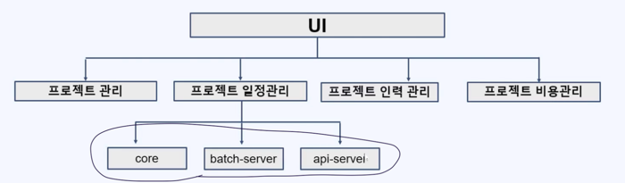

# 멀티 모듈이란?
간단하게 말해서 부분(Parts)를 의미한다.  

모듈은 독립적으로 배포될 수 있는 코드의 단위 이다

그럼 멀티모듈이란?  
- 상호 연결된 여러 개의 모듈로 구성된 프로젝트이다.
- 각 모듈은 독립적으로 빌드 된다.
- 멀티 모듈 적용시 독립된 코드로 빌드되어 확장 및 유지보수가 용이하다.

위 사진에 core, batch-server, api-server 가 각각의 모듈이며 즉 멀티모듈이라고도 한다.
batch-server : 반복적으로 처리하는 루틴한 서비스  
api-server : REST API 를 구현하는 서비스  
core : batch-server, api-server 에서 공통적으로 사용하는 코드 집합  

### 멀티모듈의 장점
1) 재사용과 공유
2) 빌드가 쉽고, 시간 단축
3) 변경으로 인한 영향 최소화
4) 의존성을 최소화

### 멀티모듈의 단점
1) 멀티모듈에 대한 이해 필요
2) 여러 모듈을 유지 관리 어려움

크기가 큰 프로젝트에서 멀티모듈은 필수이나,  
크기가 작은 프로젝트에서는 멀티모듈의 장점을 살릴 수 없다

 

