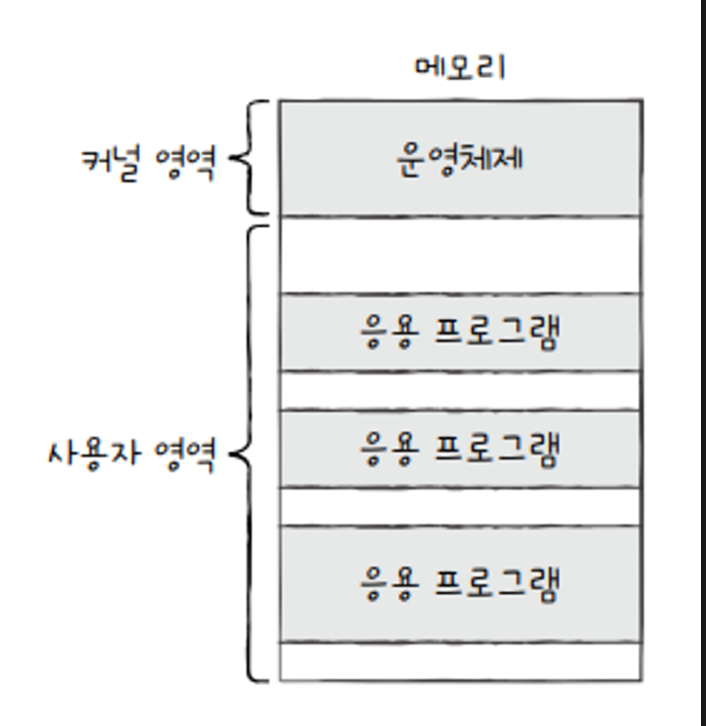
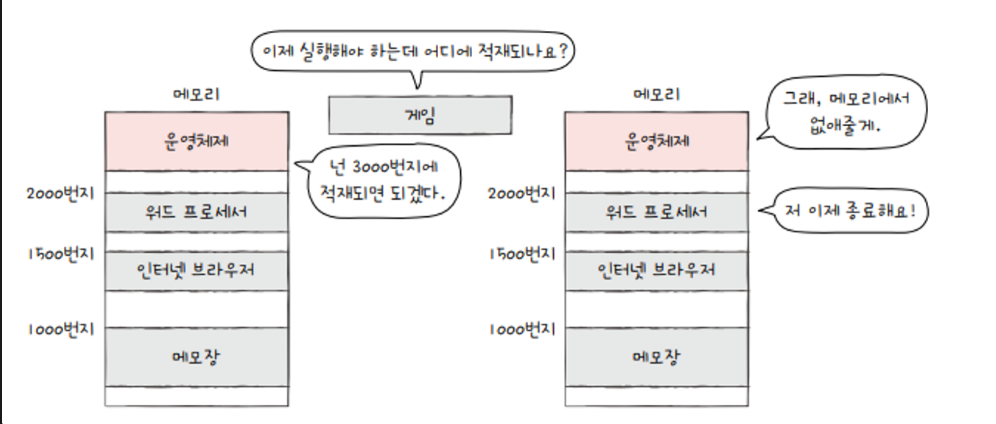

## 운영체제 기본

  운영체제는 컴퓨터 부팅시 **커널 영역**에 따로 적재되어 실행된다.

  커널 영역을 제외한 나머지 영역, 사용자가 이용하는 응용 프로그램이 적재되는 영역을 **사용자 영역** 이라고 한다.

  즉 운영체제는 커널 영역에 적재되어, 사용자 영역에 적재된 프로그램들에 자원을 할당하고 이들이 올바르게 실행되도록 돕는다.

  기본적으로 물리 Ram 안에 컴퓨터를 키면, 운영체제가 물리 ram에 커널 영역에 담기게 되어, 자동으로 내가 아무것도 실행시키지 않아도, 백그라운드 프로세스와 커널영역이 ram에 담겨있다.

  운영체제는 미리 커널 영역에 적재가 되어서,

  사용자 영역에 적재되게 프로그램들을 관리합니다.

  즉 운영체제가 사용자 영역에 프로그램들을 메모리 주소가 겹치지 않게 적재 시킵니다.

  ⇒ os는 실행할 프로그램을 메모리에 적재하고, 더 이상 실행되지 않는 프로그램을 메모리에서 삭제하며 지속적으로 메모리 자원을 관리합니다.

  프로그램이 실행되기 위해서는 cpu의 할당을 받아야 한다.

  그럼 어떤 프로그램부터 cpu를 사용하게 할까요?

  그리고 얼마나 오랫동안 cpu를 점유할까요?

  이 문제 또한 운영체제가 해결합니다.

  어느 한 프로그램이 cpu를 독점하면 다른 프로그램들은 올바르게 실행될 수 없기 때문에 운영체제는 최대한 공정하게 여러 프로그램에 cpu자원을 할당한다.

  os는 흔히 정부에 비유되기도 합니다.

  정부는 땅, 인력, 돈 국내 자원을 효율적으로 배분하고, 규칙을 정해 관리한다.

  os도 마찬가지로 프로그램을 자원을 배분하고, 규칙을 만들어 컴퓨터 시스템을 관리합니다.

    - 운영체제의 어느 한 부분에서는 cpu, 어느 한 부분에서는 메모리, 어느 한 부분에서는 하드 디스크를 관리합니다.

즉 분업이 잘 되어 있습니다.