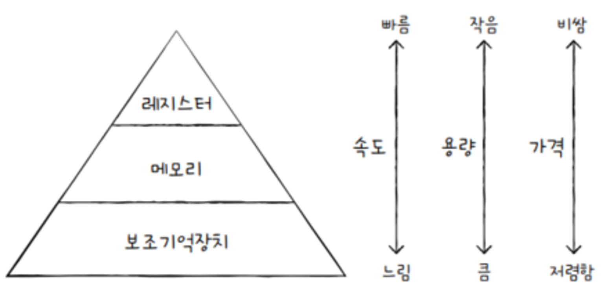
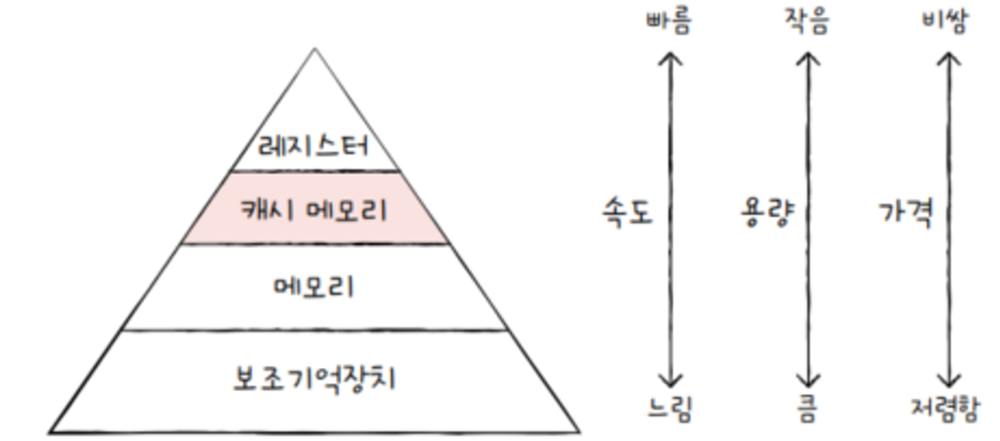
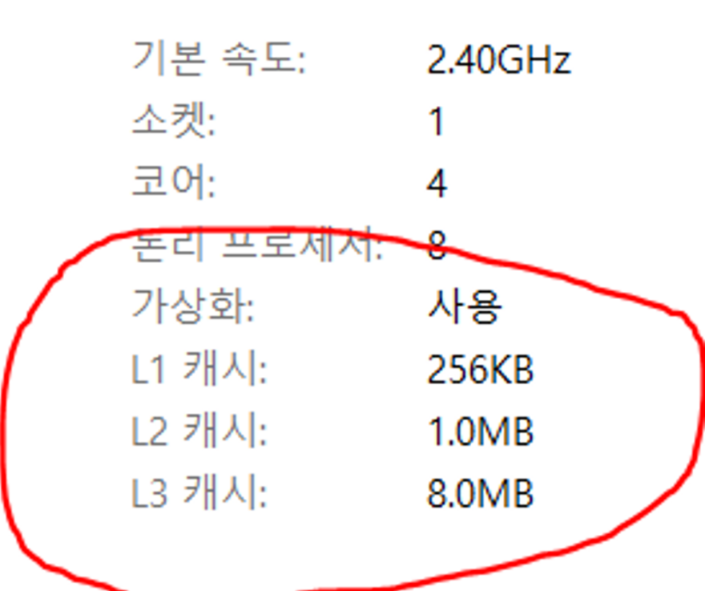
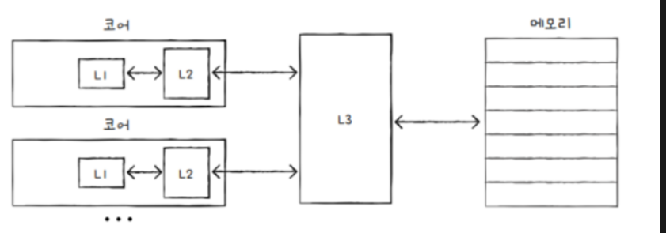
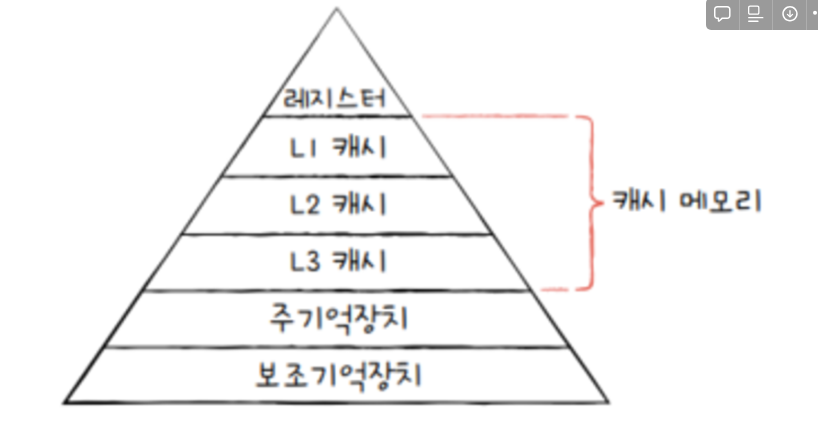

### 캐시 메모리

cpu나 메모리에 접근하는 시간은 cpu의 연산 속도보다 느립니다.

cpu가 연산을 빨리 한다 해도 메모리에 접근하는 시간이 느리면 cpu의 빠른 연산 속도는 아무런 쓸모가 없다. 이를 극복하기 위한 저장장치가 바로 **캐시 메모리** 입니다.

캐시 메모리는 **저장 장치 계층 구조 개념**을 알아야 한다.

모든 사용자들은 빠르고 동시에 용량이 큰 장치를 원합니다.

하지만 안타깝게도 빠른 저장치와 용량이 큰 저장 장치는 양립하기 어렵습니다.

저장 장치는 일반적으로 아래와 같은 명제를 따르기 때문입니다.

cpu와 가까운 저장 장치는 빠르고, 멀리 있는 저장 장치는 느리다.

속도가 빠른 저장장치는 저장 용량이 적고, 가격이 비싸다.

cpu와 가장 가까운 레지스터는 일반적으로 ram보다 용량은 적지만, 접근 시간이 압도적으로 빠르고 가격이 비쌉니다.

그리고usb메모리 보다 cpu에 더 가까운 ram은 접근 시간이 훨신 더 빠르지만, 같은 용량이라 할지라도 가격은 더 비싸다.

즉 낮은 가격대의 대용량 저장 장치를 원한다면, 느린 속도는 감수해야하고,

빠른 메모리를 원한다면 작은 용량과 비싼 가격은 감수해야 한다.

이렇게 저장 장치들의 장단점은 명확하다.

그래서 컴퓨터는 다양한 저장 장치를 모두 사용합니다.

컴퓨터가 사용하는 저장 장치들은 CPU에 얼마나 가까운가 를 기준으로 계층적으로 나타낼 수 있습니다.

이를 **저장 장치 계층 구조**라고 한다.

cpu에 가까운 저장 장치일수록 빠르고, 용량이 작고, 비쌉니다.

위 계층으로 올라갈수록 cpu와 가깝고 용량은 작지만 빠른 저장 장치입니다.

그리고 아래 계층으로 내려갈수록 CPU와 멀고 용량은 크지만, 느린 저장 장치입니다.

아래 계층으로 내려갈수록 cpu와 멀고 용량은 크지만, 느린 저장 장치입니다.

가격 또한 일반적으로 위 계층으로 올라갈수록 비싸고, 아래 계층으로 내려갈수록 저렴하다.

### **캐시 메모리**

cpu가 메모리에 접근하는 속도는 레지스터보다 느리다.

그럼에도 불구하고 cpu는 프로그램을 실행하는 과정에서 메모리에 접근해야 한다.

cpu연산속도가 아무리 빨라도, 메모리에 접근하는 속도가 그에 따라가지 못한다면, CPU의 발전은 아무 소용 없겠죠?

그래서 등장한 저장 장치가 캐시 메모리 이다.

캐시 메모리는 cpu와 메모리 사이에 위치하고, 레지스터보다 용량이 크고 메모리보다 빠른 SRAM기반의 저장 장치이다.

캐시 메모리는 cpu의 연산 속도와 메모리 접근 속도의 차이를 줄이기 위해 탄생했다.

cpu가 매번 메모리에 접근하는 건 시간이 오래 걸릴테니, 메모리에서 cpu가 사용할 일부 데이터를 미리 캐시 메모리로 가지고 와서 활용하자는 것이죠.

우리 컴퓨터 내부에도 여러 개의 캐시 메모리가 있습니다.

cpu 코어와 가까운 순서대로 계층을 구성한다.

가까운 캐시 L1 캐시 그다음 L2캐시, 그 다음 L3캐시

작업관리자를 확인하면, 보통 알 수 있습니다.

일반적으로 L1,L2 캐시는 코어 내부에, L3 캐시는 코어 외부에 위치해있다.

캐시 메모리는

- L1,L2,L3 순으로 용량이 크다
- L3,L2,L1 순으로 속도는 빠르다, 가격 또한 비싸다

즉 용량이 크면 속도가 느리고, 용량이 작으면 속도가 빠르고 비싸다.

cpu가 메모리 내에 데이터가 필요하다고 판단하면 우선L1 캐시에 해당 데이터가 있는지를, 알아보고 없다면 L2,L3 캐시 순으로 데이터를 검색합니다.

멀티 코어 프로세서에서 L1-L2-L3 캐시는 일반적으로 이렇게 구현됩니다.

L1, L2는 고유의 캐시 메모리를 가지고, L3는 공유하는 형태로 합니다.

저 같은 경우4코어 cpu 이므로

L1,L2 캐시는 4개 L3 캐시는 1개로 사용되고 있습니다.

위 사진이 저장장치계층 구조의 세부 구조 입니다.

보조기억장치는 전원이 꺼져도 기억할 대상을 저장하고,

메모리는 실행 중인 대상을 저장한다면 캐시 메모리는 cpu가 사용할 법한 대상을 예측하여 저장한다.  이때 자주 사용될 것으로 예측한 데이터가 실제로 들어맞아 캐시 메모리 내 데이터가 cpu에서 활용될 경우를 **캐시히트** 라고 합니다.

반대로 자주 사용될 것으로 예측하여 캐시 메모리에 저장했지만, 예측이 틀려 메모리에서 필요한 데이터를 직접 가져와야 하는 경우를 캐시 미스라고 합니다. 캐시 미스가 발생하면 CPU가 필요한 데이터를 메모리에서 직접 가져와야 하기 때문에 캐시 메모리의 이점을 활용할 수 없습니다.

캐시 적중률

> 캐시 히트 횟수 / (캐시 히트 횟수 + 캐시 미스 횟수)
>

우리가 사용하는 컴퓨터의 캐시 적중률은 대략 85~95 이상 입니다.

cpu가 필요할 것으로 예측한 데이터를 100번 중 85~95번 꼴로 맞추는 셈이다

캐시 메모리의 이점을 활용하려면 cpu가 사용할 법한 데이터를 제대로 예측해서 캐시 적중률을 높여아 한다. 그렇다면 cpu가 사용할 법한 데이터는 어떻게 알 수 있을까?

캐시 메모리는 한 가지 원칙에 따라 메모리로부터 가져올 데이터를 결정한다.

바로 **참조 지역성의 원리** 입니다.

이 원리는 cpu가 메모리에 접근할 때의 주된 경향을 바탕으로 만들어진 원리이다.

- cpu는 최근에 접근했던 메모리 공간에 다시 접근하려는 경향이 있다.
    - 즉 프로그래밍 언어에서 변수를 사용하면은 변수를 여러번 사용한다.
- cpu는 접근한 메모리 공간 근처를 접근하려는 경향이 있다.
    - 공간 지역성