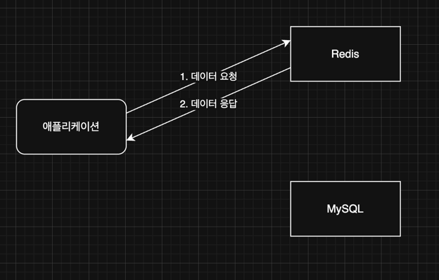
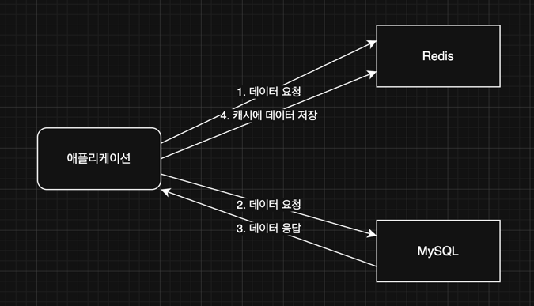
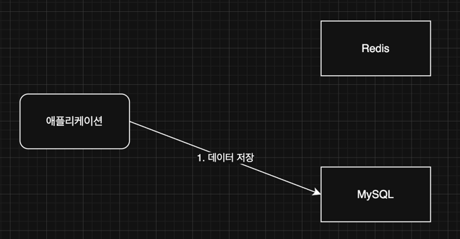

## Redis 기초 알아보기

### Redis 정의
간단하게 요약을 하면 Redis는 인메모리에 데이터를 저장하는 데이터 베이스로 Key,Value 방식을 사용한다 <br>
메모리에 데이터를 올려 사용하기에 rdb 보다 데이터 처리 성능이 빠르다

### Redis 주요 사용 사례
Redis 는 실무에서 아래와 같은 상황에 주로 사용이 된다 <br>
어느 정도 사용 예시 또는 사례를 알고 있어야 비슷한 상황에서 바로 기술적인 부분에 사용이 필요할 때 빠르게 캐치를 할 수 있다고 생각한다
- 캐싱
- 세션 관리
- pub/sub(메시지큐)
- 지리공간 인덱싱
- 속도 제한
- 실시간 채팅 및 메시징

등 다양한 용도에서 사용이 된다 <br>

대부분은 '**캐싱**' 에 용도로 많이 사용이 된다 <br>

대부분의 IT 대기업에서 대용량 트래픽 서비스 설계/개발/운영 경험 보유 및 NoSQL 을 우대한다 <br>

### Redis 기본 명령어 익히기
Redis 자료구조는 string,list,hash,set 등등이 있다 <br>

```shell
# 데이터(key,value) 저장하기 Ex) set [key 이름] [value]
set hkjin:pos abcdeft-1234 # string

# 데이터 조회하기 Ex) get [key]
get hkjin:pos

# 전체 key 조회하기
keys *

# 삭제하기 Ex) del key
del hkjin:pos

# 데이터 저장시 만료시간 지정 Ex) set key value ex 만료시간(초)
set hkjin:pos hkjin ex 3600

# 만료시간 확인 Ex) ttl key
ttl hkjin:pos

# 모든 키값 삭제
flushall
```

위 명령어들은 redis 자료구조 중에서 strings 안에 key,value 들이 생긴다 <br>

strings 가 아닌 sets, hash tables 안에 key,value 를 넣기 위해선 다른 명령어를 사용해야 한다 <br>

### Key Naming Rule
- 콜론(:) 을 활용해 계층적으로 의미를 구분해서 사용
  - users:100:profile -> User 중에 PK가 100인 사용자의 프로필 
  - products:123:details -> Product 중에 PK 가 123 인 세부사항

위 컨벤션을 통해 가독성,일관성,검색 및 필터링 용이성, 확장성 을 향상시킬수 있다 <br>

### 캐시, 캐싱이란?
원본 저장소보다 빠르게 가져올 수 있는 임시 데이터 저장소를 의미한다 <br>
Ex) 구글 브라우저 '캐시된 이미지 및 파일' 등등 <br>


### 데이터 캐싱할 때 사용하는 전략
많은 전략들이 있다. 현재는 자주 쓰이는 전략만 알아보려고 한다 <br>
#### 1. Cache Aside
위 전략은 데이터를 어떻게 조회할지 에대한 전략이다 <br>
즉 데이터를 조회할 때 주로 사용하는 전략이다 <br>
Lazy Loading 전략, Look Aside 전략이라고도 부른다 <br>

1. 데이터가 Redis 에 존재할 경우(Cache Hit)
 <br>

캐시에 데이터가 있는 경우를 **Cache Hit** 이라고 한다 <br>

2. 데이터가 Redis 에 존재하지 않을 경우(Cache Miss)
 <br>

캐시에 데이터가 없는 경우를 보고 **Cache Miss** 라고 한다 <br>

#### 2. Write Around 전략
위 전략은 데이터를 어떻게 쓸지(CUD)에 대한 전략이다 <br>

위 전략은 'Redis 에 저장하지 않고 RDB 에만 저장' 하는 방식이다 <br>
<br>
그리고 실제 Redis 에서 조회가 필요할 땐 Cache Aside 전략에 Cache Miss 가 동작하면서 Redis 에도 저장이 된다 <br>

### 위 2가지 전략의 한게점
- 캐시된 데이터와 DB 데이터가 일치하지 않을 수도 있다, 즉 데이터의 일관성을 보장할 수 없다
- 캐시에 저장할 수 있는 공간이 비교적 작다
  - DB 는 Disk 에 저장하지만, 캐시는 메모리에 저장하기에 많은 양의 저장할 수 가 없다.

그럼 위 한계를 어떻게 극복해볼 수 있을까? <br>
 
데이터 조회 성능 개선 목적으로 레디스를 쓰는 경우에는 데이터의 일관성을 포기하고 성능 향상을 택한 것이다 <br> 

캐시를 적용시키기에 적절한 데이터는 아래와 같다 <br>
- 자주 조회되는 데이터
- 잘 변하지 않는 데이터
- 실 시간으로 정확하게 일치하지 않아도 되는 데이터

하지만 장기간 데이터가 일치하지 않는 건 문제가 될 수 있다. 따라서 적절한 주기로 데이터를 동기화시켜주어야 한다. <br>
이때 활용하는 기능이 레디스의 TTL 기능 이다. <br>

일정 시간이 지나면 데이터가 캐시에서 삭제된다, 그럼 특정 사용자가 조회를 하면 Cache Miss 발생에 따라 최신화가 된다 <br>

캐시에 저장할 수 있는 공간이 비교적 작은건 TTL 기능을 활용하여 공간을 효율적으로 사용하게 한다

즉 TTL 을 잘 활용해야 한다 <br>

Redis 를 도입하여 성능 개선을 하기전 1가지 꼭 고려되어야 하는 것은 'SQL 튜닝' 이다 <br>
1차적으로 내부적으로 구축되어있는 시스템안에서 해결을 시도하고 안되면 이제 외부적인 것을 도입해야 한다 <br>
외부 적인것이라 함은 아래와 같다
- 캐싱 서버 
- Master/Slave
- DB 샤딩
- DB 스케일업

등등이 있다 <br>

근본적인 문제를 해결하는 방법이 SQL 튜닝일 가능성이 높다 <br>
SQL 자체가 비효율적이라면 외부 시스템을 도입해도 한계가 있다 <br>

DB 성능 개선 방법중 가장 가성비가 좋은 방법은 'SQL 튜닝' 이 제일 좋다 <br>

#### REF
```shell
1. https://www.youtube.com/watch?v=xKceKGMWPOw&list=PLtUgHNmvcs6qoVrxB5jzZ4meINz_KL-Bl&index=11
```