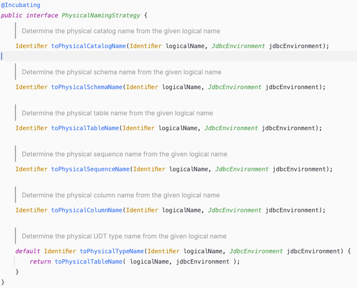
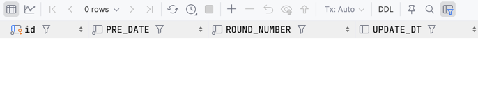

# Hibernate Column 대문자로 만들기

Springboot/JPA 환경에서 테이블을 만들 때 대문자로 컬럼을 만들어보려고 한다 <br>
(수동으로 create table ~ 하는 것은 제외한다) <br>

기본적으로 JPA/Hibernate 를 사용하여 Entity 를 생성하고 ddl-auto 옵션을 통하여 테이블을 생성하면 <br>
테이블 이름, 컬럼 명이 전부다 소문자 및 스네이크케이스로 생성이 된다 <br>

위 이유는 JPA/Hibernate 을 naming Strategy 설정과 관련이 있다 <br>

## Tech
JPA/Hibernate 는 두 가지 네이밍 전략이 있다.
- Logical Naming Strategy
- Physical Naming Strategy

기본적으로 JPA/Hibernate 는 Physical Naming Strategy 전략을 사용한다 <br>
그리고 위 구현을 SpringPhysicalNamingStrategy 인터페이스를 구현한다 <br>

 

위 전략을 특징은 아래와 같다
- 대문자 컬럼 -> 소문자로 변환
- 카멜케이스 -> 스네이크케이스
```java
private String userName; // 테이블 생성시 user_name
```

spring.jpa.hibernate.ddl-auto 옵션을 사용하여 스키마 생성을 하면 위 옵션이 자동으로 적용이 된다 <br>


그렇다면 대문자로 컬럼이름을 지정하기 위해서는 어떻게 해야할까? <br>

### 방법
방법은 직접 SpringPhysicalNamingStrategy 을 구현받아 Custom 을 지정해줘야 한다 <br>

```java
public class CustomPhysicalNamingStrategy implements PhysicalNamingStrategy {

    @Override
    public Identifier toPhysicalCatalogName(Identifier name, JdbcEnvironment jdbcEnvironment) {
        return name;
    }

    @Override
    public Identifier toPhysicalSchemaName(Identifier name, JdbcEnvironment jdbcEnvironment) {
        return name;
    }

    @Override
    public Identifier toPhysicalTableName(Identifier name, JdbcEnvironment jdbcEnvironment) {
        return name;
    }

    @Override
    public Identifier toPhysicalSequenceName(Identifier name, JdbcEnvironment jdbcEnvironment) {
        return name;
    }

    @Override
    public Identifier toPhysicalColumnName(Identifier name, JdbcEnvironment jdbcEnvironment) {
        return name;
    }

}
```

```yaml
spring:
  jpa:
    hibernate:
      ddl-auto: update
      naming:
        physical-strategy: org.hyeonqz.toy.common.configs.CustomPhysicalNamingStrategy
```


#### 결과
 <br>

위 처럼 필요한 필드들을 이제 대문자로 설정을 할 수 있다

