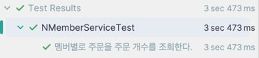
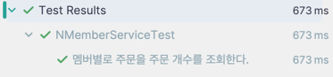
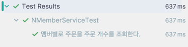
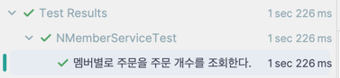

## JPA N+1 문제 만들고 직접 해결해보기
JPA 를 사용할 때 항상 N+1 문제를 조심해야한다 <br>
그리고 N+1 문제를 해결하기 위해서는 여러가지 방안이 있다 <br>

왜 N+1 이 발생하고, 어떻게 해결해 나가는지 코드를 통해 이해를 도와보자 <br>

### 1) Entity
기본적으로 2개의 엔티티가 존재한다 <br>
Member 와 Order 가 있고, Member 는 여러개의 Order 를 가짐으로써 두 엔티티의 관계에서 <br>
부모: Member, 자식: Order 관계 이다. 그러므로 Member 기준 @OneToMany, Order 기준 @ManyToOne <br>

코드 수 최소화 및 편의를 위해 Lombok 을 사용하서 개발을 한다 <br>
```java
@AllArgsConstructor
@NoArgsConstructor(access = AccessLevel.PROTECTED)
@Getter
@Table(name = "n_member")
@Entity
public class NMember {
	@Id
	@GeneratedValue(strategy = GenerationType.IDENTITY)
	private Long id;

	private String name;
	
	@OneToMany(mappedBy = "member")
	private List<NOrder> orders = new ArrayList<>();

}

@NoArgsConstructor(access = AccessLevel.PROTECTED)
@AllArgsConstructor
@Getter
@Table(name = "n_order")
@Entity
public class NOrder {

	@Id
	@GeneratedValue(strategy = GenerationType.IDENTITY)
	private Long id;

	private String productName;

	private LocalDateTime createAt;

	@ManyToOne(fetch = FetchType.LAZY)
	@JoinColumn(name = "n_member_id")
	private NMember member;

}
```

위 관계는 양방향 관계를 사용하여 맵핑을 하였다 <br>
@OneToMany 시 단방향 말고 양방향을 사용해야 한다 <br>

위 부분이 궁금하면 이 <a href="https://github.com/Hyeonqz/jpa-best-example/blob/master/docs/1.%20%40OneToMany.md">링크</a>를 참고하자 <br>

위 엔티티를 영속화 하기 위한 레포지토리는 아래 코드와 같다.
```java
public interface NMemberRepository extends JpaRepository<NMember, Long> {
}

public interface NOrderRepository extends JpaRepository<NOrder, Long> {
}
```


### 2) N+1 문제 발생 Service
```sql
INSERT INTO jpa_best.n_member (id, name) VALUES (null, '현규');
INSERT INTO jpa_best.n_member (id, name) VALUES (null, '연성');

INSERT INTO jpa_best.n_order (id, create_at, product_name, n_member_id)VALUES (null, now(), '족발', 1);
INSERT INTO jpa_best.n_order (id, create_at, product_name, n_member_id)VALUES (null, now(), '치킨', 1);
INSERT INTO jpa_best.n_order (id, create_at, product_name, n_member_id)VALUES (null, now(), '피자', 1);
INSERT INTO jpa_best.n_order (id, create_at, product_name, n_member_id)VALUES (null, now(), '떡볶이', 1);
INSERT INTO jpa_best.n_order (id, create_at, product_name, n_member_id)VALUES (null, now(), '커피', 1);
INSERT INTO jpa_best.n_order (id, create_at, product_name, n_member_id)VALUES (null, now(), '육회비빔밥', 1);
INSERT INTO jpa_best.n_order (id, create_at, product_name, n_member_id)VALUES (null, now(), '곱창', 1);
```

미리 위 쿼리를 생성해두고 진행을 하겠다 <br>

```java
@Slf4j
@Service
@RequiredArgsConstructor
public class NMemberService {
	private final NMemberRepository nMemberRepository;

	@Transactional(readOnly = true)
	public void getMemberWithOrders() {
		List<NMember> nMemberList = nMemberRepository.findAll();
		log.info("Member : {}", nMemberList.size());

		for (NMember nMember : nMemberList) {
			List<NOrder> orders = nMember.getOrders(); // N+1 발생
			log.info("Member : {} _ OrderCount : {}", nMember.getName(), orders.size());
		}
	}
}
```

위와 같은 코드가 있다 <br>
전체 NMember 를 조회하고, 그 Member 별로 주문을 찾는 로직이다 <br>

과연 위 로직을 실행시켜보면 쿼리는 어떤식으로 실행될까? <br>
아주 간단한 테스트를 만들었고 위 테스트는 그냥 쿼리가 나가게끔만 작성하였다 <br>
```java
	@Test
	@DisplayName("멤버별로 주문을 주문 개수를 조회한다.")
	void getMemberWithOrdersTest() {
	    // given & when & then
		nMemberService.getMemberWithOrders();
	}
```

위 테스트를 실행했을 때 쿼리는 아래와 같다 <br>
```java
Hibernate: 
    select
        n1_0.id,
        n1_0.name 
    from
        n_member n1_0
2025-02-16T13:25:47.197+09:00  INFO 27029 --- [    Test worker] o.h.j.nplus1.service.NMemberService      : Member : 3
Hibernate: 
    select
        o1_0.n_member_id,
        o1_0.id,
        o1_0.create_at,
        o1_0.product_name 
    from
        n_order o1_0 
    where
        o1_0.n_member_id=?
2025-02-16T13:25:47.204+09:00  INFO 27029 --- [    Test worker] o.h.j.nplus1.service.NMemberService      : Member : 현규 _ OrderCount : 7
Hibernate: 
    select
        o1_0.n_member_id,
        o1_0.id,
        o1_0.create_at,
        o1_0.product_name 
    from
        n_order o1_0 
    where
        o1_0.n_member_id=?
2025-02-16T13:25:47.207+09:00  INFO 27029 --- [    Test worker] o.h.j.nplus1.service.NMemberService      : Member : 재훈 _ OrderCount : 0
Hibernate: 
    select
        o1_0.n_member_id,
        o1_0.id,
        o1_0.create_at,
        o1_0.product_name 
    from
        n_order o1_0 
    where
        o1_0.n_member_id=?
2025-02-16T13:25:47.209+09:00  INFO 27029 --- [    Test worker] o.h.j.nplus1.service.NMemberService      : Member : 연성 _ OrderCount : 0
```

위 쿼리를 보면 나는 사실상 쿼리를 1번 날린것 같은데 쿼리가 3개가 더 날라갔다 <br>
이게 바로 N+1 문제이다 <br>

근본적으로 엔티티에서 연관관계 매핑시 FetchType 이 Lazy 일 경우 필요할 때 만 연관관계 관련 쿼리가 발생하기 때문이다 <br>

> List<NMember> nMemberList = nMemberRepository.findAll();

위 로직은 전체 Member 만 조회한다. 위 쿼리는 Join 을 통하여 Order 엔티티 정보까지 가져오지 않는다 <br>
이유는 위에도 말했듯이 FetchType 이 Lazy 이기 때문이다 <br>

그러므로 `List<NOrder> orders = nMember.getOrders(); // N+1 발생` 생각지 못한 쿼리가 발생하게 된다 <br>

기본적으로 N+1 발생시 Entity 필드 구성을 처음으로 체크를 잘해야 한다 <br>
연관관계 매핑이 어떤식으로 되어있는지 체크를 하는게 위 문제를 해결하기 위한 기본이라고 생각한다 <br>

<br>

#### 해결방법1) Lazy -> Eager
만약 Lazy 가 아니라 Eager 을 사용시 N+1 문제 자체는 해결될 수 있으나, 다른 기능에서 엔티티 조회시 불필요한 Join 이 계속 발생할 수가 있다 <br>

일시적으로는 해결된것 처럼 보여도 어디선가 또 다른 문제를 야기할 것이라고 생각한다 <br>
또 다른 문제라고 하면 '카타시안 곱' 문제 가 발생할 수 있음.

그러므로 위 방법은 N+1 자체는 해결할 수 있으나 다른 문제가 생길 수 있으므로 좋은 해결 방법은 아니라고 생각함

<br>

#### 해결방법2) @EntityGraph 사용
@EntityGraph 사용시 JPA 가 내부적으로 Left outer join 을 사용하여 한 번의 쿼리로 연관 객체 데이터를 가져온다 <br>
fetchJoin 과 동작 방식은 비슷하다 <br>

사용 방법은 아래와 같다 <br>
```java
public interface NMemberRepository extends JpaRepository<NMember, Long> {

	@EntityGraph(attributePaths = "n_order") 
	@Query("SELECT m FROM NMember m")
	List<NMember> findAllWithOrders();
}

```

레포지토리에서 메소드를 만들고 JPQL 을 통하여 쿼리를 직접 작성 후 위 어노테이션을 통해 연관 데이터를 함께 조회하게 선언해준다 <br>

현재는 데이터를 5000개 기준으로 위 메소드를 적용하였을 때와 적용안했을 때의 차이를 보자 <br>

1. 적용전<br> 

2. 적용후 <br>
 

데이터가 5000건임에도 불구하고 N+1 문제가 발생하지 않아 쿼리 성능이 벌써 개선되었다 <br>

하지만 조금의 단점이라고 하면, 관계형 코드를 작성하기 위해 JPA 를 사용하지만, JPQL 을 직접 작성한다는점? 이다 <br>
위에 대한 대안은 아래서 설명하겠다.

<br>

#### 해결방법3) JPQL FetchJoin & QueryDSL FetchJoin 사용
fetchJoin 은 queryDSL 또는 JPQL 을 통한 네이티브 쿼리를 통해 사용할 수 있다 <br>
FetchJoin 은 말 그대로 연관된 엔티티를 한번의 Join 을 통하여 가져오는 것을 의미한다 <br>

아래는 2가지 예시를 둘다 들어보려고 한다 <br>

- JPQL FetchJoin 은 @EntityGraph 와 비슷한 방식이다
```java
    @Query("SELECT m FROM Member m JOIN FETCH m.orders")
    List<Member> findAllWithOrders();
```

JPQL 끝 쪽에 JOIN FETCH 가 있다, 위 메소드가 날리는 쿼리에 대한 성능은 아래와 같다. <br>



- QueryDSL FetchJoin
JPQL FetchJoin 과 동일한 기능이지만, 동적 쿼리를 작성하는데 유용하므로 QueryDSL FetchJoin 사용을 권장함

```java
public interface CustomNMemberRepository {
	List<NMember> findAllWithNOrders();
}

@RequiredArgsConstructor
@Repository
public class CustomNMemberRepositoryImpl implements CustomNMemberRepository{
	
	private final JPAQueryFactory jpaQueryFactory;
	private static final QNMember qnMember = QNMember.nMember;
	private static final QNOrder qnOrder = QNOrder.nOrder;
	
	@Override
	public List<NMember> findAllWithNOrders () {
		return jpaQueryFactory.selectFrom(qnMember)
			.leftJoin(qnMember.orders, qnOrder)
			.fetchJoin()
			.fetch()
			;
	}

}
```

 <br>

결과는 위와 같다

<br>

#### 해결방법4) BatchSize 사용
위 기능은 일정 개수의 연관된 엔티티를 한 번의 IN 절 쿼리로 조회하는 역할을 한다 <br>

BatchSize 적용 방법 
1) 특정 Entity 에서 직접 적용
```java
    @BatchSize(size = 10)  // BatchSize 적용
    @OneToMany(mappedBy = "member", fetch = FetchType.LAZY)
    private List<Order> orders = new ArrayList<>();
```
```sql
Hibernate: 
    select
        o1_0.n_member_id,
        o1_0.id,
        o1_0.create_at,
        o1_0.product_name 
    from
        n_order o1_0 
    where
        o1_0.n_member_id in (?, ?, ?, ?, ?, ?, ?, ?, ?, ?)
```
 <br>
위 쿼리가 주기적으로 계속 나간다. 묶어서 쿼리를 실행하므로 N+1 보다는 성능이 좋지만, 당연하게도 N+1 문제를 완벽하게 해결하지 못한다 <br> 


2) Global 설정으로 @BatchSize 조절하기
```java
spring:
  jpa:
    properties:
      hibernate:
        default_batch_fetch_size: 10
```

위 설정을 적용하면 LazyLoading 연관 필드에 대헤 @BatchSize(size=10) 과 동일한 효과가 적용됨 <br>
위 설정은 모든 엔티티에 적용되므로 위에 방법처럼 엔티티 하나 하나 찾아서 @BatchSize 를 설정할 필요가 없다 <br>

하지만 위 방법은 완벽하게 해결하는 방법이 아닌, 완화하는 기법이다 <br>

그러므로 적잘한 BatchSize 조절을 하여야 한다
- size 값이 너무 작으면? → 여러 번의 IN 절 쿼리가 실행됨 (최적화 효과가 적음)
- size 값이 너무 크면? → IN 절의 값이 너무 많아져서 성능이 떨어질 수 있음
- 적절한 Batch Size 값을 찾아야 함 (보통 10~100 사이로 조절)

<br>

### 최종 정리
- 간단한 경우 → @EntityGraph 사용
- 정적 쿼리 → JPQL FETCH JOIN
- 동적 쿼리가 필요할 때 → QueryDSL fetchJoin()
- Fetch Join 데이터가 너무 많을 때, 복잡한 연관관계가 많아 Fetch Join 이 비효율적일 때 -> BatchSize 조절

필자는 실무에서 연관관계가 엮인 것이 많아 위 방법들 중에 상황에 맞게 유연하게 선택을 해서 사용한다 <br>
주로 사용하는 방법은 queryDSL 에 FetchJoin 을 많이 사용하기는 하지만, 어떠한 상황에서는 @EntityGraph 를 사용할 때도 있다 <br>

중요한건 상황에 맞게 유연하게 대처하는 것이다.

code : https://github.com/Hyeonqz/jpa-best-example/tree/master/src/main/java/org/hyeonqz/jpabestexample/nplus1
