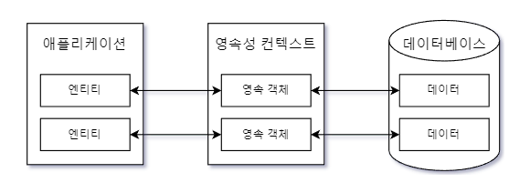

# JPA 시작하기
JPA 는 테이블과 매핑된 클래스의 객체를 생성할 때 인자가 없는 기본 생성자를 사용한다 <br>
매핑 설정을 하기 위한 기초 정리 <br>
- 테이블과 매핑될 클래스에 @Entity 를 붙인다.
- @Table 이용해서 테이블 이름을 지정한다.
- @Id 를 이용해서 식별자로 사용할 필드를 지정한다.
- @Column 을 이용해서 매핑할 컬럼을 지정한다.

## 영속 컨텍스트와 영속 객체 개요
엔티티는 DB에 보관되는 테이블을 의미한다 <br>
JPA 는 이 엔티티를 영속성 컨텍스트로 관리한다 <br>
영속 컨텍스트는 JPA 가 관리하는 엔티티 객체 집합이다 -> 스프링 컨테이너가 빈을 관리하는거랑 비슷한 느낌임<br>

영속 컨텍스트에 속한 엔티티 객체를 DB 에 반영한다 <br>
예를 들어 응용 프로그램에서 영속 컨텍스트에 엔티티 객체를 추가하면 JPA 는 이 엔티티 객체의 매핑 정보를 이용해서 관련 데이터를 DB에 반영한다 <br>

어플리케이션에서 영속 컨텍스트에 엔티티 객체를 추가하면 JPA 는 이 엔티티 객체의 매핑 정보를 이용해서 관련 데이터를 DB에 반영한다 <br>
반대로 JPA 를 이용해서 DB 에서 데이터를 읽어오면 매핑 정보를 이용해서 영속 컨텍스트에 객체를 생성해서 보관하고, 이 객체를 어플리케이션에게 제공한다 <br>

영속 컨텍스트에 보관된 객체를 영속 객체(=엔티티)라고 부른다 <br>
<br>

보통 영속 컨텍스트는 세션(JPA 의 EntityManager ) 단위로 생긴다 <br>
즉 세션 생성 시점에 영속 컨텍스트가 생성되고 세션 종료 시점에 컨텍스트가 사라진다 <br>

어플리케이션은 영속 컨텍스트에 직접 접근할 수 없다 <br>
대신 EntityManager 객체를 통해서 영속 컨텍스트와 관련된 작업을 수행한다 <br>
EntityManager 를 통해서 영속 컨텍스트로부터 엔티티 객체를 구한다 <br>

위 이유로 어플리케이션은 아래 순서로 동작한다. <br>
1) EntityManager Create
2) 트랜잭션 시작
3) EntityManager 를 통해 영속 컨텍스트에 객체를 추가하거나 구한다.
4) 트랜잭션을 Commit
5) EntityManger Close

일반 JDBC 랑 유사하다, Connection 대신 EntityManager 를 사용하고, JPA 가 제공하는 트랜잭션을 사용하는 것이 다를 뿐이다 <br>
JPA 는 SQL 을 직접 사용하지 않고, 객체 단위로 DB 연동을 처리한다 <br>

```java
	@Test
	void 유저_추가_테스트() {
		// 영속(=엔티티) 단위 별로 EntityManagerFactory 를 생성한다.
		EntityManagerFactory entityManagerFactory = Persistence.createEntityManagerFactory("jpastart");

		// 영속 관리하는 EntityManager 생성한다. -> 영속성 컨텍스트와 엔티티를 관리한다.
		EntityManager entityManager = entityManagerFactory.createEntityManager();
		
		// 영속 컨텍스트에서 EntityTransaction 을 구한다.
		EntityTransaction transaction = entityManager.getTransaction();

		try {
			transaction.begin();
			User user = new User("jin@naver.com","jin",new Date());
			entityManager.persist(user);
			transaction.commit();
		} catch (Exception e) {
			transaction.rollback();
		} finally {
			entityManager.close();
		}

		entityManagerFactory.close();
	}
```

- EntityManagerFactory 는 EntityManager 를 생성하는 팩토리이다 
  - 최초 한번 생성하지만 팩토리 안에서 영속 별로 EntityManager 를 생성한다. 

JDBC 프로그래밍에서 DB 연동을 처리할 때 Connection 을 사용하는 것처럼 JPA 는 EntityManager 를 사용하여 DB 연동을 처리한다 <br>

JPA 는 트랜잭션 범위에서 DB 변경을 처리하도록 제한하고 있기 때문에 19행과 같이 먼저 트랜잭션을 시작해야 새로운 데이터를 추가하거나 기존 데이터를 변경할 수 있다 <br>
- 트랜잭션이 정상 실행되면 DB 로 commit
- 트랜잭션이 실패하면 다시 rollback 을 시키는 메커니즘이다.

그리고 마지막으로 EntityManager 객체에 .persist() 를 사용해야 영속성 컨텍스트 -> DB 로 객체가 저장이 된다 <br>
정확히는 엔티티(=객체) 를 영속 컨텍스트에 추가한다. <br>
영속 컨텍스트에 추가한 객체는 EntityMangerTransaction 을 commit 할 때 실제 DB에 반영이 된다 <br>

즉 위 코드를 통해 DB 에 insert 가 된다 <br>
필요한 작업이 끝나면 EntityManger 를 .close() 해줘야 한다 <br>
애플리케이션 자체를 종료하고 싶다면  EntityMangerFactory 를 .close() 하면 된다 <br>


```java
	public List<User> getAllUsers() {
		EntityManager em = EMFUtils.createEntityManager();
		try {
			em.getTransaction().begin();
			TypedQuery<User> query = em.createQuery("select u from User u order by u.name", User.class);
			List<User> result = query.getResultList();
			em.getTransaction().commit();
			return result;
		} catch (Exception e) {
			em.getTransaction().rollback();
			throw e;
		} finally {
			em.close();
		}
	}
```

JPA 는 SQL 과 유사한 JPQL 을 제공한다 <br>
SQL 이 DB 테이블을 이용해서 쿼리를 작성한다면, JPQL 은 매핑 설정을 담은 클래스를 이용해서 쿼리를 작성한다 <br>
JPQL 에서 말하는 User 는 User 테이블이 아닌 User 클래스를 의미한다 <br>
즉 User 의 필드인 name 을 기준으로 정렬하는 쿼리이다 <br>

JPQL 의 실행하려면 쿼리 객체를 구해야 하는데 이 때 EntityManger.createQuery() 메소드를 사용한다 <br>
여기서 타입은 TypedQuery 객체를 생성했다 <br>

TypedQuery.getResultList() 메소드는 JPQL 실행 결과를 List 로 제공한다 <br>
이때 클래스의 매핑 정보를 사용해서 JPQL 을 알맞은 SQL 로 변환해서 실행하고 SQL 실행 결과로부터 필요한 객체를 생성한다.<br>

JPA 프로바이더가 SQL 쿼리를 생성하기 때문에 개발자는 CRUD 쿼리를 작성하지 않아도 된다 <br>

JPA 는 엔티티에 수정이 발생하면 이를 자동으로 DB에 반영해준다 <br>
```java
			User user = em.find(User.class, email);
			if(user == null) {
				throw new UserNotFoundException();
			}
			user.changeName(newName);
```

위 코드에서 email 에 해당하는 user 객체의 필드값이 바뀐다. <br>
그럼 JPA 는 자동으로 update 쿼리를 날린다 <br>
즉 JPA 는 객체의 변경 내역을 추적해서 트랜잭션을 종료할 때 알맞은 update 쿼리를 실행해서 DB 에 반영한다 <br>
하이버네이트는 이를 '더티 체킹' 이라고 부른다 <br>
이 더티 체킹 덕분에 직접 update 쿼리를 실행하지 않아도 객체의 상태 변경을 쉽게 DB 에 반영할 수 있다 <br>

JPA 를 사용하면 여러 방면에서 편리하지만, 주의해야 할 점도 있다 <br>
예를 들어 JPA 가 쿼리를 대신 생성하기 때문에 높은 성능이 요구되는 SQL 쿼리가 필요한 기능은 JPA 의 쿼리 생성 기능이 오히려 문제를 유발할 수 있다 <br>
ex) 대량 데이터를 배치로 처리한다거나 복잡한 조회 쿼리가 필요할 때 JPA 를 잘못 사용하면 처리 속도에 심각한 영향을 줄 수 있다 <br>

JPA 의 특징은 개발해야 할 기능에 따라 장점,단점이 생길 수 있다 <br>
무조건 JPA 를 이용해서 구현하는 것은 올바른 방법이 아니다 <br>
JPA 의 동작 방식을 숙지하고 상황에 따라 알맞게 사용해야 JPA 를 사용할 때 장점을 활용할 수 있다.