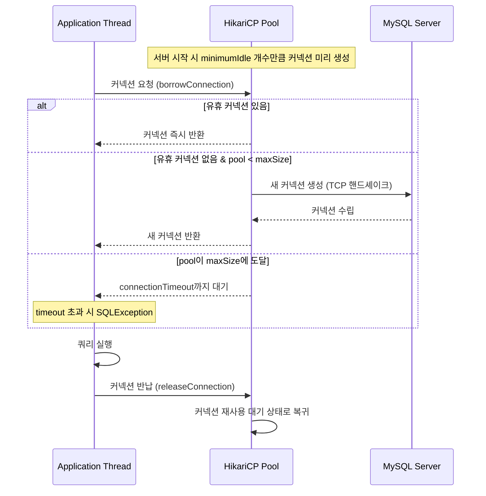
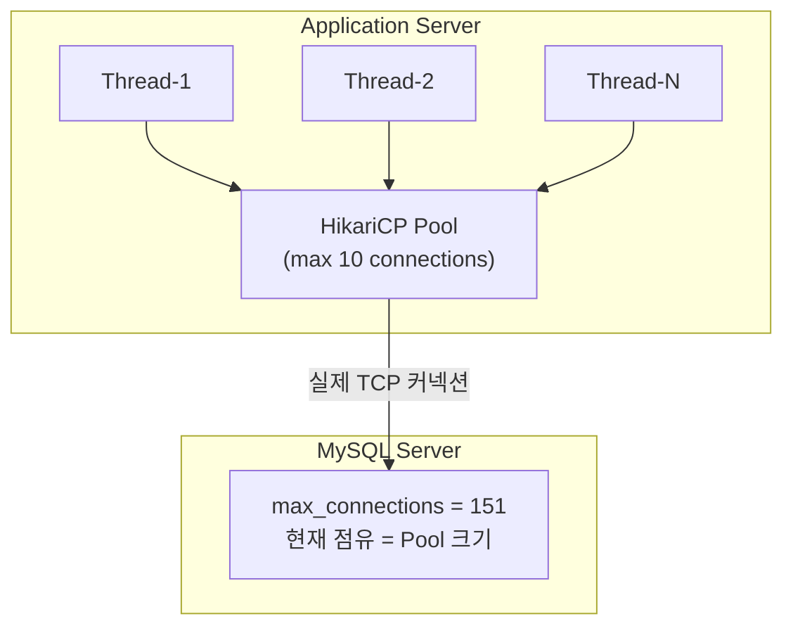
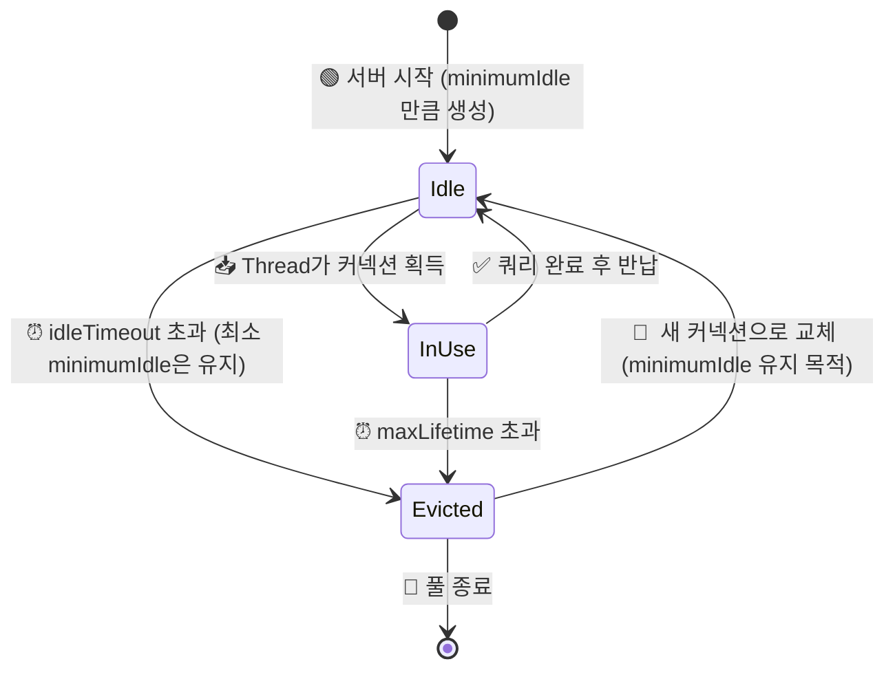
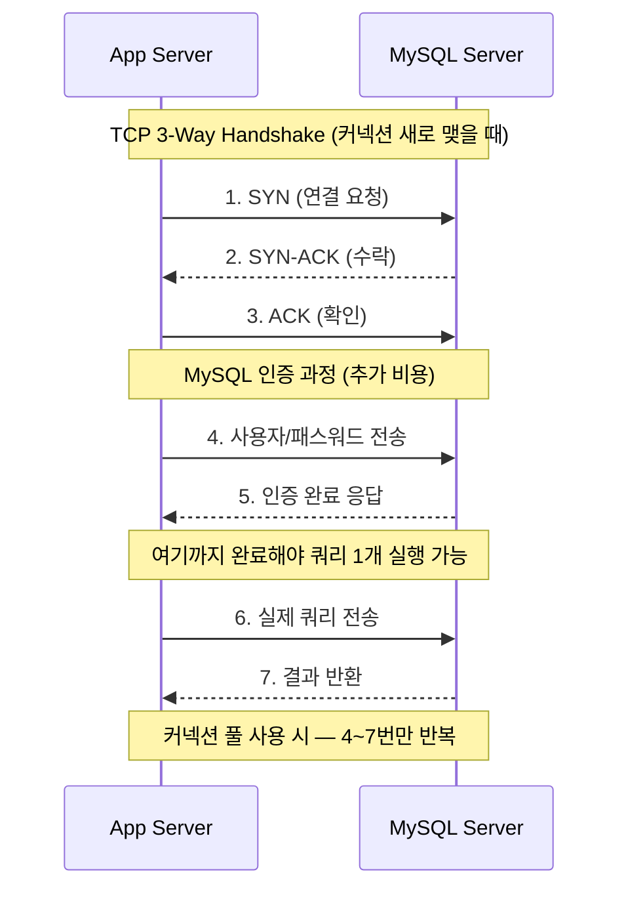
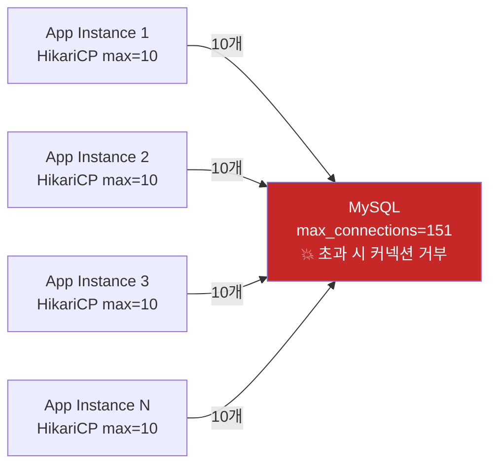
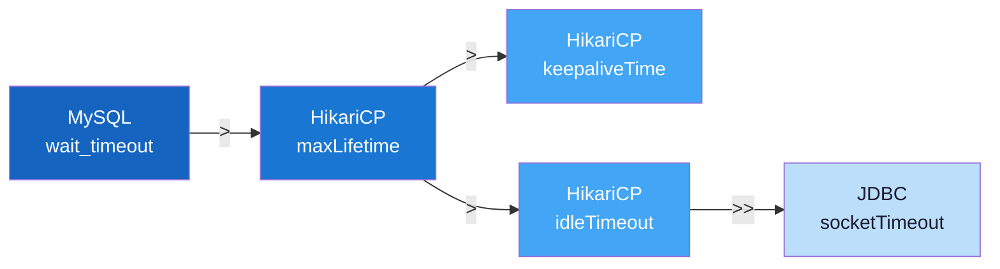

## 목차

1. [커넥션 풀이란?](#1-커넥션-풀이란)
2. [HikariCP 기본 설정값](#2-hikaricp-기본-설정값)
3. [두 레이어 전체 흐름](#3-두-레이어-전체-흐름)
4. [MySQL 서버 최대 커넥션 수](#4-mysql-서버-최대-커넥션-수)
5. [멀티 인스턴스 환경에서의 계산법](#5-멀티-인스턴스-환경에서의-계산법)
6. [적정 풀 사이즈 공식](#6-적정-풀-사이즈-공식)
7. [자주 하는 실수 & 안티패턴](#7-자주-하는-실수--안티패턴)

---

## 1. 커넥션 풀이란?

DB 커넥션은 TCP 핸드셰이크 + 인증 과정이 포함된 **비싼 자원**이다. 
매 요청마다 커넥션을 새로 맺으면 응답 지연이 심각해진다.

SpringBoot 에서는 HikariCP 를 사용하여  **커넥션 풀**을 미리 일정 수 만들어두고, 요청이 들어오면 빌려주고 반납받는 방식이다.



---

## 2. HikariCP 기본 설정값

Spring Boot는 별도 설정이 없으면 HikariCP가 기본 커넥션 풀로 자동 적용된다.

| 설정 | 기본값                 | 설명 |
|---|---------------------|---|
| `maximumPoolSize` | **10**              | 풀이 유지하는 최대 커넥션 수 |
| `minimumIdle` | maximumPoolSize와 동일 | 유휴 상태로 유지할 최소 커넥션 수 |
| `connectionTimeout` | 30,000ms (30초)      | 커넥션 획득 대기 최대 시간 |
| `idleTimeout` | 600,000ms (10분)     | 유휴 커넥션 제거 대기 시간 |
| `maxLifetime` | 1,800,000ms (30분)   | 커넥션 최대 수명 |
| `keepAliveTime` | 0 (비활성화)            | 커넥션 유지용 ping 주기 |
| `leakDetectionThreshold` | 0 (비활성화)            | 커넥션 누수 감지 임계 시간 |

> **주의** : `minimumIdle`의 기본값이 `maximumPoolSize`와 동일하기 때문에,  
> Spring Boot 앱이 뜨는 순간 **커넥션 10개가 즉시 전부 열린다.**

- MySQL 에 TCP 커넥션 10개 즉시 연결
- MySQL TCP 커넥션을, Hikari 커넥션 풀에 보관 -> 대기 상태 (Idle)

---

## 3. 두 레이어 전체 흐름



Hikari Pool에 10개의 커넥션을 미리 맺어 보관하고, 10개 요청이 동시에 들어오면 모두 즉시 처리. <br>
11번째 요청부터는 반납될 때까지 대기하며, 고정 풀(minimumIdle=maximumPoolSize) 설정에서는 추가 커넥션을 새로 생성하지 않는다. <br>

동적 풀일 때만 maxSize 까지 추가 생성하고, 고정 풀은 처음부터 maxSize 그대로 이다. 즉 maximumPoolSize 개수 이상으로는 DB 커넥션을 새로 생성하지 않는다 <br>


### Connection Life Cycle



- Idle: 커넥션 풀에서 대기 중
- InUse: 쿼리 처리 중
- Evicted: 폐기 예정


### TCP 핸드셰이크 비용


### 비용이 큰 이유
네트워크 왕복(RTT) 기준으로 핸드셰이크 없이 (풀 재사용)
- 쿼리 전송 → 결과 반환  =  1 RTT

핸드셰이크 포함 (매번 새 커넥션)
- SYN → SYN-ACK → ACK → 인증 → 쿼리 → 결과  =  3~4 RTT

내부망(1ms RTT) 기준으로도 3 RTT = 3ms 추가 오버헤드 × 초당 1000 TPS = 3,000ms 낭비 외부망이면 10배 이상

---

## 4. MySQL 서버 최대 커넥션 수

```sql
-- 현재 설정 확인
SHOW VARIABLES LIKE 'max_connections';
SHOW VARIABLES LIKE 'wait_timeout';

-- 현재 사용 중인 커넥션 수 실시간 확인
SHOW STATUS LIKE 'Threads_connected';
```

| 환경 | 기본 max_connections |
|---|---|
| MySQL 5.7 / 8.0 (로컬) | **151** |
| AWS RDS db.t3.micro | **약 66** |
| AWS RDS db.r5.large | **약 1,000** |

> **RDS 자동 산정 공식**  
> `max_connections ≈ DBInstanceClassMemory / 12,582,880 (bytes)`

---

## 5. 멀티 인스턴스 환경에서의 계산법

스케일아웃 시 **인스턴스마다 HikariCP 풀을 독립적으로** 유지하므로, MySQL 입장에서는 커넥션 수가 곱으로 증가한다.



### 안전 계산 공식

```
인스턴스 수 × maximumPoolSize ≤ MySQL max_connections × 0.8 (안전 마진 80%)

예시) 인스턴스 10대 × max=10 = 100개
     MySQL max_connections 151 × 0.8 ≈ 120
     → 100 < 120 ✅ 안전
```

> 관리자 접속, 모니터링 에이전트 등이 추가로 커넥션을 사용하므로  
> **반드시 80% 이하로 운영**해야 한다.

---

## 6. 적정 풀 사이즈 공식

HikariCP 저자 Brett Wooldridge의 공식 권장 공식이다.

```
maximumPoolSize = (Core 수 × 2) + 유효 디스크 스핀들 수

SSD 기반 → 스핀들 = 1
4 Core CPU → (4 × 2) + 1 = 9  →  9~10개가 최적
```

> **직관과 반대다** — 풀 사이즈를 크게 잡는다고 TPS가 오르지 않는다.  
> DB는 I/O 바운드 작업이고, 스레드 수가 코어 수를 초과하면  
> **컨텍스트 스위칭 오버헤드**가 증가해 오히려 TPS가 감소한다.

---

## 7. 자주 하는 실수 & 안티패턴

### ❌ 실수 1 — `maximumPoolSize`를 무작정 크게 잡기

```
잘못된 생각 : 커넥션이 많을수록 처리량이 늘어난다
실제       : DB는 I/O 바운드 → 코어 수 기반 공식이 최적
             초과 커넥션 → 컨텍스트 스위칭 증가 → TPS 감소
```

### ❌ 실수 2 — `autoReconnect=true` JDBC URL 설정

```
트랜잭션 처리 중 재연결 발생
→ 진행 중인 트랜잭션 자동 롤백
→ 결제 데이터 정합성 붕괴
→ 핀테크 환경에서는 절대 사용 금지
```

### ❌ 실수 3 — `socketTimeout`을 너무 짧게 설정

```
socketTimeout=5000 (5초)
→ 배치성 INSERT, 복잡한 JOIN 등 처리 시간 초과
→ SocketTimeoutException → 커넥션 broken 처리
→ 슬로우 쿼리 로그 p99 기준으로 여유 있게 설정할 것
```

### ❌ 실수 4 — `maxLifetime` > `MySQL wait_timeout`

```
maxLifetime=1800s, MySQL wait_timeout=60s 로 설정된 경우
→ MySQL이 먼저 커넥션 종료
→ HikariCP는 여전히 유효하다고 착각 (Stale Connection)
→ 다음 요청에서 Communications link failure 발생
```

### ✅ 안전한 설정값 대소 관계



| 규칙 | 이유 |
|---|---|
| `MySQL wait_timeout` > `maxLifetime` | MySQL이 먼저 끊기 전에 HikariCP가 커넥션을 교체해야 함 |
| `maxLifetime` > `keepaliveTime` | keepalive 전에 커넥션이 만료되면 안 됨 |
| `maxLifetime` > `idleTimeout` | idleTimeout으로 제거되기 전에 maxLifetime이 작동하면 안 됨 |
| `socketTimeout` ≥ 실제 쿼리 최대 응답 시간 | 정상 처리 중 타임아웃 방지 |

---

### 7. DB 확장 고려사항 — ProxySQL
인스턴스가 많아져 DB 커넥션 고갈이 우려될 때 도입을 검토한다.

```text
앱 ↔ ProxySQL ↔ DB 구조로,
앱이 몇 대든 DB 커넥션 수를 고정값으로 관리한다.
```

핵심 기능
- 커넥션 풀링: 앱→ProxySQL 100개, ProxySQL→DB 30개 고정
- Read/Write Splitting: SELECT → Slave, 나머지 → Master 자동 분기
- 장애 감지: Master 다운 시 자동 페일오버

도입 기준
인스턴스 수 × maximumPoolSize > max_connections × 0.6 수준이면 검토


### Q&A
> Q1) DB 서버 최대 연결 커넥션이 150일 경우 minimumIdle=10이면 앱 시작 시 10개를 미리 연결해두고, 다른 서버가 접속하면 남은 커넥션은 143개부터 시작인지?
```text
답변: 맞음, 앱이 뜨는 순간 실제로 MySQL과 TCP 소켓이 10개 열린다. 요청이 한 건도 없어도 연결은 이미 되어 있는 상태다.
미리 연결을 맺어두기 때문에 TCP 핸드셰이크 비용 없이 즉시 쿼리를 실행할 수 있다. 이게 풀을 쓰는 이유다.
MySQL 입장에서는 앱 서버가 몇 대인지 모르고, 그냥 커넥션 153개 한도 안에서 들어오는 커넥션 요청을 받아줄 뿐이다. 
```

<br>

> Q2) 고정 풀(minimumIdle=maximumPoolSize)로 유지하면서 인스턴스를 더 늘려야 할 때, 각 인스턴스의 maximumPoolSize를 줄이는 것과 MySQL max_connections를 올리는 것 중 어떤 게 더 안전한 접근인가요?
```text
답변: 둘 중 하나가 아니라, 두 가지를 함께 조정하는 게 정답이다.
```

<br>

> Q3) minimumIdle=maximumPoolSize(고정 풀)가 실무에서 어떤 문제를 막아주는가?

```text
시나리오:
  새벽 2시 — 트래픽 거의 없음 (동적 풀이면 커넥션 3개로 줄어든 상태)
  새벽 2시 10분 — 정산 배치 Job 실행 → 순간적으로 10개 커넥션 필요
  
동적 풀(minimumIdle=3) 이면:
  3개 → 10개로 늘리는 동안 TCP 핸드셰이크 7번 발생
  내부망 1ms RTT 기준 → 핸드셰이크당 3ms → 배치 첫 쿼리 지연
  
고정 풀(minimumIdle=10) 이면:
  새벽에도 10개 미리 대기 중 → 배치 Job 즉시 처리
  
결론: 배치 Job이 있는 환경에서는 고정 풀이 더 안전하다
```

> Q4) 커넥션 풀이 고갈되면 실제로 어떤 에러가 발생하는가?
```text
// 실제 발생하는 예외
HikariPool-1 - Connection is not available,
request timed out after 30000ms

org.springframework.dao.DataAccessResourceFailureException:
Unable to acquire JDBC Connection

// 원인: connectionTimeout(30초) 안에 커넥션을 못 받음
// 해결: maximumPoolSize 검토 또는 max_connections 상향
```
```
MySQL Server 모니터링 포인트:
  SHOW STATUS LIKE 'Threads_connected';   ← 현재 연결 수
  SHOW STATUS LIKE 'Connection_errors%';  ← 거부된 커넥션 수
  SHOW STATUS LIKE 'Max_used_connections'; ← 역대 최대 연결 수
```

---

## 참고

- [HikariCP 공식 문서](https://github.com/brettwooldridge/HikariCP)
- [HikariCP Pool Sizing 가이드](https://github.com/brettwooldridge/HikariCP/wiki/About-Pool-Sizing)
- [MySQL 8.0 wait_timeout 공식 문서](https://dev.mysql.com/doc/refman/8.0/en/server-system-variables.html#sysvar_wait_timeout)