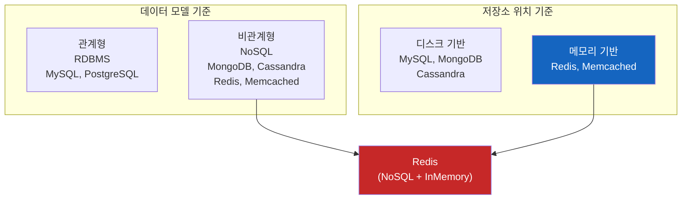
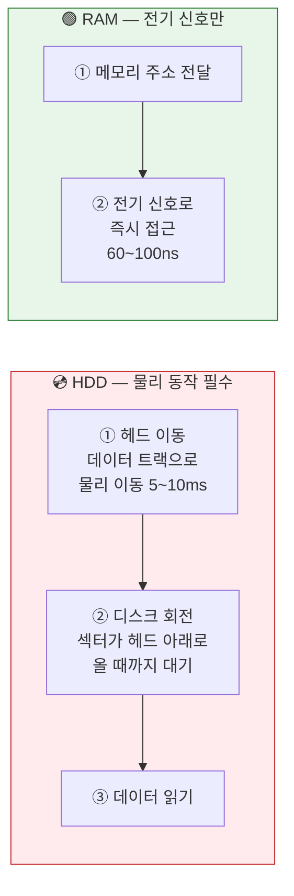
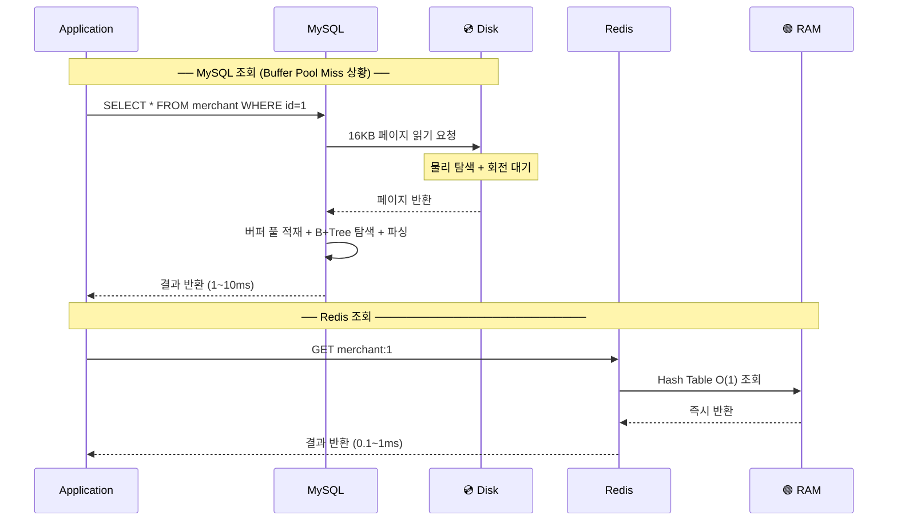
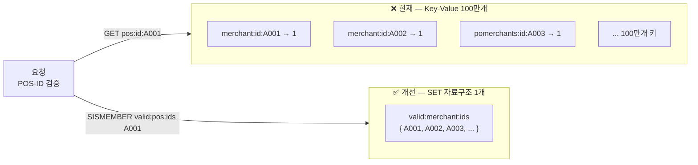

# Redis와 인메모리 DB 동작 원리

---

## 목차

1. [DB 저장소 3분류 비교](#1-db-저장소-3분류-비교)
2. [디스크 I/O 가 왜 느린가](#2-디스크-io-가-왜-느린가)
3. [인메모리 DB가 빠른 3가지 이유](#3-인메모리-db가-빠른-3가지-이유)
4. [MySQL vs Redis 동작 흐름 비교](#4-mysql-vs-redis-동작-흐름-비교)
5. [면접 답변 템플릿](#5-면접-답변-템플릿)
6. [Q&A](#6-qa)

---

## 1. DB 저장소 3분류 비교

| 분류 | 대표 제품 | 기본 저장소 | 디스크 I/O | 비고 |
|:---:|:---:|:---:|:---:|:---|
| **RDBMS** | MySQL, PostgreSQL, Oracle | 디스크 | **있음** | 트랜잭션, 정합성 중심 |
| **NoSQL** | MongoDB, Cassandra, DynamoDB | 디스크 | **있음** | 대부분 디스크 기반 |
| **NoSQL** | **Redis**, Memcached | **메모리** | **없음(기본)** | NoSQL이면서 InMemory |
| **InMemory DB** | Redis, Memcached, H2(테스트용) | 메모리 | **없음(기본)** | - |


- InMemory DB ⊂ NoSQL  (Redis는 NoSQL이면서 동시에 InMemory DB)
- NoSQL의 대부분은 디스크 기반이지만 Redis처럼 메모리 기반도 존재
- 저장소 위치(메모리/디스크)와 데이터 모델(관계형/비관계형)은  별개의 기준이다.



---

## 2. 디스크 I/O 가 왜 느린가

### 저장 매체별 속도 비교 (실제 수치)

| 저장 매체 | 접근 지연 | 읽기 속도 | 비고 |
|:---:|:---:|:---:|:---|
| HDD | 5~10ms | 100~200 MB/s | 물리 이동 필요 |
| SSD (SATA) | 0.1ms | 500 MB/s | 물리 이동 없음 |
| SSD (NVMe) | 0.02ms | ~7,000 MB/s | PCIe 직결 |
| **RAM** | **60~100ns** | **~50,000 MB/s** | 전기 신호만 |

```
RAM이 NVMe SSD보다 약 200배, HDD보다 약 100,000배 빠르다
```

### HDD가 느린 구조적 이유



### MySQL의 디스크 I/O 흐름

```
MySQL 조회 시 내부 동작

1. 쿼리 수신
2. 버퍼 풀(Buffer Pool) 확인
   ├── Hit  : 메모리에 있으면 즉시 반환 (빠름)
   └── Miss : 디스크에서 16KB 페이지 단위로 읽어서 버퍼 풀에 적재
              → 이 시점에 디스크 I/O 발생
3. B+Tree 인덱스 탐색
4. 결과 반환

→ 처음 조회이거나 버퍼 풀이 꽉 찬 경우 반드시 디스크 I/O 발생
```

---

## 3. 인메모리 DB가 빠른 3가지 이유

### ① 데이터가 처음부터 RAM에 상주

```
MySQL  : 디스크 저장 → 조회 시 디스크 읽기 → 버퍼 풀 적재 → 반환
Redis  : RAM 저장   → 조회 시 RAM 직접 접근 → 즉시 반환

MySQL의 InnoDB Buffer Pool도 메모리 캐시지만
  → 최초 조회는 반드시 디스크에서 읽어야 함
  → 버퍼 풀 용량 초과 시 LRU로 제거 → 다시 디스크 접근
  → Redis는 메모리가 허용하는 한 디스크 접근 자체가 없음
```

### ② 단순 자료구조 — O(1) 조회

```
MySQL  : B+Tree 인덱스 탐색 → 페이지 로딩 → 파싱 → 정렬 ...
Redis  : 내부적으로 Hash Table 사용 → O(1) 시간복잡도

Redis 주요 자료구조:
  String  → 단순 키-값, O(1)
  Hash    → 필드별 조회, O(1)
  List    → 순서 있는 목록, O(1) push/pop
  Set     → 중복 없는 집합, O(1) 추가/삭제
  ZSet    → 점수 기반 정렬 집합, O(log N)
```

### ③ 싱글 스레드 이벤트 루프

```
MySQL  : 요청마다 스레드 생성 → 컨텍스트 스위칭 오버헤드
Redis  : 단일 스레드 + I/O Multiplexing (epoll)
         → 컨텍스트 스위칭 없음
         → 메모리 연산 자체가 너무 빨라서 단일 스레드로도 충분
         → Redis 6.0 이후 I/O 처리는 멀티스레드, 핵심 연산은 싱글스레드 유지

결과: 단순 GET/SET 기준 초당 100,000 TPS 이상 처리 가능
```

---

## 4. MySQL vs Redis 동작 흐름 비교



### 속도 비교 요약

| 상황 | MySQL | Redis | 차이 |
|:---|:---:|:---:|:---:|
| Buffer Pool Hit | 1~5ms | - | - |
| Buffer Pool Miss | 5~50ms | - | - |
| Redis GET | - | 0.1~1ms | **10~500배** |
| 캐시 적용 후 | - | 0.1~1ms | - |

---

## 5. 면접 답변 템플릿

```
Q. Redis를 왜 사용하셨나요?

A. Redis가 빠른 근본적인 이유는 세 가지입니다.

   첫째, 데이터를 처음부터 RAM에 저장하기 때문에
   디스크 I/O가 발생하지 않습니다.
   RAM은 NVMe SSD보다 약 200배 빠른 접근 속도를 가집니다.

   둘째, Hash Table 기반의 단순 자료구조로
   O(1) 시간복잡도로 데이터를 조회할 수 있어
   MySQL의 B+Tree 인덱스 탐색보다 처리 단계가 훨씬 적습니다.

   셋째, 싱글 스레드 이벤트 루프로 동작해
   컨텍스트 스위칭 오버헤드가 없습니다.

   저는 회사 시스템에서 변경이 드물고 반복 조회가 많은 데이터를 Redis에 캐싱해서
   MySQL 디스크 I/O를 줄이는 용도로 활용했습니다.
```

---

## 6. Q&A

> **Q. NoSQL과 RDBMS는 디스크 I/O가 있고, 인메모리 DB만 디스크 I/O가 없는 건가요?**

절반은 맞고 절반은 틀리다.

RDBMS(MySQL, PostgreSQL)는 모두 디스크 기반이고, NoSQL 대부분(MongoDB, Cassandra)도 디스크 기반이다. 그러나 **Redis는 NoSQL이면서 동시에 인메모리 DB**다. 즉 분류 기준이 두 가지(데이터 모델 / 저장소 위치)인데 이를 혼동하면 Redis를 "NoSQL이니까 디스크 기반"으로 오해하게 된다.

정확한 기준은 이렇다.

```
저장소 위치 기준  : 디스크 기반 vs 메모리 기반
데이터 모델 기준  : 관계형(RDBMS) vs 비관계형(NoSQL)

Redis = 비관계형(NoSQL) + 메모리 기반(InMemory)
MySQL = 관계형(RDBMS)  + 디스크 기반
```

---

> **Q. MySQL의 InnoDB Buffer Pool도 메모리 아닌가요? Redis와 뭐가 다른가요?**

Buffer Pool은 디스크 데이터의 **캐시**다. 처음 조회 시에는 반드시 디스크에서 읽어야 하고, Buffer Pool 용량을 초과하면 LRU 알고리즘으로 데이터를 제거 후 다시 디스크에서 읽는다. Redis는 처음부터 메모리가 원본 저장소이기 때문에 디스크 접근 경로 자체가 없다.

---

> **Q. Redis가 싱글 스레드인데 어떻게 100,000 TPS 이상을 처리하나요?**

Redis의 병목은 CPU 연산이 아니라 네트워크 I/O다. 메모리 연산 자체가 나노초 단위로 너무 빠르기 때문에, 단일 스레드가 I/O Multiplexing(epoll)으로 수천 개의 소켓을 동시에 관리하면서 처리하면 CPU 낭비 없이 높은 처리량을 낼 수 있다. 컨텍스트 스위칭이 없으니 오히려 멀티스레드보다 효율적인 상황이 만들어진다.

---


## 실무 적용 개선 사례
```text
목적 = "이 MERCHANT_ID가 유효한가?" = 집합 포함 여부 확인
→ Redis SET 자료구조가 정확히 이 목적으로 설계됨

구조:
  key         : "valid:merchant:ids"  (단 1개의 키)
  value       : { A001, A002, A003, ... A1000000 }  (100만개 멤버)

검증 방법:
  SISMEMBER valid:merchant:ids "A001"
  → O(1)  반환값: 1(존재) / 0(없음)
```


---

## 메모리 사용량 비교
```
Key-Value 방식 (현재)
  키 오버헤드  : 100만 × 70 bytes  = 70 MB
  값 저장      : 100만 × 10 bytes  = 10 MB
  합계                             ≈ 80 MB

Redis SET 방식
  키 오버헤드  : 1개 키             ≈ 0 MB
  멤버 저장    : 100만 × 10 bytes  = 10 MB
  합계                             ≈ 10 MB

→ 약 8배 메모리 절약
```


## 참고

- [Redis 공식 문서 — Introduction](https://redis.io/docs/about/)
- [Redis 내부 구조 — Redis Internals](https://redis.io/docs/reference/internals/)
- [MySQL InnoDB Buffer Pool](https://dev.mysql.com/doc/refman/8.0/en/innodb-buffer-pool.html)