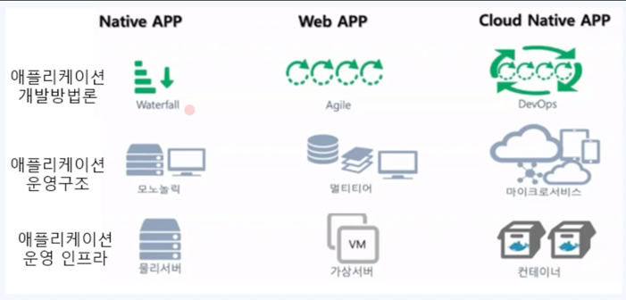
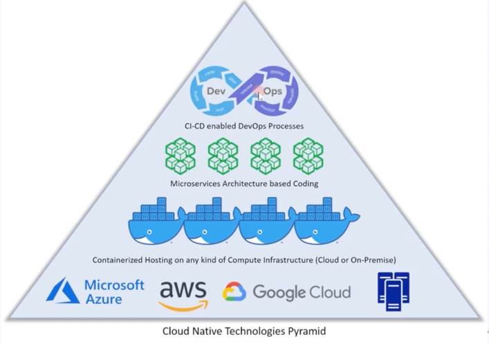
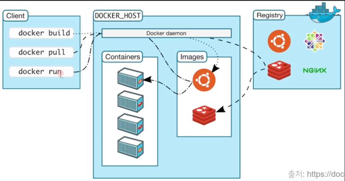
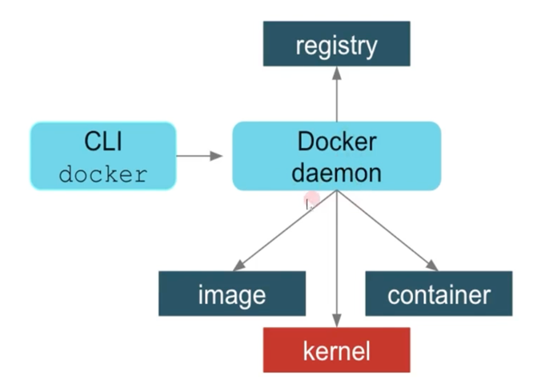

# 컨테이너 개념과 동작원리
우리가 알고 있는 컨테이너는 뭐가 있을까요?  
Docker ? Kubernetes? 등이 있습니다. 

1) 클라우드 네이티브 이해
2) 컨테이너 이해
3) 도커 컨테이너 설치

### 클라우드 네이티브 란?
CNCF : cloud native computing foundation
- 클라우드 네이티브 기술은 조직이 퍼블릭,프라이빗, 그리고 하이브리드 클라우드와 같은 현대적이고 동적인 환경에서 확장 가능한
애플리케이션을 개발하고 실행할 수 있게 해준다. 
ex) 컨테이너, 서비스 매쉬, 마이크로서비스, 불변 인프라 가 이러한 접근 방식의 예시들이다.
- 이 기술은 회복성, 관리 편의성, 가시성을 갖춘 느슨하게 결합된 시스템을 가능하게 한다.
- 견고한 자동화 기능을 함께 사용하면 엔지니어는 영향이 큰 변경을 최소한의 노력으로 자주,예측 가능하게 수행할 수 있다.

시대적으로 변화되는 애플리케이션 개발환경과 인프라 구조
  
생산성과 민첩성이 발전하였다.

클라우느 네이티브 기술 피라미드
  

#### 컨테이너 란?
- 애플리케이션과 운영환경이 모두 들어있는 독립된 공간
- 애플리케이션 가상화
  - 경량의 독립 실행 형 소프트웨어 패키지
  - 코드, 런타임, 시스템 도구, 시스템 라이브러리 및 설정과 같이 응용 프로그램을 실행하는 데 필요한 모든 것을 포함

  
### Docker container Workflow
-> client-server architecture
  

  

