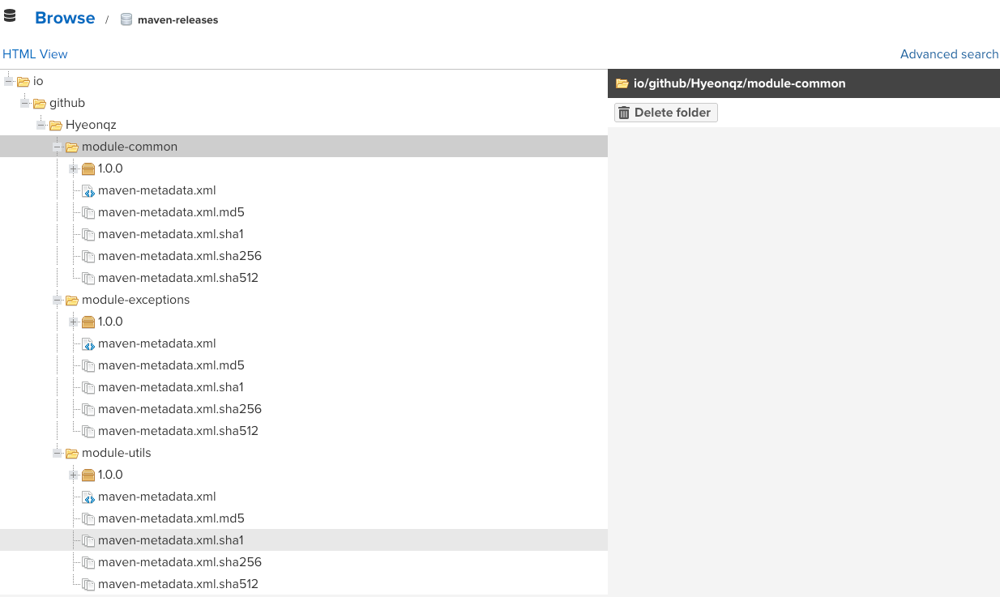

# docker-compose Nexus 환경 구성하기


```yaml
version: '3.8'

services:
  nexus:
    image: sonatype/nexus3:latest
    container_name: nexus
    restart: unless-stopped
    ports:
      - "8081:8081"      # Nexus Web UI
      - "8082:8082"      # Docker Registry (hosted)
      - "8083:8083"      # Docker Registry (group)
    volumes:
      - nexus-data:/nexus-data
    environment:
      - INSTALL4J_ADD_VM_PARAMS=-Xms2g -Xmx2g -XX:MaxDirectMemorySize=2g
    networks:
      - nexus-network

volumes:
  nexus-data:
    driver: local

networks:
  nexus-network:
    driver: bridge

```


위 docker-compose 파일을 생성하고 docker-compose up -d 명령어를 통해 컨테이너를 기동한다 <br>

기동이 완료된 이후 localhost:8081 를 접속하면 아래와 같은 화면이 나온다 <br>
 <br>

초기 id: admin <br>
pw 는 docker-compose 활성한 경로에 가서 `docker exec -it nexus cat /nexus-data/admin.password` 명령어 입력을 하면 나오는 UUID 를 pw 자리에 입력하면 초기 패스워드 설정을 할 수 있는 화면이 나온다 <br>

계정에 대한 설정을 완료한 이후에, admin 은 여러 계정을 생성할 수도 있다 <br>

필자는 아래 모듈을 nexus 저장소로 push 를 진행해보았고, push 하기 위한 설정은 아래와 같다 <br>

#### build.gradle
```java
plugins {
    id 'java'
    id 'org.springframework.boot' version '3.5.6'
    id 'io.spring.dependency-management' version '1.1.7'
    id 'maven-publish'  // maven repository deploy
}

bootJar { enabled = false }

jar { enabled = true }

group = 'io.github.Hyeonqz'
version = '1.0.0'
description = 'module-common'

java {
    toolchain {
        languageVersion = JavaLanguageVersion.of(21)
    }
}

configurations {
    compileOnly {
        extendsFrom annotationProcessor
    }
}

repositories {
    // Nexus Repository
    maven {
        url = uri('http://localhost:8081/repository/maven-public/')
        allowInsecureProtocol = true  // HTTP 허용 (로컬 개발용)
        credentials {
            username = 'admin'
            password = '1234'
        }
    }

    mavenCentral()
}

// Deploy 설정
publishing {
    publications {
        maven(MavenPublication) {
            from components.java
            versionMapping {
                usage('java-api') {
                    fromResolutionOf('runtimeClasspath')
                }
                usage('java-runtime') {
                    fromResolutionResult()
                }
            }
        }
    }

    repositories {
        maven {
            name = 'nexus'
            url = 'http://localhost:8081/repository/maven-releases/'
            allowInsecureProtocol = true
            credentials {
                username = 'admin'
                password = '1234'
            }
        }
    }
}


dependencies {
    // spring data
    implementation 'org.springframework.boot:spring-boot-starter-data-jpa'

    // lombok
    compileOnly 'org.projectlombok:lombok'
    annotationProcessor 'org.projectlombok:lombok'

    // test
    testImplementation platform('org.junit:junit-bom:5.10.0')
    testImplementation 'org.junit.jupiter:junit-jupiter'
    testRuntimeOnly 'org.junit.platform:junit-platform-launcher'
}

test {
    useJUnitPlatform()
}
```

위 gradle 설정에서 publishing 에 대한 내용을 필수적으로 정의해줘야 한다 <br>

실제 nexus 에 publish 하는 방법은 아래와 같다.

> * ./gradlew clean build
> * ./gradlew publish


위 publish 가 완료가 되면, nexus 저장소에 지정한 경로에 module 이 배포가 된다 <br>
 <br>


추가적으로 실제로 위 모듈을 가져와서 사용하는 방법은 아래와 같다
> implementation "io.github.Hyeonqz:module-common:1.0.0"


위 의존성을 build.gradle 에 주입을 하면 정상적으로 사용할 수 있다!
