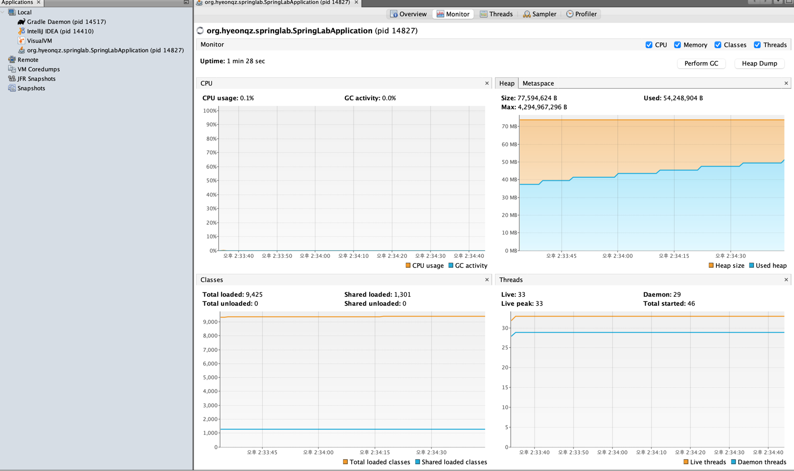
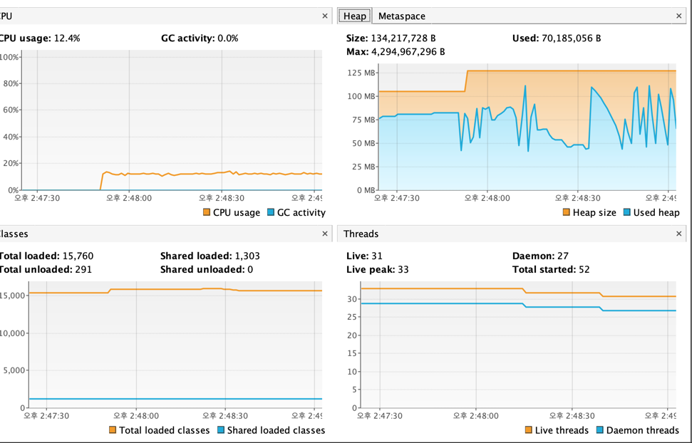

# Java(=JVM) 모니터링 using JMX

요즘 Java 사용 웹 개발자들은 보통 스프링부트를 사용하고 있다고 생각한다 <br>
그리고 Spring 에서 대표적인 모니터링 툴로는 Spring actuator 가 있다 <br>

스프링을 사용하지 않는 환경에서 Java 어플리케이션 을 모니터링하기 위해서는 JMX 가 존재한다 <br>
나는 위 JMX 를 다뤄볼 예정이고 간단하게 Spring actuator 또한 설명을 해보겠다 <br>

Spring actuator 는 Spring 어플리케이션 상태 및 메트릭을 모니터링할 수 있는 라이브러리 이다 <br>
> implementation 'org.springframework.boot:spring-boot-starter-actuator'

위 의존성을 추가하면 모니터링 기능을 사용할 수 있다 <br>

기본적으로 아래와 같이 로컬호스트/actuator 를 붙여 헬스 체크를 할 수 있다 <br>
> http://localhost:8081/actuator
> > http://localhost:8081/actuator/health <br>
> > http://localhost:8081/actuator/metrics

위 path 를 통해 모니터링을 진행할 수 있다 <br>

특징은 간단하게 말하면
- REST API 기반: /actuator/health, /actuator/metrics 등의 엔드포인트를 통해 애플리케이션 상태와 메트릭 제공.
- 확장 가능: 커스텀 엔드포인트 생성 및 필요한 데이터를 추가 가능.
- 보안 통합: Spring Security를 통해 접근 제어를 쉽게 설정 가능.
- 플러그인 지원: Prometheus, Grafana 같은 모니터링 툴과 통합 용이.

이정도가 있다. 추가적인 공부는 필요하다면 그때 그때 공식문서 및 구글링을 통해 해보는게 좋을 것 같다고 생각함

REST API 기반: /actuator/health, /actuator/metrics 등의 엔드포인트를 통해 애플리케이션 상태와 메트릭 제공.
확장 가능: 커스텀 엔드포인트 생성 및 필요한 데이터를 추가 가능.
보안 통합: Spring Security를 통해 접근 제어를 쉽게 설정 가능.
플러그인 지원: Prometheus, Grafana 같은 모니터링 툴과 통합 용이.

즉 위를 보면 REST API 기반 모니터링이 필요한 경우 위 기능을 사용하면 된다 <br>
다른말로 해보자면 어플리케이션 레벨에서 모니터링이 필요하다면 Spring actuator 가 적합하다 <br>
하지만 더 로우한 레벨에서 모니터링이 필요하다면 JMX 를 사용할 필요가 있다.


### 스프링부트에서 JVM 을 모니터링 해보자
JVM 을 직접 모니터링 해보기 위해서는 추가적인 설정이 필요하다 <br>
스프링부트에는 JMX 기능이 기본적으로 내장되어 있고 위 기능을 사용하기 위해서는 설정을 통하여 활성화만 시키면 사용할 수 있다 <br>

```java
spring:
  jmx:
    enabled: true
```

그리고 위 모니터링 내용을 모니터링툴에 연동을 할 수 있다.
- datadog
- VisualVM
- 인텔리제이
    - 서버 구동시 Profile [*****Application] with intellij profiles 를 사용해도 가능하다.
    - 위 기능은 cpu, heap memory 에 대한 내용을 모니터링 할 수 있음.

  
인텔리제이 자체 프로파일링 툴을 사용해도 나름 괜찮지만 더 자세하게 볼 수 있고 상용으로 자주 쓰이는 ‘**VisualVM**’ 을 사용하여 내 어플리케이션을 모티터링 해보려고 한다. <br>
VisualVm 은 JVM 기반 어플리케이션의 성능을 실시간으로 분석하기 위해 주로 사용하는 오픈소스 툴 이다 <br>

1) 인텔리제이 에서 VisualVm Launcher 플러그인을 다운받자 <br>
2) https://visualvm.github.io/download.html 위 사이트에서 visualVm 을 다운로드 받는다
3) 다운로드 후 인텔리제이에서 shitf 2번 연타하여 'start visualVm' 을 클릭한다
4) 그러면 VisualVm 을 연결할 Path 를 지정해줘야한다
5) 이 때 다운받은 visualVm 을 zip 을 푼 후에 visualVm/bin/visualVm 쉘 파일을 등록해준다
6) 그러면 이제 visualVm 을 실행시킬 수 있다.

실행을 시키면 위 화면이 있고 왼쪽 메뉴가 있다.<br>
- Local
  - 현재 로컬 컴퓨터에 JVM으로 돌아가는 Application 목록 및 pid
- Remote
  - 로컬 컴퓨터가 아닌 다른 서버에 있는 Application 목록 및 pid
- VM CoreDumps
  - 코어덤프 파일을 열어둔 목록
- Snapshots
  - Application 데이터의 스냅샷 파일을 열어둔 목록

  
현재 나는 Local 에 스프링 어플리케이션이 한개를 뛰워뒀다. <br>
 <br>

왼쪽 메뉴를 보면 내가 패키지 구조랑 PID 가 떠 있다 <br>

일단 로컬에서 모니터링을 하기에는 준비가 끝났다 <br>
이제 한번 어떤식으로 JVM 모니터링이 되는지 체크해보자 <br>

```java
@RequiredArgsConstructor
@Service
public class LoopService {
	private final ActuatorRepository actuatorRepository;
	
	public void insert() {
		for (int i = 0; i < 1000000000; i++) {
			Actuator actuator = new Actuator((long)i, LocalDateTime.now());
			actuatorRepository.save(actuator);
		}
	}
	
}

@RequiredArgsConstructor
@RequestMapping("/v1/act")
@RestController
public class ActuatorController {
  private final LoopService loopService;

  @GetMapping("/loop")
  public void forLoop() {
    loopService.insert();
  }
}

```

위 1억건 insert 하는 API 를 실행시켜 보겠다 <br>
위 API 를 실행시켰을 때 아래와 같은 결과가 모니터링에서 보인다 <br>
 <br>

여기서 주목할 내용은 Heap 에 집중해야 한다 <br>
Java 의 GC 는 Heap 메모리를 대상으로 동작한다 <br>
위 그래프를 보면 그래프가 위로 갔다 아래로 가는 그래프가 보이는게 정상이다 <br>

왜냐하면 GC 가 JVM Heap 을 돌아다니면서 객체들에 참조가 끊어진 것들을 찾아서 없애 버리는게 GC 이다. <br>
그러므로 GC 가 돌면서 참조가 끝난 객체들을 없애면서 메모리를 계속 확보하는 것이다 <br>

만약 Heap 그래프가 왔다갔다 하지않고 위로 쭉 올라갈 경우 장애가 발생할 것이다 ex) OutOfMemory <br> 
지금은 1억건 데이터를 그냥 insert 하는 작업을 하였지만 운영 상황에서는 어떠한 문제가 발생할지 모른다 <br>
그러므로 위 모니터링을 주기적으로 하면서 병목지점을 찾아야 하고 장애에 대한 대처를 할 수 있어야 한다. <br>

위 문제를 대처하기 위해서는 Heap Dump 기능을 통해서 자세하게 알 수 있다 <br>
Heap Dump 를 클릭하면 대시보드 summary에서 전체 heap size, classes 개수 등 heap data 정보, 시스템 환경 정보, 모듈 정보<br>
시스템 설정 정보와 함께 인스턴스의 수와 크기에 따른 클래스, 사이즈별 인스턴스 정보를 제공하고 있습니다. <br>

위 정보를 바탕으로 어떻게 코드를 리팩토링 해야 할지에 대한 감을 잡을 수 있다고 생각합니다.

> create by 20241229 나중에 추가 내용 작성하기

하지만 실무에서는 로컬에 띄워든 어플리케이션을 모니터링할일은 거의 없을 것이다 그러므로 remote 로 운영 서버에서 작동중인 어플리케이션에 대하여 모니터링이 필요합니다 <br>

관련된 글은 아래를 참고해서 진행해고 내용을 추가하려고 한다. <br>
https://velog.io/@limsubin/VisualVM%EB%A5%BC-%EC%9D%B4%EC%9A%A9%ED%95%98%EC%97%AC-remote%EB%A1%9C-jvm-%EB%B0%8F-%EC%84%B1%EB%8A%A5%EC%9D%84-%EB%AA%A8%EB%8B%88%ED%84%B0%EB%A7%81-%ED%95%98%EC%9E%90