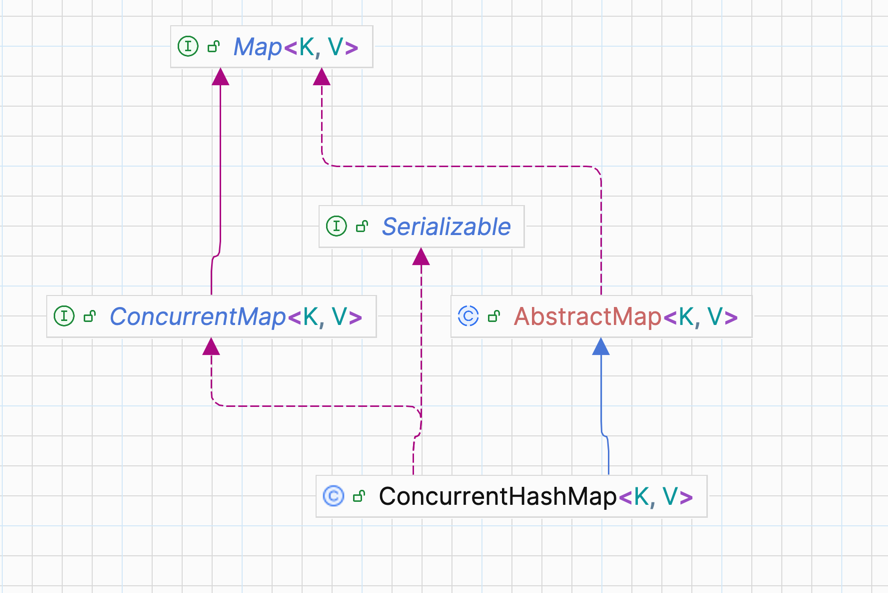

# thread-safe 이란?

면접 단골질문? 이 있다. 바로 StringBuffer 와 StringBuilder 에 대한 질문이다 <br>
위 질문에서 아마도 면접관들이 원하는 키워드는 바로 'thread-safe' 에 대한 의견을 듣는 것일 것이다 <br>

당연하게도 남들 다 아는 똑같은 역할과 동작을 시키지만 내부 메소드가 다르고, 구현 방법이 다르고~ 이런 이야기는 좋아하지 않을 것이라고 생각한다 <br>

Java ConcurrentMap 에 대한 내용을 공부하닥 thread-safe 에 관한 내용이 나와 한번 정리를 해보았다.
<br>

<h3 style="color:red">1. thread-safe 개념</h3><hr>
Thread-safe 이란 여러 스레드가 동시에 같은 리소스(객체, 변수, 데이터 구조 등)에 접근하더라도 프로그램이 의도한 대로 정확하게 동작하는 것을 의미한다 <br>

일반적으로 우리가 자주 사용하는 Primitive 타입, Wrapper 타입, 컬렉션(List,Map,Set) 등은 thread-safe 하지 않다 <br>
기본적으로 설계 및 내부 구현이 그렇게 되어있다 <br>

추가적으로 Java 환경에서 웹 개발을 한다면 SpringBoot 를 사용할 것이라고 가정하고 이야기를 하겠다 <br>

SpringBoot 는 멀티 스레드 환경으로 설정한 **스레드풀**을 사용하여 여러 사용자 요청을 별도의 스레드로 처리한다 <br>
스레드의 특성상 같은 프로세스 내에 존재한다면 메모리 공간을 공유하기에 JVM 프로세스 내에서 여러 스레드가 동일한 메모리 공간을 공유하게 된다.<br>
스레드는 Heap,Method, 모든 싱글톤 빈의 인스턴스 변수를 서로 공유할 수 있다 <br>

싱글톤은 상태(=값) 을 가지지 않도록 Stateless 하게 설계 되므로 thread-safe 하게 된다 <br>
하지만 싱글톤 빈 내부에서 상태를 가지는 인스턴스 변수를 사용하면, 여러 스레드가 접근하여 상태를 바꿀 수 있어 동시성 및 데이터 정합성이 맞지 않는 문제 발생한다 <br>

스프링부트는 각 요청마다 새로운 객체를 생성하는 메커니즘을 사용하고, 상태를 가지지 않도록 설계된 싱글톤 빈을 사용하여 thread-safe 문제를 예방해준다. <br>
그래서 우리가 어플리케이션 로직 작성시 thread-safe 에 대한 로직을 작성할 필요가 없다 <br>

하지만 위 내용 처럼 상태를 가지는 공유변수를 사용했다면 이야기는 달라진다 <br>

한번 아래 코드를 봐 보자
```java
public class Counter {
	private int count = 0; // 공유 자원

	public int increment() {
		return count++;
	}

	public int decrease() {
		return count--;
	}

}

```

위 코드를 여러 스레드가 동시에 접근한다면 무슨 문제가 발생할까? <br>
내가 원하는값은 1이 증가한 값인대 동시에 접근한쪽이 decrease() 를 사용한다면 -1 이 되어 다시 0이 될 것이다 <br>

위 문제를 방지하기 위해서는 여러가지 방법이 있다 <br>
일반적으로는 공유자원을 사용하지 않고 위 변수를 메소드 내부에서 선언하고 return 하는 것이다
```java
public class Counter {

	public int increment() {
		int count = 0;
		return count++;
	}
	public int decrease() {
		int count = 0;
		return count--;
	}

}

```


부득이하게 메소드 내부에서 변수를 선언할 수 없다면 아래 방법을 선택할 수 있다
```java
public class Counter {
	private int count = 0; // 공유 자원

	public synchronized int increment() {
		return count++;
	}


	public synchronized int increment() {
		return count--;
	}

}
```

위 synchronized 키워드가 있으면 위 메소드가 실행될 동안 다른 스레드를 대기를 시킨다. <br>

위 방법은 메소드 단에서 해결하는 방법이고, 아예 불변 객체로 만들어서 사용할 수도 있다 <br>
```java
public final class ImmutablePerson {
	private final String name;

	public ImmutablePerson (String name) {
		this.name = name;
	}
	
	public String getName() {
		return name;
	}

}

```

클래스 단에 final 을 붙이면 상속을 금지 한다는 의미 이다 ex) String, Integer <br>
사실상 확장될 일이 거의 없는 객체를 사용할 때 위 final 이 붙은 클래스를 사용한다 <br>
(요즘은 위 구조랑 같고 더 간편한 record 를 사용한다) <br>

즉 위 구조를 통해 안정성 및 불변성을 보장받을 수 있다 <br>
즉 thread-safe 하다고 할 수 있다 <br>

지금 까지는 thread-safe 하지 않는 것들을 thread-safe 한 구조로 만들어 보았다 <br>

이번에는 애초에 JDK 에서 thread-safe 하게 설계를 해둔 것에 대해서 알아보자 <br>
#### StringBuilder, StringBuffer
대표적인 예시이다 <br>
StringBuilder 는 단일 스레드 환경에서 작업을 하는 경우 사용한다 <br>
thread-safe 하지 않으므로 동기화 오버헤드가 없어 빠른 성능을 가진다 <br>

반면에 StringBuffer 는 thread-safe 하여 다중 스레드에서 안전하다 <br>
하지만 동기화 오버헤드가 있어 속도가 조금 느리다는 단점이 있다 <br> 

보통 성능이 우선시 된다면 StringBuilder 를 사용한다, 하지만 데이터 무결성이 중요하다면 StringBuffer 를 사용한다 <br>

내 경험상 실무에서는 StringBuffer 보다는  StringBuilder 를 자주 사용한다 <br>
그냥 멀티 스레드 환경에서 스레드 별로 독립적으로 StringBuilder 를 사용하거나, 아니면 외부에서 동기화를 제어하는게 나은것 같다 <br><br>


<h3 style="color: fuchsia"> Thread-Safe 한 컬렉션 </h3>
우리가 보통 사용하는 ArrayList, HashSet, HashMap 등 은 Thread-Safe 하지 않다 <br>
위 단점을 보완하기 위해서 JDK 가 업그레이드 됨에 따라 내부 구현 자체가 Thread-Safe 하게 설계된 컬렉션들 및 메소드들이 존재한다 <br>

java.util.concurrent.* 패키지에서 멀티 스레드 프로그래밍을 위한 고수준의 유틸리티를 제공한다. <br>

아래는 기존 컬렉션을 thread-safe 하게 바꾸는 로직이다 <br>
#### List, Set, Map
```java
// non thread-safe
List<String> list = new ArrayList<>();
Set<String> set  = new HashSet<>();
Map<String,String> map = new HashMap<>();

// thread-safe
List<String> syncList = Collections.synchronizedList(list);
Set<String> syncSet = Collections.synchronizedSet(set);
Map<String, String> syncMap = Collections.synchronizedMap(map);
```

위 로직은 메소드를 통하여 컬렉션을 Thread-Safe 하게 만드는 방법이다 <br>

아래는 설계 자체가 Thread-Safe 하게 된 객체들이다 <br>

```java
		AtomicInteger atomicInteger = new AtomicInteger();
		AtomicBoolean aBoolean = new AtomicBoolean();
		
		
```

<br>

#### 향상된 컬렉션
아래 코드들은 기본 구현체들은 최상위 객체를 기반으로 설계가 멀티 스레딩이 가능하게 끔 설계가 된 객체이다 <br>
```java
	public void 동시성_컬렉션() {
		// Thread-safe Map
		Map<String, String> map = new ConcurrentHashMap<>();
		
		// Thread-safe Queue
		Queue<String> queue = new ConcurrentLinkedQueue<>();
		
		// Blocking Queue
		Queue<Integer> queue2 = new LinkedBlockingQueue<>(100);

		// copy-on-write 컬렉션 Read 작업 많을 때 효율적
		List<String> list = new CopyOnWriteArrayList<>();
	}
```

위 컬렉션들을 하나 하나 깊게 가보면 정말 재밌는 내용이 많을 것 같다는 생각이 든다 <br>
위 4개의 컬렉션 중에 필자는 실무에서 그나마 적용할 수 있을 것 같은 ConcurrentHashMap 에 대한 관심이 생겨 내용을 찾아 보았다 <br>

Hierarchy 구조는 아래와 같다 <br>
 <br>

AbstractMap 을 상속받고, ConcurrentMap -> Map 의 인터페이스를 구현받고 있다 <br>

위 ConcurrentHashMap 의 특징은 여러 스레드에서 동시 접근해도 안전하다는 장점이 있다 <br>
주요 메커니즘은 레거시인 HashTable 을 확장하였다 <br>

기존 컬렉션에는 내부 구현에는 존재하지 않는 Lock 관련 구현이 있기에 동시성에 안전하다 <br>
하지만 그에 따른 메모리 오버헤드 가 발생할 수 있다는 점을 유의해야 한다 <br><br>


즉 결론적으로 멀티 스레드 환경에서 동시성을 보장받기 위해서는 아래와 같은 방법을 사용할 수 있다
- ConcurrentHashMap 같은 동시성 컬렉션 사용
- Collections.synchronizedList() 같은 동기화 래퍼 사용
- synchronized 블록으로 코드 보호
- Lock 인터페이스 구현체 사용
- AtomicXXX 클래스 사용

위 java.concurrent 유틸리티에 있는 구현체 및 메소드를 사용하여 저수준에서 컨트롤 할 수 있다는 것을 알 수 있었다 <br>

하지만 SpringBoot 같은 프레임워크에서는 여러 사용자 요청을 별도의 스레드로 처리하며<br>
각 요청마다 새로운 객체를 생성을 하여 동기화를 보장하는 메커니즘을 제공하기 때문에 직접 thread-safe 문제를 처리하지 않아도 되는 경우가 대부분 일것이다 <br>

그리고 저수준 코드를 추상화 해둔 어노테이션(=@Async, @Transactional) 등을 제공하므로 적절히 잘 찾아서 사용하면 위 코드를 건드릴 일은 많이 없을 것이라고 생각한다 <br><br>


<h3 style="color:blue;"> REF </h3>

> 1. https://www.baeldung.com/java-concurrent-map <br>