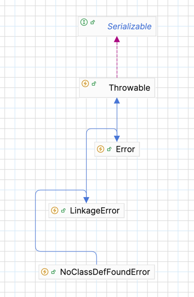

# Java 예외 처리 기본 throws, throw, Throwable 을 알아보자.

예외 처리는 어떻게 하는게 좋을까? 실무에서 많이 고민중에 있다 <br>
운영을 하다보니 효율적인 로그가 정말정말 중요하게 느껴진다 <br>

어떻게 하면 좋을까 고민을 하던 중 기본적인 것 부터 시작을 해보자 해서 다시 공부해본 내용을 정리해 보았다 <br><br>

### Java 에서의 예외 종류
- Error
  - 시스템이 비정상적인 상황 ex) OutOfMemoryError, ThreadDeath
  - JVM 에서 발생한다.
- Exception(Checked)
  - 컴파일시 에러가 잡힌다.
- RuntimeException(Unchecked)
  - 컴파일시 에러가 안잡힌다 -> 실행 중에 기능이 동작할 때 잡힌다.

추가적으로 네트워크 장애, 서버 다운 같은 외부 요인들은 Error 라고 생각하기엔 애매해서 나는 그냥 장애 라고 정의하는게 좋을 것 같다는 생각이 든다 <br>

### 0. Throwable
Throwable은 인터페이스가 아니라 **클래스(Class)**이며, Java 예외 처리 계층 구조의 최상위 루트 클래스이다. <br>
Java 에서 '던질 수 있는(throwable)' 모든 객체는 반드시 Throwable 클래스를 상속받아야 한다 <br>
즉, try-catch 문으로 잡을 수 있는 모든 것의 조상이다 <br>

Throwable 클래스는 크게 두 가지 중요한 하위 클래스로 나뉜다
- Error
- Exception
   - CheckedException
   - UncheckedException

Throwable 클래스는 예외에 대한 정보(예: 오류 메시지, 스택 트레이스, 원인 예외 등)를 담고 있으며, 이를 얻기 위한 메소드들(getMessage(), printStackTrace(), getCause() 등)을 제공한다. <br>


### 1.Error
 <br>
기본적으로 Error 는 Throwable 을 구현받는다 <br>

Error 는 일반적으로 시스템 수준에서 발생하며 종종 돌이킬 수 없을 수도 있다 <br>
ex) VirtualMachineError, OutOfMemoryError, StackOverflowError <br>

Error 에서 기억할 것은 위 Error 는 프로그램이 종료된다 <br>
즉 application이 down 된다는 이야기 이다 <br>

### 2.Checked Exception
Checked Exception 은 컴파일러가 예외 처리 여부를 반드시 확인한다 <br>
어떠한 로직이 예외가 발생할 가능성이 있는 코드는 반드시 try-catch로 처리하거나, 메소드 시그니처에 throws로 선언해야만 컴파일이 가능하다 <br>

위 예외는 어플리케이션이 JVM 에 올라가기전 문법적으로 알맞지 않았을 때 생기는 문제이다 <br>
즉 위 예외는 어플리케이션을 실행할 때 생기는 문제이다 <br>

설정 또는, 코드에 어떠한 문제가 있을 경우 JVM 이 잡아준다는 이야기 이다 <br>
그러므로 개발자가 그때 그때 대처가 가능하다 <br>
ex) IoException, FileNotFoundException 

### 3.Unchecked Exception
컴파일러가 예외 처리 여부를 확인하지 않는다. 즉, try-catch나 throws 선언이 필수가 아니다 <br>
주로 개발자의 논리적인 실수나 잘못된 API 사용 등 예측하기 어려운 내부적인 오류 상황에 사용됩니다. <br>

위 예외는 어플리케이션이 정상적으로 실행 된 후에 User 가 어떠한 기능을 이용할 때 문제가 발생한다 <br>
어떠한 기능이 동작하기 전까지는 아무런 문제도 없다 <br>

즉 실행이 될 때 알 수 있는 문제들이다. 그러므로 개발자들이 직접 실행하고 QA 하기 전까지는 문제를 알 수 없다 <br>
ex) NullPointerException, IllegalArgumentException 및 ArrayIndexOutOfBoundsException <br>


그럼 위 문제들을 어떻게 해결해가는게 효율적일까 라는 고민을 하였다 <br>

Spring Boot 환경에서는 서비스 로직 등에서 발생하는 많은 예외를 RuntimeException으로 감싸서 던지는 경우가 대부분이다 <br>
이는 Controller 계층까지 throws 선언을 연쇄적으로 추가하는 것을 피하고, AOP 등을 이용한 중앙 집중식 예외 처리를 용이하게 하기 위함이다 <br>

보통 논리적인 비즈니스 문제를 해결하는 로직에서 Unchecked Exception 들을 많이 명시한다 <br>
위 예외를 던질 때는 예외 상황에 대한 어떠한 정보를 꼭 담아서 던지는 것을 추천한다 <br>
ex) throw new IllegalArgumentException(age + "는 20보다 작아야 한다" + "현재 나이 : " + age); <br>

대부분의 상황에서 예외를 복구할 수 있는 경우는 거의 없다고 본다 <br>
그렇기 때문에 예외를 발생시키고 예외 이유를 User 에게 알려줘서, 다시 시도하게끔 하는 방법이 좋다고 생각한다 <br>

예외 복구 전략이 명확하고 복구가 가능하다면 Checked Exception 을 try ~ catch 로 잡아서 예외 복구를 하거나, 코드의 흐름으로 제어하는 것이 좋다 <br>
무책임하게 상위 메서드에 throw로 예외를 던지는 행위를 하지 않는 것이 좋다. 상위 메서드들의 책임이 그만큼 증가하기 때문이다. <br>

그렇다면 어떻게 해야 효율적으로 처리할 수 있을까? <br>

나는 RuntimeException(UncheckedException) 들은 처리하는 시점에 GlobalException 으로 처리하는 방법을 적용해보려고 한다 <br>
매번 try ~ Catch 로 사용하기엔 귀찮기 때문이다.. <br>
@RestControllerAdvice 를 통하여 특정 예외 ex) MerchantNotFoundException 같은 RuntimeException 을 상속받아 Custom 하는 예외들을 적절히 처리할 것이다 <br>
```java
@RestControllerAdvice
public class GlobalExceptionHandler {
    
    @ExceptionHandler(MerchantNotFoundException.class)
    public ResponseEntity<ErrorResponse> handleMerchantNotFoundException(MerchantNotFoundException ex) {
		
       if (ex.getErrorDto() != null) {
          // DTO를 사용한 경우
          MerchantErrorDto dto = ex.getErrorDto();
          errorResponse = new ErrorResponse(
                  "Merchant not found",
                  Map.of(
                          "merchantId", dto.getMerchantId(),
                          "merchantName", dto.getMerchantName(),
                          "additionalInfo", dto.getAdditionalInfo()
                  )
          );
       } else {
          errorResponse = new ErrorResponse(
                  "Merchant not found",
                  Map.of("No Data","No Data")
          );
       }

       return ResponseEntity.status(HttpStatus.NOT_FOUND).body(errorResponse);
    }
}
```

그리고 로그 추적에 용이한 정보를 꼭 남길 것이고, 예외 원인 또한 넣어서 처리를 해보려고 한다 ex) e.getCause() <br>


## 알아두면 좋은 내용
### throws Exception vs throw new Exception()

1. throws Exception vs throw new Exception()
여러 코드를 보다보면 메소드 단에 예외가 명시된 경우도 있고, 메소드 내부 로직에서 예외를 던지는 경우도 존재한다 <br>

둘은 어떠한 차이가 있고, 어느 상황에서 사용해야하는지 간단하게 알아보려고 한다.
#### throws Exception (메소드 시그니처에 사용)
메소드에 명시하는 ex) public void transferFile() throws IoException { } 같은 메소드를 해석하면 아래와 같다 <br>
위 transferFile() 메소드는 IoException 을 발생시킬 수 있으니 대비해야 한다 라고 알려주는 역할을 한다.<br>

즉 메소드 내부에 어떠한 로직에서 IoException 이 발생할 가능성이 있지만, 그 로직에서 직접 처리하지 않겠다는 뜻이다 <br>
메소드 내부에서 try ~ catch 블록을 설정하지 않았기 때문에 컴파일러가 예외 처리를 메소드에게 넘겨버리는 것이다 <br>

개인적으로 위 코드와 같은 예외 처리는 썩 좋은 것 같지는 않다는 생각이 든다 <br>


#### throw new Exception() (메소드 본문 내부에 사용)
메소드 내부에서 직접적으로 예외 클래스를 생성하여 던진다. 추가적으로 현재 코드 흐름을 중단시키는 역할을 한다 <br>
```java
public void getName(String name) {
	if(name.eqauls("jin")) {
       throw new IllegalArgumentException("존재하지 않는 이름입니다..");
    }
}
```

throw 키워드가 실행되면, 즉시 현재 메소드의 실행이 중단되고 JVM은 이 예외를 처리할 수 있는 catch 블록을 호출 스택(call stack)을 거슬러 올라가며 찾기 시작한다. <br>
적절한 catch 블록을 찾으면 해당 블록의 코드가 실행되고, 찾지 못하면 현재 스레드는 종료되고 보통 에러 메시지와 스택 트레이스(stack trace)가 출력된다 <br>

요약을 하면 아래와 같다 
- throws Exception: "이 메소드는 이런 종류의 예외를 던질 가능성이 있으니, 메소드를 호출하는 쪽에서 알고 있어라" (주로 Checked Exception 일 확률이 높고 대부분 컴파일러가 처리를 강제한다)
- throw new Exception(): "실제로 예외 상황이 발생했으니, 예외를 던진다" (실행, 예외 객체 생성 및 예외 처리 플로우 시작)


### 트랜잭션 예외
Java 를 사용하면 Spring 프레임워크를 사용할 거라고 생각합니다 <br>
참고로 Spring 에서 db 와 통신하는 트랜잭션은 위 Unchecked, Checked Exception 과 아무 관련이 없습니다 <br>
즉 개발하는 우리가 어떻게 예외를 컨트롤하냐에 따라 다릅니다 <br>

하지만 @Transactional 어노테이션을 사용한다면 Runtime Exception(=Unchecked) 가 발생하면 rollBack 이 되기 때문에 오해가 발생한다고 생각한다 <br>
위 상황도 개발자가 옵션에서 어떠한 예외를 지정한다면 변경이 될 수 있다 <br>

즉 트랜잭션 관련 예외는 개발자들이 어떻게 처리하느냐에 따라 바뀐다


## 참고
1. https://www.youtube.com/watch?v=_WkMhytqoCc
2. https://www.linkedin.com/pulse/mastering-error-exception-handling-deep-dive-reliable-singh-m7nef/