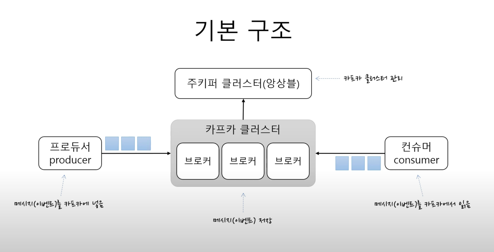
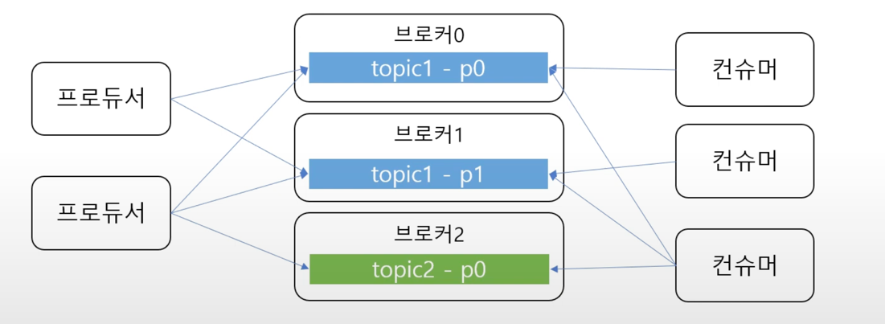
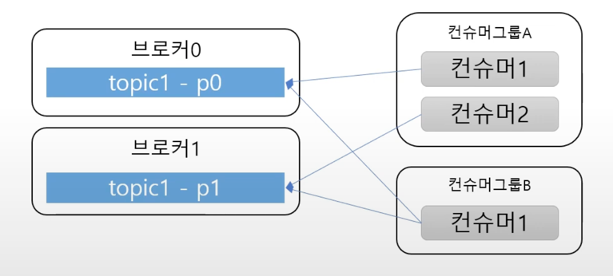
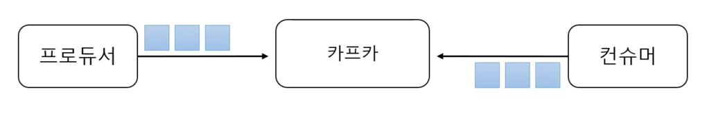
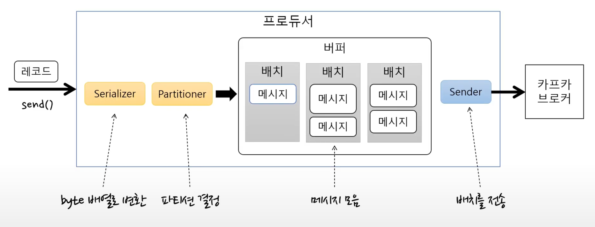
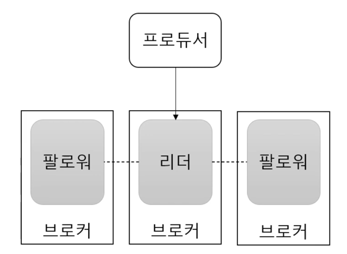
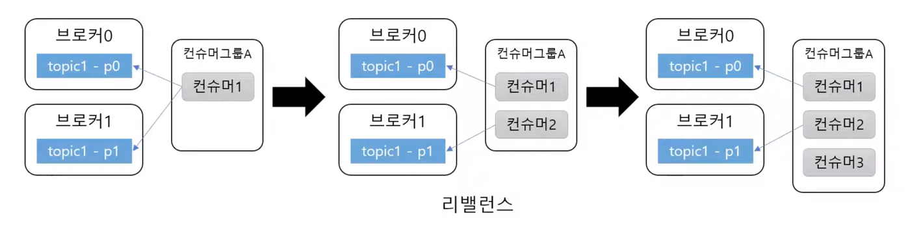

# Kafka 개념 다지기

> 위 포스팅은 https://www.youtube.com/watch?v=0Ssx7jJJADI 유튜브 1 ~ 4편 을 참고하여 작성한 글 입니다.

<br>

## Kafka 조금 아는 척하기
> https://kafka.apache.org/

#### 기본 구조
 <br>

### 주키퍼 클러스터(앙상블)
- 카프카 클러스터 관리

### 카프카 클러스터
- 메시지를 저장하는 저장소이다
- 1개의 카프카 클러스터는 여러개의 브로커로 구성이 된다 -> 기본이 3개 <br>
- 카프카 클러스터에 있는 브로커는 각각의 서버라고 생각하면 된다 ex) port:9091, port:9092, port:9093 <br>
- 이 카프카 클러스터를 관리하기 위해서 Zookeeper 가 필요하게 된다 <br>
- Zookeeper 안에 카프카 클러스터와 관련된 정보가 기록이되고 관리가 된다 <br>

<br>

### Producer
- 카프카 클러스터에 메세지(이벤트)를 보내는 곳을 Producer 라고 함.
- 이 메시지를 카프카에 넣는 역할을 한다.
  - 메시지를 저장할 때 어떤 '**토픽**'에 저장해줘 라고 요청을 하게 된다.

### Consumer
- 메시지(이벤트)를 카프카에서 읽어오는 역할을 한다.
- 어떤 '**토픽**'에서 메시지를 읽어올래? 라는 역할을 한다.

프로듀서와 컨슈머는 토픽을 기준으로 메시지를 주고 받는다 <br>


### 토픽과 파티션
- **토픽**은 메시지를 구분하는 단위
  - ex) 파일 시스템의 폴더와 유사
- 한 개의 토픽은 한 개 이상의 파티션으로 구성
  - 파티션은 메시지를 저장하는 물리적인 파일

즉 토픽안에 파티션이 들어있다 <br>

 <br>

### 파티션과 오프셋, 메시지 순서
파티션은 append-only(추가만 가능한) 파일이다 <br>
- 각 메시지 저장 위치를 **offset** 이라고 한다
- 프로듀서가 넣는 메시지는 파티션의 맨 뒤에 추가한다 ex) Stack 느낌.
- 컨슈머는 오프셋 기준으로 메시지를 '**순서대로 읽는다**'.
- 메시지는 삭제되지 않음(설정에 따라 일정 시간이 지난 뒤 삭제 가능)

즉 한 파티션 내에서만 메시지 순서 보장 <br>
ex) 컨슈머가 파티션의 3번 오프셋 부터 읽어줘 하면 3번 이후 메시지만 읽고(3,4,5,6) 그전 메시지는 읽을 수 없다 <br>

### 여러 파티션과 프로듀서
 <br>
- 프로듀서는 라운드 로빈(돌아가면서 저장) 또는 키(해쉬)로 파티션 선택
  - 같은 키를 갖는 메시지는 같은 파티션에 저장 -> 같은 키는 순서 유지


- 컨슈머는 컨슈머 그룹에 속한다.
- 한 개 파티션은 컨슈머그룹의 한 개 컨슈머만 연결 가능
  - 즉 컨슈머 그룹에 속한 컨슈머들은 한 파티션을 공유할 수 없음
  - 한 컨슈머그룹 기준으로 파티션의 메시지는 순서대로 처리


### 성능
- 파티션 파일은 OS 페이지캐시 사용
  - 파티션에 대한 파일 IO 를 메모리에서 처리
  - 서버에서 페이지캐시를 카프카만 사용해야 성능에 유리
- Zero Copy
  - 디스크 버퍼에서 네트워크 버퍼로 직접 데이터 복사
- 컨슈머 추적을 위해 브로커가 하는 일이 비교적 단순
  - 메시지 필터, 메시지 재전송과 같은 일은 브로커가 하지 않음
    - 프로듀서, 컨슈머가 직접 해야함
  - 브로커는 컨슈머와 파티션 간 매핑 관리

- 묶어서 보내기, 묶어섭 받기(batch)
  - 프로듀서: 일정 크기만큼 메시지를 모아서 전송 가능
  - 컨슈머: 최소 크기만큼 메시지를 모아서 조회 가능
- 낱개 처리보다 처리량 증가
 <br>

- 처리량 증대(확장)이 쉬움
  - 1개 장비의 용량 한계? -> 브로커 추가, 파티션 추가
  - 컨슈머가 느리다? -> 컨슈머 추가(+파티션 추가)


### 레플리카 - 복제 -> 고가용성 처리
- 레플리카: 파티션의 복제본
  - 복제수 만큼 파티션의 복제본이 각 브로커에 생긴다
- 리더와 팔로와로 구성
  - 프로듀서와 컨슈머는 리더를 통해서만 메시지 처리
  - 팔로워는 리더로부터 복제
- 장애 대응
  - 리더가 속한 브로커 장애시 다른 팔로워가 리더가 됨


## Kafka - Producer
```java
// config 설정 spring -> application.yml
Properties prop = new Properties();
prop.put("bootstrap.servers","kafka-01:9092,kakfa-02:9093,kafka-03:9094");
prop.put("key.serializer","----StringSerializer");
prop.put("value.serializer","----StringSerializer");

KafkaProducer<Integer,String> producer = new KafkaProducer<>(prop);

producer.send(new ProducerRecord<>("topicName","key","value"));
producer.send(new ProducerRecord<>("topicName","value"));

producer.close();
```

- ProducerRecord 가 Kafka 브로커에게 전송할 메시지가 된다
  - ProducerRecord 는 크게 2가지로 생성할 수 있다 -> topic,key,value &  key,value 방식이 있다.

### 프로듀서 기본 흐름
- 카프카 클러스터에 메세지(이벤트)를 보내는 곳이며 즉 메시지를 카프카에 넣는 역할 -> 메시지 발행
  - 메시지를 저장할 때 어떤 '**토픽**'에 저장해줘 라고 요청을 하게 된다. 

 <br>

- send() 메소드를 이용하여 레코드를 전송하면 Serializer 를 이용하여 byte 배열로 변환
- Partitioner 을 이용하여 '어느 토픽으르 파티션으로 보낼지 결정한다'
- 변환된 메시지(byte 배열) 을 버퍼에 저장을 한다
  - 배치로 묶어서 메시지를 저장한다.
- Sender 가 배치를 가져와서 카프카 브로커로 전송한다.

#### Sender(=카프카 브로커로 전송하는 역할) 의 기본 동작
- 별도의 스레드로 동작한다.
- 배치가 찼는지 여부에 상관없이 Sender 는 차례대로 브로커에 전송한다.
- send() 를 통해 들어오는 메시지는 배치에 누적되어 전달된다.

send() 부터 배치에 메시지를 채우는 스레드랑 Sender 스레드는 별도의 스레드로 동작한다 <br>

#### 처리량 관련 주요 속성
- batch size: 배치 크기 -> 배치가 다 차면 바로 전송
  - 배치사이즈가 작으면 한번에 보낼 수 있는 메세지의 개수가 줄어든다.
  - 즉 전송 횟수가 많아지기 때문에 처리량이 떨어지게 된다.
- linger.ms: 전송 대기 시간(기본값 0)
  - 대기 시간이 없으면 배치를 바로 전송
  - 대시 시간을 주면 그 시간 만큼 기다렸다 배치를 전송

전송 실패를 알 수 없음 <br>
실패에 대한 별도 처리가 필요없는 메세지 전송에 사용한다 <br>

#### 전송 결과 확인해야 하는 경우
1) Future 사용
```java
Future<RecordMetadata> f = producer.send(new ProducerRecord<>("topic","value"));
try {
	RecordMetadata meta = f.get(); // get() 을 할 때 블로킹 처리가 된다.
} catch(Excetpion e) {
	
}
```

- 배치 효과 떨어짐 -> 처리량 저하
- 처리량이 낮아도 되는 경우에만 사용


2) Callback 사용
```java
producer.send(new ProducerRecord<>("simple","value"),
    new Callback() {
	    @Override
        public void onCompletion(RecordMetadata m, Exception e) {
			
        }
    }
)
```

- 처리량 저하 없음 -> 대용량에 유리함

<br>

#### 프로듀서 - 전송 보장과 ack
<br>
- ack = 0 
  - 서버 응답을 기다리지 않음
  - 전송 보장도 zero
- ack = 1
  - 파티션의 리더에 저장되면 응답 받음
  - 리더 장애시 메시지 유실 가능
- ack = all (또는 -1)
  - 모든 레플리카에 저장되면 응답 받음
    - 브로커 설정에 따라 달라짐 (min.insync.replicas)
  - 엄격하게 전송을 보장해야 하는 상황에서는 ack=all 로 지정해야 함.

- min.insync.replicas(브로커 옵션)
  - 프로듀서 ack 옵션이 all 일 때 저장에 성공했다고 응답할 수 있는 동기화된 레플리카 최소 개수

<br>

#### 에러 유형
- 전송 과정에서 실패
  - ex) 전송 타임 아웃(일시적인 네트워크 오류)
  - 리더 다운에 의한 새 리더 선출 진행 중
  - 브로커 설정 메시지 크기 한도 초과
  - 직렬화 실패? 등등
- 전송 전에 실패
  - 직렬화 실패, 프로듀서 자체 요청 크기 제한 초과
  - 프로듀서 버퍼가 차서 기다린 시간이 최대 대기 시간 초과

<br>

#### 실패 대응
**1) 재 시도 -> 재시도 가능한 에러는 재시도 처리**
   - 브로커 응답 타임 아웃, 일시적인 리더 없음 등 
- 재시도 위치
   - 프로듀서는 브로커 전송 과정에서 에러가 발생시 재시도가 가능한 에러일시 재전송 시도 한다.
   - send() 메소드에서 익셉션 발생시 익셉션에 타입에 따라 send() 재호출
   - 콜백 메소드에서 익셉션 받으면 타입에 따라 send() 재호출
- 아주 특별한 이유가 없다면 무한 재시도를 하지말자.
  - 재시도를 한다는 것은 다음 메시지를 밀린다는 의미이므로, 재시도를 일정 시간 및 횟수로 제한을 하자.


**2) 기록**
- 추후 처리를 위해 기록
  - 별도 파일 및 DB 에 실패 메시지 기록
- 기록 위치
  - send() 메소드에서 익셉션 발생시
  - send() 메소드에 전달한 콜백에서 익셉션 받는 경우
  - send() 메소드가 리턴한 Future 의 get() 메소드에서 익셉션 발생시

<br>

#### 재시도와 메시지 중복 전송 가능성
- 브로커 응답이 늦게와서 재시도할 경우 중복 발송 가능

<br>

#### 재시도와 순서
- max.in.flight.requests.per.connection
  - 블록킹 없이 한 커넥션에서 전송할 수 있는 최대 전송중인 요청 개수
  - 이 값이 1보다 크면 재시도 시점에 따라 메시지 순서가 바뀔 수 있음
    - 전송 순서가 중요하면 이 값을 1로 지정


#### 정리
- 처리량 관련
  - batch.size
  - linger.ms

- 전송 신뢰성
  - ack = all
  - min.insync.replicas = 2
  - replication factor = 3

- 재시도 주의 사항
  - 중복 전송
  - 배치 순서 바뀜

<br>

### Kafka - Consumer
- 토픽 파티션에서 레코드 조회
```java
// config
Properties prop = new Properties();
prop.put("boostrap.servers","localhost:9092");
prop.put("group.id","group1");
prop.put("key.diserializer","***StringDeserializer");
prop.put("value.deserizalizer","***StringDeserializer");

// service
KafakConsumer<String,String> consumer = new KafkaConsumer<String,String>(prop);
consumer.subscribe(Collection.singletion("simple")) // 토픽 구독
while(조건) {
	ConsumerRecords<String,String> records = consumer.poll(Duration.ofMills(100));
	for(ConsumerRecord<String,String> record : records ) {
		log.info("Record : {} - topic {} - partition {} - offset {}", record.value(), record.topic(), record.partition(), record.offset());
	}
}
consumer.close();
```

#### 토픽 파티션은 그룹 단위 할당
<br>
- 컨슈머 그룹 단위로 파티션 할당
  - 파티션 개수(브로커 개수) 보다 컨슈머 그룹이 많아지면 컨슈머는 놀게 된다.

#### 커밋과 오프셋
- 컨슈머 poll
  - 이전 커밋된 offset 이 있으면 offset 이후로 레코드를 읽어 온다.

#### 커밋된 오프셋이 없는 경우?
- 처음 접근이거나 커밋한 오프셋이 없는 경우
- auto.offset.reset 설정 사용
  - earliest: 맨 처음 오프셋 사용
  - latest: 가장 마지막 오프셋 사용 (기본 값)
  - none : 컨슈머 그룹에 대한 이전 커밋이 없으면 익셉션 발생

#### 컨슈머 설정
- 조회에 영향을 주는 주요 설정 3개
- fetch.min.bytes: 조회시 브로커가 전송할 최소 데이터 크기
  - 기본값: 1
  - 이 값이 크면 대기 시간은 늘지만 처리량이 증가 -> 가용성이 좋다. 
- fetch.max.wait.ms: 데이터가 최소 크기가 될 때까지 기다릴 시간
  - 기본값: 500
  - 브로커가 리턴할 때까지 대기하는 시간으로 poll() 메소드의 대기 시간과 다름
- max.partition.fetch.bytes: 파티션 당 서버가 리턴할 수 있는 최대 크기
  - 기본값: 1MB

#### 자동 커밋/수동 커밋
- enable.auto.commit 설정
  - true: 일정 주기로 컨슈머가 읽은 오프셋을 커밋(기본값)
  - false: 수동으로 커밋 실행
- auto.commit.interval.ms: 자동 커밋 주기
  - 기본값 : 5000 (5초)
- poll(), close() 메소드 호출시 자동 커밋 실행

수동 커밋 -> 동기/비동키 커밋 사용 <br>

#### 재처리와 순서
- 컨슈머가 동일 메시지 조회 가능성
  - 일시적 커밋 실패, 리밸런스 등에 의해 발생
- 컨슈머는 멱등성을 고려해서 구현해야 함
  - ex) 아래 메시지 재처리 할 경우
    - 조회수 1증가 -> 좋아요 1증가 -> 조회수 1증가
  - 단순 처리하면 조회수는 2가 아닌 4가 될 수 있음
- 데이터 특성에 따라 타임스탬프, 일련 번호 등을 활용

<br>

#### 세션 타임아웃, 하트비트, 최대 poll 간격
- 컨슈머는 하트비트를 전송해서 연결 유지
  - 브로커는 일정 시간 컨슈머로부터 하트비트가 없으면 컨슈머를 그룹에서 빼고 리밸런스 진행
  - 관련 설정
    - session.timeout.ms: 세션 타임 아웃 시간
    - heartbeat.interval.ms: 하트비트 전송 주기
      - 세션 타임아웃의 1/3 이하 추천
    - max.poll.interval.ms: poll() 메소드의 최대 호출 간격
      - 이 시간이 지나도록 poll() 하지 않으면 컨슈머를 그룹에서 빼고 리밸런스 진행

#### Consumer 종료 처리
- 다른 쓰레드에서 wakeUp() 메소드 호출
  - poll() 메소드가 WakeupException 발생 -> close 처리

- KafkaConsumer 는 쓰레드에 안전하지 않음.
  - 여러 쓰레드에서 동시에 사용(=호출) 하지 말 것
    - wakeup() 메소드는 예외


#### 용어 정리
topic : 각종 메시지를 담는 곳 -> queue 라고 생각 <br>
producer : topic 에 메시지를 넣는다 <br>
consumer : topic 에서 메시지를 읽어온다. <br>