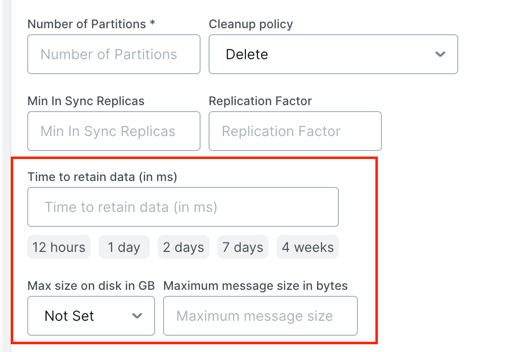

# Kafka 핵심 원리 Zero Copy 알아보기

## 개요
Kafka는 어떻게 초당 수백만 건의 메시지를 처리할 수 있을까? 라는 고민을 하며 공부를 하던 중 알게 된 내용을 정리해 보았다 <br>

## 1. Kafka 물리적 저장소
카프카의 기본 저장 단위는 파티션 레플리카 이다 <br>
파티션은 서로 다른 브로커들 사이에 분리될 수 없고, 같은 브로커의 서로 다른 디스크에 분할 저장되는 것조차 불가능하다 <br>
즉 파티션의 크기는 특정 마운트 지점에 사용 가능한 공간에 제한을 받는다고 볼 수 있다 <br>

Broker 설정시 파티션들이 저장될 디렉토리 경로를 정의한다 <br><br>

### 1.1 [파티션 할당]
사용자가 Broker 에 토픽 생성 요청시 Broker 는 위 요청을 받아 브로커 중 하나에 할당한다 <br>
ex) 브로커6개, 파티션10개, 복제 팩터3 인 토픽을 생성 -> 30개의 파티션 레플리카를 6개의 브로커가 골고루 분산해서 저장해야한다 <br><br>


## 2. 파일 관리
Broker 들은 토픽별 메시지 관리를 위해서 토픽 보존 기한 또는 용량에 따른 보존을 설정할 수 있다 <br>
 <br>

파티션별로 세그먼트라는 데이터 파일 형태로 구분하여 저장합니다. <br>
세그먼트 파일 안에는 Producer가 보낸 메시지와 오프셋 및 메타데이터가 저장됩니다. <br><br>


즉 producer 를 통해 전송한 메시지들은 broker 에 전송된 후 실제 **물리 디스크**에 저장이 된다 <br>
producer 는 직접 디스크 I/O 를 수행하지 않지만 요청을 받은 broker 에서는 우리가 보낸 메시지를 저장하기 위해 항상 쓰기 작업을 하고 있다 <br>

이 과정에서 kafka 는 '**Zero Copy**' 라는 기법을 사용하기에 초당 수백만 건의 메시지를 처리할 수 있는 분산 시스템이 될 수 있다고 생각한다. <br>

### [Zero Copy] 원리
zero copy 는 말 그대로 복사를 하지 않는 다는 뜻이다 <br>
즉 메시지를 복사하지 않고 직접 전송하는 기술이다 <br><br>

#### [기존 저장 요청 방식]
```text
[디스크] → [OS 커널 버퍼] → [애플리케이션 버퍼] → [소켓 버퍼] → [NIC 버퍼] → [네트워크]
   ①            ②                  ③                ④
```
```java
// 전통적인 파일 전송 코드
File file = new File("message.dat");
FileInputStream in = new FileInputStream(file);
byte[] buffer = new byte[4096];

while (in.read(buffer) > 0) {
    socket.getOutputStream().write(buffer);  // CPU가 데이터 복사
}

// Example: 1GB 파일 전송 시
// - 4번 복사 = 4GB 메모리 이동
// - CPU가 복사 작업에 계속 개입
// - CPU 리소스 소모 및 메모리 소모
//   - 컨텍스트 스위칭 다수 발생
```

기존에 파일 쓰기 방식은 위와 같은 방식으로 대부분 구현이 되었다 <br>

#### [Zero Copy 방식]
Zero Copy 방식은 아래와 같이 매우 단순해졌다
```text
[디스크] → [OS 커널 버퍼] → [NIC 버퍼] → [네트워크]
              (DMA)              (DMA)
```
DMA: CPU의 도움 없이 하드웨어가 직접 메모리에 접근하여 데이터를 전송하는 기술로 Zero Copy 에서 핵심 기술이다. <br>

```java
// Kafka가 내부적으로 사용하는 방식
FileChannel fileChannel = new FileInputStream(file).getChannel();
SocketChannel socketChannel = socket.getChannel();

// FileChannel.transferTo() 메서드
// 내부적으로 sendfile() 시스템 콜 사용
fileChannel.transferTo(
    0,                      // 시작 위치 (offset)
    fileChannel.size(),      // 전송할 크기
    socketChannel           // 목적지 채널
);

/*
 * transferTo() 내부 동작:
 * 1. Linux: sendfile64() 시스템 콜 호출
 * 2. Windows: TransmitFile() 사용
 * 3. 한계: 최대 2GB까지만 전송 가능 (int 범위)
 * 4. 대용량: 반복 호출 필요
 *
 * 실제 Kafka 구현:
 * - 2GB 초과 시 여러 번 호출
 * - Non-blocking I/O로 구현
 */

// Example: 1GB 파일 전송 시
// - 0번 복사 (커널 내부에서만 처리)
// - CPU는 다른 작업 가능
// - 메모리 사용량 최소화
```

<br>

### 왜 Kafka 에서 Zero Copy가 가능할까?
#### 1. [메시지 변환 없음]
기본적으로 Producer 및 Consumer 직렬화/역직렬화 타입 설정은 미리 되어 있다고 가정한다. <br>
따라서 메시지 변환 없이 바로 Broker 에 전송한다 
```text
// Producer가 보낸 메시지 형식 그대로 저장
Producer → Broker (디스크 저장) → Consumer
            ↓
    변환/파싱 없이 그대로 write
```

Kafka의 디자인 철학
```text
"메시지 포맷을 건드리지 마라"
- Broker는 메시지 내용을 해석하지 않음
- 단순히 byte array로 취급
- 직렬화/역직렬화는 Producer/Consumer 책임
```


만약 브로커가 메시지를 파싱해야 했으면 기존의 방식대로 '4번' 의 복사가 일어나며 디스크에 저장이 될 것이다 <br>


#### 2. [배치 처리]
```java
// Kafka는 메시지를 배치로 묶어서 처리
Batch: [message1, message2, ..., message100]

// Zero Copy로 배치 전체를 한 번에 전송
fileChannel.transferTo(
    batchStartOffset,
    batchSize,
    socketChannel
);

// 네트워크 왕복 횟수 감소
// - 개별 전송: 100번 syscall
// - 배치 전송: 1번 syscall
```

#### 3. [Page Cache 활용]
OS가 자동으로 관리하는 디스크 캐시 레이어로, 빈 메모리를 활용하여 최근 접근한 파일 데이터를 캐싱한다 <br>

동작 과정은 아래와 같다.
```text
Producer가 메시지 전송
    ↓
Broker가 Page Cache에 write (메모리)
    ↓
OS가 비동기로 디스크에 flush
    ↓
Consumer가 읽기 요청
    ↓
Page Cache에서 바로 읽음 (디스크 접근 없음)
    ↓
Zero Copy로 네트워크 전송
```

실제로 Linux 환경에서 Page Cache 를 체크하기 위해서는 free -h 명령어를 사용하면 된다.
```text
# Linux에서 Page Cache 확인
free -h
              total        used        free      shared  buff/cache   available
Mem:           32Gi       4Gi        2Gi       1Gi        25Gi        26Gi
                                                          ↑
                                                   Page Cache 영역
```

buff/cache가 높을수록 Zero Copy 효과 극대화 된다.<br>

<br>

추가적인 설명으로 Kafka 에서 DMA 가 사용되는 곳은 아래와 같다 <br>

> 1. 디스크 → 메모리 (Page Cache)
```java
// Producer가 메시지 전송
producer.send(record);

// Broker 내부 동작:
// 1. CPU: DMA 요청 -> 네트워크에서 받은 메시지를 Page Cache에 Write
// 2. DMA: NIC → Page Cache 전송
// 3. CPU: 비즈니스 로직 처리 (ACK 준비, 메트릭 수집 등)
```

> 2. 메모리 (Page Cache) → 네트워크 카드
```java
// Consumer가 메시지 요청
consumer.poll();

// Broker 내부 동작:
// 1. CPU: DMA 요청 -> Page Cache의 offset 1000부터 1MB를 NIC로 보내"
// 2. DMA: Page Cache → NIC 전송
// 3. CPU: 다른 Consumer 요청 처리
```

> 3. Zero Copy + DMA의 시너지
```text
* 전통 방식 (CPU 복사 4번):
[디스크] →CPU→ [커널 버퍼] →CPU→ [앱 버퍼] →CPU→ [소켓 버퍼] →CPU→ [NIC]


* Zero Copy + DMA:
[디스크] →DMA→ [Page Cache] →DMA→ [NIC]
                ↑
            sendfile() syscall
```

cpu 는 4번의 복사가 아닌 sendfile() 한번 호출하면 끝이다 <br>
실제 데이터 이동 및 처리는 DMA 가 담당한다 <br><br>

### Zero Copy 제약 사항
- SSL/TLS 사용 시 성능 저하 (20-30%)
- 파일 시스템 의존성 (NFS에서 제한적)
- 작은 메시지에는 오히려 오버헤드
- Windows vs Linux 동작 차이


위 내용을 토대로 Kafka 고성능 비결은 아래와 같다
```text
Zero Copy + DMA + Page Cache + 배치 처리
    ↓
CPU는 제어만 하고 실제 데이터 이동은 하드웨어가 처리
    ↓
초당 수백만 메시지 처리 가능
```

### Zero Copy 제약 사항
- SSL/TLS 사용 시 성능 저하 (20-30%)
- 파일 시스템 의존성 (NFS에서 제한적)
- 작은 메시지에는 오히려 오버헤드
- Windows vs Linux 동작 차이

<br>

### Reference
1. https://soft.plusblog.co.kr/7 
2. https://gautambangalore.medium.com/the-zero-copy-principle-with-apache-kafka-749dfd2ef2df

