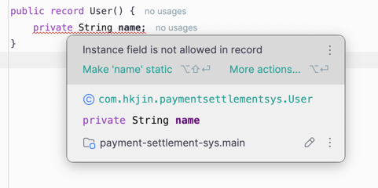

# Record 알아보기
## 들어가며
record 는 JDK14 에 처음 출시되었다 <br>

JDK17 이 사용화 되었을 때 부터 프로그래밍을 시작했던 나로써는 record 에 존재를 모르고 있었다 <br>
그리고 다른 사람들 Github 에서 소스를 훔쳐보다가 DTO 를 만들 때 record 로 만드는걸 보고 신기하였다 <br>

그래서 위 record 에l 대하여 공부하고, 개념 정리 후 내 프로젝트들에 적용을 해보려고 한다 <br>
<br>

## 본론
### Record 의 특징
보통 Entity 에 대하여 DTO 를 선언할 때 이런식으로 많이 선언할 것이라고 생각합니다.<br>
코드 길이가 길어질 것을 대비해, 일단 Lombok 라이브러리 를 사용하였다 <br>
```java
@NoArgsConstructor
@AllArgsConstructor
@Builder
@Getter
public class UserDTO {
	private String name;
	private Integer age;
	private String gender;
}
```

위 어노테이션에 추가적으로, toString, hashCode 어노테이션이 붙을 수 있습니다 <br>
매번 위 작업은 번거로울 것으로 예상 합니다 <br>

간단하게 생각해서 record 는 위 어노테이션 기능 자체를 포함하는 <br>
즉, DTO 목적에 최적화된 새로운 타입이라고 생각하면 됩니다 <br>

record 는 immutable 하므로 변경이 불가능합니다 <br>
변경이 불가능 함은 동기화 없이 데이터의 유효성이 보장된다는 뜻이다 <br>

평소에는 위 불변성을 지키고자 캡슐화 방식으로 많이 DTO 를 만들어서 사용했다 
- 필드에 private 선언
- getter 사용
- 생성자 사용
- equals, hashCode, toString 사용

위 방법들을 직접 선언하든, Lombok 을 사용하든 캡슐화를 사용했다. 그 방식이 위 선언해둔 코드이다 <br> 

하지만 위 코드에는 2가지 문제가 있습니다. <br>

보통 oop 에서는 보일러 플레이트 코드 형태를 많이 사용합니다 <br>
보일러 플레이트는 재사용을 하기 위해 전혀 변경되지 않아야 하는데, 혹시라도 위 DTO 에 필드가 추가 된다면?? <br>
equals, toString, hashCode 메소드를 각 수정하고 생성자를 다시 만들고 하는 번거로움이 있을 것입니다 <br>

그리고 Lombok 을 사용하면 덜하지만, 사실 중요한건 2개의 필드인데 부가적인 메소드들이랑 잡다한게 많아 보인다 <br>

위 단점을 보완하고자 'record' 가 JDK14 에 출시되었다 

### 기본 개념
record 타입은 DTO 를 대체하기 위해 자주 사용이 된다 <br>
그리고 컴파일시 자동으로 equals, hashCode, toString, private final 필드, public 생성자를 생성해줍니다 <br>
```java
public record User(String name, Integer age, String gender) {
}
```

기본 DTO 는 필드에 선언을 하는 방식이였다면 **record 는 Parameter 에 필드를 넣습니다** <br>

그리고 사용 방식은 DTO 를 사용하는 것과 비슷 합니다. <br>

```java
User user = new User("jin",26,"male");
```

위 코드처럼 일반 객체(=DTO) 처럼 인스턴스화 해서 사용할 수 있으며 

```java
public void createUser(User user) {
	userRepository.save(User.builder().name(user.name()).age(user.age()).gender(user.gender()).build());
}
```

record 에 @Builder 를 선언 하였다면 위처럼 필드를 가져올 수 있다 <br>
getter 와 약간의 차이점은 getter 는 user.getName() 이런식으로 가져왔지만, record 는 user.name(); 이런식으로 필드를 가져오는 차이가 있다 <br>

추가적으로 record 는 DTO 와 같이 클래스 내부안에 메소드를 만들 수도 있고, 생성자 내부를 수정할 수도 있다.
```java
public record User(String name, Integer age) {
	
	public User {
		Objects.requireNonNull(name);
		Objects.requireNonNull(age);
    }
	
	public User(String name) {
		this(name, "Jin");
    }
	
	public Entity toEntity(User user) {
		return Entity.builder()
            .name(user.name())
            .age(user.age())
            .build();
    }
}
```

위 처럼 클래스 내부에 메소드를 작성해서 컨트롤 할 수도 있다 <br>
당연하게 static 메소드 또한 사용 가능합니다 <br>

즉 위 record 를 사용하면 보일러플레이트 코드를 줄이고, Immutable 클래스를 사용할 수가 있다 <br>
만약에 가변 데이터를 다루게 된다면 record 가 아닌 일반 DTO 를 꼭 사용해야 한다 <br>
+ 일반 클래스는 필드에 final 을 붙이지 않지만, record 는 컴파일시 자동으로 final 이 들어감을 알면 위 내용이 바로 이해가 될 것이다..


그리고 Record 는 상속을 지원하지 않아, 확장할 수가 없다 <br>
당연하게, 불변 데이터를 다루니 상속을 통해 변경되는 일이 있어서는 안된다..<br>


### Q&A 
#### Q.1) Entity 로는 쓸 수 없나요?
요즘 추세가 ORM 으로 JPA 를 많이 사용한다. 물론 나 또한 그렇다 <br>
그러던중 DTO 를 Record 로 매핑하는 것을 찾아보다, 문득 Entity 또한 불변 클래스로 만들면 되지 않을까? 라는 생각이 들었다 <br>

하지만 틀린 생각이다<br>

JPA 에서 Entity 는 실제 Database 테이블로 매핑 생성이 되고, EntityManger 에 매핑이 된다 <br>
JpaProvider(=Hibernate) 는 DB 테이블 만들고, 엔티티를 테이블에 매핑하고, Entity 와 DB 일관성 및 종속성을 관리할 것이다 <br>
(이 관리는 Proxy 를 통하여 생성되고 관리가 된다)<br>

Proxy 는 런타임에 생성되고 Entity 클래스를 확장한다. 이러한 프록시는 Entity 에 default 생성자 및 Setter 가 있어야 한다 <Br>
하지만 레코드에는 이러한 기능이 없으므로 엔티티로 사용할 수가 없다 <br>

그리고 애초에 record 타입은 필드에 변수를 선언할 수가 없다 <br>
<br>

하지만 필드를 static 으로 선언하면 사용은 가능하긴한데, 굳이?? 라고 생각한다 <br>

그러므로 record 는 Entity 가 아니라 DTO 로 만 사용을 하는것이 best-practice 라고 생각한다.<br>

### REF
> https://www.baeldung.com/java-record-keyword <br>
> https://velog.io/@pp8817/record
