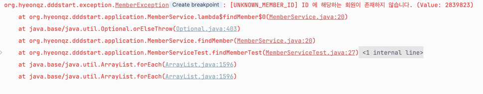

# 좋은 예외 처리에 대한 고민 및 나만의 방법 예시?

> 📌 Java & SpringBoot & JPA 환경에서 개발중임.

## 서론
Java/SpringBoot 를 사용하여 실무를 하고있다 <br>
개발을 하다보면 예외처리를 해야할일이 상당히 많이 생길 것이다 <br>

대표적으로 Java 하면 NullPointException 이 있을 것이다 <br>
적절한 예외처리를 하지 않고, Runtime 에러가 생길 경우 어플리케이션에 장애가 생길 것이다 <br>
심하면 서비스가 중단이 되는 상황도 발생할 수 있다 <br>

그만큼 예외처리는 귀찮지만 중요한 일이다. 소홀히 해서는 안된다 <br><br>

위 상황을 방지하기 위해서 코드를 작성할 때 적절한 예외처리가 항상 필요하다 <br>
아래 예시 코드를 보며 한번 예외 처리를 점진적으로 발전시켜보자. <br>

예시는 DB 와 통신하는 상황에서의 예외 처리이다 <br> 

일단 try ~ catch 에 대한 방법은 이야기 하지 않으려고 한다 <br>

물론 사용할 수는 있지만 스프링에는 @Transactional 이라는 아주 좋은 기능이 있다 <br>
그리고 try~catch 는 예외를 잡은 후에 후처리를 하기 위해서 사용된다. 하지만 DB 조회와 관련된 상황에서 후처리는 불필요하기 때문이다 <br> 
ex) I/O 작업에서 대부분 사용함.


## 본론
```java
@Getter
@Entity
public class Member {

	@Id @GeneratedValue(strategy = GenerationType.IDENTITY)
	private Long id;

	private String name;

	private String memberId;

	private String password;

	@OneToMany(mappedBy = "member", cascade = { CascadeType.PERSIST, CascadeType.REMOVE}, orphanRemoval = true)
	private List<Product> products = new ArrayList<>();
}

@Getter
@Entity
public class Product {

	@Id
	@GeneratedValue(strategy = GenerationType.IDENTITY)
	private Long id;

	private String name;
	private Integer price;
	private Integer quantity;

	@ManyToOne(fetch = FetchType.LAZY)
	@JoinColumn(name = "member_id", foreignKey = @ForeignKey(ConstraintMode.NO_CONSTRAINT))
	private Member member;

}
```

기본적으로 위 엔티티가 존재한다. 이에 따른 Repository 또한 작성이 되어 있다 <br>

### 1. id 를 통하여 조회하는 상황
아무것도 모르고 막 개발할 때는 아래와 같은 방법으로 예외처리를 하고는 했다.
#### 1-1) RuntimeException 사용한 예외처리
```java
@RequiredArgsConstructor
@Service
public class MemberService {

	private final MemberRepository memberRepository;

	public Member findMember(Long id) {
		Member member = memberRepository.findById(id)
			.orElseThrow(() -> new RuntimeException("Member is Null"));
		
		return member;
	}
}
```

제일 만만하면서 쉬운 방법중 하나이다 <br>
그리고 위 코드를 테스트 코드를 통해 실행시켜 보겠다. <br>
```java
@SpringBootTest(classes = DddStartApplication.class)
class MemberServiceTest {
	
	@Autowired
	private MemberService memberService;
	
	@Test
	@DisplayName("Member 를 조회한다.")
	void findMemberTest() {
	    // given
		Long id = 2839823L;
	    
	    // when
		Member member = memberService.findMember(id);

		// then
		Assertions.assertThat(member).isNotNull();
	}

}
```

아래 사진과 같은 로그가 나온다 <br>


사실 맨처음에는 위 에러처리 또한 나쁘지 않다고 생각했다 <br>
하지만 분명히 더 좋은 방법이 있을 거라고 생각했고, 더 좋은 방법은 아래와 같다.
<br><br>


#### 1-2) CustomException 사용한 예외처리 + 내용 추가
좀더 명시적으로 에러를 관리하고, 에러 관련 내용을 추가해보겠다.
```java
public class MemberException extends RuntimeException{

	public MemberException () {
	}

	public MemberException (String message) {
		super(message);
	}

	public MemberException (String message, Throwable cause) {
		super(message, cause);
	}

	public MemberException (Throwable cause) {
		super(cause);
	}

	public MemberException (String message, Throwable cause, boolean enableSuppression, boolean writableStackTrace) {
		super(message, cause, enableSuppression, writableStackTrace);
	}

}
```

Member 와 관련된 Exception 을 다루기 위해 MemberException 을 만들고 RuntimeException 을 상속받았다 <br>
> RuntimeException 은 컴파일러가 어플리케이션 실행시 체크하지 않는 예외(=UnCheckedException) 이므로, 어플리케이션 사용중에 에러가 발생한다. 

그리고 RuntimeException 생성자를 모두 구현받는다 <br>

```java
	public Member findMember(Long id) {
		Member member = memberRepository.findById(id)
			.orElseThrow(() -> new MemberException(id + "에 해당하는 회원이 존재 하지 않습니다."));

		return member;
	}
```
```java
	@Test
	@DisplayName("Member 를 조회한다.")
	void findMemberTest() {
	    // given
		Long id = 2839823L;

	    // when
		 memberService.findMember(id);

		// then
		//Assertions.assertThat(member).isNotNull();
	}
```

결과는 아래와 같다 <br>
 <br>

위 어플리케이션을 리눅스 테스트,운영 환경에 올렸을 때 에러 발생시 아래와 같은 코드가 로그로 찍히게 된다 <br>
```java
org.hyeonqz.dddstart.exception.MemberException: 2839823에 해당하는 회원이 존재 하지 않습니다.
	at org.hyeonqz.dddstart.application.MemberService.lambda$findMember$0(MemberService.java:18)
	at java.base/java.util.Optional.orElseThrow(Optional.java:403)
	at org.hyeonqz.dddstart.application.MemberService.findMember(MemberService.java:18)
	at org.hyeonqz.dddstart.application.MemberServiceTest.findMemberTest(MemberServiceTest.java:27)
	at java.base/java.lang.reflect.Method.invoke(Method.java:580)
	at java.base/java.util.ArrayList.forEach(ArrayList.java:1596)
	at java.base/java.util.ArrayList.forEach(ArrayList.java:1596)
```

위 에러 로그는 테스트 코드에서 나오는 에러 로그라 맨위에 에러 관련 내용이 1줄 더 추가되어 있다. 무시해도 된다 <br><br>


#### 1-3) CustomException + ErrorCode 사용
위에 방법도 1번 방법보다는 그래도 낫다. Exception 이름도 명시적으로 바뀌었고, 에러 내용 또한 추가되어 로그를 보기 더 쉬워졌다 <br>
여기서 더 좋은 방법이 있을까? <br>

여러 고민 끝에 생각난 다음 방법은 에러 상황을 생각해보고 에러 코드를 정의해두고 사용하자였다 <br>
개발을 하다보면 id 만 조회하지 않고 여러 에러 상황이 분명 생긴다 <br> 
이에 따른 ErrorCode 를 정의해두고 사용하는 방법은 아래와 같다.

```java
public interface ErrorCode {
	String getCode();

	String getDescription();

	default String getMessage() {
		return String.format("[%s] %s", getCode(), getDescription());
	}
}

```
```java
@RequiredArgsConstructor
public enum MemberErrorCode implements ErrorCode {
	UNKNOWN_MEMBER_ID(INTERNAL_SERVER_ERROR,"ID 에 해당하는 회원이 존재하지 않습니다."),
	BAD_CREDENTIALS(UNAUTHORIZED, "계정 정보가 잘못되었습니다."),
	;

	private final HttpStatus httpStatus;
	private final String description;

	@Override
	public String getCode () {
		return this.name();
	}
}
```
```java
public class MemberException extends RuntimeException{

	private ErrorCode errorCode;
	private Errors errors;
	private Throwable errorCause;

	public MemberException(ErrorCode errorCode) {
		super(errorCode.getMessage());

		this.errorCode = errorCode;
	}

	public MemberException(ErrorCode errorCode, Errors errors) {
		super(errorCode.getMessage());

		this.errorCode = errorCode;
		this.errors = errors;
	}

	public MemberException(ErrorCode errorCode, Throwable errorCause) {
		super(errorCode.getMessage(), errorCause);

		this.errorCode = errorCode;
		this.errorCause = errorCause;
	}

	public MemberException(ErrorCode errorCode, Errors errors, Throwable errorCause) {
		super(errorCode.getMessage(), errorCause);

		this.errorCode = errorCode;
		this.errors = errors;
		this.errorCause = errorCause;
	}

	public MemberException(ErrorCode errorCode, String message) {
		super(String.format("%s (Value: %s)", errorCode.getMessage(), message));
		this.errorCode = errorCode;
	}
}

```
```java
	public Member findMember(Long id) {
		Member member = memberRepository.findById(id)
			.orElseThrow(() -> new MemberException(MemberErrorCode.UNKNOWN_MEMBER_ID));

		return member;
	}
```

과연 결과는 어떻게 바뀌었을까?
 <br>

미리 정의해둔 ErrorCode 대로 에러 로그가 나왔다. 좀 더 디테일하게 하려면 httpStatus 코드도 추가하고 마음대로 Custom 할 수도있다 <br>
미리 enum 정의를 해둠으로써 좀 더 유동적으로 에러 처리를 할 수 있게 되었다 <br>

처음보다 훨씬 낫다. 하지만 뭔가 살짝 아쉽다. 운영 상황에서 저것보다 긴 에러 로그들은 훨씬 많이 볼 수 있다 <br>

그래서 고민되는 포인트가 한개 있다 <br><br>

현재는 예외 처리를 하긴 하지만, 결국은 printStackTrace 에 의해 긴 에러 메시지가 출력이 된다 <br>
printStackTrace 처럼 에러 로그를 쭈욱 보여주는게 과연 좋은걸까? 과연 문제를 빠르게 해결하기에 좋을까? <br>
아니면 에러 로그를 짧게 보여주면 로그는 짧게 보이지만 내가 바로 장애 위치 및 해결을 빠르게 할 수 있을까? <br>
위 부분에서 항상 딜레마에 빠지고 고민을 하게 된다 <br>

현재 실무에서는 printStackTrace() 랑 log.error 를 통용하여 사용하고 있기는 하다 <br>
그리고 logback-spring.xml 을 정의하여 사용하기에 팀 룰 에따라 처리 방식이 다를 것이다 <br>

다음 방법으로는 printStackTrace() 가 아닌 내가 원하는 에러값만 딱 볼 수 있게 처리하는 방법에 대해서 알아보자 

<br><br>

#### 1-4) 로그를 사용한 짧은 에러처리 + GlobalExceptionHandler
보통 위 방식은, 운영 어플리케이셔 로그에 찍히는걸 목적으로 하기 보다는, 클라이언트에 어떠한 응답을 줄 때는 printStackTrace 는 필요없기에 한줄 응답을 주기 위해 많이 사용한다.<br>
서비스에서 에러를 처리하지 않고 GlobalException 으로 에러 처리를 위임한다.
```java
	public Member findMember(Long id) {
		Member member = memberRepository.findById(id)
			.orElseThrow(() -> new MemberException(MemberErrorCode.UNKNOWN_MEMBER_ID));

		return member;
	}
```
```java
@RestControllerAdvice
public class GlobalExceptionHandler {

	private static final Logger log = LoggerFactory.getLogger(GlobalExceptionHandler.class);

	@ExceptionHandler(MemberException.class)
	public ResponseEntity<String> handleMemberException(MemberException ex) {
		log.error("예외 발생: {}", ex.getMessage());
		return ResponseEntity.status(HttpStatus.BAD_REQUEST)
			.body(ex.getMessage());
	}
}
```

> [UNKNOWN_MEMBER_ID] ID 에 해당하는 회원이 존재하지 않습니다. (Value: 2839823)

에러 발생시 위처럼 1줄 로그를 뽑아낼 수 있다 <br>

## 결론

예외처리 방법은 무수히도 많다 <br>
그리고 팀마다 분명 다를 것이다 <br>

그러므로 나는 나만의 원칙을 지키고, 팀 규율을 따를 수 있도록 해야할 것이다 <br>

좀 더 좋은 에러처리를 생각해보면 간단한 에러일 경우 로그로 찍어서 어플리케이션 서버 로그에 보관하고 <br>
정보가 많이 필요한 에러 일 경우 로그를 따로 관리할 수 있다면 정말 좋을 것 같다는 생각이 든다 <br>

그러기 위해서는 ELK,Kibana 등 로그 모니터링이 되면 좋을 것이다 <br>
하지만 현재 실무는 그렇지 않으니 뭐 나중에 내가 구축을 해보든가 해야겠다 <br>

예외처리에서 나만의 원칙 <br>
1. 예외에는 최대한 많은 정보를 넣자.
2. e.printStackTrace 는 필요에 의해서 사용하되 최대한 지양하자...
3. 결국 테스트, 운영에서 로그를 보며 장애를 처리해야하기 때문에 로그만 봤을 때 문제를 유추하고 해결할 수 있게끔 적절하고 많은 정보를 넣자가 모토이다.


Code GitHub : https://github.com/Hyeonqz/HyeonKyu-Lab/tree/master/spring-lab/src/main/java/org/hyeonqz/springlab/exceptionEx

