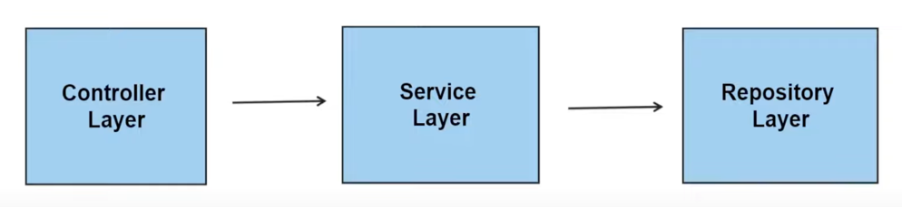

# UnitTest (단위 테스트 연습하기)
평소 통합 테스트를 자주하였고, 단위 테스트를 연습하여 점점 확장되는 복잡한 비즈니스에도 사소한 에러를 발생시키지 않게 하기 위한 연습 <br>
- 단위 테스트는 개발 초기 단계에서 버그를 발견하고 수정하는데 도움을 준다.
- 단위 테스트는 코드의 리팩토링 과정에서 중요하다.
  - 기존의 테스트 케이스를 통해 리팩토링 후 기능이 올바르게 동작하는지 체크할 수 있기 때문이다.

 <br>
단위 테스트는 Repository -> Service -> Controller 순으로 테스트를 할 것이다 <br>

* 이 readme 는 간단한 설명만 할 것이고 자세한 내용은 src/main/test/* 에 코드를 직접 보면 주석으로 설명한 내용들이 있다.

<br>

### 실행환경
- Java 21
- SpringBoot 3.3
- PostgreSQL
- H2
- Spring Data JPA
- Hibernate 6.1
- Gradle

<br>

### Repository Layer 에서 단위 테스트 하기
#### 모든 테스트는 다른 테스트에 독립적으로 작동해야 하며, 영향을 받지 않도록 설계를 해야 한다.

* given / when / then 으로 구분하여 테스트를 하자.
  * AAA 라고도 불린다 Arrange / Act / Assert
    * 또는 BDD 행위 중심 개발 이라고도 불린다.
* Repository Layer 에서는 100% 테스트 커버리지를 만들 필요는 없다.

#### 단위 테스트의 이름을 정하는 것은 중요하다
- 단위 테스트 이름은 일관성있게 짓는 것이 중요하다.
  - 아니면 귀찮게 @DisplayName() 으로 설명해야 한다.

#### [예시]
> Ex) 클래스이름_수행할기능_기대할내용() {} 
> > Ex) PokemonRepository_saveAll_ReturnPokemon() {}


JPA 를 사용한다는 가정하에 Repository 는 JpaRepository<Entity, Object> 를 가진다 <br>
JpaRepository 는 이미 추상화가 잘되어있고, 기능상 문제가 없다. 그래서 단위 테스트를 깊게 갈 필요는 없다

[기본 JPA 사용 단위 테스트 예제]
```java
@DataJpaTest
@AutoConfigureTestDatabase(connection = EmbeddedDatabaseConnection.H2) // h2 DB 사용하기 위함
class PokemonRepositoryUnitTest {
	@Autowired
	private PokemonRepository pokemonRepository;

	@BeforeEach
	public void setup() {
		System.out.println("UnitTest Setup");
	}

	@Test
	void PokemonRepository_SaveAll() {
	    // given -> Builder 사용 권장
		Pokemon pokemon = Pokemon.builder()
			.name("피카츄")
			.type("전기")
			.build();

	    // when
		Pokemon savedPokemon = pokemonRepository.save(pokemon);

		// then
		Assertions.assertThat(savedPokemon).isNotNull();
		Assertions.assertThat(savedPokemon.getId()).isGreaterThan(0);
	}

}
```

[Custom Query UnitTest]
```java
	@Test
	void PokemonRepository_FindByType_ReturnsOnePokemonNutNull() {
	    // given
		Pokemon pokemon = Pokemon.builder()
			.name("꼬마돌")
			.type("돌덩이")
			.build();

	    // when
		pokemonRepository.save(pokemon);

		Pokemon pokemon1 = pokemonRepository.findByType(pokemon.getType()).get();

		Pokemon updatedPokemon = pokemonRepository.save(
			Pokemon.builder()
				.name("진화돌")
				.type("강력한돌")
				.build()
		);

	    // then
		Assertions.assertThat(pokemon1).isNotNull();
		Assertions.assertThat(pokemon1.getType()).isEqualTo("돌덩이");
		Assertions.assertThat(updatedPokemon.getType()).isEqualTo("강력한돌");
	}
```

나머지 CRUD 테스트는 src/test/java/repository 패키지안에 코드들을 보면 자세하게 알 수 있습니다 <br>

<br>

### Mockito 알아보기
Mocking 은 모의 객체를 만들어 테스트 하는 것이다 <br>
가짜 객체라고 보면 된다 <br>

테스트에서 직접적으로 DB 에 접근하는건 좋지 않다, 그러기 위해서 **Mock** 객체를 사용하는 것이다 <br>

- Mockito는 실제 데이터베이스에 접근하지 않고, DB와 상호작용하는 객체(예: Repository, Service)를 모킹(mocking)하는 데 사용된다. 
- 모킹은 단위 테스트에서 해당 객체의 동작을 흉내내어 특정 행동을 지정할 수 있도록 하여, 실제 DB 접근 없이 비즈니스 로직을 테스트할 수 있게 해줍니다.

<br>
Mockito 는 외부 의존성을 분리하고, 독립적으로 비즈니스 로직을 테스트할 때 유용하다 <br>
실제로 DB 에 연결되어 있지 않아도 save() 가 실행이 되도 특정 값을 반환할 수 있다 <br>


[Mockito 예제]
```java
@ExtendWith(MockitoExtension.class) // Mock 객체 확장하기 위함
public class PokemonServiceUnitTest {

	@Mock // Mock 객체 선언
	private PokemonRepository pokemonRepository;

	@InjectMocks
	private PokemonServiceImpl pokemonService;

	@Test
	void PokemonService_CreatePokemon_ReturnsPokemonDTO () {
		// given
		Pokemon pokemon = Pokemon.builder()
			.id(1L)
			.name("피카츄")
			.type("전기")
			.build();

		PokemonDto pokemonDto = PokemonDto.builder()
			.name("피카츄")
			.type("전기")
			.build();

		// when
		// DB 에 접근하지 않고, Mock 을 이용해서 한다.
		// Mock 을 하는 대상은 실제로 DB 에 접근하려는 대상을 Mocking 한다??
		Mockito.when(pokemonRepository.save(Mockito.any(Pokemon.class))).thenReturn(pokemon);
		PokemonDto savedPokemonDto = pokemonService.createPokemon(pokemonDto);

		// then
		Assertions.assertThat(savedPokemonDto).isNotNull();
		Assertions.assertThat(savedPokemonDto.id()).isGreaterThan(0L);
	}

}
```

### Service Layer 에서 단위 테스트 하기.
[예시]
```java
	@Test
	void PokemonService_GetPokemonById_ReturnsPokemonDTO () {
		// given
		Pokemon pokemon = Pokemon.builder()
			.name("피카츄")
			.type("전기")
			.build();

		PokemonDto pokemonDto = PokemonDto.builder()
			.name("피카츄")
			.type("전기")
			.build();

		// when
		Mockito.when(pokemonRepository.findById(1L)).thenReturn(Optional.ofNullable(pokemon));
		PokemonDto savedPokemonDto = pokemonService.getPokemonById(1L);

		// then
		Assertions.assertThat(savedPokemonDto).isNotNull();
	}
```

[Mockito 사용 예시2]
```java

@Mock
private ReviewRepository reviewRepository;
@Mock
private PokemonRepository pokemonRepository;

@InjectMocks
private ReviewServiceImpl reviewService;

private Pokemon pokemon;
private Review review;
private ReviewDto reviewDto;
private PokemonDto pokemonDto;

@Test
void ReviewService_UpdatePokemon_ReturnReviewDTO() {
  // given
  long pokemonId = 1L;
  long reviewId = 1L;

  pokemon.addReview(review);
  review.associatedWithPokemon(pokemon);

  // when
  Mockito.when(pokemonRepository.findById(pokemonId)).thenReturn(Optional.of(pokemon));
  Mockito.when(reviewRepository.findById(reviewId)).thenReturn(Optional.of(review));
  Mockito.lenient().when(reviewRepository.save(review)).thenReturn(review);

  ReviewDto updateReturn = reviewService.updateReview(pokemonId,reviewId,reviewDto);

  // then
  Assertions.assertThat(updateReturn).isNotNull();
}
```


혹시라도 Mockito Strict Stubbing UnnecessaryStubbingException 에러를 만났다면
> Mockito.lenient().when(reviewRepository.save(Mockito.any(Review.class))).thenReturn(review);

lenient() 메소드를 통해, 엄격한 Mockito 테스트를 느슨하게 만들어주면 된다 <br>
위 메소드를 사용시 Mockito 가 테스트 실행 중에 실현되지 않는 코드들을 느슨하게 만들어 에러를 발생시키지 않는다 <br>

위 오류가 나는 이유는 테스트 실행 중에 모든 코드들이 실행되야 하는데, 실행되지 않는 코드들이 생겨서 이다. 

<br>

### MockMVC 
Controller 를 테스트하기 위해서 사용하는 가짜 객체가 MockMvc 이다 <br>

```java
@WebMvcTest(controllers = PokemonController.class) // controller 를 테스트하기 위한 어노테이션
@AutoConfigureMockMvc(addFilters = false) // 자동 mock 추가, Spring Security 우회 하기 위한 설정
@ExtendWith(MockitoExtension.class) // Mockito 확장
class PokemonControllerTest {
	@Autowired
	private MockMvc mockMvc;

	@MockBean
	private PokemonService pokemonService;

	@Autowired
	private ObjectMapper objectMapper;

	private Pokemon pokemon;
	private Review review;
	private ReviewDto reviewDto;
	private PokemonDto pokemonDto;

	@BeforeEach
	public void setup () {
		pokemon = Pokemon.builder().name("라이츄").type("강화전기").build();
		pokemonDto = PokemonDto.builder().name("라이츄").type("강화전기").build();

		review = Review.builder().title("무슨제목?").content("무슨내용?").stars(0).build();
		reviewDto = ReviewDto.builder().title("무슨제목?").content("무슨내용?").stars(0).build();
	}

	@Test
	void PokemonController_CreatePokemon_Return_ () throws Exception {
		// given
		BDDMockito.given(pokemonService.createPokemon(ArgumentMatchers.any()))
			.willAnswer(invocation -> invocation.getArgument(0));

		ResultActions resultActions = mockMvc.perform(MockMvcRequestBuilders.post("/api/pokemon/create")
			.contentType(MediaType.APPLICATION_JSON)
			.content(objectMapper.writeValueAsString(pokemonDto)));

		resultActions.andExpect(MockMvcResultMatchers.status().isCreated())
                .andDo(MockMvcResultHandlers.print());;
	}

}
```

MockMvc 를 사용한 기본이 되는 코드이다.

### Controller Layer 에서 단위 테스트 하기.

(예제1)
```java
	@Test
	void pokemonController_GetAllPokemon_ReturnResponseDTO () throws Exception {
		// given
		PokemonPageableResponse response = PokemonPageableResponse.builder()
			.pageSize(10)
			.pageNo(1)
			.last(true)
			.content(Collections.singletonList(pokemonDto))
			.build();

		// when
		Mockito.when(pokemonService.getAllPokemon(1, 10)).thenReturn(response);

		ResultActions resultActions = mockMvc.perform(MockMvcRequestBuilders.get("/api/pokemon")
			.contentType(MediaType.APPLICATION_JSON)
			.param("pageNo", "1")
			.param("pageSize", "10"));

		// then
		resultActions.andExpect(MockMvcResultMatchers.status().isOk())
			.andExpect(MockMvcResultMatchers.jsonPath("$.content.size()", CoreMatchers.is(response.content().size())));
		System.out.println("/api/pokemon/" + "테스트 성공");
	}
```

(예제2)
```java
	@Test
	void PokemonController_PokemonUpdate_ReturnPokemonDTO() throws Exception {
		long pokemonID = 1L;
		Mockito.when(pokemonService.updatePokemon(pokemonDto,pokemonID)).thenReturn(pokemonDto);

		ResultActions resultActions = mockMvc.perform(MockMvcRequestBuilders.put("/api/pokemon/1/update")
			.contentType(MediaType.APPLICATION_JSON)
			.content(objectMapper.writeValueAsString(pokemonDto)));

		resultActions.andExpect(MockMvcResultMatchers.status().isOk())
			.andExpect(MockMvcResultMatchers.jsonPath("$.name", CoreMatchers.is(pokemonDto.name())))
			.andExpect(MockMvcResultMatchers.jsonPath("$.type", CoreMatchers.is(pokemonDto.type())));
	}
```

### 단위 테스트의 Best Practice
1) 테스트 코드도 유지보수가 필요한 소프트웨어의 일부로 간주해야 한다 -> 이는 테스트 코드의 가독성과 유지보수성을 높이는데 중요하다
2) 테스트를 자주 실행해야 한다 -> CI 를 통해 자동화도 하며, 코드 변경 사항이 테스트를 통과하지 못할 경우 즉시 피드백을 받을 수 있다.
3) 테스트 커버리지를 모니터링 하는 것도 중요하다. -> High coverage 는 코드의 품질을 향상시키는데 도움이 된다.
4) 테스트 코드에 대한 리뷰 -> 테스트 코드 품질 향상 및 팀 내에서 테스트에 대한 공통된 이해를 구축하는데 기여한다.


### Ref
> https://www.youtube.com/watch?v=jqwZthuBmZY&list=PL82C6-O4XrHcg8sNwpoDDhcxUCbFy855E <br>
> https://hyeonq.tistory.com/202