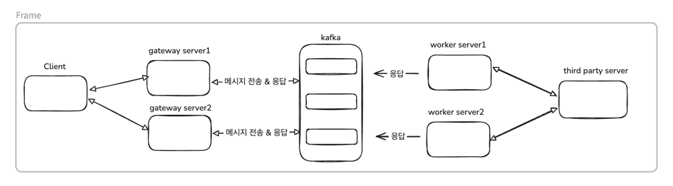
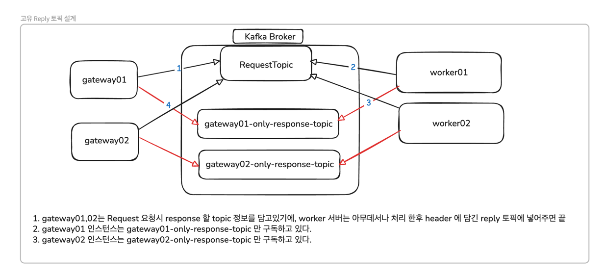
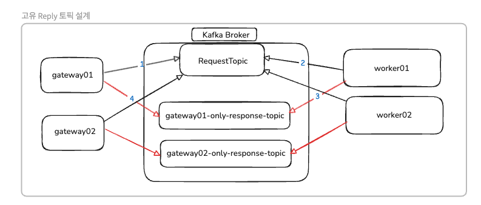

# Kafka Request-Reply패턴: 분산환경에서의 응답 라우팅 이슈 해결.md

## 개요
통합 결제 서비스를 설계하는 과정에서 Kafka 를 도입하였고,Kafka Request-Reply 분산 환경 메시지 처리 관련 이슈 해결 과정을 적어보려고 합니다. 

> Skills: SpringBoot3.2 , Java17, MySQL, JPA, Spring Kafka

## 문제 상황
현재 대강 그려본 서버 아키텍쳐는 아래와 같습니다. <br>


기본적인 설정은 아래와 같습니다.
- **Gateway 서버**: 사용자 요청 수신 및 응답 반환 (2대 - (gateway01, gateway02))
- **Worker 서버**: 실제 결제 처리 로직 수행 (2대)
- **Third Party Server**: 외부 PG사 API
- **Kafka Cluster**: 메시지 브로커 (3 brokers, replication factor=3)
- **Consumer Group**: 동일 (`payment-gateway-group`)
- **Request Topic**: `payment_requeust` (6개 파티션)
- **Reply Topic**: `payment_response` (6개 파티션)

위 구조에서 gateway server 는 kafka 로 특정 토픽에 메시지를 발행하였고 <br>
결제의 응답을 필수적으로 주어야 했기에 reply 를 대기할 수 있는 `ReplyingKafkaTemplate` 을 사용하는 `Request-Reply` 패턴을 사용했습니다 <br>

기본적으로 Request-Reply 에 사용하는 `ReplyingKafkaTemplate` 구현체는  Request 전송 시 header에 kafka_replyTopic 및 kafka_correlation_id 이 포함되어 있습니다.

위 구현체를 사용하여 비즈니스 로직을 개발하였고, 로컬에서 테스트를 진행 후에 모듈을 개발 서버에 배포 후 테스트를 진행하는 과정에서 문제가 발생했다 <br><br>
문제 설명에 앞서 간단한 개념 설명을 진행하겠습니다.

## Request-Reply 패턴이란?
Kafka는 기본적으로 비동기 메시징 시스템이지만, Spring Kafka의 `ReplyingKafkaTemplate`을 사용하면 **동기식 Request-Reply 패턴**을 구현할 수 있습니다.

```text
1. Producer가 Request 메시지 전송 시:
   - Header에 kafka_replyTopic 지정
   - Header에 kafka_correlationId (UUID) 추가

2. Consumer가 처리 완료 후:
   - 같은 correlationId로 Reply 토픽에 응답

3. Producer가 Reply 토픽을 구독하여:
   - correlationId 매칭되는 응답 대기
   - Future.get()으로 동기 대기
```

실제 메인 로직은 아래와 같습니다
```java
    public RequestReplyFuture<K, V, R> sendAndReceive(ProducerRecord<K, V> record, @Nullable Duration replyTimeout) {
    Assert.state(this.running, "Template has not been started");
    Duration timeout = replyTimeout;
    if (replyTimeout == null) {
        timeout = this.defaultReplyTimeout;
    }

    CorrelationKey correlationId = (CorrelationKey)this.correlationStrategy.apply(record);
    Assert.notNull(correlationId, "the created 'correlationId' cannot be null");
    Headers headers = record.headers();
    boolean hasReplyTopic = headers.lastHeader("kafka_replyTopic") != null;
    if (!hasReplyTopic && this.replyTopic != null) {
        headers.add(new RecordHeader(this.replyTopicHeaderName, this.replyTopic));
        if (this.replyPartition != null) {
            headers.add(new RecordHeader(this.replyPartitionHeaderName, this.replyPartition));
        }
    }

    Object correlation = this.binaryCorrelation ? correlationId : correlationId.toString();
    byte[] correlationValue = this.binaryCorrelation ? correlationId.getCorrelationId() : ((String)correlation).getBytes(StandardCharsets.UTF_8);
    headers.add(new RecordHeader(this.correlationHeaderName, correlationValue));
    this.logger.debug(() -> {
        String var10000 = KafkaUtils.format(record);
        return "Sending: " + var10000 + " with correlationId: " + String.valueOf(correlationId);
    });
    RequestReplyFuture<K, V, R> future = new RequestReplyFuture();
    this.futures.put(correlation, future);

    try {
        future.setSendFuture(this.send(record));
    } catch (Exception e) {
        this.futures.remove(correlation);
        throw new KafkaException("Send failed", e);
    }

    this.scheduleTimeout(record, correlation, timeout);
    return future;
    }
```

설명은 동기라고 했지만, 실제 내부 구현은 future 인터페이스 구현체인 CompleteFuture 를 사용하여 구현이 되어있습니다 <br>
그리고 처리 시 블로킹을 통하여 동기적으로 동작시킵니다 <br>

이제 실제 이슈에 대한 내용을 설명해보겠습니다


### 1. 동기 처리가 되지 않음.
```text
[상황]
Gateway 1번 서버: 사용자 요청 받음 → Kafka Request 전송 → Reply 대기 중 (세션 홀딩)
Gateway 2번 서버: 대기 중 (같은 reply 토픽 구독)

[Kafka 흐름]
1번 서버 → [requestTopic] → worker1번 또는 worker2번 처리
                                          ↓
                                    [replyTopic]
                                          ↓
                          ┌───────────────┴───────────────┐
                          ↓                               ↓
                    Gateway 1번 서버                   Gateway 2번 서버 
                    (원래 받아야 함)                    (consumer 처리) ❌
                          ↓                               ↓
                    응답 못 받음 → 타임아웃!             처리 성공 (의미 없음)

[결과]
- Gateway 1번 서버: 타임아웃 → 사용자에게 500 에러 반환
- Gateway 2번 서버: 메시지는 처리했지만 요청한 곳이 아니기 때문에 의미X
- 실제로는 성공했지만 사용자는 실패로 인식 ❌
```

결론적으로는 앞에 각각의 gateway 인스턴스가 동일한 reply 토픽을 구독하는 상황에서<br>
요청한 인스턴스가 아닌 다른 gateway 인스턴스가 응답을 먼저 가로채서(consume) 하여 원래 요청한 gateway 1번 인스턴스가 응답을 받지 못하는 상황입니다 <br>

추가적인 설명을 더 붙이자면, 각 gateway1, gateway2 서버는 같은 Consumer Group 으로 reply 토픽을 구독하고 있었고 <br>
reply 토픽의 6개의 파티션으로 구성되어 있었고 실제 Consumer-group 의 파티션 구독 현황은 아래와 같습니다.

```text
ReplyTopic (파티션 6개)
- Partition 0 → gateway01 서버
- Partition 1 → gateway02 서버
- Partition 2 → gateway01 서버
- Partition 3 → gateway02 서버
- Partition 4 → gateway01 서버
- Partition 5 → gateway02 서버
```

위의 상황이였고 gateway1번 서버가 구독중인 파티션 0, 2, 4 이지만, reply 를 하는 worker 서버가 1, 3, 5 파티션 중 한개에 reply 메시지를 전달해버리면 <br>
현재의 문제가 발생하는 것이였습니다. <br>

즉 같은 Consumer Group 내에서 파티션이 분산되어 있어서, 응답이 요청한 서버가 아닌 다른 서버로 전달되는 상황이 발생했습니다 <br>

필자는 서버 최상단에 LB 를 사용했기에 RoundRobin 방식으로 gateway server 로 각각 한번씩 요청이 들어왔고, 운이 좋을 때는 요청이 정상적으로 처리가 되기도 하였습니다 <br>
하지만 위 부분은 심각한 문제였고, 위 문제를 해결하기 위해 생각해본 방법은 아래와 같습니다. <br>


## 1. 인스턴스별 고유 Reply 토픽 생성
문제를 해결하기 위해 설계해본 결과는 아래와 같다 <br>
 <br>

위 설계를 가져갔을 떄의 장단점을 비교해보았다 <br>

### 장점
- 각 인스턴스 서버가 정해진 본인 응답만 받음 (요청 유실X -> 100% 처리 가능)
- Consumer Group 충돌 위험 없음
  - 파티션 할당 문제 없음
- 확장 용이 → 서버 추가 시 자동으로 새 토픽 생성

### 단점
- 토픽 개수 증가 (서버수 * 기능수)
  - 관리의 포인트가 많이 늘어남
- 토픽 관리 필요
  - 기능별로 토픽을 분리해야 하기 때문에 많은 토픽이 생김


위 장단점을 비교해봤을 때, 확장성은 나쁘지 않지만, 유지보수성이 다소 떨어지는 점이 있습니다. <br>

다음으로 생각해본 방법은 아래와 같습니다. <br>

## 2. 각 인스턴스별 수동 Consumer-group-id 를 지정
```text
gateway 1번 서버 group-id -> gateway-request-01-group
gateway 2번 서버 group-id -> gateway-request-02-group
```

위 설정을 생각해보았지만, 위 설정은 장단점이 뚜렷하였다 <br>

- 장점
  - 토픽 개수 증가 없음
  - 설정 간단
- 단점: 모든 서버가 모든 메시지 받음
  - 불필요 트래픽 발생
  - 메시지 중복 처리 위험

이 방법은 **다른 Consumer Group을 사용하는 것**이므로, 각 서버가 **모든 파티션의 메시지를 중복으로 받게 됩니다**. <br>

실제로 요청을 받고 처리를 해야하는 서버는 gateway01 이지만, gateway02 에서도 메시지를 처리하기에 중복처리가 진행될 수 있습니다. <br>

즉, gateway1과 gateway2가 각각 독립적인 Consumer Group이므로:
- Gateway1: Partition 0,1,2,3,4,5 모두 처리
- Gateway2: Partition 0,1,2,3,4,5 모두 처리
- 결과: 모든 메시지가 2번 처리됨

위 문제를 해결하기 위해서는 기술적으로 Redis 또는 다른 기술을 사용하여 이미 처리가 되었는지 체크를 필수적으로 진행해야 합니다. <br>

현재 상황에서 위 방법은 적합하지 않은 것 같다는 생각이 들었고, 멱등성이 중요한 환경이므로 위 방법은 배제 하였습니다. <br>


### 3. Redis 기반 Publish/Subscribe 응답 공유
worker 서버에서 응답을 reply 토픽에도 보내고, redis 에 데이터를 담아주는 설계도 생각을 해보았습니다.

```text
0. user 요청
1. gateway01 서버 요청 수신 후 request 토픽 전달
- 전달시에 kafka header에 고유 correlationId 전달 (위 id 는 kafka key가 됨 ex) kafka:reply:correlationId
1. worker 서버 처리 후 reply 토픽 응답 메시지 전송 및 redis pub
  - redis 에도 전달받은 correlationId 기반으로 Key: kafka:reply:correlationId value: Object 를 넣는다.
2. gateway02 서버 메시지 수신 
  -> 수신후 데이터 처리 진행 -> kafka:reply:correlationId 에 처리된 데이터 insert
3. gateway01은 아래 두 가지 방식으로 응답 대기:
   - 방법 A: Kafka Reply 토픽에서 직접 수신 (자신이 처리하는 파티션)
   - 방법 B: Redis에서 1초마다 polling (다른 서버가 처리한 경우)

즉, gateway02가 Reply 메시지를 받으면:
→ Kafka에서는 gateway02가 처리
→ Redis에 저장
→ gateway01이 Redis polling으로 감지하여 원래 요청에 응답"
```

worker 서버를 담당하는 팀은 Redis를 사용하지 않았기에, 기술적인 부채가 있었기에 위 방법은 사용할 수 없었습니다. <br>

 
## 실제 해결 방법
| 방안 | 장점 | 단점 | 멱등성 | 복잡도 | 선택 |
|------|------|------|----|--------|------|
| **1. 인스턴스별 Reply 토픽** | 100% 정확한 라우팅<br>중복 처리 없음 | 토픽 수 증가<br>관리 포인트 증가 | 보장 | 중 | ⭐ 채택 |
| 2. 다른 Consumer Group | 토픽 추가 불필요 | 모든 메시지 중복 처리<br>불필요한 트래픽 2배<br>멱등성 로직 필수 | ⚠추가 구현 필요 | 고 | ❌ 배제 |
| 3. Redis Pub/Sub | 토픽 추가 불필요<br>실시간 응답 가능 | Worker팀에 Redis 추가<br>Polling 오버헤드<br>아키텍처 복잡도 증가 | 보장 | 매우 고 | ❌ 배제 |


팀원들과 상의 끝에 모든 트레이드 오프를 고려해봤을 때 서버별 전용 Reply 토픽을 생성하여 관리를 하기로 했습니다. <br>

위 방법은 현재로서 가장 최적의 방법이라고 생각하였고, 멱등성과 정확성이 최우선인 환경인 것을 감안하면 1번 방법이 가장 적합한 방식이라고 생각했습니다 <br>

결론적으로는 1개의 요청 & 응답 흐름당 1개의 Request 토픽과 2개의 Response Topic 을 생성하여 사용하는 것으로 설계했습니다. <br>
 <br>

- Request Topic: `payment_request` (6개 파티션)
- Reply Topic (Gateway01): `payment_response_dev1` (6개 파티션)
- Reply Topic (Gateway02): `payment_response_dev2` (6개 파티션)

**파티션 6개로 설정한 이유:**
- Gateway 서버당 concurrency 3
- 총 consumer threads: 3 × 2서버 = 6개
- 파티션 6개 = consumer 6개 → 1:1 매칭
- 파티션당 예상 처리량: 1000 TPS / 6 ≈ 167 TPS


실제 설정 로직은 아래와 같습니다.

### 설정
```java
@Slf4j
@Configuration
public class KafkaReplyConfig {
    
    @Bean
    public ReplyingKafkaTemplate<String, RequestDto, ResponseDto> replyingKafkaTemplate() {
        var replyingKafkaTemplate = new ReplyingKafkaTemplate<>(replyProducerFactory(),
            replyingListenerContainer());

        replyingKafkaTemplate.setDefaultReplyTimeout(Duration.ofMinutes(10)); // 응답 타임 아웃 지정

        return replyingKafkaTemplate;
    }

    @Bean
    public ProducerFactory<String, RequestDto> replyProducerFactory() {
        var producerProps = new HashMap<String, Object>();

        producerProps.put(ProducerConfig.BOOTSTRAP_SERVERS_CONFIG, bootstrapAddress);
        producerProps.put(ProducerConfig.KEY_SERIALIZER_CLASS_CONFIG, StringSerializer.class);
        producerProps.put(ProducerConfig.VALUE_SERIALIZER_CLASS_CONFIG, JsonSerializer.class);
        producerProps.put(ProducerConfig.ACKS_CONFIG, "all"); // 위 설정 적용 시  메시지 유실 없음
        
        return new DefaultKafkaProducerFactory<>(producerProps);
    }

    @Bean
    public ConcurrentMessageListenerContainer<String, ResponseDto> replyingListenerContainer() {
        InetAddress inetAddress;
        try {
            inetAddress = InetAddress.getLocalHost();
        } catch (UnknownHostException e) {
            throw new ConfigException("HOST 정보를 알 수 없습니다.");
        }
        String hostAddress = inetAddress.getHostAddress();
        String replyTopic = getDynamicReplyTopic(hostAddress);

        if (replyTopic == null)
            throw new ConfigException("Reply Topic Setting 이 되지 않았습니다.");

        ContainerProperties containerProperties = new ContainerProperties(replyTopic);

        containerProperties.setGroupId(groupId);
        containerProperties.setClientId(groupClientId);

        var concurrentMessageListenerContainer = new ConcurrentMessageListenerContainer<>(
                replyConsumerFactory(), containerProperties
        );
        
        // Poll timeout 5ms: 빠른 응답을 위해 짧게 설정 -> Reply 메시지는 즉시 처리되어야 하므로 대기 시간 최소화
        concurrentMessageListenerContainer.setPollTimeout(5); 

        // TPS 1000 목표 -> 파티션당 ~200 TPS 처리 필요
        // 1000 TPS / 333 TPS per thread ≈ 3)
        concurrentMessageListenerContainer.setConcurrency(3);

        return concurrentMessageListenerContainer;
    }

    @Bean
    public ConsumerFactory<String, ResponseDto> replyConsumerFactory() {
        var consumerProps = new HashMap<String, Object>();

        consumerProps.put(ConsumerConfig.BOOTSTRAP_SERVERS_CONFIG, bootstrapAddress);
        consumerProps.put(ConsumerConfig.PARTITION_ASSIGNMENT_STRATEGY_CONFIG,
            Arrays.asList(
                CooperativeStickyAssignor.class.getName(), // 1순위: 협력적 리밸런스
                RangeAssignor.class.getName()              // 2순위: 호환적 리밸런스
            )
        );

        // 리밸런스 관련 타이밍 설정 (kafka 죽은 컨슈머를 찾아 리밸런싱 하는 관련 설정)
        consumerProps.put(ConsumerConfig.SESSION_TIMEOUT_MS_CONFIG, 45000);    // 45초
        consumerProps.put(ConsumerConfig.HEARTBEAT_INTERVAL_MS_CONFIG, 15000); // 15초
        consumerProps.put(ConsumerConfig.MAX_POLL_INTERVAL_MS_CONFIG, 300000); // 5분

        // consumer 직렬화 & 역직렬화
        consumerProps.put(ConsumerConfig.KEY_DESERIALIZER_CLASS_CONFIG,
            ErrorHandlingDeserializer.class); // consumer Read & Write 시 에러까지 감안해서 Custom 으로 사용
        consumerProps.put(ConsumerConfig.VALUE_DESERIALIZER_CLASS_CONFIG, ErrorHandlingDeserializer.class);
        consumerProps.put(ErrorHandlingDeserializer.KEY_DESERIALIZER_CLASS, StringDeserializer.class); // key -> String
        consumerProps.put(ErrorHandlingDeserializer.VALUE_DESERIALIZER_CLASS,
            JsonDeserializer.class); // value -> Object
        consumerProps.put(JsonDeserializer.TRUSTED_PACKAGES, "*"); // 역직렬화시 모든 패키지에서 작업 허용

        // consumer 메시지 소비 관련 설정
        consumerProps.put(ConsumerConfig.REQUEST_TIMEOUT_MS_CONFIG, 30000); // 30초 동안 브로커로부터 응답을 대기할 수 있음
        consumerProps.put(ConsumerConfig.AUTO_OFFSET_RESET_CONFIG, "latest"); // consumer 오프셋 관련 메시지 소비 재시도 방식
        consumerProps.put(ConsumerConfig.ENABLE_AUTO_COMMIT_CONFIG, false); // consumer offset 수동 커밋으로 변경

        // 메시지 fetch 설정 -> poll() 요청 빠른 응답을 위한 설정
        consumerProps.put(ConsumerConfig.FETCH_MIN_BYTES_CONFIG, 1024); // 메시지 최소 크기 1kb
        consumerProps.put(ConsumerConfig.FETCH_MAX_WAIT_MS_CONFIG, 3000); // 메시지 fetch 대기 시간 최대 3초

        // Network I/O -> OS 에 맞춰 사용
        consumerProps.put(ConsumerConfig.RECEIVE_BUFFER_CONFIG, -1);

        return new DefaultKafkaConsumerFactory<>(consumerProps);
    }

    private String getDynamicReplyTopic(String hostAddress) {
        String replyTopic = "payment_response";
        if (profile.equals(DEV.getCode()))
            return replyTopic;

        if (profile.equals(TEST.getCode()))
            if (hostAddress.equals(ServerConstants.Test.API_DEV1.getIp()))
                return replyTopic + "_dev1";
            else
                return replyTopic + "_dev2";

        if (profile.equals(PRODUCTION.getCode()))
            if (hostAddress.equals(ServerConstants.Prod.API_PROD1.getIp()))
                return replyTopic + "_prod1";
            else
                return replyTopic + "_prod2";

        return null;
    }

}
```

### 실제 처리 로직(요약)
```java
    @Override
    public ResponseDto processRefund(RefundContext refundContext, Payment payment) {
        int partitionNumber = PartitionEnums.fromPayment(payment);
        String refundTime = getRefundTime(payment);
        RequestDto request = buildRequest(refundContext, refundTime, payment);

        ProducerRecord<String, RequestDto> record = new ProducerRecord<>(
            requestTopic,
            partitionNumber,
            payment.getOrderId(),
            request
        );

        try {
            RequestReplyFuture<String, RequestDto, ResponseDto> future = replyingKafkaTemplate.sendAndReceive(
                record);

            return future.get().value();
        } catch (KafkaReplyTimeoutException e) {
            sendDlq(RequestDto);
            throw new PaymentExcpetion(CustomErrorCode.KAFKA_REPLY_ERROR, "Reply Timeout 발생 (10초 경과)");
        } catch (Exception e) {
            sendDlq(RequestDto);
            throw new PaymentExcpetion(CustomErrorCode.KAFKA_REPLY_ERROR);
        }
    }
```

많은 요약이 되었지만 실제 처리하는 로직은 위와 같습니다. <br>
멱등성이 제일 중요한 결제 환경에서 재처리는 따로 구현하지 않았고, DLQ 설계를 통하여 실패 이벤트만 따로 관리 및 모니터링을 진행하였습니다. <br>

실제 운영은 아직이지만, 예상 처리 시간은 서드파티 api 응답시간을 고려하여 평균 처리 시간 1s 정도로 생각하고 있으며, 현재 테스트 단계에서는 무난하게 동작하고 있습니다. <br>
서드파티를 제외하고 요청 흐름은 최대 300ms 정도로 생각을 하며, 위 부분은 모니터링을 진행하며 개선을 해나갈 예정입니다. <br>


## 결론
위 이슈를 해결하면서 분산 환경에서의 Request-Reply 패턴에 대하여 자세하게 알게되었습니다 <br>

트레이드오프 관점에서 많은 고민을 하였고, 결론적으로는 멱등성 보장과 명확한 메시지 라우팅을 택하였습니다 <br>
관리의 영역은 늘어나게 되었지만, 시스템 안정성 측면에서는 우수한 성과를 보였습니다 <br>

위 설계 및 개발을 진행하며 완벽한 설계는 없고 상황에 맞는 최선의 선택만 있을 뿐이라는 큰 교훈을 얻게되었고, 무언가 설계를 진행할 때는 많은 고민이 필요하다는 것을 다시 느꼈습니다. <br>

실제 운영 후 예상치 못한 문제가 또 발생할 수 있지만, 그것 역시 좋은 학습 기회가 될 것이라고 생각합니다 <br>
이슈가 생긴다면 위 부분 또한 정리하여 2탄으로 글을 작성해보려고 합니다 <br>


## Ref
1. https://docs.spring.io/spring-kafka/reference/kafka/sending-messages.html
2. https://kafka.apache.org/documentation/