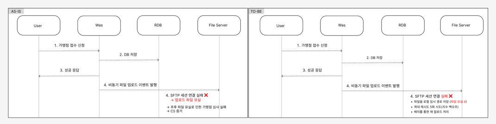

## 개요
비즈니스 요구 사항인 가맹점 접수 시 첨부 파일 업로드 실패로 인한 데이터 유실 문제가 발생했습니다. <br>
사용자에게는 성공 응답을 보냈지만, 실제로는 파일이 업로드되지 않아 가맹점 심사가 불가능한 상황이 반복되었습니다.<br>

본 글에서는 **트랜잭셔널 아웃박스 패턴(Transactional Outbox Pattern)**을 활용하여 파일 업로드 실패를 자동으로 복구하고, 데이터 유실률 0%를 달성한 경험을 공유합니다.

### Skills
- **Language**: Java 17
- **Framework**: Spring Boot 3.4
- **Database**: MySQL 8.0
- **File Transfer**: SFTP (JSch)


## 문제 상황: 비동기 업로드와 사용자 응답(트랜잭션)의 불일치

기존 로직은 다음과 같은 구조였습니다:
```java
@Transactional
public boolean registerApplication(RequestMerchantInfoDto request,
                                   List<MultipartFile> documents) throws Exception {

  // 1. DB에 가맹점 원장 저장
  MerchantApplication merchantApplication = saveMerchantApplication(request);

  // 2. 비동기로 파일 업로드 (@Async)
  fileUploadService.uploadDocuments(request, merchantApplication, documents);

  // 3. 사용자에게 즉시 성공 응답
  return true; // ✅ 사용자: "접수 완료!"
}
```
```java
@Async(value = "fileTaskExecutor")
@Transactional(propagation = Propagation.REQUIRES_NEW)
public void uploadDocuments(...) throws Exception {
    String path = ""; // 업로드 경로
    
    ChannelSftp sftp = null;
    try {
        sftp = fileService.createSftp(); 
        fileService.createDirs(path, PERMISSION, sftp);
        
        for (FileData fileData : fileDataList) {
            String fileName = ""; // 파일 이름
            try (ByteArrayInputStream inputStream = new ByteArrayInputStream(fileData.content())) {
                // sftp 서버 저장
                sftp.put(inputStream, fileName, ChannelSftp.OVERWRITE);
            }
        }
        
        // DB에 파일 정보 저장
        merchantFileRepository.saveAll(merchantFiles);
        
    } catch (Exception e) {
        log.error("파일 업로드 실패", e); // 여기서 실패 -> 하지만 사용자는 이미 성공 응답을 받은 상태
    } finally {
        fileService.disconnect(sftp);
    }
}
```

### 2. 실제로 발생한 문제들

**Case 1: SFTP 서버 Connection Refused**
```
com.jcraft.jsch.JSchException: java.net.ConnectException: Connection refused
```
- 인프라 정책에 따른 SFTP 서버 최대 연결 수 10개 도달
- 새로운 연결 시도 → 즉시 거부
- 파일은 업로드 안 되고, DB에는 원장만 존재

**Case 2: 네트워크 일시 장애**
```
java.net.SocketTimeoutException: Read timed out
```

- 파일 전송 중 네트워크 끊김
- 부분 업로드된 파일은 불완전한 상태
- 재시도 메커니즘 없음

**Case 3: 데이터 정합성 문제**
DB 에는 데이터가 정상적으로 들어와 있는 상황, 하지만 실제로는 파일도 없고 문제가 없는 데이터
```sql
SELECT * FROM merchant_application WHERE id = 123;
/*
id  | name   | status  | created_at
123 | 홍길동 | PENDING | 2024-12-10 15:30:00
*/

SELECT * FROM merchant_file WHERE merchant_application_id = 123;
-- Empty set
```
**영향:**
- 월 평균 1~3건 정도의 파일 업로드 실패 발생
- 심사 담당자가 서류를 확인할 수 없음
- 고객은 접수 완료로 알고 대기 → 며칠 후 CS 문의
  - 수동으로 파일 재요청 → 재접수 필요
  - 비즈니스 신뢰도 하락
- 개발자는 추후 CS 문의 이후 로그 확인하며 문제인지


## 문제 원인 분석
### 비동기 처리에 따른 데이터 멱등성 보장X
#### Good Case
- 파일 저장 정상
- 파일 업로드 정상

#### Bad Case(현재 상황)
- 파일 저장은 정상
- 파일 업로드 비정상(문제 발생)

### 재시도 메커니즘 부재
SFTP 연결 실패 시 단 한 번의 시도 후 예외 던지기
```java
try {
    sftp = fileService.createSftp(); // Connection refused
    // 재시도 없이 바로 예외 throw
} catch (Exception e) {
    log.error("업로드 실패", e);
}
```

### 업로드 실패에 대한 추적 불가
DB에 실패 기록이 남지 않아, 어떤 파일이 업로드되지 않았는지 알 수 없음
```sql
-- 실패 시 DB 상태
SELECT * FROM merchant_file WHERE merchant_application_id = 1;
-- Empty set (0.00 sec)

-- 파일 업로드 실패 여부조차 알 수 없음
```


## 해결 방법
해결 방법을 찾는 중에 29cm <a href="https://medium.com/@greg.shiny82/%ED%8A%B8%EB%9E%9C%EC%9E%AD%EC%85%94%EB%84%90-%EC%95%84%EC%9B%83%EB%B0%95%EC%8A%A4-%ED%8C%A8%ED%84%B4%EC%9D%98-%EC%8B%A4%EC%A0%9C-%EA%B5%AC%ED%98%84-%EC%82%AC%EB%A1%80-29cm-0f822fc23edb">트랜잭셔널 아웃박스 패턴 실제 구현 </a> 글을 보았고 참고하면서 해결할 수 있었습니다. <br>

위 아티클에서 알게된 트랜잭셔널 아웃박스 패턴 or CDC(변경 데이터 캡쳐) 두가지의 방식을 알게되었고 <br>
모범 사례를 조사한 후 팀원과 공유한 결과 CDC 의 최대약점인 테이블 스키마 변경에 취약하다는 점이 있었기에 위 방법 대신 트랜잭셔널 아웃박스 패턴을 도입하였다 <br>
 <br>


### 방법: 트랜잭셔널 아웃박스 패턴
#### 추가적인 내용
- 파일을 로컬 임시 저장소 저장(네트워크 의존성 제거)
- DB에 '업로드 의도 저장' (트랜잭셔널 아웃박스)
- 백그라운드 스케쥴러를 통해 자동 재시도
- 최종 실패 시 텔레그램 알림


### 1. 임시 저장소 설계
외부 저장소인 S3를 고려하였지만, 외부 의존성을 최소화 하고 사용자에게 빠른 응답을 목표로 하기 위해서 로컬 저장소를 사용하였다 <br>
- 네트워크 장애와 무관
- 빠른 저장 속도
- SFTP 실패해도 파일 안전하게 보관

```java
@Value("${qrbank.file.storage.path}")
private String tempStoragePath;

private String saveTemporaryFiles(
        List<MultipartFile> files) throws IOException {
    
    // 디렉토리명: UUID
    String dirName = UUID.randomUUID().toString();
    Path uploadDir = Paths.get(tempStoragePath, dirName);
    
    // 디렉토리 생성
    Files.createDirectories(uploadDir);
    
    // 파일 저장
    for (MultipartFile file : files) {
        String safeFilename = file.getOriginalFilename() != null
            ? file.getOriginalFilename()
            : UUID.randomUUID().toString();
        
        Path targetPath = uploadDir.resolve(safeFilename);
        file.transferTo(targetPath.toFile());
        
        log.debug("파일 저장: {}", targetPath);
    }
    
    String savedPath = uploadDir.toString();
    log.debug("임시 파일 저장 완료: {}", savedPath);
    
    return savedPath; // /tmp/merchant-uploads/fsid3423-3222-4232-gsgs23g323
}
```

### 2. DB 상태 저장(트랜잭션 아웃박스)
```java
@Async(value = "fileTaskExecutor")
@Transactional(propagation = Propagation.REQUIRES_NEW)
public void uploadDocuments(...) {
    
    // Step 1: 임시 파일 저장 (로컬 디스크 - 빠름, 안전함)
    String actualTempPath = null;
    try {
        actualTempPath = saveTemporaryFiles(documents);
        log.debug("임시 파일 저장 완료: {}", actualTempPath);
    } catch (IOException e) {
        log.error("임시 파일 저장 실패", e);
        handleFileUploadFail(application, merchantApplication, fileDataList, docTypes, null); // 임시 저장도 실패하면 DB에 기록 (tempStoragePath는 null)
        sendTelegramAlert("임시 파일 저장 실패", e.getMessage());
        return; 
    }
    
    // Step 2: SFTP 업로드 시도
    String sftpPath = buildSftpPath(
        application.businessRegistrationNumber(),
        application.mainPhone()
    );
    
    var merchantFiles = new ArrayList<MerchantFile>();
    ChannelSftp sftp = null;
    try {
        sftp = fileService.createSftp(); // Exponential Backoff 내장
        fileService.createDirs(sftpPath, PERMISSION, sftp);
        
        for (int i = 0; i < fileDataList.size(); i++) {
          // 파일 업로드 로직 ...
        }
        merchantFileRepository.saveAll(merchantFiles);
        
        // Step 3: 성공 시 임시 파일 삭제
        deleteTemporaryFiles(actualTempPath);
        log.debug("✅ 파일 업로드 완료 - {}건", merchantFiles.size());
    } catch (Exception e) {
        log.error("SFTP 업로드 실패", e);
        // Step 4: 실패 시 DB에 FAILED 상태로 저장
        handleFileUploadFail(application, merchantApplication, fileDataList, docTypes, actualTempPath);
        sendTelegramAlert("SFTP 업로드 실패", e.getMessage());
    } finally {
        fileService.disconnect(sftp);
    }
}
```
### 문제 발생 흐름도
```java
[사용자] --파일 업로드-->
[Controller] --비동기 호출--> [FileUploadService]
|                              |
| 200 OK ✅                    | ❌ SFTP 실패
|                              |
[사용자: 성공으로 인식]            [실제: 파일 없음]
```

### 3. 백그라운드 처리 스케쥴러 설계 (자동 재시도)
```java
@Slf4j
@Component
public class AsyncFileUploadWorker {
    private static final String LOCAL_IP = NetworkUtil.getLocalIp();
    
    /**
     * 전략:
     * 1. 본인 서버에 파일(이중화 환경 고려 하여 DB에 요청 받아 처리하는 서버 IP 저장)이 있는 FAILED 건 조회
     * 2. 파일 존재 여부 확인
     * 3. SFTP 재시도 (Exponential Backoff 적용)
     */
    @Scheduled(fixedDelay = 600000)
    public void processPendingUploads() {
        // FAILED 상태이면서 재시도 가능한 건 조회
        List<MerchantFile> failedUploads = 
            merchantFilePersistence.findFailedUploadsByServer(
                LOCAL_IP,
                MerchantFileStatus.FAILED,
                5 // maxRetryCount
            );
        if (failedUploads.isEmpty()) return;
        
        log.debug("📋 처리 대기 중 (서버: {}) - {}건", LOCAL_IP, failedUploads.size());
        // tempStoragePath로 그룹핑 (같은 디렉토리 파일은 함께 처리)
        Map<String, List<MerchantFile>> grouped = failedUploads.stream()
            .collect(Collectors.groupingBy(MerchantFile::getTempStoragePath));
        
        grouped.forEach((tempPath, files) -> {
            // 파일 존재 확인
            if (fileUploadService.isTempFileExist(tempPath)) {
                processUploadSafely(files);
            } else {
                log.warn("⏭️  파일 없음 (skip): {}", tempPath);
            }
        });
    }
    
    private void processUploadSafely(List<MerchantFile> merchantFiles) {
        try {
            MerchantFile first = merchantFiles.get(0);
            MerchantApplication merchantApp = first.getMerchantApplication();
            
            String uploadPath = buildSftpPath(
                merchantApp.getBusinessRegistrationNumber(),
                merchantApp.getMainPhone()
            );
            
            // 재 업로드 처리 -> 완료시 Status completed 로 변경 -> 그래야 다시 재시도 되지 않음
            fileUploadService.processUpload(merchantFiles, uploadPath, merchantApp);
        } catch (Exception e) {
            log.error("배치 처리 중 오류", e);
        }
    }
}
```

### 4. SFTP 연결 안정성 개선 (Exponential Backoff)
```java
@Service
@Slf4j
public class FileService {
    
    private static final int MAX_RETRY_ATTEMPTS = 3;
    private static final long BASE_RETRY_DELAY_MS = 1000; // 1초
    
    /**
     * SFTP 연결 생성 (Exponential Backoff 내장)
     * 
     * 재시도 전략:
     * - 1차 실패: 1초 대기 후 재시도
     * - 2차 실패: 2초 대기 후 재시도
     * - 3차 실패: 4초 대기 후 재시도
     * - 최종 실패: Exception throw
     */
    public ChannelSftp createSftp() throws Exception {
        int attempt = 0;
        Exception lastException = null;
        
        while (attempt < MAX_RETRY_ATTEMPTS) {
            attempt++;
            
            try {
                ChannelSftp sftp = createSftpConnection();
                
                if (attempt > 1)
                    log.debug("✅ SFTP 연결 성공 ({}회 재시도 후)", attempt - 1);
                
                return sftp;
                
            } catch (Exception e) {
                lastException = e;
                
                boolean shouldRetry = isRetryableException(e) && attempt < MAX_RETRY_ATTEMPTS;
                
                if (shouldRetry) {
                    // 지수 백오프: 1초 → 2초 → 4초
                    long waitTime = BASE_RETRY_DELAY_MS * (long) Math.pow(2, attempt - 1);
                    
                    log.warn("SFTP 연결 실패 (시도 {}/{}) - {}ms 후 재시도...", attempt, MAX_RETRY_ATTEMPTS, waitTime);
                    
                    Thread.sleep(waitTime);
                } else {
                    throw new SftpConnectionException(
                        "SFTP 연결 실패 (" + attempt + "회 시도)", e);
                }
            }
        }
        
        throw new SftpConnectionException(
            "SFTP 연결 최종 실패", lastException);
    }
}
```


위 방법들을 적용하며 파일 유실문제를 완벽히 해결하였고, 실제 운영 결과 파일 유실에 대한 CS 문의건 0건으로 사라졌습니다.

위 문제를 해결하면서 같이 고민했던 내용은 다중화 서버 간 파일 처리에 대한 문제였지만, 위 부분은 DB 에 server_instance_id 를 저장하며, <br>
각 인스턴스 서버에서 동작하는 스케쥴러가 본인 해당 server ip 를 조회하며 문제를 해결할 수 있었습니다 <br>

### 결론
위 비동기 프로세스 문제를 해결하며 배운점은 아래와 같습니다.
- 비동기 처리의 양날의 검: 빠른 응답은 좋지만, 실패 처리가 복잡해짐
  - 비동기 로직은 재시도가 필수적으로 존재해야 한다는 점을 인지했습니다.
- 네트워크는 항상 실패한다: 외부 의존성은 반드시 재시도 로직 필요
- 관찰 가능성의 중요성: 실패를 추적할 수 없으면 해결할 수 없음
  - 고유 eventId 를 잘 활용하자..
- 트랜잭셔널 아웃박스는 효과: DB 트랜잭션과 외부 API 호출을 안전하게 연결

**향후 개선 계획**
- 관리자 대시보드: 실패 건 수동 재시도, 파일 재업로드 UI 제공
- 모니터링 강화: Prometheus + Grafana로 실패율, 재시도율 실시간 모니터링

이번 경험을 통해 배운 핵심 원칙은 "네트워크는 항상 실패할 수 있다" 입니다. <br>
추후 비동기 관련 로직 설계하게 된다면 항상 실패를 전제로 설계를 진행 할 것 입니다.<br>

그리고 트랜잭셔널 아웃박스 패턴을 도입하고 설계를 하면서 생각한 부분은 위 패턴은 비동기 상황 또는 MSA 설계에서 유용하게 잘 사용될 것이라고 생각합니다 <br>


### REF
- <a href="https://microservices.io/patterns/data/transactional-outbox.html">Transactional Outbox Pattern - Microservices.io </a>
- <a href="https://aws.amazon.com/ko/blogs/architecture/exponential-backoff-and-jitter/">Exponential Backoff And Jitter - AWS Architecture Blog</a>
