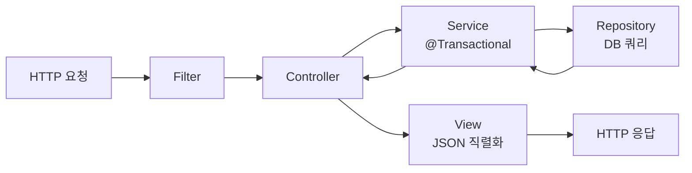
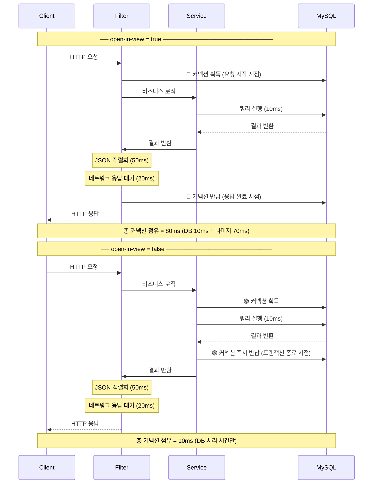
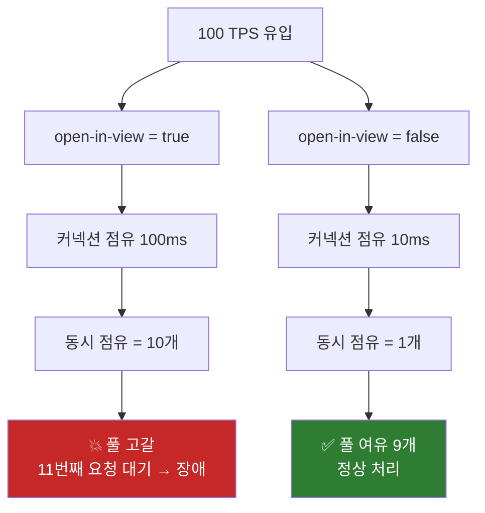
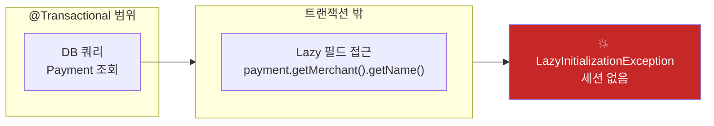

## 목차

1. [open-in-view란?](#1-open-in-view란)
2. [Spring Boot 기본값과 경고 메시지](#2-spring-boot-기본값과-경고-메시지)
3. [커넥션 점유 시간 비교](#3-커넥션-점유-시간-비교)
4. [커넥션 풀 고갈로 이어지는 흐름](#4-커넥션-풀-고갈로-이어지는-흐름)
5. [false로 바꾸면 생기는 문제 — LazyInitializationException](#5-false로-바꾸면-생기는-문제--lazyinitializationexception)
6. [해결 패턴](#6-해결-패턴)
7. [핀테크 환경에서 특히 위험한 이유](#7-핀테크-환경에서-특히-위험한-이유)
8. [설정 및 적용 방법](#8-설정-및-적용-방법)
9. [Q&A](#9-qa)

---

## 1. open-in-view란?

`open-in-view`는 **HTTP 요청 전체 생명주기 동안 영속성 컨텍스트(EntityManager)와 DB 커넥션을 열어두는 설정**이다.

자세하게 말하면 `open-in-view`는 JPA + Web + DataSource 세 가지가 모두 있을 때만 동작하는 JPA 종속 설정이다. <br>

OSIV = Open Session In View 패턴  = View(응답 렌더링) 단계에서도 DB 세션을 열어둔다는 의미

원래 목적은 **View 레이어(템플릿, JSON 직렬화)에서도 Lazy Loading이 동작하도록** 편의성을 제공하기 위해 만들어졌다.



```
open-in-view = true  → Controller ~ HTTP 응답 (Filter 이후 트랜잭션 전체 구간 점유)
open-in-view = false → Service ~ Repository (2구간 점유)
```

---

## 2. Spring Boot 기본값과 경고 메시지

```yaml
# Spring Boot 기본값
spring:
  jpa:
    open-in-view: true  ← 기본값이 true
```

Spring Boot는 `open-in-view=true` 상태로 뜰 때 아래 경고를 출력한다.

```
WARN  o.s.b.autoconfigure.orm.jpa.JpaBaseConfiguration$JpaWebConfiguration
      spring.jpa.open-in-view is enabled by default.
      Therefore, database queries may be performed during view rendering.
      Explicitly configure spring.jpa.open-in-view to disable this warning.
```

> 대부분 이 경고를 무시하고 넘어가지만 **HikariCP 커넥션 풀과 함께 쓰면 치명적인 성능 문제**가 된다.

---

## 3. 커넥션 점유 시간 비교



| 구분 | 커넥션 점유 시간 | 비고 |
|---|---|---|
| `open-in-view=true` | DB 처리 + JSON 직렬화 + 네트워크 응답 | **80ms** |
| `open-in-view=false` | DB 처리 시간만 | **10ms** |
| 차이 | | **8배** |

---

### 실제 벤치 마크 결과
Benchmark는 MySQL 을 통해 진행하였다.
```kotlin
    @Test
    @DisplayName("커넥션 점유 시간 직접 측정 — HikariCP 메트릭 기반")
    fun connectionHoldTimeTest() {
        val hikari = dataSource as HikariDataSource
        val pool   = hikari.hikariPoolMXBean

        println("\n=== 커넥션 점유 시간 측정 ===")
        println("초기 상태 — 유휴: ${pool.idleConnections}, 활성: ${pool.activeConnections}")

        // ──────────────────────────────────────────────────────
        //  RAW 시나리오 — OSIV=true 시뮬레이션
        //  트랜잭션 종료 후 Lazy 접근을 직접 하지 않고
        //  "커넥션 점유 시간"만 측정
        // ──────────────────────────────────────────────────────
        val rawStart = System.currentTimeMillis()
        val order = orderService.findOrderRaw(testOrderId)
        val rawServiceEnd = System.currentTimeMillis()

        // Lazy 필드를 직접 접근하지 않고 프록시 상태만 확인
        // OSIV=true 라면 여기서 정상 접근 가능
        // OSIV=false 라면 이 블록이 실패함 → 예외 캐치로 상태 기록
        var lazyAccessResult = "접근 불가 (OSIV=false — 예상된 동작)"
        try {
            val merchantName = order.merchant.name  // Lazy 접근 시도
            val itemCount    = order.items.size
            lazyAccessResult = "접근 성공 (OSIV=true) — merchant=$merchantName, items=$itemCount"
        } catch (e: org.hibernate.LazyInitializationException) {
            // OSIV=false 일 때 예상되는 정상 실패
            lazyAccessResult = "LazyInitializationException 발생 (OSIV=false — 예상된 동작) ✅"
        }

        simulateViewRendering(100)
        val rawTotalEnd = System.currentTimeMillis()

        println("\n[RAW — OSIV 의존 시나리오]")
        println("  Service 처리 시간 : ${rawServiceEnd - rawStart}ms")
        println("  View 포함 총 시간 : ${rawTotalEnd - rawStart}ms")
        println("  Lazy 접근 결과    : $lazyAccessResult")

        //  DTO 시나리오 — OSIV=true/false 모두 안전
        //  트랜잭션 안에서 DTO 변환 완료 → 세션 불필요
        val dtoStart = System.currentTimeMillis()
        val dto = orderService.findOrderDto(testOrderId)
        val dtoServiceEnd = System.currentTimeMillis()

        // 커넥션 반납 후 View 작업 — 세션 없어도 정상
        simulateViewRendering(100)
        val dtoTotalEnd = System.currentTimeMillis()

        println("\n[DTO — OSIV 독립 시나리오]")
        println("  Service 처리 시간 : ${dtoServiceEnd - dtoStart}ms  ← 커넥션 점유 구간")
        println("  View 포함 총 시간 : ${dtoTotalEnd - dtoStart}ms")
        println("  DTO 접근 결과     : merchant=${dto.merchantName}, items=${dto.itemCount} ✅")

        // ──────────────────────────────────────────────────────
        //  결과 요약
        // ──────────────────────────────────────────────────────
        println("\n╔══════════════════════════════════════════════════════╗")
        println("║          커넥션 점유 시간 측정 결과                   ║")
        println("╠══════════════════════════════════════════════════════╣")
        println("║  RAW  Service 처리  : ${pad(rawServiceEnd - rawStart)}ms                  ║")
        println("║  RAW  View 포함     : ${pad(rawTotalEnd - rawStart)}ms  ← OSIV=true 점유  ║")
        println("║  DTO  Service 처리  : ${pad(dtoServiceEnd - dtoStart)}ms  ← 실제 점유 구간║")
        println("║  DTO  View 포함     : ${pad(dtoTotalEnd - dtoStart)}ms                   ║")
        println("╠══════════════════════════════════════════════════════╣")
        println("║  절감 가능 시간     : ${pad((rawTotalEnd - rawStart) - (dtoServiceEnd - dtoStart))}ms                  ║")
        println("╚══════════════════════════════════════════════════════╝")

        printHikariStats("테스트 완료 후")
    }
```
```결과
=== 커넥션 점유 시간 측정 ===
초기 상태 — 유휴: 5, 활성: 0
Hibernate: select o1_0.id,o1_0.amount,o1_0.merchant_id,o1_0.status from orders o1_0 where o1_0.id=?

[RAW — OSIV 의존 시나리오]
  Service 처리 시간 : 69ms
  View 포함 총 시간 : 169ms
  Lazy 접근 결과    : LazyInitializationException 발생 (OSIV=false — 예상된 동작) ✅
Hibernate: select o1_0.id,o1_0.amount,i1_0.order_id,i1_0.id,i1_0.price,i1_0.product_name,m1_0.id,m1_0.code,m1_0.name,o1_0.status from orders o1_0 join merchant m1_0 on m1_0.id=o1_0.merchant_id left join order_item i1_0 on o1_0.id=i1_0.order_id where o1_0.id=?

[DTO — OSIV 독립 시나리오]
  Service 처리 시간 : 15ms  ← 커넥션 점유 구간
  View 포함 총 시간 : 121ms
  DTO 접근 결과     : merchant=세븐일레븐 강동점, items=3 ✅

╔══════════════════════════════════════════════════════╗
║          커넥션 점유 시간 측정 결과                   ║
╠══════════════════════════════════════════════════════╣
║  RAW  Service 처리  : 69      ms                  ║
║  RAW  View 포함     : 169     ms  ← OSIV=true 점유  ║
║  DTO  Service 처리  : 15      ms  ← 실제 점유 구간║
║  DTO  View 포함     : 121     ms                   ║
╠══════════════════════════════════════════════════════╣
║  절감 가능 시간     : 154     ms                  ║
╚══════════════════════════════════════════════════════╝
[테스트 완료 후] 총: 5, 활성: 0, 유휴: 5, 대기: 0
```

- OSIV=true  기준 커넥션 점유 시간 : 169ms (RAW View 포함)
- OSIV=false 기준 커넥션 점유 시간 : 15ms  (DTO Service 처리)

## 4. 커넥션 풀 고갈로 이어지는 흐름

### 수치로 보는 위험성

```
환경 가정:
  maximumPoolSize = 10
  open-in-view = true
  평균 응답 시간 = 100ms (DB 10ms + 직렬화/네트워크 90ms)
  초당 유입 TPS = 100
```

```
동시에 커넥션을 점유하는 요청 수 계산
= TPS × 커넥션 점유 시간(초)
= 100 TPS × 0.1s
= 10개

→ maximumPoolSize(10)와 딱 맞아떨어짐
→ 11번째 요청부터 connectionTimeout 대기
→ 30초 후 SQLException → 장애
```

```
open-in-view = false 였다면:
= 100 TPS × 0.01s (DB 10ms만)
= 1개

→ 풀 여유 9개 → 문제없음
```



---

## 5. false로 바꾸면 생기는 문제 — LazyInitializationException

`open-in-view=false`로 바꾸면 **트랜잭션 밖에서 Lazy Loading을 시도할 때 예외**가 발생한다.

```java
// 문제 상황
@GetMapping("/payment/{id}")
public PaymentResponse getPayment(@PathVariable Long id) {

    Payment payment = paymentService.findById(id);
    // 여기서 트랜잭션이 이미 종료됨 (open-in-view=false)

    // ❌ Lazy Loading 시도 → LazyInitializationException
    String merchantName = payment.getMerchant().getName();
    //                            ↑ Lazy 관계 → 세션 없음 → 예외
}
```

```
org.hibernate.LazyInitializationException:
  failed to lazily initialize a collection of role:
  could not initialize proxy - no Session
```

---

### 언제 터지는가



---

## 6. 해결 패턴

### 패턴 1 — DTO로 변환해서 반환 (권장)

```kotlin
// ── Entity 반환 ──────────────────────────────────────────────
@Transactional(readOnly = true)
fun findOrderRaw(id: Long): Order {          // Order 엔티티 반환
    return orderRepository.findById(id)      // Lazy 필드는 아직 미로딩
}
// 트랜잭션 종료 → 커넥션 반납
// Controller에서 order.merchant.name 접근 → 💥

// ── DTO 반환 ─────────────────────────────────────────────────
@Transactional(readOnly = true)
fun findOrderDto(id: Long): OrderResponse {
    val order = orderRepository.findById(id)
    return OrderResponse(
        merchantName = order.merchant.name,  // ← 트랜잭션 안에서 Lazy 접근
        itemCount    = order.items.size      // ← 트랜잭션 안에서 Lazy 접근
    )
}
// 트랜잭션 종료 → 커넥션 반납
// Controller에는 OrderResponse(일반 데이터 클래스)만 넘어옴
// 커넥션 필요 없음 → ✅
```
```
핵심 차이

Entity 반환 : Hibernate 프록시 객체가 Controller 까지 넘어옴
              → 프록시는 Lazy 로딩을 위해 언제든 세션이 필요
              → OSIV=false 면 세션 없어서 터짐

DTO 반환    : 트랜잭션 안에서 필요한 값을 전부 꺼내서
              일반 Kotlin data class 로 변환 완료
              → 프록시가 Controller 까지 넘어가지 않음
              → 세션이 전혀 필요 없음
```


---

### 패턴 2 — Fetch Join으로 한 번에 로드

```java
// ✅ 필요한 연관 엔티티를 쿼리 시점에 같이 로드
public interface PaymentRepository extends JpaRepository<Payment, Long> {

    @Query("SELECT p FROM Payment p JOIN FETCH p.merchant WHERE p.id = :id")
    Optional<Payment> findByIdWithMerchant(@Param("id") Long id);
}
```

---

### 패턴 3 — @EntityGraph 활용

```java
// ✅ 어노테이션으로 선언적으로 Eager 로딩
public interface PaymentRepository extends JpaRepository<Payment, Long> {

    @EntityGraph(attributePaths = {"merchant", "paymentDetail"})
    Optional<Payment> findById(Long id);
}
```

---

### 패턴별 비교

| 패턴 | 장점 | 단점 | 권장 상황 |
|---|---|---|---|
| DTO 변환 | 명확한 경계, 레이어 분리 | 코드량 증가 | 대부분의 경우 |
| Fetch Join | 쿼리 최적화 | JPQL 작성 필요 | 연관 엔티티가 필요한 경우 |
| @EntityGraph | 선언적, 간결 | 항상 Eager → 불필요한 조회 | 대부분 함께 조회하는 경우 |

---

## 7. 핀테크 환경에서 특히 위험한 이유

```
결제 처리 흐름에서 커넥션 점유 시간

open-in-view = true 기준:

  1. PG사 API 호출 (외부 통신) ────── 평균 200~500ms
  2. DB 저장                ─────── 10ms
  3. 응답 직렬화            ─────── 5ms
  4. 네트워크               ─────── 20ms

총 커넥션 점유 = 735ms

open-in-view = false 기준:
  2번 DB 저장 구간만 = 10ms

→ 73배 차이
```

```
결제 트래픽 50 TPS 기준

open-in-view = true
  동시 점유 = 50 × 0.735s = 36개
  → maximumPoolSize=10 → 26개가 대기 → 장애

open-in-view = false
  동시 점유 = 50 × 0.01s = 0.5개
  → 풀 여유 충분 → 정상
```

---

## 8. 설정 및 적용 방법

### 설정 변경

```yaml
# application.yml (전체 환경)
spring:
  jpa:
    open-in-view: false  # 반드시 명시적으로 false
```

### 적용 전 점검 체크리스트

```
□ 컨트롤러에서 엔티티 직접 반환하는 코드 확인
  → DTO로 변환 후 반환으로 수정

□ @Transactional 밖에서 Lazy 필드 접근하는 코드 확인
  → Fetch Join 또는 @EntityGraph로 수정

□ View 템플릿(Thymeleaf 등)에서 엔티티 Lazy 필드 접근 확인
  → DTO 모델로 교체

□ 변경 후 전체 API 통합 테스트 실행
  → LazyInitializationException 발생 지점 확인 및 수정
```

---

## 9. Q&A

> **Q1) open-in-view=true인데 지금까지 문제없이 잘 됐다. 왜 바꿔야 하나?**

트래픽이 적을 때는 문제가 드러나지 않는다.  
커넥션 풀이 고갈되는 시점은 **동시 요청 수 × 커넥션 점유 시간 > maximumPoolSize** 를 넘는 순간이다.  
지금 괜찮다는 건 트래픽이 그 임계점 아래라는 뜻이고, 트래픽이 늘어나는 순간 예고 없이 터진다.

---

> **Q2) open-in-view=false로 바꿨더니 LazyInitializationException이 너무 많이 난다. 어디서부터 잡아야 하나?**

우선순위 기준:

```
1순위 — 컨트롤러에서 엔티티 직접 반환하는 코드
        → Response DTO 클래스 만들어서 변환

2순위 — Service에서 엔티티 반환 후 컨트롤러에서 Lazy 접근
        → Service 반환 타입을 DTO로 변경

3순위 — @Transactional(readOnly=true) 없는 조회 메서드
        → readOnly=true 추가 후 메서드 안에서 DTO 변환
```

---

> **Q3) Lazy Loading을 전부 Eager로 바꾸면 open-in-view=false 해도 되는 거 아닌가?**

```
❌ 안 된다.

Eager로 전환하면:
  해당 엔티티를 조회할 때마다 연관 엔티티를 전부 조인
  → 필요 없는 데이터까지 항상 로드
  → 쿼리 복잡도 증가, 성능 더 나빠짐
  → N+1 문제가 Eager 방향으로 역전

올바른 방향:
  기본은 Lazy 유지
  필요한 곳에서만 Fetch Join 또는 @EntityGraph로 명시적 로드
```

---

> **Q4) open-in-view=false 와 OSIV는 다른 건가?**

```text
결론부터 말하면 같은 것이다. 이름만 다르다.
OSIV = Open Session In View
     = Open EntityManager In View  (JPA 용어로는 EntityManager)
     = open-in-view (Spring Boot 설정 키 이름)

전부 동일한 개념을 가리키는 다른 표현이다.

┌─────────────────────────────────────────────────────┐
│  개념                  용어                          │
├─────────────────────────────────────────────────────┤
│  패턴 이름             OSIV (Open Session In View)   │
│  Hibernate 용어        Open Session In View          │
│                        (Session = Hibernate 세션)    │
│  JPA 용어              Open EntityManager In View    │
│                        (EntityManager = JPA 세션)    │
│  Spring Boot 설정 키   spring.jpa.open-in-view       │
│  Spring 구현체 클래스   OpenEntityManagerInViewInterceptor │
└─────────────────────────────────────────────────────┘
```

---

> **Q5) OSIV=true 설정 시 Service에 @Transactional이 없으면 OSIV가 의미 없는 것인가?**

```text
┌─────────────────────────────────────────────────────────────┐
│  개념              제어 주체             생명주기             │
├─────────────────────────────────────────────────────────────┤
│  영속성 컨텍스트   OSIV (Interceptor)    HTTP 요청 전체       │
│  트랜잭션          @Transactional        메서드 범위          │
│  DB 커넥션         HikariCP              트랜잭션 범위        │
└─────────────────────────────────────────────────────────────┘

OSIV는 영속성 컨텍스트(EntityManager) 의 생명주기를 제어하는 것이고,
@Transactional은 트랜잭션 의 생명주기를 제어하는 것이다.
이 둘은 독립적으로 동작한다
```

### OSIV 의 역할
```text
@Transactional 없는 Service + OSIV=true 흐름

HTTP 요청
    │
    ▼
[OSIV] EntityManager Open ──────────────────────────────────┐
    │                                                        │
    ▼                                                        │
Repository.findById()                                        │
    └── @Transactional (Spring Data JPA 기본값)              │
        ├── 커넥션 획득                                       │
        ├── SELECT 쿼리                                       │
        └── 커넥션 반납  ← 트랜잭션 종료                     │
                                                             │
    ▼                                                        │
Controller에서 payment.getMerchant().getName() 호출          │
    │                                                        │
    └── 영속성 컨텍스트 살아있음 (OSIV 덕분)                  │
        └── Hibernate: "Lazy 로딩 가능"                      │
            ├── 새 커넥션 획득  ← ⚠ 여기가 문제             │
            ├── SELECT merchant 쿼리                         │
            └── 커넥션 반납                                  │
                                                             │
    ▼                                                        │
[OSIV] EntityManager Close ─────────────────────────────────┘
```

OSIV는 @Transactional 유무와 관계없이 영속성 컨텍스트를 살려두기 때문에, <br>
View/Controller 레이어에서 Lazy 로딩 시도 시 Hibernate가 스스로 새 커넥션을 획득해서 쿼리를 날린다.

결론적으로는 위 동작 내부를 팀원들이 다 알수없으니 제일 간편한, 결국 OSIV=false + DTO 변환 패턴을 사용하자..!


## 참고

- [Spring Boot JpaBaseConfiguration 소스](https://github.com/spring-projects/spring-boot/blob/main/spring-boot-project/spring-boot-autoconfigure/src/main/java/org/springframework/boot/autoconfigure/orm/jpa/JpaBaseConfiguration.java)
- [Vlad Mihalcea — The Open Session In View Anti-Pattern](https://vladmihalcea.com/the-open-session-in-view-anti-pattern/)
- [HikariCP — About Pool Sizing](https://github.com/brettwooldridge/HikariCP/wiki/About-Pool-Sizing)