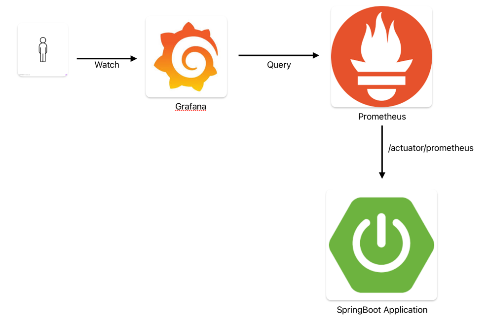
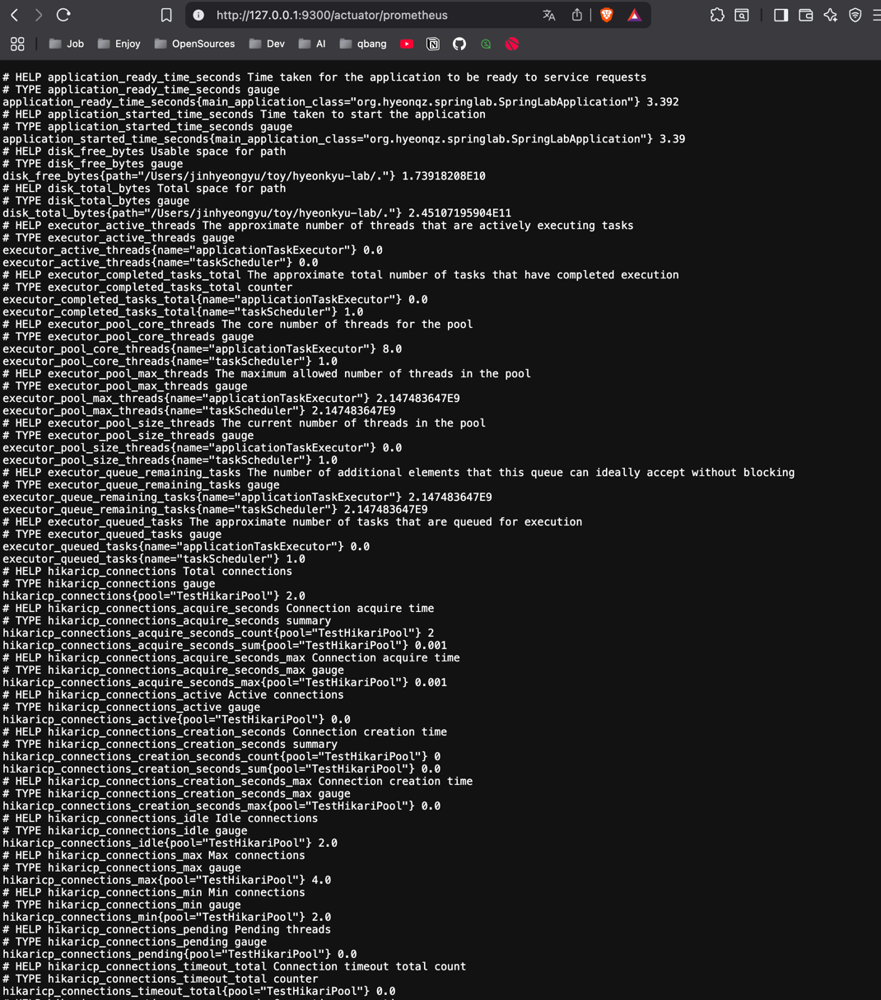
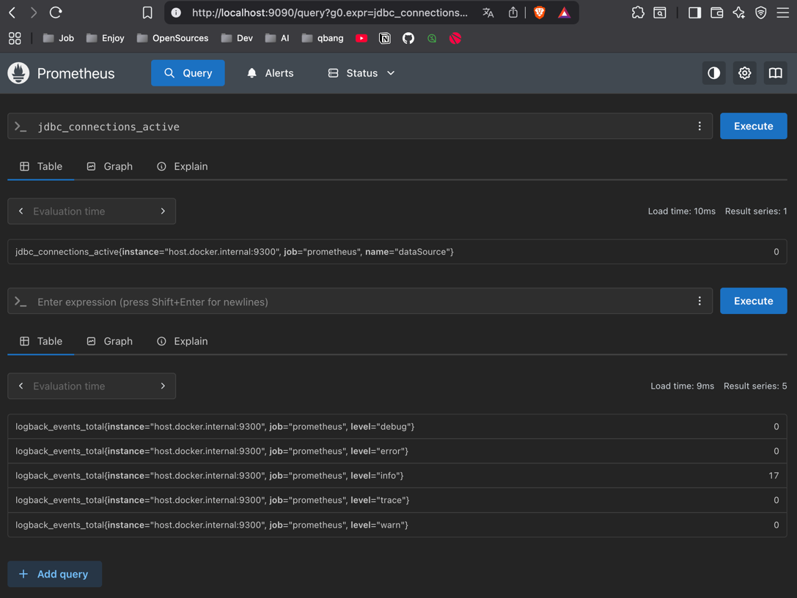
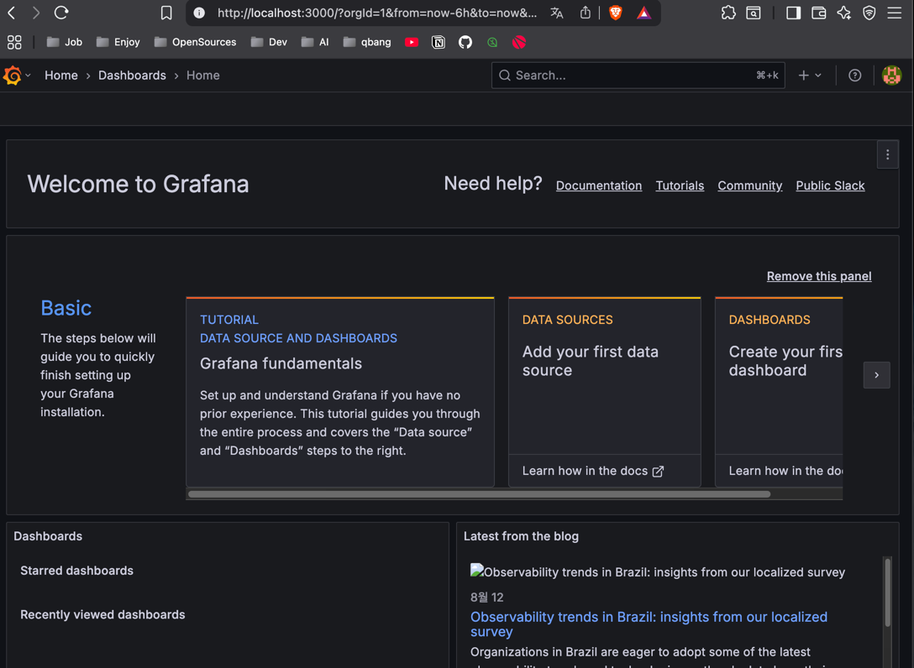
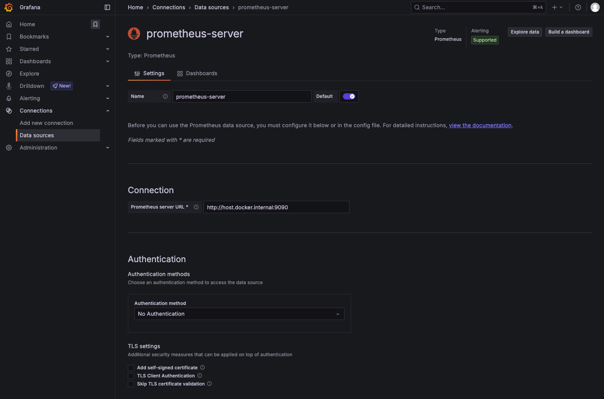
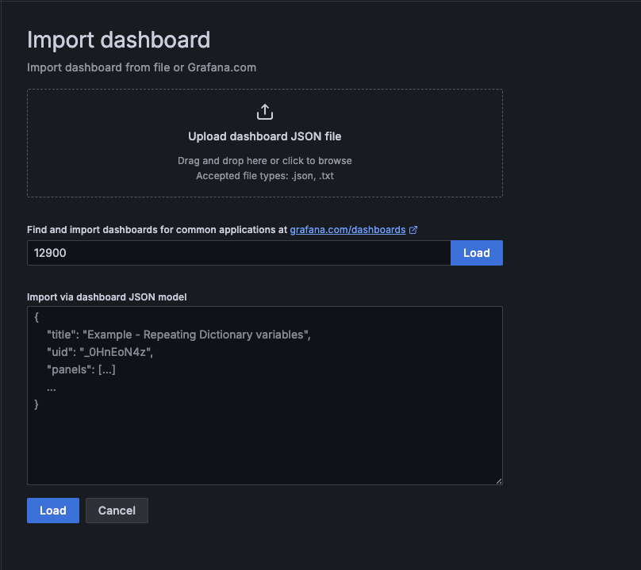
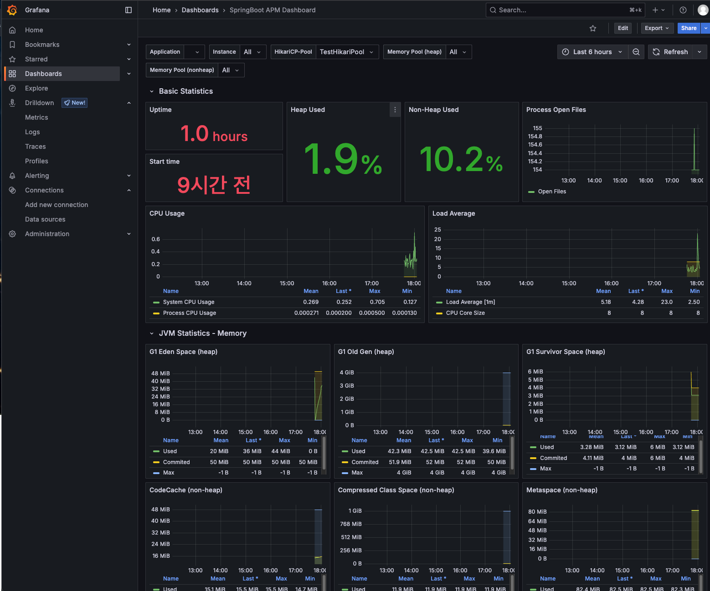

# SpringBoot + Prometheus + Grafana 모니터링 체계 구축하기

## 개요
<hr>

현재 나는 스타트업에서 근무함에 따라 하나하나 체계를 잡아가는 중이다 <br>
요즘에는 서비스 이용자가 많아짐에 따라 안전한 서비스 제공을 위해서 모니터링 및 알람 체계를 잡아가는 중이다 <br>

현재 인프라 관련 팀에서는 모니터링 및 알람 관련으로 Zabbix 라는 오픈소스를 사용중이다 <br>
하지만 따로 개발팀에서는 어플리케이션 관련 모니터링은 존재하지 않았다 <br>

초반에 그래서 apm 오픈소스인 pinPoint 를 도입하긴 했지만, 시스템 전반적인 상황을 모니터링하기에는 아쉬운점이 있었다 <br>
그래서 어플리케이션 전반적인 부분을 모니터링할 수 있는 도구들을 찾아보다가, 레퍼런스가 제일 많은 prometheus + grafana 조합을 찾았고 <br>
위 오픈소스를 사용하여 모니터링 시스템을 구축한 과정을 적어보려고 한다 <br>


## 본론
<hr>

> 개발환경 SpringBoot3.3, jdk17, gradle, mysql8.0, jpa

전체적인 모니터링 흐름도는 아래와 같다 <br>
 <br>
- grafana -> query 호출
- prometheus -> springboot app 으로부터 /actuator/prometheus api 호출
- springboot -> 응답

일단 어플리케이션 모니터링을 위해서 스프링부트 프로젝트 build.gradle 에 모니터링 관련 의존성을 추가해줘야 한다.

#### build.gradle
```groovy
// springboot 모니터링
implementation 'org.springframework.boot:spring-boot-starter-actuator'
// prometheus -> metric 수집
runtimeOnly ("io.micrometer:micrometer-registry-prometheus")
```

위 2개의 의존성을 추가한 후에 추가적으로 설정을 잡아줘야 한다 <br>

#### application.yml
```yaml
# spring actuator
management:
  endpoint:
    health:
      show-details: always

  endpoints:
    web:
      exposure:
        include: "*"
```

위 management 를 설정을 통하여 actuator 를 컨트롤할 수 있고, endpoints 에 include 에 모니터링 대상을 추가하여 제어할 수 있다 <br>
일단은 include 에 '*" 설정을 통하여 all open 상태를 해둔 상태이다 <br>

위 설정을 잡아주면 우리가 원하는 prometheus 를 통한 메트릭 엔드포인트 노출이 가능하다 <br>

#### SpringBootApplication 실행 후 prometheus 호출
localhost:8080/actuator/prometheus 를 호출한 결과는 아래와 같다 <br>
 <br>

위 이미지에서 주요 내용을 보면 thread, jvm 및 hikaricp 등 여러 정보들이 텍스트로 정리되어 있다 <br>

위처럼 글로 보면 파악하기가 쉽지 않다 <br>
그래서 위 내용을 기반으로 시각화 할 수 있게 만들어둔 오픈소스가 바로 Grafana 이다 <br>

그리고 Grafana 는 데이터 시각화 툴이기 때문에 화면에 보여질 데이터를 grafana 에게 import 를 시키기 위한 작업이 필요하다 <br>

#### prometheus.yml
```yaml
global:
  scrape_interval: 15s
  evaluation_interval: 15s

scrape_configs:
  - job_name: 'prometheus-springboot'
    metrics_path: '/actuator/prometheus'
    static_configs:
      - targets: ['host.docker.internal:9300']
```

메트릭 수집 주기 및 어떤 호스트에서 수집할지에 대한 정보를 적어 줄 수있다 <br>

필자는 현재 local 에 docker 를 사용중이므로 docker 호스트를 적어주었다 <br>

docker 에는 메트릭을 수집할 prometheus 및 grafana 가 구동중이며, 아래 docker-compose.yml 을 참고하자
#### docker-compose.yml
```yaml
services:
  prometheus:
    image: prom/prometheus:latest
    container_name: prometheus
    volumes:
      - ./prometheus.yml:/etc/prometheus/prometheus.yml:ro
      - prometheus-data:/prometheus
    command:
      - '--config.file=/etc/prometheus/prometheus.yml'
      - '--storage.tsdb.path=/prometheus'
      - '--web.console.libraries=/etc/prometheus/console_libraries'
      - '--web.console.templates=/etc/prometheus/consoles'
      - '--storage.tsdb.retention.time=200h'
      - '--web.enable-lifecycle'
    ports:
      - "9090:9090"
    networks:
      - monitoring-network

  grafana:
    image: grafana/grafana:latest
    container_name: grafana
    volumes:
      - grafana-data:/var/lib/grafana
    environment:
      - GF_SECURITY_ADMIN_PASSWORD=admin
    ports:
      - "3000:3000"
    networks:
      - monitoring-network

volumes:
  prometheus-data:
  grafana-data:

networks:
  monitoring-network:
    driver: bridge
```

위 설정으로 docker-compose up -d 옵션으로 실행을 시킨 후에 이제 위 port 로 접근을 해보자 <br>

- 서비스 접근
- Prometheus: http://localhost:9090
- Grafana: http://localhost:3000 
  - id: admin
  - pw: admin


    
#### prometheus 화면
 <br>

추가적으로 http://localhost:9090/targets 접속을 통하여 현재 metric 을 수집중인 타겟을 체크할 수 있다 <br>

#### grafana 화면



위 설정이 완료되었다면 이제 prometheus metric 을 기반으로 grafana 에 시각화를 진행해보자 <br>

그라파나에 로그인을 한 상태라면 이제 Data Source 를 구성해보자 <br>
 <br>

그리고 필자는 Connection 을 Docker 로 했기에 docker 가 떠있는 prometheus port 를 지정해준다 <br>

그 이후 하단에 Save & Test 를 지정해주면 된다 <br>

이제 대쉬보드를 구성할 수 있다 <br>
대쉬 보드는 직접 하나하나 구성을 하며 입맛대로 꾸밀 수도 있고, 아니면 이미 잘 구성된 대쉬보드를 import 와서 사용할 수 있다 <br>

유명한 대쉬보드 id 는 아래와 같다
- JVM: 4701
- MySQL: 7362
- SpringBoot: 12900


위 내용말고 다른게 궁금하다면 https://grafana.com/grafana/dashboards/ 위 링크에서 직접 보는게 좋다 <br>

 <br>

위 id 를 입력한 후 결과 사진은 아래와 같다 <br>
 <br>

위 과정을 통해서 springboot + prometheus + grafana 구성을 완료했다 <br><br>


## 결론
<hr>

모니터링은 정말 중요하다 <br>
그리고 백엔드 개발자로써 모니터링 지표를 보고 서비스를 개선할 수 있는 능력은 더 중요하다고 생각한다 <br>

이제 실무에서 위 대쉬보드 여러개를 더 찾아서 팀원들과 알맞는 대쉬보드를 찾아서 개선을 해보려고 한다 <br>

대시 보드 구성 우선 순위로는 
1. 비즈니스 로직 메트릭 (결제 성공률, 실패율, tps)
2. 애플리케이션 상태(jvm, thread, hikari)
3. 인프라 메트릭 (cpu, memory, db connection)

위 3가지 관련 메트릭을 중점적으로 모니터링 할 수 있게 시각화를 진행하는 중이다 <br>

추후 위 3가지가 완성이 되면 loki 를 연동하여 로그 시스템까지도 볼 수 있게 환경을 구축할 예정이다 <br>


### Reference
> https://grafana.com/ <br>
> https://hudi.blog/spring-boot-actuator-prometheus-grafana-set-up/ <br>
> https://junuuu.tistory.com/968


전체 코드는 <a href="https://github.com/Hyeonqz/Hyeonq-Lab/tree/master/spring-lab/src/main/java/org/hyeonqz/springlab">Github</a> 에서 확인할 수 있습니다 <br>

