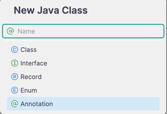
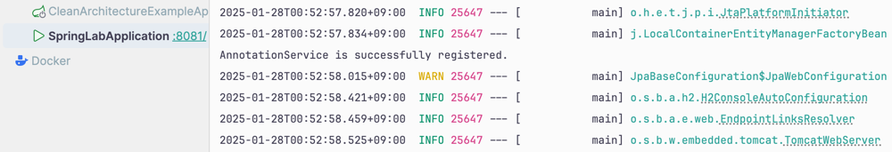

# Custom 어노테이션을 만들어보자. 

Spring 프레임워크를 사용하면 대부분의 클래스들에 어노테이션을 선언하고는 한다 <br>
대표적으로 많이 사용하는 어노테이션이 Lombok, Spring Context 에 Bean 으로 등록하기 위한 어노테이션이 있다 <br>
> @Getter, @Setter, @Service, @Component, @RestController 등...


개발을 하며 여러가지 어노테이션을 사용하고 있을 것이라고 생각한다 <br>
그리고 위 어노테이션을 선언함으로써 어떠한 동작을 할수있게 된다 <br>

나는 문득 궁금해졌다. <br>
내가 이 어노테이션이 어떻게 동작하는지 알고 쓰는걸까? <br>
어노테이션을 내가 만들어서 사용할 수 있을까? <br>
라는 생각을 하였다. <br>


위 생각을 행동으로 옮기기 위해 생각이 났을 때 공부를 해보고 기록을 해보았다 <br><br>


## 1) 어노테이션 동작 원리 및 예시
어노테이션은 설정에 따라 컴파일 or 런타임 시에 적용될 수 있다 <br>
어노테이션은 '메타 데이터'로 프로그램의 동작에 직접적인 영향을 주지는 않지만, <br>
코드에 대한 데이터를 제공하거나, 코드를 어떻게 사용할지에 대한 가이드를 제공할 수 있다 <br>

그리고 위 어노테이션을 처리하기 위해선 'Annotation Processor' 를 통해서 처리가 된다 <br>
- Java 컴파일시 컴파일러가 돌면서 어노테이션을 처리 하여 byte 코드로 바꿔준다.

위 Annotation Processor 'javax.annotation.processing' 에 'Processor' 라는 인터페이스로 정의되어 있다 <br>

자바에서는 대표적으로 @Override, @FunctionalInterface 등 기본 JDK 에서 내장 어노테이션을 제공한다 <br>
이러한 어노테이션들은 자바 컴파일러에게 특정 작업을 수행하도록 명령한다. <br>

그리고 Java 는 어노테이션을 내가 만들어서 사용또한 가능하다 <br> 
보통 코드의 가독성 높이거나, 명시적으로 무언갈 선언하기 위해서 Custom 하여 사용하고는 한다 <br>
만드는 방법은 간단한다.<br>
 <br>

클래스를 생성할 떄 Annotation 으로 생성하면 된다. <br>
위 어노테이션을 생성하면 아래와 같이 interface 에 @ 가 붙은 것이 생성된다 <br>
```java
public @interface ExampleAnnotation {
}
```

위 어노테이션에 또다른 어노테이션을 선언할 수 있고, 내부적으로 변수를 선언하여 어노테이션 자체에 어떠한 설정을 줄 수도있다 <br>

아래는 스프링에서 동작하는 대표적인 어노테이션 예시 이다
```java
@Target(ElementType.TYPE)
@Retention(RetentionPolicy.RUNTIME)
@Documented
@Component
public @interface Service {

	/**
	 * Alias for {@link Component#value}.
	 */
	@AliasFor(annotation = Component.class)
	String value() default "";

}

```

<br>

#### 그러면 어노테이션에 설정한 내용은 내부적으로 어떻게 동작하며 적용이 되는걸까?
어노테이션은 Java Reflection 을 사용하여 일반적으로 런타임에 해석된다 <br>
이를 통해 동적으로 코드의 동작을 변경하거나 설정한 정보를 수행한다 <br>

런타임시 동작시키지 않고, 다른 동작을 원한다면 아래와 같은 설정 하면 된다 <br>
> @Retention(RetentionPolicy.SOURCE) <br>
@Retention(RetentionPolicy.CLASS) <br>
@Retention(RetentionPolicy.RUNTIME)
```java
@Documented
@Retention(RetentionPolicy.RUNTIME)
@Target(ElementType.ANNOTATION_TYPE)
public @interface Retention {
	RetentionPolicy value();
}

public enum RetentionPolicy {
	SOURCE,
	CLASS,
	RUNTIME
}
```

- SOURCE : 컴파일 시 제거됨 ex) @Override
- CLASS : 컴파일된 클래스 파일에 포함되지만, 런타임에는 사용불가
- RUNTIME : 런타임에 리플렉션에 의해 조회 가능

위 enum 에 정의된 코드를 사용하여 명시적으로 선언을 할 수 있다 <br>
자바 리플렉션을 사용하기 위해선 Runtime 에 실행되어야 한다, 그래서 RUNTIME 설정을 적용해야 한다 <br>

어플리케이션 런타임시 아래와 같은 코드가 실행되며 모든 어노테이션을 조회하여 설정을 적용한다 <br>
```java
Class<?> clazz = ExampleAnnotation.class;
Annotation[] annotations = clazz.getAnnotations(); // 클래스에 선언된 모든 어노테이션 조회
```

우리가 아는 대부분 어노테이션은 Runtime 기반으로 동작한다고 생각하면 된다 <br>

추가적으로 어노테이션이 적용될 타겟또한 정의할 수 있다 <br>

```java
@Documented
@Retention(RetentionPolicy.RUNTIME)
@Target(ElementType.ANNOTATION_TYPE)
public @interface Target {
    ElementType[] value();
}

public enum ElementType {
	/** Class, interface (including annotation interface), enum, or record
	 * declaration */
	TYPE,

	/** Field declaration (includes enum constants) */
	FIELD,

	/** Method declaration */
	METHOD,

	/** Formal parameter declaration */
	PARAMETER,
}

```

위 enum 4개 말고도 여러 타입이 존재하지만 많이 사용되는 것들로만 일단은 추렸다 <br>
위 Target 지정을 함으로써 위 어노테이션이 어디서 동작할지를 설정한다 <br>

- TYPE : 클래스, 인터페이스, enum, record 등 클래스 레벨에서 동작 ex) @Service
- FIELD : 변수에 선언 ex) @Column
- METHOD : 메소드에 선언 ex) @Transactional
- PARAMETER : 파라미터에 선언 ex) @Valid

등이 있다. <br>


어노테이션을 직접 만들기 위해서 일단은 이정도만 알아도 충분하다고 생각한다. <br> 
이제 실습으로 들어가서 내가 Custom 어노테이션을 만들어보자 <br><br>


## 2) 실습 - Bean 등록을 해주는 어노테이션을 만들어 보자
### 목표
- 런타임시 동작해야한다.
- 클래스에서 동작해야 한다.
- 이름이 같은 클래스를 Bean 으로 등록 할 수 없으니, 이름을 지정할 수 있는 기능이 필요하다.
- 빈 등록을 할 수 있어야 한다.

<br>

#### 1. 어노테이션 생성
```java
public @interface CustomBean {
}
```

#### 2. 설정
- Bean 등록은 클래스를 하기 때문에 Target 은 'TYPE' 으로 설정한다. <br>
```java
@Target(ElementType.TYPE) // 클래스에서 동작
@Retention(RetentionPolicy.RUNTIME) // 런타임시 동작
@Component // 자동 bean 등록을 위한 컴포넌트 스캔 대상으로 만들기
public @interface CustomBean {
	String value() default "";
}


```

그리고 실제로 Spring Container 에 Bean 으로 등록하는 내부 구현 로직을 작성해야 한다 <br>

#### 3. 실제 Bean 등록 내부 구현
```java
package org.hyeonqz.springlab.annotation;

@Configuration
public class CustomBeanRegistrar implements ImportBeanDefinitionRegistrar {

	@Override
	public void registerBeanDefinitions (AnnotationMetadata importingClassMetadata, BeanDefinitionRegistry registry,
		BeanNameGenerator importBeanNameGenerator) {

		ClassPathScanningCandidateComponentProvider scanner =
			new ClassPathScanningCandidateComponentProvider(false);

		// CustomBean 어노테이션이 붙은 클래스만 검색
		scanner.addIncludeFilter(new AnnotationTypeFilter(CustomBean.class));

		String basePackage = "org.hyeonqz.springlab";
		Set<BeanDefinition> candidateComponents = scanner.findCandidateComponents(basePackage);

		for (BeanDefinition beanDefinition : candidateComponents) {
			try {
				// 클래스 이름 가져오기
				String className = beanDefinition.getBeanClassName();
				if (className == null) continue;

				// 빈 이름 가져오기
				Class<?> clazz = Class.forName(className);
				CustomBean customBeanAnnotation = clazz.getAnnotation(CustomBean.class);
				String beanName = customBeanAnnotation.value().isEmpty()
					? clazz.getSimpleName() // 값이 없으면 클래스 이름으로 등록
					: customBeanAnnotation.value();

				// 빈 정의 생성
				GenericBeanDefinition definition = new GenericBeanDefinition();
				definition.setBeanClass(clazz);

				// 빈 등록
				registry.registerBeanDefinition(beanName, definition);
				System.out.println("Bean registered: " + beanName);

			} catch (ClassNotFoundException e) {
				e.printStackTrace();
			}
		}
	}

}
```

#### 4. 객체 Bean 등록 
```java
@CustomBean
public class AnnotationService {
}

```

#### 스프링부트 실행 후 확인
```java
@SpringBootApplication
public class SpringLabApplication {

	private final ApplicationContext applicationContext;

	public SpringLabApplication (ApplicationContext applicationContext) {
		this.applicationContext = applicationContext;
	}

	@PostConstruct
	public void init() {
		if (applicationContext.containsBean("annotationService")) {
			System.out.println("AnnotationService is successfully registered.");
		} else {
			System.out.println("AnnotationService is NOT registered.");
		}
	}

	public static void main (String[] args) {
		SpringApplication.run(SpringLabApplication.class, args);
	}

}

```

> 결과 

 <br>

내가 만든 어노테이션이 실제로 Bean 으로 등록이 되는 것을 확인하였다 <br><br>


### 결론


Custom 어노테이션을 적절하게 만들어서 사용한다면 프로젝트에 가독성 향상 및 유지보수에 도움을 줄 수있다 <br>
지금까지 내 경험상 '이런거 기능 있나?' 라는 생각을 하고 찾아보면 대부분 존재했다 <br>

그래서 나는 무언가 명시적으로 사용하기 위해서 어노테이션을 직접 만들어서 사용하고는 한다 <br>
> ex) @Converter


제 글이 누군가에게 도움이 되기를 바라며.. <br> 

구현 코드 : https://github.com/Hyeonqz/HyeonKyu-Lab/tree/master/spring-lab/src/main/java/org/hyeonqz/springlab/annotation

### 참조
> 1) https://f-lab.kr/insight/understanding-java-annotations
> 2) https://f-lab.kr/insight/understanding-java-annotations2