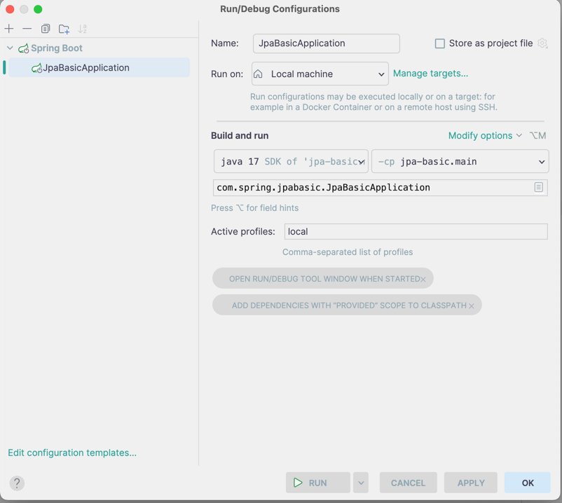

# 개발 환경 분리하기
보통 실무를 할 때 개발 환경을 분리하는 경험을 하신적 있을 것이라 생각합니다.<br>
환경을 분리 하였을 때 얻는 장점이 너무나도 많고, 단점은 귀찮음? 정도 밖에 없기에 개발 환경 분리하는 것을 당연시 생각합니다 <br>


Spring 프레임워크에서 대표적인 개발 환경 분리 방법으로 2가지가 있습니다.
- yml,properties 에서 on-profile 설정을 준다.
- yml 에서 profile 설정을 한다.

1번 방법 같은 경우 한개의 application.yml 에서 환경을 분리합니다.
```java
server:
  port: 8080

spring:
  profiles:
    default: local

  jpa:
    hibernate:
      ddl-auto: none

  datasource:
    url: jdbc:h2:mem:~/cafeKioskApplication
    driver-class-name: org.h2.Driver
    username: sa
    password:


--- # local
spring:
  config:
    activate:
      on-profile: local

  jpa:
    show-sql: true
    generate-ddl: true
    hibernate:
      ddl-auto: create
    properties:
      hibernate:
        format_sql: true
    defer-datasource-initialization: true # (boot 2.5~) Hibernate 초기화 이후 data.sql 실행 -> 매번 data insert 가 귀찮으므로 이 기능이 대신 해준다.

  # h2 console 접속 여부
  h2:
    console:
      enabled: true

--- # test
spring:
  config:
    activate:
      on-profile: test

  jpa:
    show-sql: true
    generate-ddl: true
    hibernate:
      ddl-auto: create
    properties:
      hibernate:
        format_sql: true

  datasource:
    url: jdbc:mysql://localhost:3306/test?useSSL=false&useUnicode=true&allowPublicKeyRetrieval=true
    driver-class-name: com.mysql.cj.jdbc.Driver
    username: abcd
    password: 1234

  sql:
    init:
      mode: never
```

위 코드를 보면 '---' 으로 분류가 되어 있습니다 <br>
default 는 local 로 설정되어 있고 현재는 분리는 local, test 2가지가 있습니다 <br>

위 코드를 자세히 보시면 local 과 test 는 dataSource 내부 및 jpa 설정이 다른 것을 확인할 수 있습니다 <br>
local 에서는 h2 인메모리 DB 를 사용하여 간단하게 테스트 를 진행하고 <br>

실제 테스트 환경에서는 운영 환경에서 사용할 RDB 인 MySQL 을 사용하는 것입니다.<br>
보통 실무에서 이런식으로 나누고는 합니다 <br>

위 yml 에서 원하는 profiles 를 실행하기 위해서는 아래와 같은 Edit 이 필요합니다 <br>
 <br>
위 사진처럼 Active-profiles 에 원하는 환경을 넣어주면 원하는 설정이 자동으로 주입이되어 서버가 실행이 됩니다.


#### 2번째 방법
2번째 방법은 환경별로 application.yml 파일을 여러개 만들어줍니다. <br>
- (default) application.yml
- application-local.yml
- application-test.yml
- application-prod.yml

이런 식으로 '-' 을 붙여 환경을 뒤에 붙여 줍니다. 그리고 그 안에 환경별 설정을 넣습니다. <br>
[application.yml](디폴트 -> 아무것도 건드리지 않았을 때)
```java
spring:
    profiles:
        active: local
```

위 설정을 두게 되면 application-local.yml 파일이 실행이 된다. <br>

추가적으로 여러 profile 을 사용할 수 있게 group 또한 지정할 수 있다.

본인은 개인적으로 파일이 많아지는 것을 좋아하지 않아 한 파일에서 환경을 분리하는 1번 방법을 좋아한다.