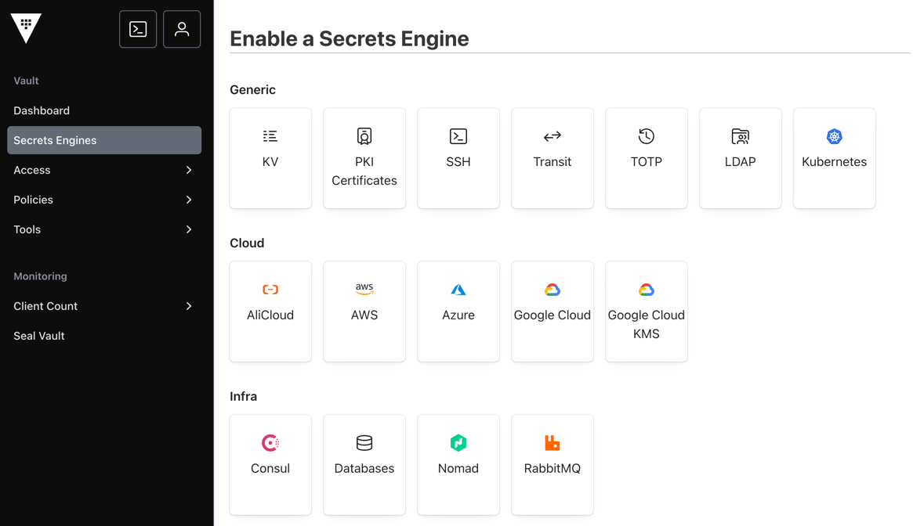
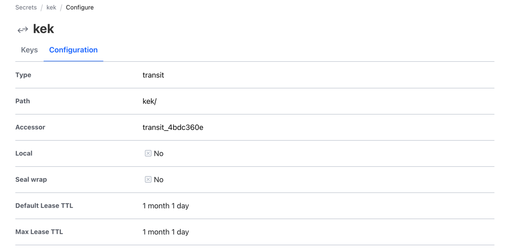
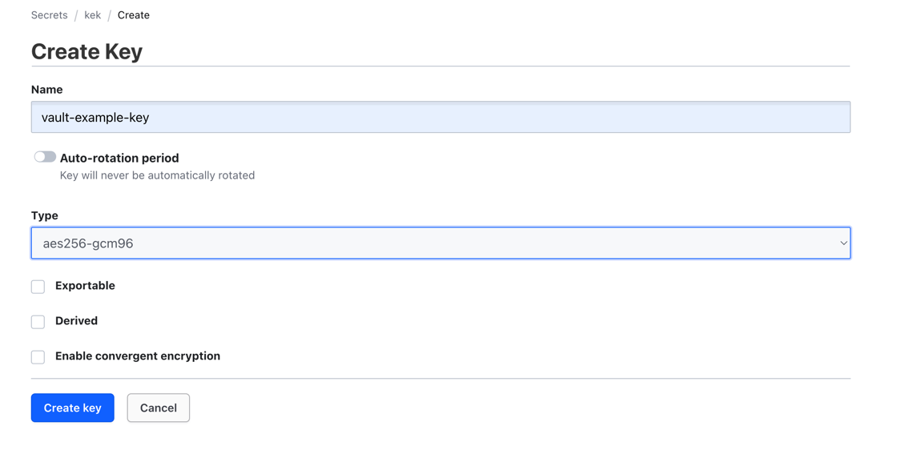
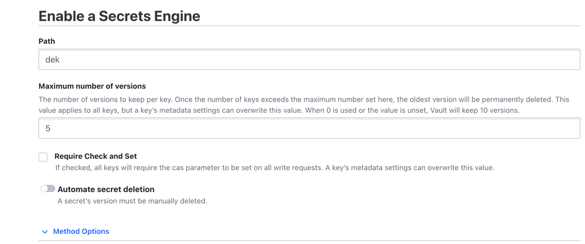
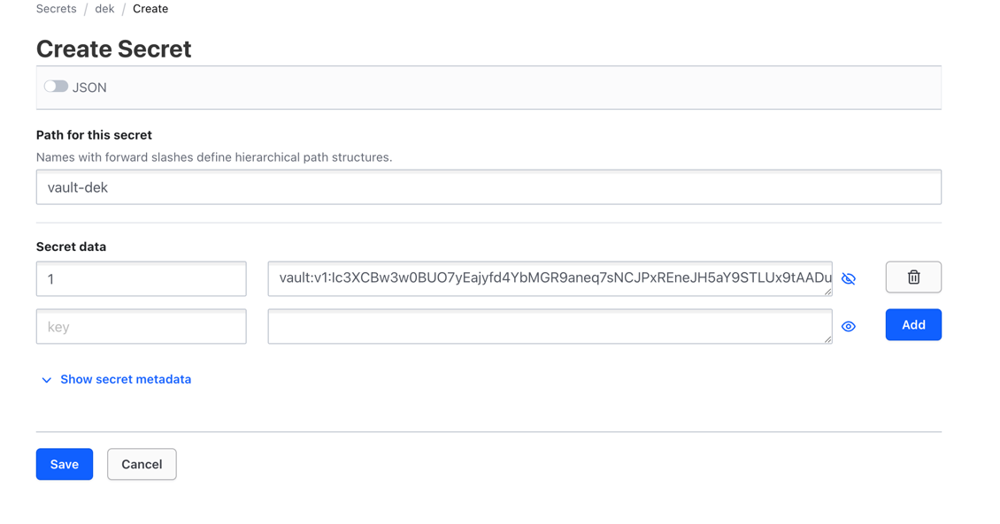
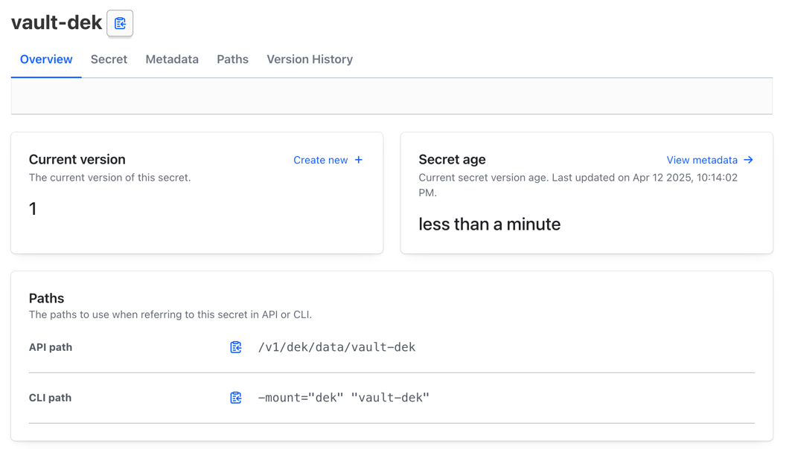
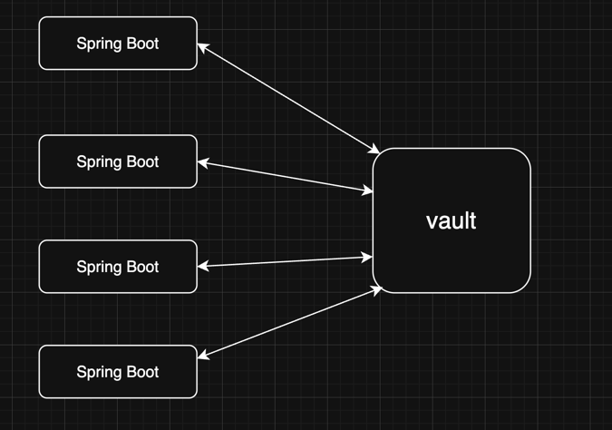

# spring-cloud-vault 적용기

실무에서 User 데이터를 암호화 해야하는 상황이 왔다. 어떻게 암호화를 할지 고민을 하던 중 Vault 라는 오픈소스를 알게 되었다 <br>
그래서 최소한의 지식은 알고 사용 하기 위해 여러가지를 찾아보았다 <br> 

사용하는 기술을 100% 알고 사용하는 사람은 극히 드물다고 생각한다 <br>
하지만 잘 알고 하는 사람과 잘 모르고 하는 사람을 활용도는 천차 만별로 다른건 100% 맞는말 이다. <br> 

사용하는 기술이나 구조에 대해 끊임없이 질문을 던지고 탐구하는 과정은 개발자의 성장은 큰 도움을 준다고 믿고 있으며 <br>
적어도 기본적인 vault 을 구조에 대해는 알고 사용 하기 위해 찾아 보고 실무에 적용한 과정을 설명해보겠다 <br>


### 들어가기에 앞서
필자의 개발 환경은 Java17, SpringBoot3.4.2 , Spring cloud 2024.02 버전을 사용하였다 <br>
혹시라도 본인들의 SpringBoot 버전이 2.x.x 이면 Spring cloud 또한 호환하는 버전을 사용해야 한다 <br><br>

### Vault 란?
한국의 개인정보 보호법에 의해 User 의 데이터를 보호해야할 의무가 있다 <br>

'**Vault 는 데이터를 보호하기 위해 적합한 솔루션이다**' <br>

Vault는 ID 기반 비밀 및 암호화 관리 시스템이다 <br>

Vault 는 중앙 집중식 관리라서 분산환경에서 모든 서버들의 비밀 정보를 관리하기에 아주 유용하다 <br>

공식문서에 따르면 주요 User Cases 는 아래 3가지 경우가 있다 <br>
#### 1. Secrets Management
어플리케이션, 시스템 및 인프라 전반에 걸쳐 비밀을 중앙에서 저장, 액세스 및 배포하기 위한 서비스
- KV Secrets Engine
- Database Credentials
- Kubernetes Secrets

#### 2. EncryptionService
주민등록번호, 신용카드 번호 및 기타 규정 준수 규제 대상 정보와 같은 데이터를 안전하게 처리 하기 위한 서비스
- Transit Secrets Engine
- Transform Secrets Engine
- Tokenization

#### 3. Key Management
표준화된 워크플로우를 사용하여 다양한 KMS 제공업체에서 암호화 키를 배포하고 수명주기를 관리하는 서비스 
- KMIP Secrets Engine
- Key Management Secrets Engine
- PKI


아마 일반적인 실무 상황이라면 위 3개 UseCase 를 다 사용할 것이라고 생각한다 <br>

Vault 의 특징은 아래와 같다
- key,value 방식으로 비밀정보를 동적 제공
- 중앙 집중식 키 관리
- 즉각적인 액세스 제어
- 감시 추적 기능

<br>

### docker-compose 를 통한 vault 활성화
```yml
# https://spring.io/guides/gs/vault-config 참조
services:
  vault:
    container_name: "spring-cloud-vault"
    image: hashicorp/vault:latest
    environment:
      VAULT_DEV_ROOT_TOKEN_ID: 19aefa97-cccc-bbbb-aaaa-225940e63d76
    ports:
      - "8200:8200"

# docker compose -f docker-compose-vault.yml up -d
```

위 docker-compose 를 실행시키면 실제 vault 서버가 활성화가 되며 vault-ui 에도 접근을 할 수 있다 <br>
vault 는 기본적으로 8200 포트를 사용하며 로컬 기준 localhost:8200/(=127.0.0.1:8200/) 으로 접속할 수 있다 <br>

위 url 로 접속을 하면 로그인 화면이 나온다. 로그인 pw 은 VAULT_DEV_ROOT_TOKEN_ID 에 Value 를 입력하면 로그인 할 수 있다 <br>
 <br>

Vault는 클라이언트 요청을 승인하기 위해 인증 메커니즘이 필요하다. <br>
Spring Cloud Vault는 Vault로 애플리케이션을 인증하기 위해 여러 인증 메커니즘을 지원한다. <br>
보통은 token 방식을 사용해 루트 토큰을 사용하여 로그인을 한다 <br>
```java
spring.cloud.vault:
    authentication: TOKEN
    token: 19aefa97-cccc-bbbb-aaaa-225940e63d76
```

위 docker-compose 만 있다면 vault 를 실행시킬 수 있다. <br>

인증에 관련된 자세한 내용은 따로 포스팅을 하지 않을 예정이라 아래 글을 읽어보기를 추천한다 <br>
<a href="https://adjh54.tistory.com/475">docker 로 vault server 구축 방법</a>


이제 UI 접속 까지는 끝났다 <br>
이제 실제로 암호화 대상을 넣는 과정을 알아야 한다 <br>

그러기 위해선 몇가지 키워드를 알 필요가 있다.
- Initial Root Key -> docker-compose 에서 설정한 token 
- Seal Key -> Vault 에서 모든 데이터를 암호화하는데 사용되는 키(Master key)
  - 위 키는 처음 Vault 생성시 만들어지며, Vault 시스템이 관리를 한다 -> 우리는 알 수 없다. 
- Unseal Key -> 암호화된 데이터를 복호화 하는데 사용되는 키
  - 관리자(=개발자) 가 관리한다.


이제는 암호화가 필요한 정보를 관리하기 위해선 메뉴에서 '**Secrets Engine**' 에 들어가야 한다 <br>
 <br>

3가지의 메뉴가 있다 <br>
- Generic: 가장 기본적인 형태의 보안 정보를 제공하고 관리
- Cloud: 클라우드 서비스와 통합하여 보안 정보를 직접 관리하고 생성
- Infra: 인프라 서비스와 통합하여 보안 정보를 보다 안전하게 보관하고 관리

위 3개 중 필자는 Generic 에서 Transit, KV 2개의 메뉴만을 사용해서 키 관리 및 암 복호화를 진행하였다 <br>

### Key 관리
Secrets Engine -> Transit -> path(이름 지정) <br>
 <br>

key를 관리할 transit 생성이 되었고, 이제 실제 key 암복호화 Key 를 생성해보자 <br>
 <br>

이제 다시 kek transit 을 들어가면 방금 생성한 key 가 화면에 보일 것이다 <br>
이제 key 를 누르고 
- Key Actions 메뉴에 DataKey 를 클릭한다.
- Create dataKey 를 클릭해 key 를 생성한다. (설정은 따로 건드리지 않는다)
성공적으로 완료가 되었다면 아래 사진과 같은 화면이 나올 것이다 <br>
vault:v1 으로 시작하는 Key 가 하나가 발급될 것이다 <br>

그 Key 를 복사한 후에 다음 step 으로 넘어가자.<br>
vault:v1:Ic3XCBw3w0BUO7yEajyfd4YbMGR9aneq7sNCJPxREneJH5aY9STLUx9tAADunrkDds4eW55q+B78fVF+

### 데이터 암복호화
이번에는 Secrete Engine 에서 enable new engine 을 들어간 후 Generic 에서 KV 를 선택한다 <br>
 <br>
별다른 옵션을 건드리지 않고 생성을 해준다 <br>

그리고 Create Secret 을 하여 방금 복사한 vault:v1 으로 시작한 key 를 넣어준다.
 <br>

방금 생성한 vault-dek overview 를 보면 아래와 같이 위 값을 호출할 수 있는 방식이 나와 있다 <br>
 <br>

필자는 API Paths 를 SpringBoot 에서 호출하여 키 관리를 진행할 것이다 <br>

Vault 를 통한 key 관리 방법은 총 3가지가 있다
- CLI
- API
- UI

필자는 Key 생성 및 관리는 Vault-UI 를 통해서 진행하고, 키 조회는 어플리케이션 내부에 API 호출 로직을 통해 진행할 것이다. <br>

이제 Springboot 에서 실행을 해보자 <br>

## Springboot 프로젝트 적용
SpringBoot 를 기준으로 Vault 를 사용하는 흐름은 아래와 같다 <br>
 <br>

실제로는 vault 를 kubernetes 에 올리고 관리를 하고 있지만, kubernetes 지식은 없어서 추후 좀더 알아보고 그림을 고쳐보려고 한다 <br>

### build.gradle
```java
plugins {
    id 'java'
    id 'org.springframework.boot' version '3.4.4'
    id 'io.spring.dependency-management' version '1.1.7'
}

group = 'org.hyeonqz'
version = '0.0.1-SNAPSHOT'

java {
    toolchain {
        languageVersion = JavaLanguageVersion.of(21)
    }
}

configurations {
    compileOnly {
        extendsFrom annotationProcessor
    }
}

repositories {
    mavenCentral()
}

ext {
    set('springCloudVersion', "2024.0.2")
}

dependencies {
    implementation 'org.springframework.boot:spring-boot-starter-data-jpa'
    implementation 'org.springframework.boot:spring-boot-starter-web'
    implementation 'org.springframework.cloud:spring-cloud-starter-vault-config'
    compileOnly 'org.projectlombok:lombok'
    runtimeOnly 'com.h2database:h2'
    annotationProcessor 'org.projectlombok:lombok'
    testImplementation 'org.springframework.boot:spring-boot-starter-test'
    testRuntimeOnly 'org.junit.platform:junit-platform-launcher'
}

dependencyManagement {
    imports {
        mavenBom "org.springframework.cloud:spring-cloud-dependencies:${springCloudVersion}"
    }
}

tasks.named('test') {
    useJUnitPlatform()
}

```

위 의존성을 통해 vault 에 접속할 수 있는 환경을 구성할 수 있다 <br>
spring-cloud 의존성을 사용하기에 일반적으로 implementation 만 추가하는게 아닌 <br>
spring-cloud 의존성을 사용하기 위한 추가 설정이 필요하다 <br>
```java
ext {
	set('springCloudVersion', "2024.0.2")
}

dependencyManagement {
    imports {
        mavenBom "org.springframework.cloud:spring-cloud-dependencies:${springCloudVersion}"
    }
}
```


위 설정이 끝나고 build.gradle 을 reload 한 후에 정상적으로 동작하면 Vault 관련 config 를 잡아줘야 한다 <br>

VaultConfig.java
```java

```


필자는 실무에서 Vault UseCase 중에서 3가지 를 다 사용한다. <br>
- DB 정보 암호화 (host,username,password,url)
- 개인정보 암호화 & 복호화 Key 관리
- 외부 연동 기관 인증서 key 암호화 & 복호화 

위 설정을 vault 로 전부 빼게 되면서 application.yml 에 값들을 직접 설정하는 번거로움또한 사라졌고 <br>
해킹으로 부터 훨씬 안전해졌을 거라고 생각한다 <br>

하지만 귀찮았던건, springboot 가 기동되면서 application.yml 설정정보를 읽어와서 자동으로 설정을 잡아주던 것을 이제 <br>
수동으로 해줘야한다 ex) db 연결을 위한 DataSource @Bean 등록 <br>

등등 위와 같은 수동 설정 사항이 필요한 경우가 많아질 수도 있다 <br><br>

### REF
> 1. https://cloud.spring.io/spring-cloud-vault/reference/html/ <br>
> 2. https://adjh54.tistory.com/475 <br>
> 3. https://github.com/spring-cloud/spring-cloud-vault
> 4. https://developer.hashicorp.com/vault/docs/get-started/operations-qs