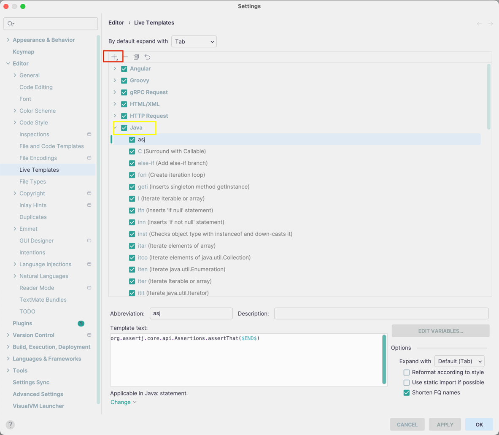
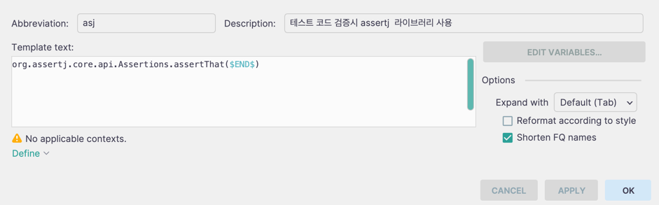
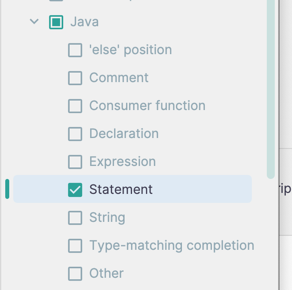

# live template 설정
1) Settings 들어감
2) Live templates 검색
3) menu 중에 Java 를 찾는다.
  
'+' 클릭 후 Live Template 추가를 누른다  

하단에 live template 을 설정할 수 있는 Abbreviation 및 Template text 가 나온다  
- Abbreviation : 설정할 약어 ex) asj
- Template text : 약어를 입력시 나올 코드 포맷

예시는 아래와 같다  
  

- 추가적으로 Options 에 Shorten FQ names 는 설정되 있어야 한다
- Template Text 에 $END$ 는 Abbreviation 입력시 마우스 커서가 $END$ 쪽에서 시작하게 하는 것이다.

그리고 마지막으로 Define 설정을 통해 마무리를 진행한다  
  
Java -> Statement 를 체크한다

이제 내가 설정한 Abbreviation 입력시 원하는 코드 포맷이 출려이 될 것이다  
위 설정을 통해 이제 개발 생산성 및 편의성이 증가할 것으로 판단된다  