# 도메인 주도 개발 시작하기 - DDD 핵심 개념 정리부터 구현까지 (1~4장 정리)

## 도메인 모델 시작하기
도메인은 여러 하위 도메인으로 구성이된다 <br>
소프트웨어가 도메인은 모든 기능을 제공하지는 않는다. 어떠한 도메인은 외부 업체를 이용해서 진행한 후 가져다가 붙이기만 하는경우도 많다<br>
ex) 결제 - PG사, 카드,VAN 사, 물류 - 외부 물류 업체 <br>

#### 도메인 전문가와 개발자 간 지식 공유
요구사항을 제대로 이해하지 않으면 쓸모없거나 유용함이 떨어지는 시스템을 만들기 때문이다 (요구사항은 첫 단추와 같다) <br>
도메인 전문가 = PM ? 개발자도 도메인 지식을 갖춰야 한다 <br>
'Garbage in Garbage out' -> 잘못된 값이 들어가면 잘못된 값이 나온다 <br>

#### 도메인 모델
도메인 모델을 정의할 때는 클래스 다이어그램을 사용해서 UML 을 그리면 보기가 편하다 <br>
그리고 도메인 모델을 모델링 할 때 상태 다이어그램을 이용하면 편하다 <br>
도메인 모델 표현할 때 클래스 다이어그램이나 상태 다이어그램과 같은 UML 표기법만 사용해야 하는 것은 아니다 <br>
관게가 중요한 도메인이라면 그래프를 이용해서 도메인을 모델링할 수 있다 <br>
예를 들어 객체 기반 모델을 기반으로 도메인을 표현했다면 객체 지향 언어를 이용해 개념 모델을 가깝게 구현할 수 있다<br>

#### 도메인 모델 패턴
일반적이 어플리케이션 아키텍쳐는 [ 표현 - 응용 - 도메인 - 인프라 - DB] 로 구성이 된다. <br>
DDD 에서의 도메인 모델은 아키텍쳐 상의 도메인 계층을 객체 지향 기법으로 구현하는 패턴을 말합니다 <br>
도메인 계층은 도메인의 핵심 규칙을 구현한다. <br>
개념 모델과 구현 모델 <br>
개념 모델은 순수하게 문제를 분석한 결과물이다 <br>
프로젝트를 진행하면서 개념 모델을 구현 모델로 점진적으로 발전시켜 나가야 한다

#### 도메인 모델 추출
문서화를 하든 주된 이유는 지식을 공유하기 위함이다. 실제 구현은 코드에 있으므로 코드를 보면 다 알 수 있지만 <br>
코드는 상세한 모든 내용을 다루고 있기 때문에 코드를 이용해서 전체 소프트웨어를 분석하려면 많은시간이 필요하다 <br>
코드를 보면서 도메인을 깊게 이해하게 되므로 코드 자체도 문서화의 대상이 된다 <br>

#### Entity & Value
도출한 모델은 크게 Entity, Value 로 구분할 수 있다. <br>
Entity, Value 를 제대로 구분해야 도메인을 올바르게 설계하고 구현할 수 있기 때문에 <br>
이 둘의 차이를 명확하게 이해하는 것은 도메인을 구현하는 데 있어 중요하다 <br>

#### Entity
엔티티의 가장 큰 특징은 식별자를 가진다는 것이다 <br>
식별자는 엔티티 객체마다 고유해서 각 엔티티는 서로 다른 식별자를 갖는다 <br>
엔티티의 식별자를 생성하는 시점의 도메인의 특징과 사용하는 기술에 따라 달라진다 <br>
1) 특정 규칙에 따라 생성
2) UUID 나 Nano ID 와 같은 고유 식별자 생성기 사용
3) 값을 직접 입력
4) 일련번호 사용(시퀀스나 DB의 자동 증가 컬럼 사용)

```java
import java.util.UUID;

UUID uuid = UUID.randomUUID();
String strUuid = uuid.toString();
```

#### Value
정보를 가진 클래스에는 데이터를 갖고 있다 <br>
Value 타입은 개념적으로 완전한 하나를 표현할 때 사용한다 <br>
예를 들어 받는 사람을 위한 Value 타입인 Receiver 를 작성할 수 있다. <br>
```java
public class Receiver {
	private Stirng name;
	private String phoneNumber;
	
	public Receiver(String name, String phoneNumber) {
		this.name = name;
		this.phoneNumber = phoneNumber;
    }
	
	public String getName() {
		return this.name;
    }
	
	public String getPhoneNumber() {
		return this.phoneNumber;
    }
	
}
```

**도메인 모델에 set 메소드 넣지 않기** <br>
getter,setter 를 습관적으로 만드는 이유는 프로그래밍 예제 코드 때문일 확률이 높다 <br>
특히 set 메소드는 도메인의 핵심 개념이나 의도를 코드에서 사라지게 한다 <br>
set 에 의미는 그냥 단순하게 설정을 한다는 뜻으로 사용이 된다 <br>

도메인 객체가 불완전한 상태로 사용되는 것을 막으려면 생성 시점에 필요한 것을 전달해주어야 한다. 즉 생성자를 통해 필요한 데이터를 모두 받아야한다 <br>

**DTO 의 getter/setter** <br>
DTO 는 Data Transfer Object 의 약자로 프레젠테이션 계층과 도메인 계층이 데이터를 주고 받을 때 사용하는 일종의 구조체이다 <br>
요즘 개발 프레임워크나 개발 도구는 set 메소드가 아닌 private 필드에 직접 값을 할당할 수 있는 기능을 제공하고 있어 <br>
set 메소드가 없어도 프레임워크를 이용해서 데이터를 전달 받을 수 있다 <br>
프레임워크가 필드에 직접 값을 할당하는 기능을 제공하고 있다면 set 메소드를 만드는 대신 해당 기능을 최대한 활용하자 <br>
이렇게 하면 DTO 도 불변 객체가 되어 불변의 장점 DTO 까지 확장할 수 있다

#### 도메인 용어와 유비쿼터스 언어
코드를 작성할 때 도메인에서 사용하는 용어는 매우 중요하다 <br>
도메인에서 사용하는 용어를 코드에 반영하지 않으면 그 코드는 개발자에게 코드의 의미를 해석해야 하는 부담을 준다 <br>
**도메인 용어에 알맞은 단어를 찾는 시간을 아까워하지 말자**

## 2장 아키텍쳐 개요
표현,응용,도메인 인프라스트럭쳐는 아키텍쳐를 설계할 때 출현하는 전형적인 4가지 영역이다 <br>
네 영역중 표현 영역은 사용자의 요청을 받아 응용 영역에 전달하고 응용 영역의 처리 결과를 다시 사용자에게 보여주는 역할을 한다  Ex) 스프링 MVC <br>
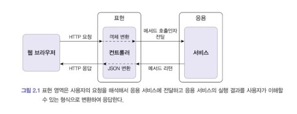 <br>
표현 영역은 사용자의 요청을 해석해서 응용 서비스에 전달하고 응용 서비스의 실행 결과를 사용자가 이해할 수 있는 형식으로 변환하여 응답한다 <br>
응용 영역은 기는을 구현하기 위해 도메인 영역의 도메인 모델을 사용한다 <br>
응용 서비스는 로직을 직접 수행하기 보다는 도메인 모델에 로직 수행을 위임한다 <br>
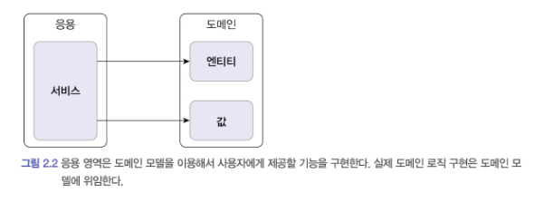 <br>
도메인 영역은 도메인 모델을 구현한다. 도메인 모델은 도메인의 핵심 로직을 구현한다 <br>
인프라 영역은 구현 기술에 대한 것을 다룬다 ex) rdbms 연동, 메세징 큐 사용, redis, mongoDB 연동 등 <br>
- 인프라 영역은 논리적인 개념을 표현하기보다는 실제 구현을 다룬다.
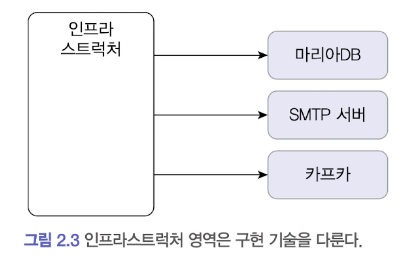 <br>
도메인,응용,표현 영역은 구현 기술을 사용한 코드를 직접 만들지 않는다 <br>

#### 계층 구조 아키텍쳐
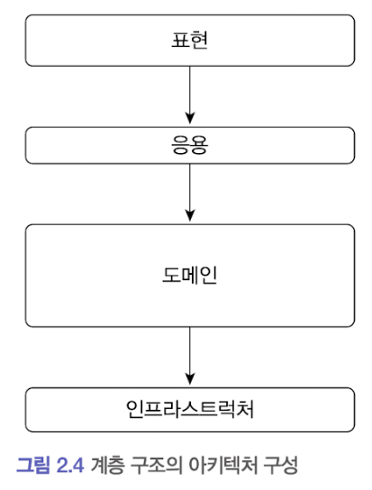 <br>
계층 구조는 그 특성상 상위 계층에서 하위 계층으로의 의존만 존재하고 하위 계층은 상위 계층에 의존하지 않는다 <br>
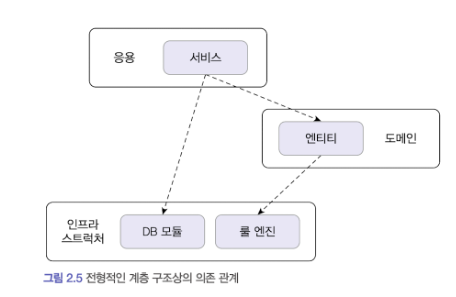 <br>
응용,도메인 영역은 DB나 외부시스템 연동을 위해 인프라 영역 기능을 사용해야 한다 <br>
하지만 표현,응용,도메인 계층이 구현 기술을 다루는 인프라 계층에 종속된다 <br>
인프라 영역에 의존하게 되면 '테스트 어려움', '기능 확장의 어려움' 이라는 두가지 문제가 발생한다 <br>

#### DIP 의존 역전 원칙
인프라 영역에 의존하지 않기 위해서 DIP 객체지향 설계원칙을 잘 활용해야 한다. <br>
DIP 는 저수준 모듈이 고수준 모듈에 의존하도록 바꾼다 <br>
고수준 모듈을 구현하려면 저수준 모듈을 사용해야 하는데, 반대로 저수준 모듈이 고수준 모듈에 의존하도록 하려면 어떻게 해야할까? 비밀은 추상화한 인터페이스에 있다.
```java
public interface RuleDiscounter {
	Money applyRules(Customer customer, List<OrderLine> orderLines);
}
```

의존이란: 다른 객체를 포함 또는 사용하고 있는 것을 의미한다. 
```java
class A {
	private B b;
}
class B {
	
}
```

**모듈의 수준** <br>
고수준 모듈이란 실제로 사용하는 것과 근접해있는 것이다. 모듈의 본질적인 기능과 책임이 어떤 것인지 나타내는 것이다. <br>
저수준 모듈이란 모듈 내부를 구성하는 각각의 동작들을 의미한다. 고수준 모듈에서 기능을 수행하기 위해 도와주는 역할을 한다.<br>

고수준 모듈은 더 이상 저수준 모듈에 의존하지 않고 구현을 추상화한 인터페이스에 의존한다 <br>
실제 사용할 저수준 구현 객체는 다음 코드처럼 의존 주입을 이용해서 전달받을 수 있다 <br>
```java
// 사용할 저수준 객체 생성
RuleDiscounter ruleDiscounter = new DroolsRuleDiscounter();

// 생성자 방식으로 주입
CalculateDiscountService discountService = new CalculateDiscountService(ruleDiscounter);
```

구현 기술을 변경하더라도 CalculateDiscountService(고수준 모듈) 를 수정할 필요 없이 저수준 모듈을 변경하면 된다. <br>
스프링과 같은 의존 주입을 지원하는 프레임워크를 사용하면 설정 코드를 수정해서 쉽게 구현체를 변경할 수 있다 <br>

#### DIP 주의사항
인프라 영역은 구현 기술을 다루는 저수준 모듈이고, 응용 영역과 도메인 영역은 고수준 모듈이다 <br>
인프라 계층이 가장 하단에 위치하는 계층형 구조와 달리 아키텍쳐에 DIP 를 적용하면, 인프라 영역이 응용 영역과 도메인 영역에 의존하는 구조가 된다.<br>
인프라에 위차한 클래스가 도메인이나 응용 영역에 정의한 인터페이스를 상속받아 구현하는 구조가 되므로 도메인과 응용 영역에 대한 영향을 주지않거나 최소화하면서 구현 기술을 변경하는 것이 가능하다 <br>
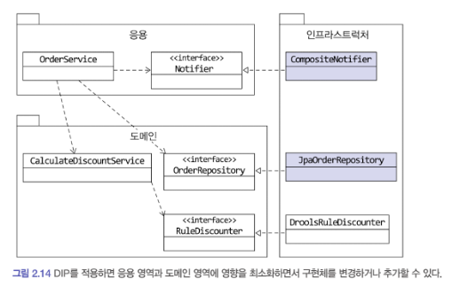 <br>
jpa를 사용한다면 jpaRepository 구현 클래스를 인프라 영역에 추가해서 사용하면 된다 <br>
항상 DIP 를 항상 적용할 필요는 없다.

### 도메인 영역의 주요 구성요소
도메인 영역은 도메인의 핵심 모델을 구현한다, 도메인 영역의 모델은 도메인의 주요 개념을 표현하며 핵심 로직을 구현한다 <br>
1장에서 살펴본 Entity & Value 는  도메인 영역의 주요 구성요소이다. <br>
- Entity: 고유 식별자를 갖는 객체라 자신의 라이플 사이클을 갖는다.
- Value: 고유의 식별자를 갖지 않는 객체로 주로 개념적으로 하나인 값을 표현할 때 사용된다.
- Aggregate: 연관된 엔티티와 밸류 객체를 개념적으로 하나로 묶은 것이다.
- Repository: 도메인 모델의 영속성을 처리한다.
- Domain Service: 특정 엔티티에 속하지 않는 도메인 로직을 제공한다.

#### Entity & Value
도메인 모델의 Entity 와 DB 모델의 Entity 를 같은 것이라고 착각하면 안된다 <br>
이 두 모델의 가장 큰 차이점은 도메인 모델의 엔티티는 데이터와 함께 도메인 기능을 함께 제공한다는 점이다 <br>
ex) 주문을 표현하는 엔티티는 주문과 관련된 데이터 뿐만 아니라 배송지 주소 변경을 위한 기능을 함께 제공한다 <br>
```java
public class Order {
	// 주문 도메인 모델의 데이터
    private OrderNo number;
	private Orderer orderer;
	private ShippingInfo shippingInfo;
	
	// 도메인 모델 엔티티는 도메인 기능도 함께 제공
    public void changeShippingInfo(ShippingInfo newShippingInfo) {
		// 로직
    }
}
```

도메인 모델의 엔티티는 단순히 데이터를 담고 있는 데이터 구조라기보다는 데이터와 함께 기능을 제공하는 객체이다 <br>
도메인 관점에서 기능을 구현하고 기능 구현을 캡슐화해서 데이터가 임의로 변경되는 것을 막는다 <br>
또 다른 차이점은 도메인 모델의 엔티티는 두 개 이상의 데이터가 개념적으로 하나인 경우 밸류 타입을 이용해서 표현할 수 있다는 것이다 <br>
```java
public class Orderer {
	private String name;
	private String email;
}
```

RDBMS 와 같은 관계형 데이터베이스는 밸류 타입을 제대로 표현하기 어렵다<br>
Value 는 Immutable 으로 구현할 것을 권장하며, 이는 엔티티의 Value 타입 데이터를 변경할 때는 객체 자체를 완전히 교체한다는 것을 의미한다 <br>

#### 애그리거트 Aggregate
도메인이 커질수록 개발할 도메인 모델도 커지면서 많은 엔티티와 밸류가 출현한다 <br>
Entity 와 Value 개수가 많아질수록 모델은 점점 복잡해진다 <br>
도메인 모델에서 전체적인 구조를 이해하는데 도움이 되는 것이 바로 애그리거트 이다 <br>
애그리거트의 대표적인 예가 주문이다 -> 관련 객체를 하나로 묶은 군집 <br>
ex) 주문 - 배송지정보, 주문자, 주문목록, 총 결제 금액 등 하위 모델로 구성 <br>
에그리거트를 구현할 때는 고려할 것이 많다. 애그리거트를 어떻게 구성했느냐에 따라 구현이 복잡해지기도 하고, 트랜잭션 범위가 달라지기도 한다 <br>

#### 레포지토리
도메인 객체를 지속적으로 사용하려면 물리적인 저장소에 도메인 객체를 보관해야 한다.<br>
엔티티나 밸류가 요구사항에서 도출되는 도메인이라면, 레포지토리는 구현을 위한 도메인 모델이다<br>
레포지토리는 애그리거트 단위로 도메인 객체를 저장하고 조회하는 기능을 정의한다 <br>
```java
public interface OrderRepository {
	Order findByNumber(OrderNumber orderNumber);
	void save(Order order);
	void delete(Order order);
}
```

도메인 모델 관점에서 OrderRepository 는 도메인 객체를 영속화 하는데 필요한 기능을 추상화 한것으로 고수준 모듈에 속한다 <br>
OrderRepository 를 구현한 클래스는 저수준 모듈로 인프라 영역에 속한다 <br>
레포지토리 인터페이스는 도메인 모델 영역에 속하며, 실제 구현 클래스는 인프라 영역에 속한다 <br>

### 요청 처리 흐름
사용자 입장에서 봤을 땐 웹 어플리케이션이나 데스크톱 어플리케이션이나 같은 소프트웨어 기능을 제공한다 <br>
사용자가 어플리케이션에 기능 실행을 요청하면 그 요청을 처음받는 영역은 **표현** 영역이다 <br>
스프링MVC 를 사용해서 웹 어플리케이션을 구현했다면 Controller 가 사용자의 요청을 받아 처리하게 된다 <br>
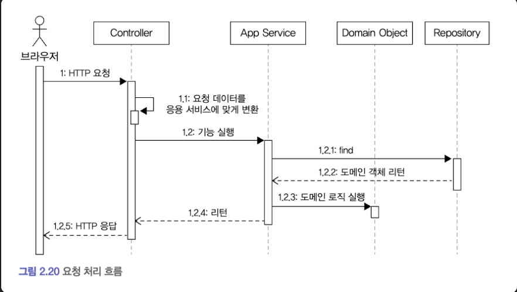 <br>
표현 영역은 사용자가 전송한 데이터 형식이 올바른지 검사하고 문제가 없다면 데이터를 이용해서 응용 서비스에 기능 실행을 위임한다 <br>
이때 표현 영역은 Converting 을 통해서 서비스가 요구하는 형식으로 변환해서 전달한다 <br>
도메인의 상태를 변경하는 것은 물리 저장소에 올바르게 반영되도록 트랜잭션을 관리해야 한다 <br>
스프링 프레임워크에서는 @Transactional 어노테이션을 이용해서 트랜잭션을 처리한다.
```java
public class CancelOrderService {
	private OrderRepository orderRepository;
	
	@Transactional
    public void cancel(OrderNumber n) {
		Order order = orderRepository.findByNumber(n);
		if(order==null)
			throw new IllegalArgumentException("number null");
		order.cancel();
    }
}
```

### 인프라스트럭쳐 개요
인프라 영역은 표현, 응용, 도메인 영역을 지원한다. <br>
도메인 객체의 영속성 처리, 트랜잭션, SMTP, REST 등 다른 영역에서 필요로 하는 프레임워크, 구현 기술, 보조 기능을 지원한다 <br>
도메인영역과 응용영역에서 인프라의 기능을 직접 사용하는 것보다 이 두 영역에 정의한 인터페이스를 인프라 영역에서 구현하는 것이 시스템을 더 유연하고 테스트 하기 쉽게 만들어준다 <br>
하지만 무조건 인프라 영역에 대한 의존을 없앨 필요는 없다 <br>
구현의 편리함은 DIP 가 주는 다른 장점(변경유연함,테스트 쉬움) 만큼 중요하기 때문에 DIP 의 장점을 해치치 않는 범위에서 응용, 도메인 영역에서 구현 기술에 대한 의존을 가져가는 것이 나쁘지 않다고 생각한다 <br>
응용,도메인 영역이 인프라에 대한 의존을 완전히 갖지 않도록 시도하는 것은 자칫 구현을 더 복잡하고 어렵게 만들 수 있다 <br>
표현 영역은 항상 인프라 영역과 쌍을 이룬다. 스프링 MVC 를 사용해서 웹 요청을 처리하면 스프링이 제공하는 MVC 프레임워크에 맞게 표현 영역을 구현해야 한다 

### 모듈 구성
아키텍쳐의 각 영역은 별도 패키지에 위치한다 <br>
패키지 구성 규칙에 정답이 존재하지 않는다.
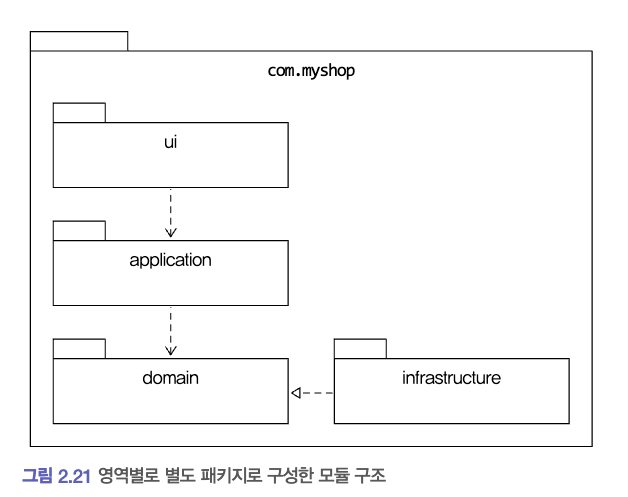 <br>
도메인이 크면 아래 사진 처럼 분리하여 패키지를 구성한다.<br>
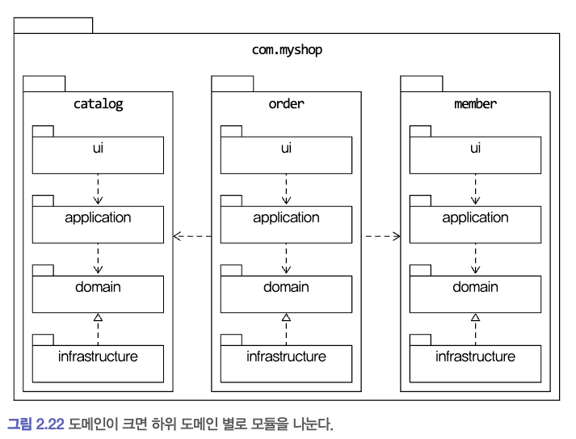<br>
도메인 모듈은 도메인에 속한 애그리거트를 기준으로 다시 패키지를 구성한다 <br>
예를 들어 카탈로그 하위 도메인에 상품 애그리거트, 카테고리 애그리거트가 있을 경우 아래 사진처럼 패키지를 구성할 수 있다 <br>
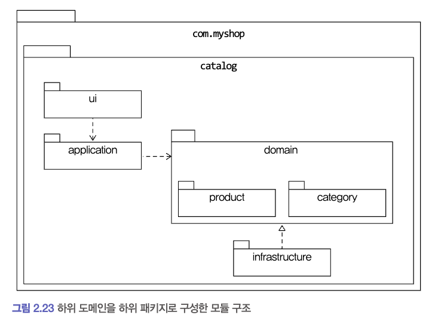<br>
애그리거트, 모델, 레포지토리는 같은 패키지에 위치시킨다 <br>
도메인이 복잡하면 도메인 모델과 도메인 서비스를 별도 패키지에 위치시킬 수도 있다.<br>
- com.myshop.order.domain.order: 애그리거트 위치
- com.myshop.order.domain.service: 도메인 서비스 위치

응용 서비스 도 도메인 별로 패키지를 구분할 수 있다. <br>
- com.myshop.catalog.domain.product
- com.myshop.catalog.domain.category

모듈 구조를 얼마나 세분화 해야하는지에 대한 정해진 규칙은 없다 <br>
조용호님 개인적으로는 한 패키지에 10~15개 사이로 유지하려고 한다. 만약 15개 오버가 되면 분리하려고 시도를 해본다 <br>

## 애그리거트
### 애그리거트
상위 수준 개념을 이용해서 전체 모델을 정리하는 전반적인 관계를 이해하는데 도움이 된다 <br>
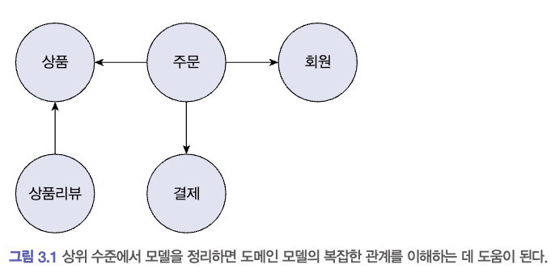<br>
위 사진이 아닌 개별 객체로 수준에서 모델을 바라보면 상위 수준에서 관계를 파악하기 어렵다 <br>

주요 도메인 요소 간의 관계를 파악하기 어렵다는 것은 코드를 변경하고 확장하는 것이 어려워 진다는 것을 의미한다 <br>
복잡한 도메인을 이해하고 관리하기 쉬운 단위로 만들려면 상위 수준에서 모델을 조망할 수 있는 방법이 필요한데, 그게 바로 애그리거트 이다 <br>
애그리거트는 관련된 객체를 하나의 군으로 묶어준다 <br>
수 많은 객체를 애그리거트로 묶어서 바라보면 상위 수준에서 도메인 모델 간의 관계를 파악할 수 있다 <br>
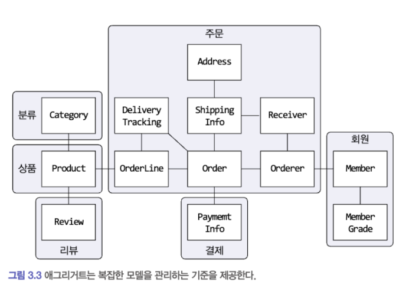<br>
위 사진이 모델 간의 관계를 모델 수준과 상위 수준에서 모두 이해할 수 있게 애그리거트로 분리한 다이어그램이다 <br>
애그리거트 단위로 일관성을 관리하기 때문에 애그리거트는 복잡한 도메인을 단순한 구조로 만들어준다 <br>
복잡도가 낮아지는 만큼 도메인 기능을 확장하고 변경하는데 필요한 노력도 줄어든다 <br>
애그리거트에 속한 구성 요소는 대부분 함께 생성하고 함께 제거한다 <br>
위 그림처럼 애그리거트는 경계를 갖는다 즉 한 애그리거트에 속한 객체는 다른 애그리거트에 속하지 않는다 <br>
경계를 설정할 때 기본이 되는 것은 도메인 규칙과 요구사항이다 <br>
도메인 규칙에 따라 함께 생성되는 구성요소는 한 애그리거트에 속할 가능성이 높다 <br>

### 애그리거트 루트
주문 애거리그트는 아래를 포함한다.
- 총 금액인 totalAmounts 를 갖고 있는 Order 엔티티
- 개별 구매 상품의 개수인 quantity 와 금액인 price 를 갖는 OrderLine 밸류

구매할 상품의 개수를 변경하면 한 OrderLine 의 quantity 를 변경하고 더불어 Order 의 totalAmounts 도 변경해야 한다 <br>
그렇지 않으면 도메인 규칙을 어기고 데이터 일관성이 깨진다 <br>
- 주문 총 금액 : 상품 주문 개수 * 가격 의 합이다 <br>

애그리거트는 여러 객체로 구성되기 때문에 한 객체만 상태가 정상이면 안된다 <br>
도메인 규칙을 지키려면 애그리거트에 속한 모든 객체가 정상 상태를 가져야 한다 <br>
애그리거트에 속한 모든 객체가 일관된 상태를 유지하려면 애그리거트 전체를 관리할, 애그리거트 루트 엔티티가 필요하다 <br>
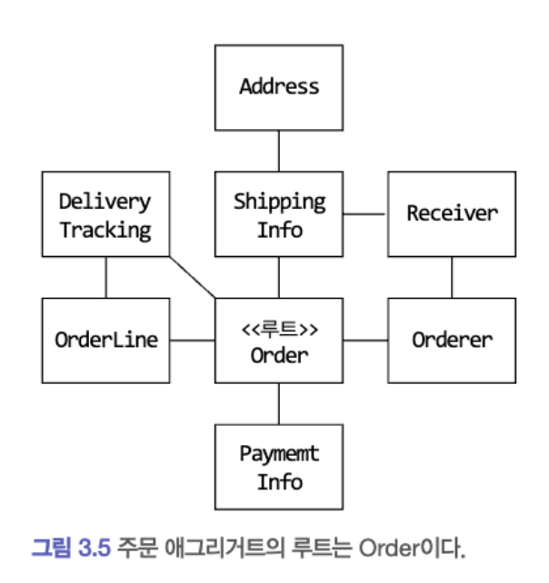<br>
주문 애그리거트에서 루트 역할을 하는 엔티티는 Order 이다, 나머지는 Order 에 간접적 또는 직접적으로 속한다<br>

#### 도메인 규칙과 일관성
애그리거트 루트의 핵심 역할은 애그리거트의 일관성이 깨지지 않도록 하는 것이다 <br>
이를 위해 애그리거트 루트는 애그리거트가 제공해야 할 도메인 기능을 구현한다 <br>
```java
public class Order {
	// 애그리거트 루트는 도메인 규칙을 구현한 기능을 제공한다
    public void changeShippingInfo(ShippingInfo newShippingInfo) {
		verifyNotYetShipped();
		setShippingInfo(newShippingInfo);
    }
	
	private void verifyNotYetShipped() {
		// 검증 구현 로직
    }
}
```

애그리거트 외부에서 애그리거트에 속한 객체를 직접 변경하면 안된다. <br>
이것은 애그리거트 루트가 강제하는 규칙을 적용할 수 없어 모델의 일관성을 깨는 원인이 된다 <br>
```java
ShippingInfo si = order.getShippingInfo();
si.setAddress(newAddress);
```

DB 데이터를 직접 수정을 하는 코드이다. 즉 논리적인 데이터 일관성이 깨지게 되는 것이다. <br>
불필요한 중복을 피하고 애그리거트 루트를 통해서만 도메인 로직을 구현하게 만들려면 도메인 모델에 대해 다음으 두가지를 적용해야 한다 
- 단순히 필드를 변경하는 set 메소드를 public 범위로 만들지 않는다.
- 밸류 타입은 불변으로 구현한다.

보통 set 메소드는 필드에 값을 할당하는 것으로 끝나느 경우가 많다, 잘해야 null 체크 정도 이다
```java
public void setName(String name) {
	this.name = name;
}
```

public set 메소드는 도메인 로직을 응용, 표현 영역으로 분산시킨다. <br>
도메인 로직이 한 곳에 응집되지 않으므로 코드를 유지 보수할 때에도 분석하고 수정하는데 더 많은 시간이 필요하다 <br>
공개 set 메소드를 만들지 않는 것의 연장으로 Value 는 불변 타입으로 구현한다 <br>
애그리거트 외부에서 내부 상태를 함부로 바꾸지 못하므로 애그리거트의 일관성이 깨질 가능성이 줄어든다 <br>
Value 객체가 불변이면 Value 객체의 값을 변경하는 방법은 새로운 Value 객체를 할당하는 것 뿐이다 <br>
즉 다음과 같이 애그리거트 루트가 제공하는 메소드에 새로운 Value 객체를 전달해서 값을 변경하는 방법 밖에 없다.
```java
public class Order {
	private ShppingInfo shppingInfo;
	
	public void changeShippingInfo(Shippinginfo newShippingInfo) {
		verifyNotYetShipped();
		setShippingInfo(newShippingInfo);
    }
	
	private void setShippingInfo(ShippingInfo newShippingInfo) { // set 메소드의 접근 허용 범위는 private 이다. 이 클래스에서만 접근 가능
		this.shppingInfo = newShippingInfo; // 밸류가 불변이면 새로운 객체 할당해서 값 변경
    }
}
```

위 코드처럼 밸류 타입의 내부 상태를 변경하려 애그리거트 루트를 통해서만 가능하다 <br>

#### 애그리거트 루트의 기능 구현
애그리거트 루트는 애그리거트 내부의 다른 객체를 조합해서 기능을 완성한다 <br>
예를 들어 Order 는 총 주문 금액을 구하기 위해 OrderLine 목록을 사용한다.
```java
public class Order {
	private Money totalAmounts;
	private List<OrderLine> orderLines;
	
	private void calculateTotalAmount() {
		int sum = orderLines.stream()
            .mapToInt(ol -> ol.getPrice() * ol.getQuantity())
            .sum();
		this.totalAmounts = new Money(sum);
    }
}

public class Member {
	private Password password;
	
	public void changePassword(String currentPassword, String newPassword) {
		if(!password.match(currentPassword)) 
			throw new IllegalArgumentException();
		
		this.password = new Password(newPassword);
    }
}
```

애그리거트 루트가 구성요소의 상태만 참조하는 것은 아니다. 기능 실행을 위임하기도 한다 <br>
```java
public class OrderLine {
	private List<OrderLine> lines;
	
	public Money getTotalAmounts() {
		// 구현
    }
	public void changeOrderLines(List<OrderLine> newLines) {
		this.lines = newLines;
    }
}
```

#### 트랜잭션의 범위
트랜잭션의 범위는 작을수록 좋다, 한 트랜잭션이 한 개 테이블을 수정하는 것과 세 개의 테이블을 수정하는 것을 비교하면 성능에서 차이가 발생한다 <br>
한 개 테이블을 수정하면 트랜잭션 충돌을 막기 위해 잠그는 대상이 한 개 테이블의 한 행으로 한정되지만, 세 개의 테이블을 수정하면 잠금 대상이 더 많아진다 <br>
잠금 대상이 많아진다는 것은 그만큼 동시에 처리할 수 있는 트랜잭션 개수가 줄어든 다는 것을 의미하고, 이것은 전체적인 성능(처리량) 을 떨어뜨린다 <br>
동일하게 한 트랜잭션에서는 한 개의 애그리거트만 수정해야 한다 <br>
한 트랜잭션에서 두 개 이상의 애그리거트를 수정하면 트랜잭션 충돌이 발생할 가능성이 더 높아진다 <br>
그러므로 한 번에 수정하는 애그리거트 개수가 많아질수록 전체 처리량이 떨어지게 된다 <br>
한 트랜잭션에서 한 애그리거트만 수정한다는 것은 애그리거트에서 다른 애그리거트를 변경하지 않는 다는 것을 의미한다 <br>

결합도가 높아지면 높아질수록 향후 수정 비용이 증가하므로 애그리거트에서 다른 애그리거트의 상태를 변경하지 말아야 한다 <br>
만약 부득이하게 한 트랜잭션으로 두 개 이상의 애그리거트를 수정해야 한다면 애그리거트에서 다른 애그리거트를 직접 수정하지 말고 응용 서비스에서 두 애그리거트를 수정하도록 구현한다 <br>
```java
public class ChangeOrderService {
	// 두 개 이상 애그리거트를 변경해야함
    // 응용 서비스에서 각 애그리거트의 상태를 변경한다.
    @Transactional
    public void changeShippingInfo(OrderId id, ShippingInfo newShippingInfo, boolean useNewShippingAddrAsMemberAddr) {
		Order order = orderRepository.findById(id);
		if(order==null)
			throw new IllegalArgumentException();
		order.shipTo(newShippingInfo);
		if(useNewShippingAddrAsMemberAddr) {
			Member member = findMember(order.getOrderer());
			member.changeAddress(newShippingInfo.getAddress());
		}
    }
}
```

도메인 이벤트를 사용하면 한 트랜잭션에서 한 개의 애그리거트를 수정하면서도 동기나 비동기로 다른 애그리거트의 상태를 변경하는 코드를 작성할 수 있다 <br>

### 레포지토리와 애그리거트
애그리거트는 개념상 완전히 한 개의 도메인 모델을 표형하므로 객체의 영속성을 처리하는 레포지토리는 애그리거트 단위로 존재한다 <br>
Order 와 OrderLine 을 물리적으로 다른 테이블에 저장한다고 해서 Order, OrderLine 레포지토리를 각각 만들지 않는다 Order만 만든다.<br>
새로운 애그리거트를 만들면 저장ㅈ소에 애그리거트를 영속화하고 애그리거트를 사용하려면 저장소에서 애그리거트를 읽어야 하므로, 레포지토리는 save, findById 메소드를 기본적으로 사용한다 <br>

어떤 기술을 이용해서 레포지토리를 구현하느냐에 따라 애그리거트의 구현도 영향을 받는다 <br>
ORM 기술 중 하나인 JPA 를 사용하면 RDBMS 과 맞춰야 할 때도 있다 <br>
특히 레거시 DB 를 사용하거나 팀 내 DB 설계 표준을 따라야 한다면 DB 테이블 구조에 맞게 모델을 변경해야 한다 <br>
애그리거트는 개념적으로 하나이므로 레포지토리는 애그리거트 전체를 저장소에 영속화해야 한다 <br>
Order 애그리거트와 관련된 테이블이 세 개라면 Order 애그리거트를 저장할 때 애그리거트 루트와 매핑되는 테이블 뿐 아니라 애그리거트에 속한 모든 구성요소에 매핑된 테이블에 데이터를 저장해야 한다 
```java
orderRepository.save(order);
```

동일하게 애그리거트를 구하는 레포지토리 메소드는 완전한 애그리거트를 제공해야 한다 <br>
```java
Order order = orderRepository.findById(orderId); // 레포지토리는 완전한 order 를 제공해야 한다.
```

레포지토리가 완전한 애그리거트를 제공하지 않으면 필드나 값이 올바르지 않아 애그리거트의 기능을 실행하는 도중에 NPE 와 같은 문제가 발생할 수 있다 <br>
애그리거트에서 두 개의 객체를 변경했는데 저장소에는 한 객체에 대한 변경만 반영되면 데이터 일관성이 깨지므로 문제가 된다 <br>
RDBMS 를 이용해서 레포지토리를 구현하면 트랜잭션을 이용해서 애그리거트의 변경이 저장소에 반영되는 것을 보장할 수 있다 <br>
몽고 DB 를 사용하면 한 개 애그리거트를 한 개 문서에 저장함으로써 한 애그리거트의 변경을 손실 없이 저장소에 반영할 수 있다 <br>

### ID 를 이용한 애그리거트 참조
한 객체가 다른 객체를 참조하는 것처럼 애그리거트도 다른 애그리거트를 참조한다 <br>
애그리거트 관리 주체는 애그리거트 루트이므로 애그리거트에서 다른 애그리거트를 참조한다는 것은 다른 애그리거트의 루트를 참조한다는 것 과 같다 <br>
애그리거트 간의 참조는 필드를 통해 쉽게 구현할 수 있다.<br>
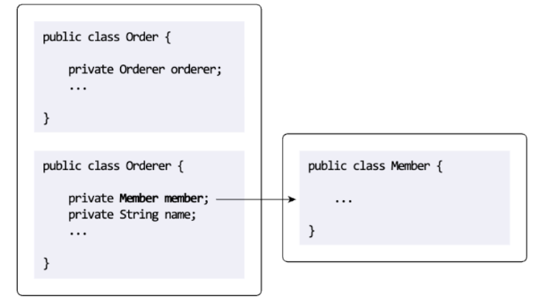<br>
필드를 이용해서 다른 애그리거트를 직접 참조하는것은 개발자에게 구현의 편리함을 제공한다 <br>
예를 들어 주문 정보 조회 화면에서 회원 ID 를 이용해 링크를 제공해야 할 경우 아래처럼 코드를 작성할 수 있다.
```java
order.getOrder().getMember().getId();
```

JPA 는 @ManyToOne, @OneToOne 등 어노테이션을 이용해서 연관된 객체를 로딩하는 기능을 제공하고 있으므로 필드를 이용해 다른 애그리거트를 쉽게 참조할 수 있다 <br>
ORM 기술 덕에 애그리거트 루트에 대한 참조를 쉽게 구현하고(또는 get 메소드) 를 이용한 애그리거트 참조를 사용하면 다른 애그리거트의 데이터를 쉽게 조회할 수 있다<br>
하지만 필드를 이용한 애그리거트 참조는 다음 문제를 야기할 수 있다.
1) 편한 탐색 오용
2) 성능에 대한 고민
3) 확장 어려움

**즉 편한 탐색으로 다른 애그리거트 객체에 접근하여 상태를 쉽게 변경할 수 있게 된다** <br>
트랜잭션 범위에서 언급한 것처럼 한 애그리거트가 관리하는 범위는 자기 자신으로 한정해야 한다 <br>
한 애그리거트에서 다른 애그리거트의 상태를 변경하는 것은 애그리거트 간의 의존 결합도를 높여서 결과적으로 애그리거트의 변경을 어렵게 만든다 <br>

**두 번째 문제는 애그리거트를 직접 참조하면 성능과 관련된 고민을 해야한다는 것이다** <br>
JPA 를 사용하면 참조한 객체를 LAZY 로딩과 EAGER 로딩 의 두가지 방식으로 로딩할 수 있다 <br>
두 로딩방식은 애그리거트의 어떤 기능을 사용하느냐에 따라 달라진다 <br>
단순히 연관된 객체의 데이터를 함께 화면에 보여줘야 하면 EAGER(=즉시) 로딩이 조회 성능에 유리하지만 <br>
애그리거트의 상태를 변경하는 기능을 실행하는 경우에는 불필요 객체를 로딩할 필요 없으므로 LAZY(=지연) 로딩이 유리하다 <br>
이런 다양한 경우의 수를 고려해서 연관매핑과 JPQL/Criteria 쿼리의 로딩 전략을 결정해야 한다.<br>

**세 번째 문제는 확장이다 <br>**
초기에는 단일 서버에 단일 DBMS 로 서비스를 제공한다 <br>
사용자가 몰리기 시작하면, 트래픽이 증가하면서 자연스럽게 부하를 분산하기 위해 하위 도메인 별로 시스템을 분리하기 시작한다 <br>

위 세가지 문제를 완화할 때 사용할 수 있는 것이 ID를 이용해서 다른 애그리거트를 참조하는 것이다 <br>

DB 테이블에서 외래키로 참조하는 것과 비슷하게 ID 를 이용한 참조는 다른 애그리거트를 참조할 때 ID 를 사용한다 <br>
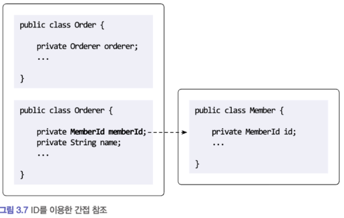<br>

#### ID를 이용한 참조와 조회 성능
다른 애거리그트를 ID로 참조하면 참조하는 애그리거트를 읽을 때 조회속도가 문제될 수 있다 <br>
예를 들어 주문 목록을 보여주려면 상품 애그리거트와 회원 애그리거트를 함께 읽어야 한다 <br>
이를 처리할 때 다음과 같이 각 주문마다 상품과 회원 애그리거트를 읽어온다고 해보자. <br>
한 DBMS 에 데이터가 있다면 조인을 이용해서 한번에 모든 데이터를 가져올 수 있음에도 불구하고 주문마다 상품 정보를 읽어오는 쿼리를 실행한다.
```java
Member member = memberRepository.findById(orderId);
List<Order> orders = orderRepository.findByOrderer(ordererId);
List<OrderView> dtos = orders.stream()
    .map(order -> {
		ProductId prodId = order.getOrderLines().get(0).getProductId();
		// 각 주문마다 첫 번째 주문 상품 정보 로딩 위한 쿼리 실행
        Product product = productRepository.findById(prodId);
		return new OrderView(order, member, product);
    }).toList();
```

위 코드는 주문개수가 10개면 주문을 읽어오기 위한 1번의 쿼리와 주문별로 각 상품을 읽어오기 위한 10번의 쿼리를 실행한다 <br>
조회 대상이 N개 일때 N개를 읽어오는 한 번의 쿼리와 연관된 데이터를 읽어오는 쿼리를 N번 실행한다 해서 이를 N+1 조회 문제라고 부른다 <br>
ID를 이용한 애그리거트 참조는 지연 로딩과 같은 효과를 만드는데 지연로딩과 관련된 대표적인 문제가 N+1 조회 문제이다 <br>

N+1 조회 문제는 더 많은 쿼리를 실행하기 때문에 전체 조회 속도가 느려지는 원인이 된다 <br>
이 문제가 발생하지 않도록 하려면 조인을 사용해야 한다 <br>
조인을 사용하는 가장 쉬운 방법은 ID 참조 방식을 객체 참조방식으로 바꾸고 즉시 로딩을 사용하도록 매핑 설정을 바꾸는 것이다 <br>
하지만 이 방식은 애그리거트간 참조를 ID 참조 에서 객체 참조 방식으로 바꾸라는 것이다.

ID 참조 방식을 사용하면서 N+1 조와 같은 문제가 발생하지 않도록 하려면 조회 전용 쿼리를 사용하면 된다 <br>
예를 들어 데이터 조회를 위한 별도 DAO 를 만들고 DAO 의 조회 메소드에서 조인을 이용해 한 번의 쿼리로 필요한 데이터를 로딩하면 된다 <br>
```java
@Repository
public class JpaOrderViewDao implements OrderViewDao {
	@PersistenceContext
    private EntityManager em;
	
	@Override
    public List<OrderView> selectByOrders(String orderId) {
		String selectQuery = "쿼리문";
		TypedQuery<OrderView> query = em.createQuery(selectQuery, OrderView.class);
		query.setParameter("orderId",orderId);
		return query.getResultList();
    }
}
```

위 코드는 JPA를 이용해서 특정 사용자의 주문 내역을 보여주기 위한 코드이다 <br>
이 코드는 JPQL 을 사용하는데 이 JPQL 은 Order 애그리거트와 Member 애그리거트 그리고 Product 로딩 전략을 고민할 필요 없이 조회 화면에서 <br>
필요한 애그리거트 데이터를 한 번의 쿼리로 로딩할 수 있다. <br>
쿼리가 복잡하거나 SQL에 특화된 기능을 사용해ㅑㅇ 한다면 조회를 위한 부분만 마이바티스와 같은 기술을 이용해서 구현할 수도 있다 <br>
애그리거트마다 서로 다른 저장소를 사용하면 한 번의 쿼리로 관련 애그리거트를 조회할 수 없다 <br>
이때는 조회 성능을 높이기 위해 캐시를 적용하거나 조회 전용 저장소를 따로 구성한다 <br>
이 방법은 코드가 복잡해지는 단점이 있지만 시스템의 처리량을 높일 수 있다는 장점이 있다 <br>
특히 한 대의 DB 장비로 대응할 수 없는 수준의 트래픽이 발생하는 경우 캐시나 조회 전용 저장소는 필수로 선택해야 하는 기법이다 <br>

### 애그리거트 간 집합 연관
애그리거트: 도메인객체를 의미 <br>
밸류: 객체안에 있는 필드 ex) Member member, (String id; 이런건 아님) <br>
애그리거트 간 1-N 과 M-N 연관에 대해 알아보자 <br>
이 두 연관은 컬렉션을 이용한 연관이다, 카테고리와 상품 간의 연관이 대표적이다 <br>
카테고리 입장에서 한 카테고리에 한 개 이상의 상품이 속할 수 있으니 카테고리와 상품은 1-N 관계이다 <br>
한 상품이 한 카테고리에만 속할 수 있다면 상품과 카테고리 관계는 N:1 관계이다 <br>
애그리거트간 1-N 관계는 Set 컬렉션으로 표현할 수 있다
```java
public class Category {
	private Set<Product> productSet; // 다른 애그리거트에 대한 1-N 연관 -> 즉 Product 는 1개라는 뜻
}
```

하지만 개념적으로 존재하는 애그리거트 간의 1:N 연관을 실제 구현에 반영하는 것이 요구사항을 충족하는 것과는 상관없을 때가 있다 <br>
보통 목록 관련 요구사항은 한 번에 전체 상품을 보여주기보다는 페이징을 이용해 제품을 나눠서 보여준다 <br>
이 기능을 카테고리 입장에서 1-N 연관을 이용해 구현하면 다음과 같은 방식으로 코드를 작성해야 한다
```java
public class Category {
	private Set<Product> products;
	
	public List<Product> getProducts(int page, int size) {
		 List<Product> sortedProducts = sortById(products);
		 return sortedProducts.subList((page-1)*size, page*size);
    }
}
```

이 코드를 실제 DBMS 와 연동해서 구현하면 Category 에 속한 모든 Product 를 조회하게 된다 <br>
Product 개수가 수만 개 정도로 많다면 이 코드를 실행할 때마다 실행속도가 느려져 성능상 치명적이다 <br>

개념적으로 애그리거트 간에 1:N 연관이 있더라도 이런 성능 문제 때문에 애그리거트 간의 1:N 연관을 실제 구현에 반영하지 않는다.<br>

카테고리에 속한 상품을 구할 필요가 있다면 상품 입장에서 자신이 속한 카테고리를 N:1로 연관지어 구하면 된다<br>
이를 구현 모델에 반영하면 Product 에 다음과 같이 Category 로의 연관을 추가하고 그 연관을 이용해서 특정 Category 에 속한 Product 목록을 구하면 된다 <br>
```java
public class Product {
	private CategoryId categoryId;
}
```

카텔고리에 속한 상품 목록을 제공하는 응용 서비스는 다음과 같이 ProductRepository 를 이용해서 categoryId 가 지정한 카테고리 식별자인 Product 목록을 구한다.
```java
public class ProductListService {
	public Page<Product> getProductOfCategory(Long categoryId, int page, int size) {
		Category category = categoryRepository.findById(categoryId);
		checkCategory(category);
		List<Product> products = productRepository.findByCategoryId(category.getId(), page, size);
		int totalCount = productRepository.countsByCategoryId(category.getId());
		return new Page(page,size,totalCount,products);
    }
}
```

M:N 연관은 개념적으로 양쪽 애그리거트에 컬렉션으로 연관을 만든다. 상품이 여러 카테고리에 속할 수 있다고 가정하면 카테고리와 상품은 M:N(=다대다) 연관을 맺는다. <br>
보통 특정 카테고리에 속한 상품목록을 보여줄 때 목록 화면에서 각 상품이 속한 모든 카테고리를 상품 정보에 표시하지 않는다 <br>
제품이 속한 모든 카테고리가 필요한 화면은 상품 상세화면이다 <br>
즉 개념적으로는 상품과 카테고리의 양방향 M:N 연관이 존재하지만, 실제 구현에서는 상품에서 카테고리로의 단방향 M:N 연관만 적용하면 되는 것이다 <br>
```java
public class Product {
	private Set<CategoryId> categoryIds;
}
```

RDBMS 를 이용해서 M:N 연관을 구현하려면 조인 테이블을 사용해야 한다 <br>
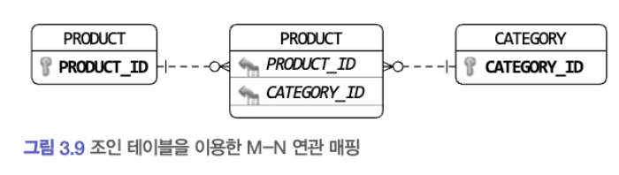<br>
JPA 를 이용하면 다음과 같은 매핑 설정을 사용해서 ID 참조를 이용한 M:N 단방향 연관을 구현할 수 있다 <br>
```java
@Entity(name="product")
public class Product {
	@EmbeddedId
    private ProductId id;
	
	@ElementCollection
    @CollectionTable(name="product_category", joincolumns= @Joincolumn(name="product_id"))
    private Set<CategoryId> categoryIds;
}
```

이 매핑은 카테고리 ID 목록을 보관하기 위해 Value 타입에 대한 컬렉션 매핑을 이용했다 <br>
이 매핑을 사용하면 다음과 같이 JPQL 의 members of 연산자를 이용해서 특정 Category 에 속한 Product 목록을 구하는 기능을 구현할 수 있다
```java
@Repository
public class JpaProductRepository implements ProductRepository {
	@PersistenceContext
    private EntityManager entityManager;
	
	@Override
    public List<Product> findByCategoryId(CategoryId catId, int page, int size) {
		TypedQuery<Product> query = entityManager.createQuery(
			"select p from Product p " +
                "where :catId member of p.categoryIds order by p.id.id desc",
            Prodcut.class);
		query.setParameter("catId",catId);
		query.setFirstResult((page-1)*size);
		query.setMaxResults(size);
		return query.getResultList();
    }
}
```

위 코드에서 ":catId member of p.categoryIds" 는 categoryIds 컬렉션에 catId 로 지정한 값이 존재하는지를 검사하기 위한 검색 조건이다 <br>

### 애그리거트를 팩토리로 사용하기
고객이 특정 상점을 여러 차례 신고해서 해당 상점이 더 이상 물건을 등록하지 못한다면? <br>
상품 등록 기능을 구현할 응용 서비스는 다음과 같이 상점 계정이 차단 상태가 아닌 경우에만 상품을 생성하도록 구현할 수 있을 것이다 <br>
```java
public class RegisterProductService {
	public ProductId registerNewProduct(NewProductReqeust req) {
		Store store = storeRepository.findById(req.getStoreId());
		checkNull(store);
		
		if(store.isBlocked()) 
			throw new StoreBlockedException();
		
		
    }
}
```

위 코드는 나쁘지는 않지만, 중요한 도메인 로직 처리가 응용 서비스에 노출되었다 <br>
Store 가 Product 를 생성할 수 있는지를 판단하고 Product 를 생성하는 것은 논리적으로 하나의 도메인 기능인데 이 도메인 기능을 응용 서비스에서 구현하고 있는 것이다 <br>
이 도메인 기능을 넣기 위한 별도의 도메인 서비스나 팩토리 클래스를 만들 수도 있지만 이 기능을 Store 애그리거트에 구현할 수도 있다 <br>
```java
public class Store {
	public Product createProduct(ProductId newProductId, ...) {
		if (isBlocked()) throw new StoreBlockedException();
		return new Product(newProductId, getId(), ...);
    }
}
```

## 레포지토리와 모델구현

### JPA를 이용한 레포지토리 구현
데이터 보관소로 RDBMS 를 사용할 때, 객체 기반의 도메인 모델과 관계형 데이터 모델 간의 매핑을 처리하는 기술로 ORM 만한 것이 없다 <br>
#### 모듈 위치
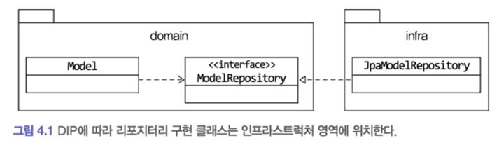<br>
레포지토리 인터페이스는 애그리거트와 같이 도메인 영역에 속하고, 레포지토리를 구현한 클래스는 인프라 영역에 속한다 <br>
가능하면 레포지토리 구현 클래스를 인프라 영역에 위치시켜서 인프라에 대한 의존을 낮춰야 한다 <br>
#### 레포지토리 기본 기능 구현
- ID 로 애그리거트 조회하기
- 애그리거트 저장하기

인터페이스는 애그리거트 루트를 기준으로 작성한다. 주문 애그리거트는 Order 루트 엔티티를 비롯해 여러 객체를 포함한다 <br>
이 구성요소 중에서 루트 엔티티인 Order 를 기준으로 레포지토리 인터페이스를 작성한다 <br>
일반적으로 애그리거트를 조회하는 네이밍은 findBy프로퍼티이름 으로 한다 <br>
null 을 사용하고 싶지 않다면 Optional 을 사용한다.

ID 가 아닌 다른 조건으로 애그리거트를 조회할 때는 findById 뒤에 조건 대상이 되는 프로퍼티 이름을 붙인다 <br>
```java
public interface OrderRepository {
	List<Order> findByOrderId(String ordererId, int startRow, int size);
}
// 위 findByOrderId 는 1개 이상의 Order 객체를 return 할 수 있으므로 List 사용

// INFO JPQL 구현
@Override
public List<Order> findByOrderId(String ordererId, int startRow, int size) {
	TypedQuery<Order> query = em.createQuery(
		"select o from Order o" +
			"where o.orderer.memberId.id = :ordererId"+
			"order by o.number.number desc", Order.class
	);
	query.setParameter("ordererId",ordererId);
	query.setFirstResult(startRow);
	query.setMaxResults(fetchSize);
	return query.getResultList();
}
```

추가적으로 데이터를 삭제하는 기능도 있는데 <br>
보통 삭제를 요청받으면 바로 삭제하지 않고, 일정 기간 동안 보관을 한다 <br>
즉 UI 에서만 보여주지 않고 실제 데이터를 어느정도 보관을 한다

### 스프링 데이터 JPA 를 이용한 레포지토리 구현
- Optional<Order> findById(OrderNo id); -> null 일 경우 빈 Optional 을 리턴한다.

특정 프로퍼티를 이용해서 엔티티를 조회할 때는 findBy프로퍼티이름 형식의 메소드를 사용한다 <br>
```java
List<Order> findByOrderer(Orderer orderer);
```

중첩 프로퍼티도 가능하다. 이 메소드는 Orderer 객체의 memberId 프로퍼티가 파티라미터와 같은 Order 목록을 조회한다
```java
List<Order>findByOrdererMemberId(MemberId memberId);
```

### 매핑 구현
애그리거트와 JPA 매핑을 위한 기본 규칙은 다음과 같다
- 애그리거트 루트는 엔티티 이므로 @Entity 로 매핑을 한다.

한 테이블에 엔티티와 밸류 데이터가 같이 있다면
- Value 는 @Embeddable 매핑 설정한다.
- Value 타입 프로퍼티는 @Embedded 로 매핑 설정한다.

주문 애거리그트를 예로 들어보자, 주문 애그리거트의 루트 엔티티는 Order 이고, 이 애그리거트에 속한 Orderer, ShippingInfo 는 Value 이다 <br>
이 세 객체와 ShippingInfo 에 포함된 Address, Receiver 객체는 한 테이블에 매핑할 수 있다.<br>
루트 엔티티와 루트 엔티티에 속한 밸류는 한 테이블에 매핑할 때가 많다. <br>
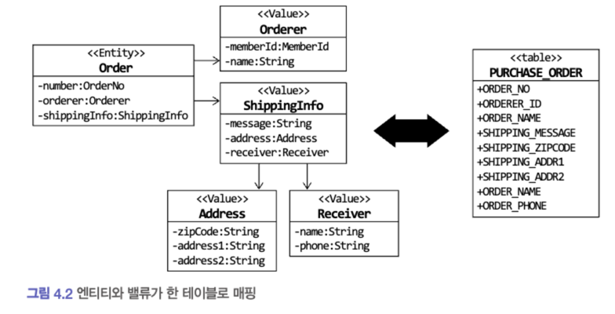<br>
```java
@Entity(name="purchase_order")
public class Order {
	// 
}
```

Order 에 속하는 Orderer 는 Value 이므로 @Embeddable 로 매핑을 한다.
```java
public class Orderer {
	// MemberId 에 정의된 컬럼 이름을 변경하기 위해
    // @AttributeOverride 어노테이션 사용
    @Embedded
    @AttributeOverrides(@AttributeOverride(name="id", column= @Column(name="orderer_id")))
    private MemberId memberId;
	
	@Column(name="orderer_name")
    private String name;    
}
```

Orderer 의 MemberId 는 Member 애그리거트를 ID로 참조한다 <br>
Member 의 ID 타입으로 사용하는 MemberId 는 다음과 같이 id 프로퍼티와 매핑되는 테이블 컬럼이름으로 'member_id' 를 지정하고 있다 <br>

```java
import java.io.Serializable;

@Embeddable
public class MemberId implements Serializable {
	@Column(name="member_id");
	private String id;
}
```

Orderer 의 memberId 프로퍼티와 매핑되는 컬럼 이름은 orderer_id 이므로 MemberId 의 member_id 와 이름이 다르다 <br>
@Embeddable 타입에 설정된 컬럼이름과 실제 컬럼 이름이 다르므로 @AttributeOverrides 어노테이션을 사용해서 매핑할 컬럼 이름을 변경했다 <br>

#### 기본 생성자
엔티티와 밸류의 생성자는 객체를 생성할 때 필요한 것을 전달 받는다 <br>
예를 들어 Receiver 밸류 타입은 생성 시점에 수취인 이름과 연락처를 생성자 파라미터로 전달 받는다 <br>
```java
@AllArgsConstructor
@Getter
@Comment(value = "ShippingInfo 하위 도메인 모델")
public class Receiver {
	public String name;
	public String phoneNumber;
}
```

Receiver 가 불변 타입이면 생성 시점에 필요한 값을 모두 전달받으므로 값을 변경하려는 set 메소드는 필요가 없다 <br>
값을 변경할 필요 없는 객체는 기본 생성자를 추가할 필요가 없다 <br>

하지만 JPA 에서 @Entity 와 @Embeddable 로 클래스를 매핑하려면 기본 생성자를 제공해야 한다 <br>
DB 에서 데이터를 읽어와 매핑된 객체를 생성할 때 기본 생성자를 사용해서 객체를 생성하기 때문이다 <br>
```java
package org.ddd.start.domain.order;

import org.hibernate.annotations.Comment;

import jakarta.persistence.Column;
import jakarta.persistence.Embeddable;
import jakarta.persistence.Embedded;
import lombok.AllArgsConstructor;
import lombok.Getter;
import lombok.NoArgsConstructor;

@Embeddable
@AllArgsConstructor
@Getter
@Comment(value = "ShippingInfo 하위 도메인 모델")
public class Receiver {
	@Column(name="receiver_name")
	public String name;
	@Column(name="receiver_phone")
	public String phoneNumber;

	protected Receiver() {
		// JPA 를 적용하기 위해 기본 생성자 추가
	}

}

```

기본 생성자는 JPA 프로바이더가 객체를 생성할 때만 사용한다<br>
기본 생성자를 다른 코드에서 사용하면 값이 없는 온전치 못한 객체를 만들게 된다<br>
이런 이유로 다른 코드에서 기본 생성자를 사용하지 못하도록 protected 로 선언한다

#### 필드 접근 방식 사용
JPA 는 필드와 메소드의 두 가지 방식으로 매핑을 처리할 수 있다 <br>
메소드 방식을 사용하려면 다음과 같이 프로퍼티를 위한 get/set 메소드를 구현해야 한다
```java
	@Column(name="state")
	@Enumerated(EnumType.STRING)
	private OrderState orderState;

	public OrderState getOrderState () {
		return orderState;
	}

	public void setOrderState (OrderState orderState) {
		this.orderState = orderState;
	}
```

엔티티에 프로퍼티를 위한 공개 get/set 메소드를 추가하면 도메인의 의도가 사라지고 객체가 아닌 데이터 기반으로 엔티티를 구현할 가능성이 높아진다 <br>
엔티티가 객체로써 제 역할을 하려면 외부에 set 메소드 대신에 의도가 잘 드러나는 기는을 제공해야 한다 <br>

객체가 제공할 기능 중심으로 엔티티를 구현하게끔 유도하려면 JPA 매핑 처리를 프로퍼티 방식이 아닌 필드 방식으로 선택해서 <br>
불필요한 get/set 메소드를 구현하지 말아야 한다
```java
@Entity
@Access(AccessType.FIELD)
public class Order {
	@EmbeddedId
    private OrderNo number;

	@Column(name="state")
	@Enumerated(EnumType.STRING)
	private OrderState orderState;
	
	// 필요한 get 메소드만 만들기
    // 도메인 기능 구현하기
}
```

JPA 구현체인 하이버네이트는 @Access 를 이용해서 명시적으로 접근 방식을 지정하지 않으면 <br>
@Id 나 @EmbeddedId 가 어디에 위치했느냐에 따라 접근 방식을 결정한다. <br>

#### AttributeConverter 를 이용한 밸류 매핑 처리
ing,long,String 등 타입은 DB 테이블의 컬럼과 매핑된다 <br>
이와 비슷하게 밸류 타입의 프로퍼티를 한 개 컬럼에 매핑해야 할 때도 있다, 즉 두개 프로퍼티를 한 개컬럼에 매핑하는 것을 의미한다 <br>
두 개 이상의 프로퍼티를 가진 밸류 타입을 한 개 컬럼에 매핑하려면 AttributeConverter 를 사용해야 한다.
```java
public interface AttributeConverter<X,Y> {
	Y convertToDbColumn(X attribute);
	X convertToEntityAttribute(Y dbData);
}

@Converter(autoApply=true)
public class MoneyConverter implements AttributeConverter<Money, Integer> {
	@Override
	public Integer convertToDbColumn(Money money) {
		return money == null ? null : money.getValue();
    }
	@Override
    public Money convertToEntityAttribute(Integer value) {
		return value == null? null : new Money(value);
    }
    
}
```

#### 밸류 컬렉션: 별도 테이블 매핑
Order 엔티티는 한 개 이상의 OrderLine 을 가질 수 있다.
```java
private List<OrderLine> orderLines;
```

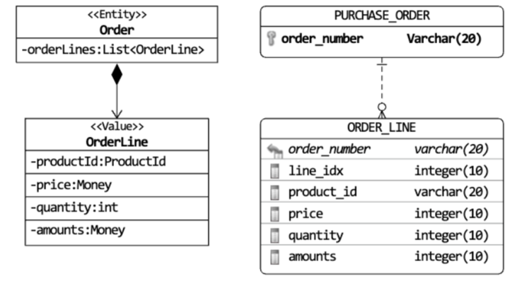<br>
밸류 컬렉션을 별도 테이블로 매핑할 때는 @ElementCollection 과 @CollectionTable 을 함께 사용한다.
```java

```

#### 밸류컬렉션: 한 개 컬럼 매핑
밸류 컬렉션을 별도 테이블이 아닌 한 개 컬럼에 저장해야 할 때가 있다 <br>
예를 들어 도메인 모델에는 이메일 주소 목록을 Set 으로 보관하고 DB에는 한개 컬럼 콤마로 구분해서 저장해야 할 때가 있다 <br>

```java
import java.util.Collections;

public class EmailSet {
	private Set<Email> emails = new HashSet<>();

	public EmailSet (Set<Email> emails) {
		this.emails.addAll(emails);
	}

	public Set<Email> getEmails () {
		return Collections.unmodifiableSet(emails);
	}
}
```

#### 밸류를 이용한 ID 매핑
식별자라는 의미를 부각시키기 위해 식별자 자체를 밸류 타입으로 만들 수 있다 <br>
보통 OrderNo, MemberId 등이 식별자를 표현하기 위해 사용한 밸류 타입이다 <br>
밸류 타입을 식별자로 매핑하면 @Id 대신 @EmbeddableId 어노테이션을 사용한다.

```java
import java.io.Serializable;

@Entity(name = "purchase_order")
public class Order {
	@EmbeddableId
	private OrderNo number;

}

@Embeddable
public class OrderNo implements Serializable {
	@Column(name="order_number")
    private String number;
}
```

JPA 에서 식별자 타입은 Serializable 타입이어야 하므로 식별자로 사용할 밸류 타입은 Serializable 인터페이스를 상속받아야 한다 <br>
Value 타입으로 식별자를 구현할 때 얻을 수 있는 장점은 식별자에 기능을 추가할 수 있다는 점이다 <br>

```java
import java.io.Serializable;

@Embeddable
public class OrderNo implements Serializable {
	@Column(name="order_number")
    private String number;
	
	public boolean is2ndGeneration() {
		return number.startsWith("N");
    }
}
```

시스템 세대 구분이 필요한 코드는 OrderNo 가 제공하는 기능을 이용해서 구분하면 된다.
```java
if(order.getNumber().is2ndGeneration()) {
	// 로직
    }
```

JPA 는 내부적으로 엔티티를 비교할 목적으로 equals() 메소드와 hashcode() 메소드 값을 사용하므로 식별자로 사용할 Value 타입은 이 두 메소드를 알맞게 구현해야 한다.

#### 별도 테이블에 저장하는 Value Mapping
애그리거트에 루트 엔티티를 뺀 나머지 구성요소는 대부분 Value 이다. 루트 엔티티 외에 또 다른 엔티티가 있다면 진짜 엔티티인지 의심해 봐야한다 <br>
단지 별도 테이블에 데이터를 저장한다고 해서 엔티티인 것은 아니다. 주문 애그리거트도 OrderLine 을 별도 테이블에 저장하지만 OrderLine 자체는 엔티티가 아니라 Value 이다 <br>

애그리거트에 속한 객체가 밸류인지 엔티티인지 구분하는 방법은 고유 식별자를 갖는지를 확인하는 것이다 <br>
하지만 식별자를 찾을 때 매핑되는 테이블의 식별자를 애그리거트 구성요소의 식별자와 동일한 것으로 착각하면 안된다 <br>
별도 테이블로 저장하고 테이블에 PK가 있다고 해서 테이블과 매핑되는 애그리거트 구성요소가 항상 고유 식별자를 갖는 것은 아니기 때문이다 <br>
Value 객체는 @Embeddable 로 매핑을 한다.<br>

TODO: 위 내용 잘 모르겠음 나중에 다시보기 (p151~154)

#### Value 컬렉션을 @Entity 로 매핑하기
개념적으로 Value 인데 구현 기술의 한계나 팀 표준 때문에 @Entity 를 사용해야 할 때도 있다 <br>
ex) 제품의 이미지 업로드 방식에 따라 이미지 경로와 썸네일 이미지 제공 여부가 달라진다고 해보자 <br>
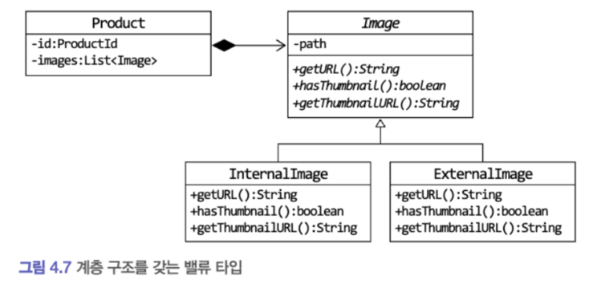
JPA 는 @Embeddable 타입의 클래스 상속 매핑을 지원하지 않는다 <br>
상속 구조를 갖는 Value 타입을 사용하려면 @Embeddable 대신 @Entity 를 이용해서 상속 매핑으로 처리해야 한다 <br>
Value 타입을 @Entity 로 매핑하므로 식별자 매핑을 위한 필드도 추가해야 한다, 추가적으로 타입 식별 컬럼도 추가해야 한다
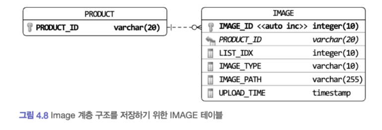
한 테이블에 Image 와 그 하위 클래스를 매핑하므로 Image 클래스에 다음 설정을 사용한다 <br>
- @Inheritance 
- strategy 값으로 SINGLE_TABLE 
- @DiscriminatorColumn 사용 타입 구분용으로 사용할 컬럼 지정

Image 를 @Entity 로 매핑했지만 모델에서 Image 는 Value 이므로 상태 변경 기능은 추가하지 않는다.
```java
@DiscriminatorColumn(name="image_type")
@Inheritance(strategy = InheritanceType.SINGLE_TABLE)
@Entity(name="image")
public abstract class Image {
	@Id @GeneratedValue(strategy = GenerationType.IDENTITY)
	private Long idl;

	private String path;

	@Temporal(TemporalType.TIMESTAMP)
	private Timestamp uploadTime;

	protected Image() {

	}

	public Image (String path, Timestamp uploadTime) {
		this.path = path;
		this.uploadTime = uploadTime;
	}

	protected String getPath() {
		return path;
	}

	public Timestamp getUploadTime() {
		return uploadTime;
	}

	public abstract String getURL();
	public abstract boolean hasThumbnail();
	public abstract String getThumbnailURL();

}

```

Image 를 상속받은 클래스는 @Entity 와 @Discriminator 를 사용하여 매핑을 설정한다.

애그리거트를 직접 참조하는 방식을 사용했다면 영속성 전파나 로딩 전략을 고민해야 하는데 ID 참조 방식을 사용함으로써 여러 고민을 없앨 수 있다.