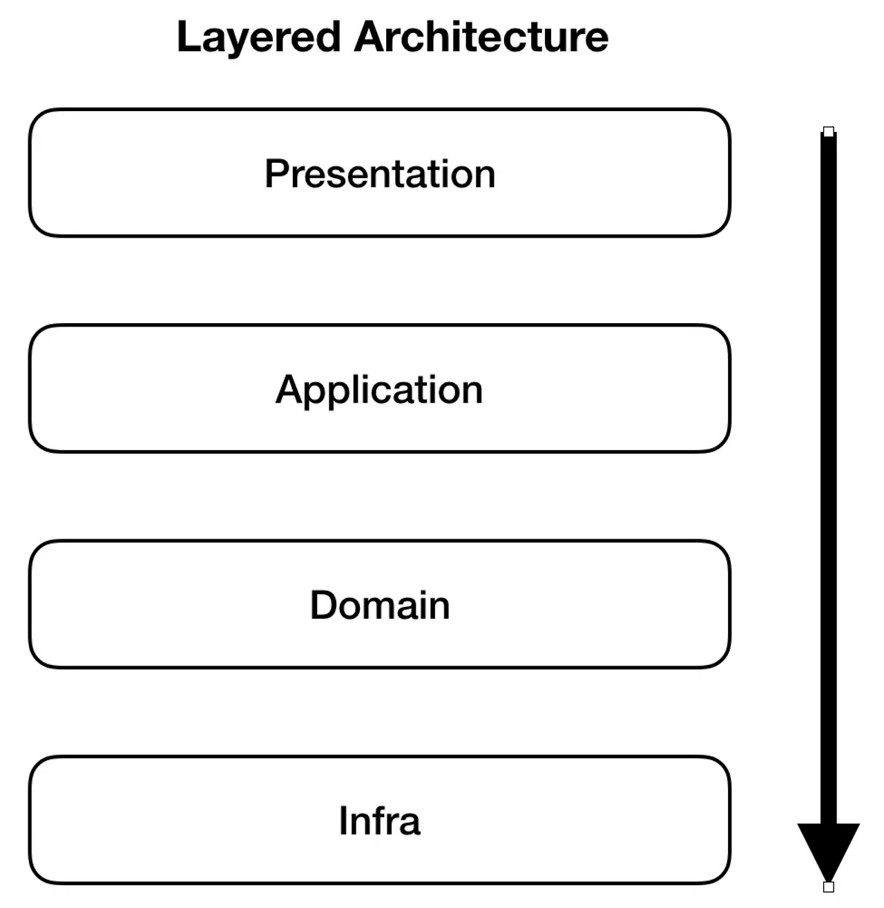
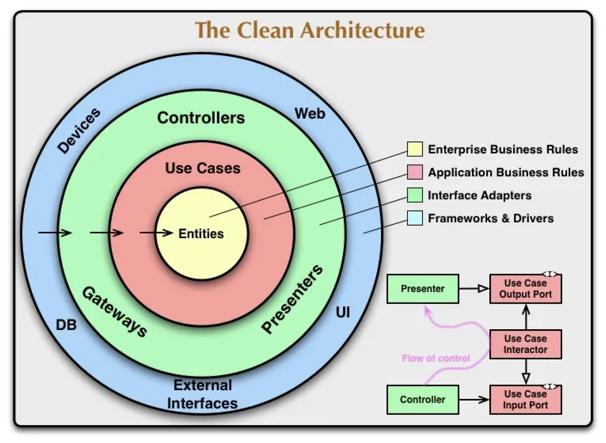

## 들어가며
필자는 실무에서 SpringBoot, Java, JPA 를 사용하여 개발하고 있다.

그리고 현재 멀티 모듈 기반의 스프링부트 프로젝트를 하고 있다.

그리고 일반적인 Spring Layered Architecture 를 사용하고 있다.

하나 특이점이 있다면, 일반적인 멀티 모듈 구조랑은 살짝 느낌이 다르다.

책임을 분리한 모듈들도 존재하지만, 예를 들면 아래와 같다.

```java
module-common 
module-database
module-core
```

위 공통으로 사용하는 모듈들도 존재하고, 아래 처럼 역할에 맞는 멀티 모듈이 존재한다.

```java
moudle-api
module-payment
module-admin
module-merchant
```

위처럼 역할에 맞는 모듈들이 존재한다. 그리고 각 모듈은 일반적으로 레이어드 아키텍쳐로 구성이 되어있다.

그리고 현재 작은 프로젝트에 살이 붙어 조금씩 커지고 있다. 그에 따라 여러 클래스들이 생기고 막 뭐가 많아져서 살짝 복잡한 상황이 슬슬 오고 있다고 생각하였고 <br>
위 문제를 해결하기 위해 나는 방법을 찾아야 했다.

첫번째로 찾은 방법은 '**도메인 계층 패턴 적용**' 이였다

현재는 모든 비즈니스 코드가 영속성 레이어가 기반으로 동작한다. 즉 데이터베이스의 구조나 세부 사항이 도메인, 서비스, 웹 통틀어서 영향을 줄 수 있다. <br>
그리고 현재는 데이터 중심의 아키텍쳐로 시스템이 복잡해 짐에 따라 유지보수성 및 개발 편의성이 줄어들고 있다.

그래서 위 문제를 보완하기 위한 도메인 계층 패턴을 적용해보려고 한다.<br>
위 도메인 계층 패턴을 사람들은 '**DDD**' 라고도 부른다.


'**도메인 계층 패턴**' 을 구현하는 방법은 디테일 하게 총 3가지가 있다.
- Layered Architecture
- Clean Architecture
- Hexagonal Architecture

그 중에서 현재 구조에서 변경하기 제일 쉬울 것 같은 Layered Architecture 를 적용해 보았다.

위 아키텍쳐를 도메인 중심의 아키텍쳐로 변경하게 된다면 분명 데이터 지향 적인 코드들이 도메인 지향 적으로 교체됨에 따라 계층간 결합도가 줄어들고,<br>
추후 유지보수성도 좋아질 것이고, 새로운 기능 및 요구사항에 대한 유연성이 증가할 것이라고 판단했기 때문이다.

도메인 중심 아키텍쳐에서도 제일 기본이 되는 레이어드 아키텍처를 사용했고 간단하게 설명을 하자면 소프트웨어의 관심사에 따라 레이어를 나누고 계층적으로 의존하도록 배치하는 방식의 아키텍처입니다.

레이어드 아키텍처는 의존성을 단순화시키고 구조가 단순해서 구현이 쉽고 빠르게 개발할 수 있는 장점이 있어서 실무에서도 자주 사용하는 것으로 알고 있다.

추가적으로 개발자 입장에서 복잡한 패키지 구조에서 직관적으로 도메인 별로 볼 수 있기에 개발 편의성 또한 증가할 것으로 판단했다.


변경된 패키지 구조는 아래와 같다.

```java
com.example.admin
├── domain
│   ├── transaction
│   │    ├── model
│   │    ├── repository
│   │    └── service
│   └── settlement
│   │    ├── model
│   │    ├── repository
│   │    └── service
│   └── settlement
│   │    ├── model
│   │    ├── repository
│   │    └── service
│
│
├── application
├── presentation
├── infrastructure
├── common

```


변화시키는 작업은 생각보다 오래걸리지 않았고, 기존의 레이어 아키텍쳐처럼 도메인을 나누고 <br>
그 도메인 내부에서 레이어 아키텍쳐 처럼 작성하면 되었다.

일단 개발 편의성을 위해 나는 common 패키지를 추가했고 눈 여겨 봐야할 구조는 나머지 4가지이다.

- application
- domain
- infrastructure
- presentation

common 은 공통적인 부분을 어떻게 관리해야할지에 대한 고민을 하다가, common 패키지를 추가하게 되었습니다. 좋은 방법이 있으시면 위 부분 알려주시면 감사하겠습니다.

필자는 멀티 모듈 프로젝트를 사용하고 있기에 사실 Infrastructure 영역 처럼 영속성 부분은 따로 작성해줄 필요는 없었지만, 영속성만 관리를 하지는 않기에 일단은 작성해 두었다.

일단은 데이터 중심 기본 아키텍쳐에서 도메인 중심으로 변경이 되니 패키지들이 훨씬 깔끔하게 정리가 되었고 보기에도 편안해졌다. <br>
하지만 위 구조는 깔끔해지기는 하지만 치명적인 단점이 하나가 있습니다.

#### '바로 데이터베이스와 결합이 너무 강하다는 점입니다.'

아래 사진을 보자 <br>


일반적인 레이어드 아키텍쳐이며 현재는 위 레이어드 아키텍쳐를 기반으로 도메인 분리만 한것 뿐이다.

- 프레젠테이션 → 어플리케이션 호출
- 어플리케이션 → 도메인 호출
- 도메인 → 인프라 호출
레이어드 아키텍쳐에서는 위 구조로 요청, 응답이 왔다 갔다 하게 됩니다.

결과적으로 모든 요청들은 최하위의 Infra(=영속성) 관련 레이어로 흐릅니다.

즉, 상위 레이어들은 Infra 에 의존하는 구조가 됩니다.

(편의를 위해 Infra → 영속성) 이라고 부르겠다. <br>
하지만 일반적인 레이어드 아키텍쳐는 치명적인 단점이 있다. 눈치가 빠른 분들은 위에 설명을 보면 바로 알아 챘을 것이다.

바로 '영속성' 영역에 도메인 및 어플리케이션이 의존하게 된다.<br>
도메인이 영속성 영역에 의존하게 되면 도메인이 가진 비즈니스 로직에 영속성 관련 내용이 포함될 수 밖에 없다.

비즈니스 로직에 영속성 레이어의 세부 사항이 포함되면 비즈니스 로직에 변경이 생겨야 할 때 영속성 레이어의 세부 사항을 이해하고 변경을 해야하는 문제가 생긴다.

특히 영속성 레이어의 세부 사항이 변경되면 도메인 레이어에도 변경 사항을 반영해야 하는 문제가 발생할 수 있다. <br>
모두 알다시피 결합도가 높을 수록 좋지않은 소프트웨어라는 것을 알고 있을 것이다. 그러므로 응집도를 높이고, 결합도가 낮은 소프트웨어를 만들기 위해 노력을 해야한다.

그래도 나는 도메인별로 분리를 한것 만으로도 나는 기분이 좋았다. <br>
왜냐하면 보기에 엄청 편해졌기 때문이다.

그래도 이왕하는거 더 좋은 방법론을 찾기 위해 열심히 찾아보았다. <br>
위 방법을 보완하기 적합한 아키텍쳐는 바로 '클린 아키텍쳐 및 헥사고날 아키텍쳐' 를 사용하는 것이였다.

위 2가지 아키텍쳐는 처음 들어보는 내용이라 개념을 잡기 위해 노력했다.<br>
그리고 어느정도 파악을 한 후에 팀원들과 상의를 한 후 '클린 아키텍쳐' 를 적용하기로 결정하였다.

헥사고날 아키텍쳐를 선택하지 않은 이유는 아래와 같다.
1) 클린 아키텍쳐보다 복잡해 보였다. <br>
-> 좋다고 다 사용할 수는 없으니, 할 수 있는 범위 에서 적용해 보아야 했다.


사실 두 아키텍쳐는 드라마틱한 차이는 없다.<br>
오히려 공통적인 부분이 많다.
- 도메인 로직 독립성
- 외부 의존성 최소화
- 비즈니스 로직 보호

차이점이라면 어떻게 도메인 영역에 접근하냐정도가 차이였다.

하지만 헥사고날 보다 클린 아키텍쳐가 뭔가 좀 더 깔끔해보이고 와닿아서 선택한 것도 없지 않아 있다ㅎ..

그럼 클린 아키텍쳐를 적용했을 때 얻을 수 있는 이점은 뭘까? <br>
최고의 장점으로 뽑자면 도메인 영역에 영속성 관련 영역 의존성을 없앨 수가 있다.

즉 도메인 영역의 비즈니스 로직을 구현할 때 JPA Fetch, 더티체킹 등 세부 사항이 도메인 비즈니스 로직을 구현할 때 영향을 미칠수 있는 세부사항을 걱정할 필요가 없다.<br>
위 세부 사항은 비즈니스 로직과 분리되어 영속성 레이어를 구현할 때 고려하면 된다.

아래 클린 아키텍쳐 대표적인 사진을 보자.
 <br>

위 클린 아키텍쳐를 보면 Entities, Use Cases 를 보면 가운데 꽁꽁 싸여 있다. <br> 
내부 도메인이 외부 영역에 대해 알지 못하기 위해 클린 아키텍쳐는 의존성 방향이 외부에서 내부로 단방향으로 흘러야 한다.

이제 직접 적용을 해보기 앞서 어떻게 분리를 해야할지를 설명을 해보려고 한다.


## 클린 아키텍쳐 적용
여담이지만 멀티모듈 기반의 도메인 중심 아키텍쳐는 '안드로이드' 에서 많이 사용한다고 합니다.

적용에 앞서 필자는 Infrastructure Layer 는 별도의 모듈로 분리되어 있기에 패키지 구조상 생성은 하지만 따로 로직은 없다는 것을 참고하면 좋을 것 같다.

내가 분리해야 한다고 생각하는 영역은 총 5가지 영역이였다.

기본적으로 database 영역을 관리하는 영속성 계층은 멀티 모듈에서 아래와 같이 관리한다.
```java
└─module-database
│
├── rdbms
│     ─── entites
│           ── Payment.java
│           ── Settlement.java
│           ── Member.java
│     ─── repositories  
│           ── PaymentRepository.java
│           ── SettlementRepository.java
│           ── MemberRepository.java
│
│
├── redis
│     ─── entites
│           ── Token.java
│           ── Terminal.java
│     ─── repositories  
│           ── TokenRepository.java
│           ── TerminalRepository.java

```


### 1) Domain 영역
   Entity 를 직접 사용하지 않는다. <br>
   Entity 랑 같은 역할을 하는 ‘도메인’ 을 만든다.<br>
   도메인은 어떻게 보면 엔티티랑 같은 같다.<br>

   다른점은 영속화 하기 위해 사용하는게 아닌 ‘도메인’ 객체로만 사용을 한다.<br>
   추후 Entity to Domain Convert 로직이 필요하다.<br>
   그렇다면 JPA 표준 스펙상 엔티티에서 구현해둔 ‘Serializable’ 을 도메인 객체에도 구현받아야할까?

```java
@Entity
public class MerchantTerminal implements Serializable {

}
```

대충 영속성 컨텍스트의 2차캐시 또는 클러스터 환경 지원을 위해 Serializable 을 구현받게 되어있다. <br>
#### 결론만 말하자면 도메인 객체에는 Serializable 을 구현할 필요가 없다.

1) 도메인 객체는 엔티티와 역할이 다르다
클린 아키텍처에서 도메인 객체는 비즈니스 로직과 규칙을 캡슐화하는 역할을 합니다. 반면, 엔티티는 JPA를 통해 DB와 매핑되는 역할을 합니다.<br>
- 도메인 객체: 데이터베이스에 직접적인 의존성을 가지지 않고, 비즈니스 로직을 처리하는 데 집중.
- 엔티티: 데이터 저장소와의 매핑을 위해 설계.
- 따라서, 도메인 객체는 반드시 Serializable을 구현할 필요가 없습니다.

하지만 예외적인 상황이 있다.

도메인 객체를 캐시에 저장하거나, 원격 통신에서 사용할 경우, 특정 기술에서 직렬화를 필요로 하는경우 <br>
ex) Redis, Kafka <br>
예외상황을 제외하고는 거의 직렬화할 필요는 없다.

그러면 도메인 객체를 만들 때는 엔티티와 필드가 다 똑같아야 하나? 라는 의문이 생겼다. 대답은 ‘NO’ 라고 생각합니다.<br>
도메인 객체는 비즈니스 로직 중심으로 설계되기 때문에, 엔티티에 필요 없는 필드를 추가하거나, 엔티티에 있는 필드를 도메인 객체에는 추가안하거나 자유롭게 설계가 가능하다.

다시 한번 상기시키자면 도메인 영역의 초점은 ‘역할 분리’ 이다.

- 엔티티는 데이터베이스와 매핑.
- 도메인 객체는 비즈니스 로직 처리. 

위 역할에 충실해야 한다.


2) 계층별 책임 분리
   DTO → 도메인 객체 → 엔티티 순서로 책임을 나누어 관리.
   도메인 객체가 비즈니스 로직 중심으로만 설계될 수 있도록 데이터를 필요한 수준으로 제한.


#### 1. 도메인 객체
````java
   @NoArgsConstructor
   @Getter
   public class MerchantTerminal {

   private Long id;
   private Merchant merchant;
   private UUID uuid;
   private String shortUuid;
   private String name;
   private Instant createTime;
   private Instant updateTime;
   private Instant deleteTime;

   // 도메인 로직 작성

}
````

미리 말을 하자면 도메인 객체를 엔티티 객체로 바꿔주는 작업 또한 필요하다. <br>
위 작업은 infra/mapper 패키지를 만들어 작성을 할 예정이다.


### 2) Application 영역
도메인 영역을 활용해서 비즈니스 로직을 호출한다. <br>
UseCase, Command 를 활용한다. <br>
→ 포트, 유스케이스, 커맨드 라는 개념이 존재한다. 위 개념을 잘 기억하도록 하자.

클린 아키텍쳐에서 ‘포트’는 외부와 어플리케이션이 소통할 수 있는 인터페이스 이다. <br>
일반적으로 어플리케이션이 외부의 기능을 호출하고자 할 때 외부 영역에 의존하지 않도록 의존성을 역전하는 방식으로 설계 한다.

UseCase 는 포트의 일종으로 외부에서 도메인 코어의 기능을 호출할 때 사용되는 인터페이스라고 생각하면 된다.<br>
외부 호출이라 함은, Presentation 영역을 Controller 부분을 의미한다.<br>

그리고 가능한 하나의 인터페이스 당 하나의 유스케이스를 다루도록 분리해서 작성하는 게 좋습니다(ISP 원칙).<br>
매개변수로는 커맨드 객체를 받도록 되어 있습니다.


#### UseCase
```java
@FunctionalInterface
public interface AddMerchantTerminalUseCase {
    MerchantTerminal addMerchantTerminal(AddMerchantTerminalCommand command);
}
```

인터페이스는 ISP 원칙을 치기기 위해 1가지의 책임만 담당할 수 있게 구현을 하였다.


#### Command
````java
@Getter
public record AddMerchantTerminalCommand(
String merchantName,
String posName) {

    public AddMerchantTerminalCommand {
        CommandUtil.throwIfNull(merchantName, "merchantName is null or blank.");
        CommandUtil.throwIfNull(posName, "posName is null or blank.");
    }

}
````

커맨드는 외부에서 유스케이스를 호출할 때 전달되는 매개변수 역할을 한다고 생각하면 된다. <br>
일반적으로 커맨드 클래스를 통해 유스케이스의 입력값을 검증한다.


그리고 어플리케이션 영역에는 위 유스케이스를 구현한 서비스가 존재한다. <br>
서비스는 객체 호출 영역의 기능을 담당하며 구체적인 비즈니스 로직을 구현한다. <br>

#### Service
```java
@RequiredArgsConstructor
@Transactional(readOnly = true)
@Service
public class AddMerchantTerminalService implements AddMerchantTerminalUseCase {

    private final AddMerchantTerminalPort addMerchantTerminalPort;

    @Override
    public MerchantTerminalDomain addMerchantTerminal(AddMerchantTerminalCommand command) {
        
        // 비즈니스 로직 구현
        addMerchantTerminalPort.save(command);
        
        return null;
    }

}

```


그리고 비즈니스 로직을 인터페이스로 작성해두는 Port 가 존재한다.


#### port
```java
@FunctionalInterface
public interface AddMerchantTerminalPort {
    MerchantTerminalDomain save(MerchantTerminalDomain merchantTerminalDomain);
}


```


### 3) Adapter 영역
어댑터 영역은 포트를 구현하거나, 어플리케이션의 유스케이스를 호출하는 영역이다. <br>
위 영역에서는 실제 'CRUD' 로직을 만든다.

```java
@RequiredArgsConstructor
@Repository
public class AddMerchantTerminalAdapter implements AddMerchantTerminalPort {

    private final MerchantTerminalRepository merchantTerminalRepository;


    @Override
    public MerchantTerminalDomain save(MerchantTerminalDomain merchantTerminalDomain) {

        // domain -> to entity
        MerchantTerminal merchantTerminal = MerchantTerminal.builder().build();

        // save (CRUD) 진행
        merchantTerminalRepository.save(merchantTerminal);

        // entity -> domain
        MerchantTerminalDomain merchantTerminalDomain = MerchantTerminalMapper.toDomain();
        
        return merchantTerminalDomain;
    }

}

```

위 Adapter 에서는 비즈니스 로직은 없고 영속성 세부사항을 다루는데 집중을 해야한다. <br>
비즈니스 로직이 도메인 영역과 어플리케이션 영역에 집중되도록 설계되었기 떄문에 가능한 일이다. <br>


### 4) Presentation 영역
Controller 를 정의한다. <br>
Request 로 들어는 Input DTO 를 같이 정의한다. <br>

```java
@RequiredArgsConstructor
@RequestMapping("/apis")
@RestController
public class MerchantExternalPosIDController {

    private final AddMerchantTerminalUseCase addMerchantTerminalUseCase;

    @PostMapping("/issue")
    public ResponseEntity<?> IssuePosId(@RequestBody @Valid MerchantInputs.PosIdRequestDto posIdDto) {
        

        return ResponseEntity.ok("hi");
    }


}
```

실제로 컨트롤러에서 사용되는 클래스는 UseCase 이다.


### 5) Infrastructure 영역
- Mapper 를 정의한다.
- Filter, Inteceptor 등 외부와 작업이 것들을 정의한다.

```java
public class MerchantTerminalMapper {

    public static MerchantTerminalDomain toDomain(MerchantTerminal merchantTerminal) {
        return MerchantTerminalDomain.builder()
                .merchant(merchantTerminal.getMerchant())
                .uuid(merchantTerminal.getUuid())
                .shortUuid(merchantTerminal.getShortUuid())
                .name(merchantTerminal.getName())
                .createTime(merchantTerminal.getCreateTime())
                .createAt(merchantTerminal.getCreateAt())
                .createBy(merchantTerminal.getCreateBy())
                .updateTime(merchantTerminal.getUpdateTime())
                .updateAt(merchantTerminal.getUpdateAt())
                .updateBy(merchantTerminal.getUpdateBy())
                .deleteTime(merchantTerminal.getDeleteTime())
                .deleteAt(merchantTerminal.getDeleteAt())
                .deleteBy(merchantTerminal.getDeleteBy())
                .build();
    }
}

```


위 처럼 Entity 를 받아서, Domain 객체로 변환하는 작업이 필요하다.


최종적으로 구현된 패키지 구조는 아래와 같다.
```java

├── adapter
│   ├── dtos
│   │
│   ├── output
│   │   ├── AddMerchantTerminalAdapter
│
├── application
│   ├── command
│   │   ├── AddMerchantTerminalCommand
│   │
│   ├── port
│   │   ├── input
│   │   │   ├── AddMerchantTerminalUseCase
│   │   ├── output
│   │   │   ├── AddMerchantTerminalPort
│   │
│   ├── service
│   │   ├── AddMerchantTerminalService
│
├── domain
│   ├── MerchantTerminalDomain
│
├── presentation
│   ├── dtos
│   │   ├── MerchantTerminalInputs
│   │   
│   ├── output
│   │   ├── MerchantTerminalController
│
├── infrastructure
│   ├── mapper
│   │   ├── MerchantTerminalMapper

```


클린 아키텍쳐는 중요한 의존성 규칙이 존재한다

바깥쪽 계층은 내부 계층에 의존해야 하지만, 내부 계층은 외부 계층에 절대 의존할 수 없다.
위 부분만 잘 지키면 유지보수성이 용이하고 관리가 편한 프로젝트가 될 수 있다.
아키텍쳐 구조를 바꾸면서, 배보다 배꼽이 더 커진 것 같은 느낌이 들었다.

MVP 방식을 개발을 좋아하는 나로써는 오버 엔지니어링 이라는 생각이 들었지만

뭐 개발은 혼자하는게 아니고 다같이 하는거닌까, 다수의 의견을 따르는게 맞다는 생각이 들었다.


프로젝트가 커질것을 미리 대비하는 것또한 좋은 방법일 수도 있으니, 팀에 결정에 잘 따랐다고 생각한다.


혹시라도 잘못된 내용이 있거나 궁금한점이 있으면 언제든 알려주세요.

부족한 지식이 누군가에게 도움이 되기를 바라며..

<br>

위 코드 Github: https://github.com/Hyeonqz/HyeonKyu-Lab/tree/master/clean-architecture-example


#### 참조 글
> <https://developers.hyundaimotorgroup.com/blog/359> <br>
<https://developers.hyundaimotorgroup.com/blog/381> <br>
<https://www.youtube.com/watch?v=sLG5n_pXWK0> <br>
<https://blog.cleancoder.com/uncle-bob/2012/08/13/the-clean-architecture.html><br>