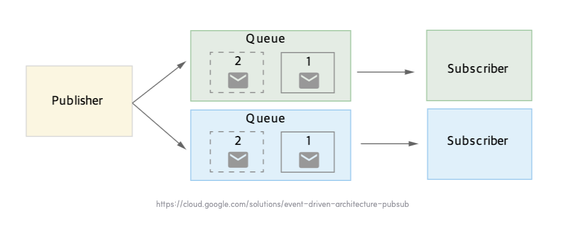

# Event-Driven-Architecture(EDA) 란?

## 개요
실무에서 kafka 를 사용한 아키텍처를 구성 하는 중에 알게된 내용을 정리해보려고 한다. <br>


### 1. EDA 기본 개념 정리
EDA 아키텍처를 사용하기 위해선 간단하게 MSA 아키텍처에 대한 기본 지식이 필요하다고 생각합니다 <br>

> **MSA(마이크로 서비스 아키텍처)**
> 
> 하나의 어플리케이션을 '독립적으로 배포 가능한 서비스' 단위로 분리하여 배포하는 구조를 의미

 <br>
출처: https://www.atlassian.com/ko/microservices/microservices-architecture/microservices-vs-monolith


위 독립 배포는 유지 보수 및 장애 대응에 편리함을 가지고 있다. 하지만 그에 반해 단점도 명확하다 
- 서비스 간 통신 복잡성
- 데이터 일관성 유지
- 트랜잭션 관리
- 서비스 디스커버리
- 학습 곡선

위와 같은 문제가 있다 <br>

그럼 이에 반해 EDA 아키텍처를 알아보자 <br>

> **이벤트 기반 아키텍처(EDA)**
> 
> 분리된 서비스 혹은 시스템들 간의 이벤트를 게시, 소비 또는 라우팅 동작을 통해 각 정보를 공유하는 형태로 구성된 아키텍처

EDA 구조는 이벤트 발행(Publish) – 이벤트 브로커(라우터) – 이벤트 소비(Consume) 라는 세 가지 큰 흐름으로 그려진다 <br>

```scss
                    (이벤트 발행)            (이벤트 브로커)         (이벤트 소비)
[Order Service] --(OrderCreatedEvent)--> [Event Broker] --> [Payment Service]
                                                     └--> [Other Subscribers]

[Payment Service] --(PaymentCompletedEvent)--> [Event Broker] --> [Notification Service]
                                                                    [Settlement Service]
```


#### 1. 이벤트 발행
이벤트를 발행한다는 것은 서비스의 '상태 변화(행위)' 를 요청하는 신호 라고 생각한다 <br>
또는 특정 작업이나 행동을 요청하는 역할로 보면 된다 <br>

행위를 표현하는 방법은
- 대상
  - ex) 대상의 **식별자 정보**를 제공한다.
- 행동
  - ex) 이미 벌어진 사건 -> **과거형으로 표현**
- 정보
  - ex) **행위와 관련된 값** 들을 표현한다.
    - 필요하다면 행위 외의 값도 추가 가능
- 시간
  - ex) **행위가 발생한 시간**을 표현한다.

정도로 분류를 할 수 있다. <br>

#### 2. 이벤트 브로커
EDA 아키텍처의 핵심 구성 요소로, 시스템 간의 '이벤트 통신을 중개' 하는 아주 중요한 역할이다 <br>
발행된 이벤트를 수집하고, 발행된 이벤트를 이벤트 소비자에게 전달하는 중개자 역할을 수행한다 <br>
(다른 말로, 이벤트 라우터, 이벤트 버스 라고도 불린다) <br>


#### 3. 이벤트 소비
이벤트 브로커로부터 이벤트 를 전달받아 실제 비즈니스 로직 처리를 하는곳이다 <br><br>


#### MSA vs EDA 
MSA 는 '서비스 독립적 분리' 가 목표이고 EDA 는 '이벤트 중심 시스템 연결' 하는 것이다 <br>
즉 MSA 는 더큰 범위에서 구조적 접근 이고, EDA 는 통신/동작 패턴 에 가깝다 <br>
-> MSA 환경에서 서비스 간 통신 방식을 EDA로 채택하는 경우가 많다


#### 비유
- MSA = 도시를 여러 "동네"로 나누는 도시 계획.
- EDA = 그 동네들을 연결하는 "교통수단" 중 하나(버스/지하철처럼 이벤트 기반).
- 도시를 나누는 게 목적(MSA), 연결하는 방식은 선택(EDA or REST).


<br>

### 2. EDA 구현 방법
대표적으로 EDA 아키텍처를 구성하는 방법은 3가지가 있다 <br>

#### 2.1) pub/sub
> 소프트웨어 아키텍처 종류 중 하나인 '게시-구독 패턴' 을 이용하여 메시지 발행(pub) 메시지 소비자(sub) 으로 분리된 상태에서 메시지를 주고 받는 모델을 의미한다.

위 모델의 핵심은 게시자-구독자 는 서로 알지 못하여 이벤트 브로커를 통해서 낮은 결합도로 연결되어 있다는 점이다 <br>
-> 시스템의 유연성과 확장성이 향상되는게 특징이다 <br>

위 모델은 대표적으로 kafka, redis 를 사용해서 구현이 된다 <br>

 <br>
출처: https://cloud.google.com/solutions/event-driven-architecture-pubsub


#### 2.2) message-queue
> 이벤트 생성자가 생성한 하나의 이벤트가 이벤트 소비자에게 하나의 이벤트로 전달되어 서로 간의 통신을 지원하는 모델이다.

- 위 메시지는 순서를 보장하는 모델로 FIFO 선입선출 을 기본으로 사용한다.
- 메시지의 안정적인 전달을 보장한다
  - 네트워크, 일시적인 서비스 장애 발생시에도 메시지는 메시지 큐에 저장되어 있으므로 메시지 손실이 없다.
- 하지만, 메시지 큐 모델은 1번에 1개의 이벤트만 소비자에게 전달할 수 있다는 제약이 있다. -> 큰 시스템에는 적합하지 않다.

위 아키텍처 구성시에는 RabbitMQ 를 많이 사용한다 <br>
물론 MQ 모델 또한 1:N 전송을 지원하지만, kafka 같은 pub/sub 시스템 대비 확장성 및 이벤트 처리능력이 약해서 잘 사용하지 않는다 <br>

 <br>
출처:  https://cloud.google.com/solutions/event-driven-architecture-pubsub <br>


#### 2.3) event-streaming
> 실시간으로 발생하는 데이터를 '연속적인 스트림' 으로 처리하는 아키텍처 패턴이다. 

-> 위 내용은 이야기 하면 길어서 추후 새로운 포스팅을 할 예정이다 <br>
일단은 위 내용이 있다는 것만 알기만 하자 <br>


### 3. EDA 설계 고려사항
기본적으로 필자는 '이벤트 유실' 에 초점을 두고 시스템이 안전해야 한다고 생각한다 <br>
단순히 이벤트 발행 -> 구독 -> 처리 위 3개만 생각하고 간단하게 생각하고 구현하면 놓치는 부분이 분명 많을 것이다 <br>

필자는 EDA 설계시 kafka 를 고려하고 있으므로 kafka 기반으로 설명을 하겠다 <br>
'이벤트 유실' 중점적으로 설계하게 된다면 고려해야 하는 사항은 아래와 같다
- 이벤트 전달 보장 전략
  - 빠른 처리 -> 손실 가능 있음
  - 늦은 처리 -> 손실 가능성 없음
    - **(중요)** 위 부분은 비즈니스에 맞게 설계가 필요함
- 멱등성 보장
  - kafka 에서는 consumer offset 관리 -> 자동 관리해주니 __consumer_offsets 을 잘 보자
- 이벤트 순서 보장
  - kafka partition key, 메시지 그룹핑 등 순서 보장 설계
- 장애 대응 및 복구 전략
  - consumer DLQ 적극 사용
  - 재시도 정책 설계(Retry Policy)
  - Replay -> 과거 이벤트 재처리 가능 여부(kafka 는 기능 지원함)
- 데이터 정합성
  - SAGA 패턴 도입 고려
  - 보상 트랜잭션 로직 고려
- 모니터링 & 운영
  - 이벤트 플로우 추적 (Zipkin 사용 권장)
  - grafana & prometheus 또는 시각화 + 메트릭 수집이 가능한 툴을 잘 사용하자
- 확장성 & 성능
  - 파티션 설계 및 설정을 잘 잡아두자!

    
## 결론
- 이벤트 기반 아키텍처를 구성하면 요구사항 추가 시 기존 시스템 복잡도 영향이 없다.
- 유지보수에 용이성이 높아진다.
- 즉 변경사항 내용을 이벤트로 단순하게 파악을 할 수 있다
- 기존 로직에 결합도 감소 및 응집력이 높아지는 효과를 얻을 수 있다 <br>
- 추가적으로 데이터 분석 측면에서 도메인 히스토리 파악이 용이해진다.

필자가 느끼는 개인적으로 최고의 장점은 **낮은 결합도(loose coupling) + 비동기 처리** 가 핵심이라고 생각하며 이를 기반으로 시스템 확장성 및 유연성을 높이는 부분이라고 생각한다 <br>


하지만 장점이 있는 만큼, 단점 또한 있다.
- 이벤트 데이터 무분별한 추가 주의
  - '**행위자**' 기반의 데이터 정의 필요
  - 소비처 요구사항에 대한 무분별한 데이터 추가 주의
- 디버깅/모니터링
  - 이벤트 흐름이 분산되면 트랜잭션 추적이 어려울 수 있다.
- 이벤트의 '**순서**'가 중요하다
  - 결제 요청 -> 결제 확인 -> 결제 승인 등등
  - 이벤트의 동기적 순서를 정확하게 보장할 수 있어야 한다.

    

### REF
> 1. <a href="https://adjh54.tistory.com/492#3.%20%EC%9D%B4%EB%B2%A4%ED%8A%B8%20%EA%B8%B0%EB%B0%98%20%EC%95%84%ED%82%A4%ED%85%8D%EC%B2%98%20%EC%A3%BC%EC%9A%94%20%EA%B5%AC%EC%84%B1%20%EC%9A%94%EC%86%8C%20%3A%20%EC%9D%B4%EB%B2%A4%ED%8A%B8%2C%20%EC%9D%B4%EB%B2%A4%ED%8A%B8%20%EB%B2%84%EC%8A%A4%2C%20%EC%9D%B4%EB%B2%A4%ED%8A%B8%20%EC%B1%84%EB%84%90-1-5">contributor9 님 블로그 글</a>
> 2. http://www.itdaily.kr/news/articleView.html?idxno=217717
> 3. https://cloud.google.com/eventarc/docs/event-driven-architectures?hl=ko
> 4. https://learn.microsoft.com/ko-kr/dotnet/architecture/microservices/multi-container-microservice-net-applications/integration-event-based-microservice-communications
> 5. https://www.youtube.com/watch?v=DY3sUeGu74M&t=462s